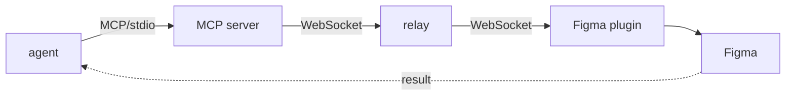

# figma-agent-bridge — Architecture

> Governed by [[figma-bridge/docs/principles|the principles]]. This is the *how*:
> the mechanism the principles' "Where mechanism lives" footer deliberately defers
> here. Per-tool contracts live in the [[figma-bridge/docs/specs/tool-surface|specs]],
> not here. This is the map of how the system is built.

## Data flow

One request crosses four hops and comes back the same way:

1. **Agent → MCP server.** The agent calls a tool over MCP (stdio transport).
   Params are Zod-validated against the shared schemas.
2. **MCP server → relay.** The server *parses* expressions into Figma-ready values
   (see below), wraps the work as a `{ id, command, params }` message, and sends it
   over its WebSocket to the relay on the **target file's** channel (one file, one channel — B3).
3. **Relay → plugin.** The relay is dumb pub/sub: it broadcasts the message to every
   client on that channel. The paired Figma plugin is the one that receives it.
4. **Plugin → Figma.** The plugin's UI iframe forwards the command to `code.ts`
   (the QuickJS main thread), which executes it against the Figma Plugin API and
   **only assigns** the pre-parsed values — it does not parse.
5. **Back.** The plugin posts `{ id, result }` (or `{ id, error }`) to its UI, which
   sends it over the same WebSocket; the relay broadcasts it; the server matches the
   `id` to the pending request and resolves the agent's tool call.

This realizes the three layers of [[figma-bridge/docs/principles|the principles]]:
the **bridge** is the server transport + relay + Figma plugin (B1); the **tool**
layer is the server's MCP tools (T1–T8); the **plugin** layer (skills/agents/commands)
sits above the agent and is out of band of this request path (P1).

## The five packages

A Bun monorepo, `packages/*`. Each package has one responsibility.

| Package | Layer | Responsibility |
|---|---|---|
| `shared` | — | Single source of truth for types, Zod schemas, and constants (`DEFAULT_PORT`, `APP_NAME`). Imported by every runtime package so message shapes and tool params never drift. |
| `server` | tool + bridge (transport) | The MCP server — the brain. Registers the tool surface, validates params, **parses all expressions** (`parser.ts` / `expression-parser.ts`), and owns the WebSocket client to the relay (`figma-client.ts`) plus relay bootstrap (`ensure-relay.ts`). |
| `relay` | bridge | A minimal WebSocket pub/sub. Tracks channels; broadcasts each message to all clients on that channel. Holds no design semantics and no request state — it only routes. |
| `figma-plugin` | bridge | The Figma plugin (Vite + React UI iframe, plain-TS `code.ts` main thread). The UI is the WebSocket client to the relay and the channel pairer; `code.ts` is a thin executor that calls the Figma API and assigns parsed values. |
| `cli` | — | Cloud/headless client. Stub for now. |

> Note the deliberate naming split from the principles: the **Figma plugin** here is
> part of the *bridge*; the **plugin layer** (P1) means the Claude Code plugin —
> skills, agents, commands — which is not a package in this repo.

## Mechanism (demoted from the principles)

These are the *how* details the principles point here for.

### All Figma access is async
The Figma Plugin API's modern surface is promise-based, and `code.ts` uses it
throughout: `getNodeByIdAsync`, `importComponentByKeyAsync`, `loadFontAsync`,
`getStyleByIdAsync`, and peers. The executor awaits these rather than touching the
deprecated synchronous accessors. Every command handler is therefore async end to end.

### The server parses; the plugin only assigns
The [[figma-bridge/docs/specs/expression-formats|single expression grammar]] (T8) is
parsed **once, server-side**, before anything crosses the wire. Colors, fonts,
effects, layout, sizing, constraints, strokes, and text all become concrete
Figma-ready values in the MCP server. `code.ts` receives those values and assigns
them to nodes — it never interprets an expression string. This keeps the QuickJS
main thread thin and keeps one grammar with one parser (no per-tool, per-side drift).

### Transport: per-file channels, UUID-correlated request/response
The server holds a WebSocket to the relay. Each outbound command carries a UUID `id`
(`randomUUID()`); the server keeps a pending-request map keyed by that id. Responses are
matched back by `id` and resolve (or reject, on `error`) the originating promise.

**One file, one channel (B3).** Each connected file's plugin is on its **own** channel,
bound to the file by its `fileKey` — not a single shared channel. (The prior design stored
one `channel-id` in `figma.clientStorage`, which is per-user and shared across *every* open
file, so every file's plugin rejoined the **same** channel and a command broadcast to all of
them — the multi-file collision this replaces.) The server drives **one file at a time**: it
resolves a target `fileKey` to that file's channel and operates only there.

**Availability registry (relay).** The relay maintains `{ fileKey → { channel, fileName,
connectedAt } }` — the files with a **live plugin** (reachable/writable). It is kept current
by the WebSocket lifecycle: a plugin's `register` adds its entry; the socket's `close`, or a
missed heartbeat (`removeClient`), removes it. So "which files are available" is a transport
fact the relay already owns — no Figma focus/active-file API is involved (none exists). The
agent reads this set to choose a target.

**Identity guard (B3).** A command carries its `targetFileKey`; the plugin refuses to execute
if `figma.fileKey` doesn't match — so even a stale registry entry can never land a write in
the wrong file. If the target `fileKey` is not in the registry the command fails and the agent
is asked to choose; it is never silently retargeted to another available file.

- **Default timeout:** 30s per command (`3e4` ms in `figma-client.ts`); callers may
  override per command. On timeout the pending entry is dropped and the call rejects.
- **Reconnection:** the client recovers a dropped relay connection; in-flight requests
  that cannot complete are rejected so the agent never hangs silently.

### Default port
Relay and server both default to **18080** (`DEFAULT_PORT` in `shared`), overridable
via `PORT` / `RELAY_URL` env vars. The server bootstraps the relay if one is not
already listening (`ensure-relay.ts`).

### Error and result contract
Every reply is `{ id, result }` or `{ id, error }` — one uniform shape, faithfully
relayed (B1). The relay never rewrites payloads; the server surfaces results and
typed errors to the agent without interpreting what a node *means*.
