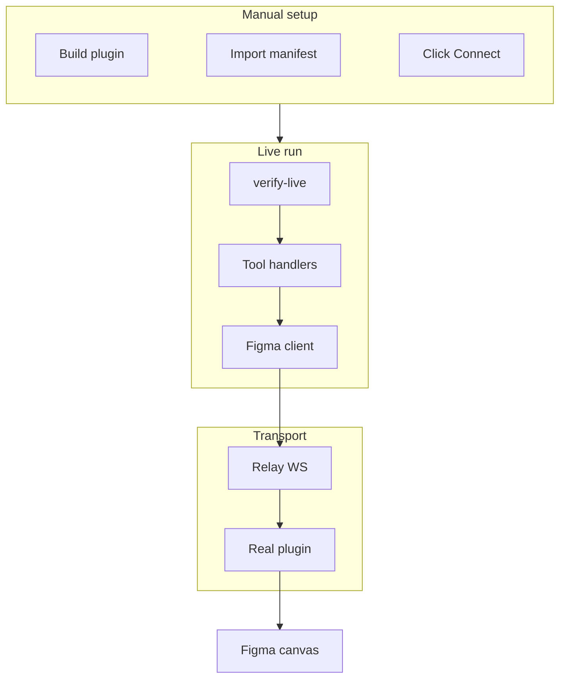

# Live Verification

The whole automated test suite is **mock-plugin-over-real-relay** (headless):
the e2e tests drive a faithful mock plugin, so no Figma is needed and CI stays
green without a GUI. That proves the **mechanics** of every tool — but it cannot
prove the **real-API behaviors** the mock only _models_: a true variables
round-trip, real paint binding, `loadFontAsync`, real PNG bytes,
`createImageAsync` over the network, real boolean geometry.

This guide is the **LIVE twin**. Once a human has loaded the real plugin into
Figma and clicked Connect, the harness in `packages/server/src/verify-live.ts`
drives the **REAL plugin** through the **same server tool handlers** and asserts
the documented contract from
[[figma-bridge/docs/specs/tool-surface|the tool-surface spec]]. It exports PNGs so an agent can _visually_ confirm, and it cleans up
every node it creates.

> [!important] The Figma desktop plugin cannot run headless
> Loading + connecting the plugin is a **manual, GUI-only** step. The harness
> fails fast with a clear message if no plugin is connected. The headless VM
> install-check covers the build/relay/test flow; this guide covers the live
> plugin on a dev Mac.

## Connect & data flow



**Flow details**:

- **Manual setup** — build the plugin, import it from the manifest, run it, and
  click Connect. The plugin registers a **channel** on the relay.
- **Live run** — `verify-live` joins that channel via the same `FigmaClient` the
  MCP server uses, then runs the `CHECK_LIST` through the real tool handlers.
- **Transport** — each handler sends a command over the relay WebSocket to the
  plugin, which mutates the real canvas and replies. PNGs are exported back for
  visual confirmation.

## One-time setup

1. **Build the plugin.**
   ```sh
   cd packages/figma-plugin && bun run build
   ```
2. **Import from manifest.** In the Figma **desktop** app: `Plugins →
Development → Import plugin from manifest…` and pick
   `packages/figma-plugin/manifest.json`.
3. **Run the plugin + Connect.** Open any Figma file, run
   `Plugins → Development → Agent Bridge`, and click **Connect** in the plugin
   UI. Copy the **channel id** it shows.
4. **Restart Claude Code** so the `figma-bridge` MCP server loads (if you want
   to drive the tools from an agent session as well as the CLI harness).
5. **(Agent session) connect tool.** From the agent, call `connect({fileKey})`
   (or `fileName`) to target a **specific file**, choosing from the `available[]`
   set it returns. There is no single-plugin auto-discover and no channel id:
   with per-file channels many plugins are connected at once, and B3 forbids
   guessing which file — an unavailable/ambiguous target returns the available
   list and asks you to choose.

> [!note] networkAccess + GUI-connect caveats
>
> - `create_image(url)` / the `image(url)` paint atom call `createImageAsync` on
>   the **main thread**, which requires `networkAccess` in the manifest. It is
>   set to `{"allowedDomains": ["*"]}`. If a build is missing it, the
>   `create_image(url)` check reports **SKIP** with that reason — not a false
>   pass.
> - The relay WebSocket itself is opened from the plugin **UI iframe**, which is
>   not bound by `networkAccess`; only the main-thread `createImageAsync` is.
> - Connecting is **GUI-only** and cannot be automated — a human must click
>   Connect before any live run.

## Running the harness

```sh
# Auto-discover the only connected plugin:
bun run verify:live

# Or target a specific channel:
bun run verify:live -- --channel <id>
```

### Flags

| Flag              | Effect                                                                                                       |
| ----------------- | ------------------------------------------------------------------------------------------------------------ |
| `--channel <id>`  | Dev harness escape hatch — join this channel directly on the relay. Omit to auto-discover a single connected plugin; with several files open (per-file channels), pass the channel.                                         |
| `--out <dir>`     | Where PNGs + reports are written. Default `verify-output/`.                                                  |
| `--keep`          | Do **not** delete the nodes the harness created.                                                             |
| `--screencapture` | macOS: after `set_focus`, shell `screencapture -x` per node so the canvas is grabbed with the nodes in view. |

The relay URL comes from `RELAY_URL` / `PORT` (default port `18080`), same as the
server.

### Output

- A per-check **PASS / FAIL / SKIP** table grouped by tier, printed to stdout.
- `verify-output/report.json` — machine-readable result + tool coverage +
  cleanup summary.
- `verify-output/report.md` — a short human report.
- `verify-output/<id>.png` — exported PNG per check that named an export target.
- **Exit code** — non-zero if any **Tier-1 or Tier-2** check FAILS. A SKIP is
  honest (e.g. needs a library / needs networkAccess) and never a FAIL.

## The tick-off checklist

This is the same contract the harness checks — written so it can ALSO be run by
hand, or by an agent in a connected session, by issuing the listed tool call(s)
and confirming the expected result. The harness ids (`T1.a`, …) match
`packages/server/src/verify-checks.ts`.

### Tier 1 — real-API behaviors the mock can't prove

- [ ] **T1.a — variables round-trip.** `create_variables` (collection +
      `Light`/`Dark` modes + a COLOR var with `scopes`, `codeSyntax`,
      `hiddenFromPublishing`) → `get_variables` shows the collection + var with
      those fields → `update_variables` runs the **mode lifecycle**
      (`addModes`/`renameModes`) → `get_variables` again.
      _Expect:_ a `collectionId` returned; both reads list the collection; no error.
- [ ] **T1.b — bind_variable on fills.** `create_variables` (COLOR) →
      `create_node`(FRAME) → `bind_variable(nodeId, variableId, 'fills')` →
      `get_node`.
      _Expect:_ bind returns without error; `get_node` round-trips. On a build with
      paint binding available, the fill renders as a `var(...)` atom.
- [ ] **T1.c — boolean tree + ref-pool.** `create_tree` with a
      `BOOLEAN_OPERATION` child (two ELLIPSEs) and a `{ref:'dot'}` reused **twice**
      from the ref-pool.
      _Expect:_ a root id + `totalNodes` reflecting the realized (ref-expanded) tree.
- [ ] **T1.d — status live context.** `status`.
      _Expect:_ `connected: true`; `currentPage` / `viewport` / `selection`
      populated (best-effort — degrades, never throws).
- [ ] **T1.e — annotations/reactions degrade.** `get_annotations(nodeId)` +
      `get_reactions(nodeId)`.
      _Expect:_ both return a Rule-A list envelope **without crashing**; when the
      API is gated they carry `warnings[]` — never an `Error:` reply.
- [ ] **T1.f — TEXT + text style.** `create_node`(TEXT, with a `font(...)`
      atom) plus `create_styles` of a `text` style.
      _Expect:_ both succeed (proves `loadFontAsync`); no per-entry errors.
- [ ] **T1.g — export PNG bytes.** `create_node`(FRAME) → `export(nodeId, PNG)`.
      _Expect:_ an `image` content item whose base64 decodes to **> 0 bytes**.
- [ ] **T1.h — create_image(url).** `create_image({url})`.
      _Expect:_ a `hash`. If it degrades (no hash + warnings), the harness reports
      **SKIP** naming likely-missing `networkAccess` or no network — not a pass.

### Tier 2 — round-trip on real nodes

- [ ] **T2.a — get → update → get.** `create_node`(FRAME) → `get_node` →
      `update_node` (name + opacity) → `get_node`.
      _Expect:_ both reads succeed; the patch applies; the read round-trips into
      write form.
- [ ] **T2.b — set_instance ↔ get_node.** `search({match:{type:'INSTANCE'}})` →
      `set_instance` → `get_node`.
      _Expect:_ round-trips on a found instance; **SKIP** with reason if the doc has
      no INSTANCE node.
- [ ] **T2.c — get_components ↔ update_component.** `create_node`(FRAME) →
      `create_component` (promote) → `update_component` (add a TEXT property +
      description) → `get_components`.
      _Expect:_ a promoted component id; the added property present; re-read ok.

### Tier 3 — smoke (one happy-path call per remaining tool)

- [ ] **T3.reads** — `inspect`, `get_nodes`, `list_pages`, `get_selection`,
      `get_styles`, `list_fonts`, `get_plugin_data`, `search` all return without
      error.
- [ ] **T3.structure** — `create_tree`, `clone_node`, `set_focus`,
      `set_selection`, `reorder_children`, `boolean_op`, `flatten`, `reparent_node`
      all return without error.
- [ ] **T3.pages** — `create_page` → `duplicate_page` → `set_current_page`
      (restores the original current page; scratch pages are left for manual cleanup
      — there is no `delete_page` tool).
- [ ] **T3.svg** — `create_from_svg` (or SKIP if the build needs a non-empty
      `parentId`).
- [ ] **T3.styles** — `create_styles`(paint) → `apply_style` → `update_styles`.
- [ ] **T3.metadata** — `set_plugin_data` + `set_reactions` + `set_annotations`
      (the gated ones degrade with warnings, never error).
- [ ] **T3.batch** — `batch` of two `update_node` ops over created frames; all
      ok.
- [ ] **T3.combine-swap** — `create_component` ×2 → `combine_variants`.
      `swap_component` remote is **SKIP** by design (needs a published library).

> [!note] Coverage
> The check list touches **every facade tool** — the coverage denominator is
> `ALL_TOOLS` in `packages/server/src/verify-checks.ts`, and
> [[figma-bridge/docs/specs/tool-surface|tool-surface.md]] is authoritative for
> the count (`connect` is touched via the harness connect step; `delete_node` via
> cleanup). The non-facade meta-tools are out of scope here. Deliberate SKIPs:
> `swap_component` remote (needs a library) and `create_image(url)` (needs
> `networkAccess` + network) — both reported honestly, never false-passed.

## Capstone — build a small dashboard

The checks prove each tool in isolation. The real test of the surface is
**composition**. In a connected session, build a small dashboard backed by a
design system:

1. `create_variables` — a brand collection with `Light`/`Dark` modes (color
   tiers, a radius scale).
2. `create_styles` — a text style for headings, a paint style for surfaces.
3. `create_tree` — a dashboard frame: a header, a row of metric cards (reuse a
   card via the ref-pool), a chart placeholder.
4. `bind_variable` / `apply_style` — wire the cards' fills + text to the tokens.
5. `create_component` + `combine_variants` — promote the card to a component
   with a `State` variant axis.
6. `bind_variable` frame-mode switch — flip the dashboard frame to `Dark` and
   confirm the tokens cascade.
7. `export(PNG)` — capture the result and review it visually.

If that flows without per-step friction and the exported PNG looks right, the
tool surface is doing its job end-to-end.
