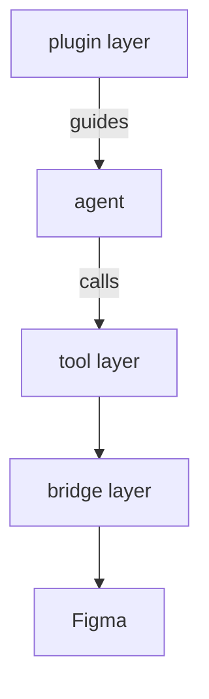

# figma-agent-bridge — Principles

This is the **governing document.** Every other doc (`architecture.md`, the `specs/`,
the plans) and every implementation decision is subordinate to it. When a design and
these principles disagree, the principles win — or a principle is changed **deliberately,
first**, with human approval.

## Project scope — three layers, one purpose each

figma-agent-bridge lets an AI agent read and build Figma designs. It is **three layers**,
and the whole discipline is that **concerns never leak across them**:

- **Bridge** — reliable, standardized transport between the agent and Figma (the MCP
  server's transport, the WebSocket relay, and the Figma plugin that executes commands).
  It cares only about **connection reliability and a consistent result/error contract** —
  never about design semantics.
- **Tool** — the agent-facing capability surface. It exposes **everything the Figma API
  can do** (*possible*) and makes it **pleasant to use** — compact formatting, batching
  (*useful*). It holds **no opinions**.
- **Plugin** — the Claude Code plugin: **skills, agents, and commands**. This is where all
  **preferences, recommendations, and opinionated workflows** live. *(Not to be confused
  with the Figma plugin, which is part of the bridge.)*

> **The rule that ties them together:** each layer has exactly one purpose. A concern in
> the wrong layer is a bug — no preferences in the tools, no design semantics in the
> bridge, no transport detail in a skill.

## Bridge layer

### B1 — A reliable, standardized pipe
The bridge moves commands to Figma and returns results and errors **faithfully and
consistently**. Its promise is reliability (connect, stay connected, recover) and a
**uniform contract** (every result and every error has the same shape). It never
interprets what a node *means*.
*Why:* everything above depends on the bridge being boring and trustworthy; if transport
or error shapes are inconsistent, no tool or skill can be either.

### B2 — Versioned and compatible
The whole app is versioned with **semver**, and **a breaking change bumps the minor** version
(patch is reserved for non-breaking changes). The bridge guards against a plugin↔server **version
skew**: it compares the two sides on **major + minor only** (patch ignored) and, on a mismatch,
**fails loudly with an actionable message** — never a silent breaking drift.
*Why:* an uncaught breaking transport/schema change corrupts sessions silently (the 2026-06-25
incident). Comparing on semver **major.minor** means every breaking change trips the check while
harmless patches don't — neither too strict (tripping every release) nor too loose (missing
breaks). *(Where the version is sourced and how it's compared is mechanism → the specs.)*

### B3 — Every command is addressed to exactly one file
The bridge never leaves **which file** ambiguous. A command carries its target file's
**stable identity** (`fileKey`) and executes **only** against that file — never another,
never a guessed default. If the target file has **no live, connected plugin**, the command
**fails loudly and asks the agent to choose** — it does not silently retarget, and it does
not fall back to "the only file that happens to be open." On a transport that can reach
more than one file at once, a write must never land in the wrong file.
*Why:* once more than one file is reachable, a silent mis-target corrupts the wrong design —
the failure that erodes trust fastest. "One file was open, so I edited it" is exactly the
guess this forbids: the file the agent meant may be the one that just closed. Naming the
file on every command, and making an unmatched target a hard stop, is what makes multi-file
safe. *(Mechanism — per-file channels, the availability registry, the plugin-side identity
guard — lives in the specs, not here.)*

## Tool layer

### T1 — A clean, symmetric, organized facade over Figma
The surface is **symmetric** (every read has a matching write; consistent names, parameter
shapes, and grouping) and **very well-organized**. Figma's Plugin API is sprawling and
inconsistent; the bridge **absorbs that mess and never leaks it** to the agent. One
concept has one canonical name, everywhere.
*Why:* an agent reasons far better over a small, predictable, symmetric surface than over
Figma's raw API; consistency is what makes the tools learnable and composable.

### T2 — Round-trip fidelity
The sharpest case of symmetry: a node read in the **edit** format writes back **losslessly**
via `create_node`/`update_node`. Anything readable is writable under the same name. Any
field that cannot round-trip is a **documented, deliberate** asymmetry — never a silent one.
*Why:* read-modify-write is the core agent loop; if a read can't be written back, the agent
can't safely edit existing designs.

### T3 — Node view vs edit formats
For **nodes**, reading has two formats: a compact, lossy **view** (`inspect*`) built to scan
as many nodes as cheaply as possible, and a faithful **edit** format (`get_node`) that
round-trips (T2). Reading defaults to view; the edit format is used only when you intend to
write back. Other data (styles, variables, components) uses a single representation unless
breadth-vs-fidelity actually demands two.
*Why:* understanding a design needs breadth (many nodes, few tokens); editing needs fidelity
(one node, complete). One format can't be both.

### T4 — Token efficiency is first-class
Every tool is designed to **minimize the tokens** an agent spends reading and writing.
Output defaults to the most compact form that still serves the task.
*Why:* the agent's context is the scarcest resource; a tool that floods it is a worse tool
even when it is correct.

### T5 — Minimize round-trips; batching is offered, the agent decides
Every tool call is a latency round-trip to Figma. The surface therefore **provides batch
affordances** so the agent can do more per call. Whether to batch is **always the agent's
choice** — never forced, never the only path.
*Why:* round-trips dominate wall-clock; batching lets a capable agent cut latency while
single-target calls stay simple for everything else.

### T6 — Possible + useful, no opinions
The tool layer aims to expose **every distinct capability the Figma API offers**
(*possible*) — one non-redundant tool per capability — and to make them **useful**
(formatting, batching). It bakes in **no opinions** about how a design *should* be made.
*Why:* opinions age and vary by user; capability and ergonomics don't. Keeping opinions out
of tools is what lets the plugin layer own them (P1).

### T7 — Honest capability
Every tool maps to a **real Figma API**. A capability that may be unavailable is
**feature-detected**: the tool warns and degrades gracefully rather than hallucinating or
failing silently. The surface never promises what Figma can't do.
*Why:* a tool that claims a capability it lacks corrupts designs and erodes trust faster
than a missing tool ever would.

### T8 — One expression grammar, one source of truth
All values — color, font, effect, layout, sizing, constraints, stroke, text — use the
**single expression grammar** (`specs/expression-formats.md`), parsed by **one shared
parser**. Formats are never reinvented per tool; the grammar is extended in the doc and the
parser together.
*Why:* one grammar lets the same string round-trip through read and write and keeps every
tool consistent; per-tool formats guarantee drift.

### T9 — Native to modern professional Figma practice
The surface makes the modern professional Figma workflow the path of least resistance —
each part at least as easy as the naive alternative and never blocked: **auto-layout over
coordinates**, **composition from components** (variants + boolean/text/instance-swap
properties + slots), and **binding to semantic tokens/styles over literals** (including
layout numbers). An agent defaults to HTML-thinking — absolute frames, duplicated shapes,
hard-coded values — so the tool removes every reason not to build like a professional.
*Why:* in Figma, quality and maintainability come from this workflow, not pixel-pushing.
Only the plugin layer should *prefer* it (P1); the tool layer makes it effortless. Refines
T6. Full reference: [[figma-bridge/docs/reference/figma-professional-practice]].

### T10 — Bounded by default; never let a call blow up the agent
Every tool is **bounded**: no single call returns unbounded output or runs unbounded work.
Reads and scans carry a **default budget/limit** and **truncate with a continuation handle**
(cursor/receipt) rather than flooding the agent's context or exceeding the bridge's command
timeout. A request for "everything" is served in safe, resumable pieces — the surface
protects the agent from one call that overflows its context (token blow-up) or hangs the
bridge (an O(document) scan → timeout).
*Why:* the agent's context and the bridge's round-trip are both finite; an unbounded read
corrupts the session and an unbounded scan stalls it. A tool that can sink the agent is
worse than one that returns a bounded page plus a way to continue. Implemented via the
read-model (D1: limit + truncation + cursor); refines T4 (compact ≠ bounded — a call can be
compact yet still O(document)).

## Plugin layer (skills / agents / commands)

### P1 — What ships vs what the user customizes
Opinions never live in the tools (T6). Within the plugin layer, a **shipped** skill may carry
only **tool usage** (how to operate the surface) and a **basic level of the universal
professional practices** — **design-system-first** and **component-first**. These ship because
they are **construction, not taste** (how a design is built, not how it looks) and have a
**universally-defensible default**, so the plugin guarantees a professional **baseline** for a
user who customizes nothing.

Everything else is a **preference** and lives in the **user preference skill**
(`figma-bridge-prefs`), never in a shipped skill: all **concrete values** (tokens, spacing
scale, type ramp, naming) and any **stricter-than-basic standard** — including *how strictly* to
apply design-system-first and component-first. A preference may ship a default **only if** it
has a universally-defensible floor; design-system-first and component-first do — a brand colour
or spacing scale does not (any default there imposes one team's taste on all).

*Why:* the shipped layer serves every user, so it holds only the universal — the mechanics and
the basic floor of the construction workflow the whole surface is built around (T9). A user with
no preferences still gets that floor; `figma-bridge-prefs` raises the level and supplies the
concrete values. The moment guidance encodes a particular value or a stricter-than-basic
standard it is no longer universal and must be swappable — so it belongs to the user.

## Where mechanism lives
*How* these principles are met — transport and reconnection, the typed `{error, code}`
envelope, the async Figma calls, server-side parsing (the plugin only assigns),
replace-not-merge write semantics, the package layout — belongs in **`architecture.md`**
and the **`specs/`** docs, **not here.** Keeping mechanism out of the principles is what
lets them stay a stable north star.
