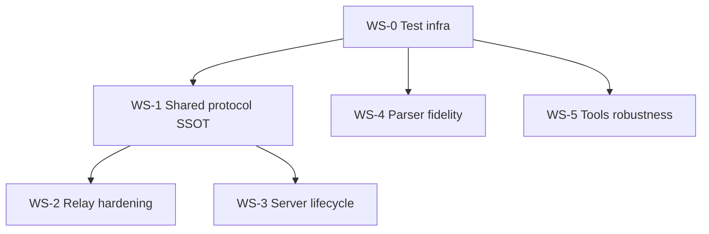

# Server + Relay Review Fixes — Design

## Context

A deep multi-agent review of the `relay` and `server` packages (adversarially verified)
surfaced **58 confirmed findings** consolidated into **30 actionable items** (no P0s).
The full suite is green at baseline: **251 pass** (shared 2, relay 9, server 240), 0 fail.

This spec records the design for fixing **all confirmed findings**. Per-finding problem
detail lives in the review; this document captures the *approach*, *decisions*, and a
*self-contained, testable task mapping* so the work can be executed (incl. in fresh sessions).

## Goal

Close every confirmed correctness, security, robustness, and maintainability finding in
`packages/relay` and `packages/server` (plus the supporting `shared` protocol types),
without regressing the green suite, landing each workstream as a separate reviewable commit.

## Locked decisions

1. **Scope** — fix *everything confirmed* (all 30 consolidated items, incl. P3s).
2. **Relay state** — refactor the module-global state (`channels`, `clientChannels`,
   `channelRegistry`, `alive`, `heartbeatTimer`) into a **per-server context object**
   created inside `startRelay`. Eliminates the double-start timer leak and mid-iteration
   fragility by construction; makes the relay instantiable/testable.
3. **Error model** — unify create/read/search/export tools on **try/catch in each handler**
   (map thrown plugin errors to tool-formatted messages, as `session.ts` already does);
   delete the dead `result.error` branch. Keep the client's reject contract.
4. **Style cache** — **delete** the `styleCache`/`resolveStyleIds`/`resolveTreeStyles` path
   and its test (never wired in production). Re-add when a tool actually populates a cache.

## Resolved sub-decisions (⚑ from design review, approved)

- **WS frame validation** — define zod schemas for the WS message union in `shared` and
  `safeParse` every inbound frame on **both** ends (relay + figma-client). Chosen over inline
  guards: matches existing zod conventions and removes type/schema drift.
- **Non-linear gradients** — document `angle` as **linear-only**; drop `angle` from the
  radial/angular/diamond representation rather than serializing gradient transforms for all
  four types (YAGNI; the build side never converts angle back to a transform for any type).
- **Application Ping/Pong** — **remove** the dead `type:'ping'`/`type:'pong'` protocol path
  and rely solely on native ws ping/pong for liveness (no version handshake built).
- **`inspect_components`** — switch to true case-insensitive **substring** matching to match
  the schema's documented contract (was an undocumented regex/wildcard that could throw).
- **Resource caps** (proposed constants, confirm in review):
  `MAX_CHANNELS_PER_CONNECTION = 32`, `MAX_MEMBERS_PER_CHANNEL = 64`,
  `MAX_TOTAL_CHANNELS = 1024`, `MAX_PAYLOAD_BYTES = 4 * 1024 * 1024`,
  per-connection token bucket `~50 msg/s burst 100`.

## Non-goals

- No reconnect/backoff in `figma-client` (verifier confirmed the no-reconnect design is
  intentional; the `connect` tool re-establishes).
- No graceful-shutdown/signal handling in `index.ts` (stdio MCP server dies with its parent).
- No new gradient-transform fidelity for non-linear types (see sub-decision).
- No feature work beyond the review; no changes to the Figma plugin package.

## Architecture of the change — 6 workstreams (TDD)

Within each workstream: **write the failing test first**, then fix, then run
`bun --filter '@figma-agent-bridge/*' test` and `…typecheck`. Each workstream is a commit.

### WS-0 · Test infrastructure (enables TDD for failure paths)

- **Mock fidelity** — `test/mocks/mock-plugin.ts`: make the create handler **echo received
  params** (fills/effects/layout/gradient) so e2e can assert serialized values reach the plugin.
- **Injectable timing** — parameterize `HEARTBEAT_INTERVAL` (relay) and
  `POLL_INTERVAL_MS`/`MAX_POLL_ATTEMPTS` (`ensure-relay`) so failure-path tests are deterministic
  (no real multi-second sleeps).

### WS-1 · Shared protocol SSOT (`packages/shared`)

- **WS protocol zod schemas** — new `shared/src/ws-schemas.ts` (or extend `schemas.ts`):
  zod schemas for `JoinMessage`/`ChannelMessage`/`RegisterMessage`/`PingMessage`
  (`RelayIncoming`) and `BroadcastMessage`/`SystemMessage`/`PongMessage` (`RelayOutgoing`).
  Single source of truth; TS types derive from / stay in sync with schemas.
- **Item 25** — use `connectParamsSchema.shape` in `index.ts` as SSOT (relax `channel` to
  `.optional()` to match live auto-discovery); or delete the orphaned export. → use it.
- **Item 26** — type the relay's send paths against `RelayOutgoing` via a `send(ws, msg)` helper.
- **Item 24** — remove the application-level Ping/Pong types + relay branch (native ws only).

### WS-2 · Relay hardening (`packages/relay/src/relay.ts`)

- **Refactor** module globals → per-server context object (decision 2). `startRelay` owns its
  own state + timer; `stopRelay` clears that instance. (Closes items 16 double-start leak.)
- **Item 1a** — bind `hostname: '127.0.0.1'` (opt-in `RELAY_BIND` env for advanced LAN use).
- **Item 1b** — pass `ws` to `handleRegister`; verify
  `clientChannels.get(ws.data.id)?.has(channel)` before mutating the registry.
- **Item 5 (relay side)** — `safeParse` inbound frames against WS schemas; drop invalid frames;
  guard `channel` non-empty in join/register; skip broadcast when inner `message` is missing.
- **Item 7** — enforce caps (per-connection channels, members/channel, global channels) +
  `maxPayloadLength` + per-connection token-bucket rate limit; reject over-limit joins with a
  system error.
- **Item 8** — track **all** upgraded sockets in a context `Set` (added on upgrade/open, removed
  on close), seed `alive=true` at upgrade; run heartbeat over that set, not only channel members.
- **Item 17** — heartbeat collects dead sockets into a local array and closes them **after** the
  iteration (decouple mutation from iteration).
- **Item 28** — exclude the sending socket from `handleMessage` broadcast (removes reliance on the
  `hasResponse` heuristic); keep the heuristic as defense-in-depth.

### WS-3 · Server lifecycle (`packages/server/src/{figma-client,ensure-relay}.ts`)

- **Item 2 + 27** — `joinChannel`: add a join **timeout** that rejects + clears `joinResolve`;
  **correlate** the system reply by id (or serialize joins); in `rejectAll`/`onclose`/`disconnect`
  reject a pending join. `connect()` early-return also accounts for `CONNECTING`.
- **Item 5 (client side)** — `safeParse` inbound frames in `figma-client.handleMessage`; guard
  `parsed.message` before dereferencing.
- **Item 11** — `ensureRelay`: wrap `import.meta.resolve` + `Bun.spawn` in try/catch returning the
  friendly `{error}`; on readiness timeout `proc.kill()` (await `proc.exited`) before returning;
  check `proc.exitCode` in the poll loop to detect early crash; single-flight re-check before spawn.
- **Item 30** — drop the unused `started` flag from the production contract (keep `proc` for tests).

### WS-4 · Parser / expression fidelity (`packages/server/src/{parser,expression-parser}.ts`)

- **Item 3** — allow a sign in the linear-gradient angle regex:
  `/^(-?\d+(?:\.\d+)?)deg,\s*(.+)$/`. Round-trip test on `[[0,-1,1],[1,0,0]]` asserting the
  **exact** `-90deg` survives re-parse.
- **Item 4** — fold paint opacity into emitted hex alpha:
  `effectiveAlpha = (color.a ?? 1) * (paint.opacity ?? 1)` → 8-char hex when `<1`; add `opacity`
  to `FigmaFill`; applies to fills **and** strokes. Round-trip test for `paint.opacity < 1`.
- **Item 12** — reimplement `parseEffectExpressions` in terms of `parseEffectExpression`
  (single regex source of truth); make throw-vs-skip explicit and aligned with the fill path.
- **Item 13** — extract `paintToExpression(paint)` (SOLID/IMAGE/gradient incl. `atan2` math) used
  by both `parseFills` and `renderPaintValue`; extract a per-element effect formatter
  (with `includeSpread` flag) used by `parseEffects` and `renderStyleEffect`. Output-identical.
- **Item 14** — delete `toPageLayoutYaml`/`toStylesYaml`/`toComponentsYaml`/`toInspectYaml` and
  their self-referential tests (~140 lines; no production caller; `*Tree` variants cover it).
- **Item 18** — document `angle` as linear-only; drop it from the non-linear gradient
  representation. Update `docs/specs/expression-formats.md` to match.
- **Item 19** — `parseFontExpression`: guard `lastSlash === -1`/`secondSlash === -1`, throw a
  descriptive error; tests for 0-slash and 1-slash inputs.
- **Item 20** — after `parseFloat` in line-height/letter-spacing/font-size, check
  `Number.isFinite` and throw on `NaN` (consistent with `parseColorExpression` returning null).

### WS-5 · Tools robustness (`packages/server/src/tools/*.ts`)

- **Item 6** — try/catch error model in create/create-component/create-svg/read/search/export
  (decision 3); delete the dead `result.error` branch.
- **Item 10** — delete the style-cache resolution path + its test (decision 4).
- **Item 9** — multi-selection `inspect`: when `parsedNodes.length < selection.length`, prepend a
  note listing the failed ids; update the existing "skips nodes that fail to fetch" test to assert
  the note.
- **Item 15** — express the real `componentProperties` contract in zod (refined/discriminated:
  BOOLEAN→boolean default, TEXT/INSTANCE_SWAP→string default, INSTANCE_SWAP `.min(1)`); drop the
  `as` cast in `index.ts`.
- **Item 21** — `Array.isArray` guard before `.map`/`.filter` in `search.ts`, `read.ts`,
  `design-system.ts`; return a clear "unexpected response from plugin" otherwise.
- **Item 22** — `export`: validate `typeof result.data === 'string'` after the null check.
- **Item 23** — `inspect_components`: true case-insensitive substring match (sub-decision).
- **Item 29** — extract shared tool helpers (`tools/shared.ts`): `requireConnected(client)`,
  `formatMutationResult(result, failMsg)`, `textResult(text)`, one `ToolResult` type; adopt
  everywhere (incl. `export.ts`).

## Sequencing & dependencies

WS-0 first. WS-1 gates the two WS-validation consumers (WS-2 relay, WS-3 client). WS-4 and WS-5
depend only on WS-0 and can proceed in parallel. Riskiest: WS-2 (relay refactor) and WS-1 (touches
both ends) — both land behind expanded tests before consumers change.

## Testing strategy

- TDD per item; new coverage explicitly targets the review's gaps:
  - Relay: heartbeat dead-client eviction, malformed frames, double-join, register-before-join,
    426 branch, caps, sender-echo exclusion.
  - figma-client: in-flight `sendCommand` rejects on disconnect; join timeout; not-connected /
    not-in-channel guards; `CONNECTING` race.
  - ensureRelay: spawn-failure, readiness-timeout (+ orphan kill), foreign-server-on-port —
    using injected short constants.
  - Parser: **exact** serialized gradient strings (negative + `0deg`); `paint.opacity < 1`
    round-trip; font 0/1-slash; NaN numeric inputs.
  - e2e: mock echoes params so gradient angle/stops/effects are asserted end-to-end.
- Gate every workstream on `bun --filter '@figma-agent-bridge/*' test` **and** `…typecheck`.

## Risk & rollback

- Each workstream is an isolated commit → revertable independently.
- Relay refactor (WS-2) is the highest-risk change; the existing 9 relay tests plus new ones run
  before and after to lock behavior.
- Resource-cap constants are conservative and behind named constants for easy tuning.

## Acceptance criteria

- All 30 consolidated findings addressed or explicitly deferred with rationale.
- Suite green and growing (≥ new tests for each item with a test obligation); typecheck clean.
- `expression-formats.md` updated for the linear-only-angle decision.
- No new lint/prettier violations.
