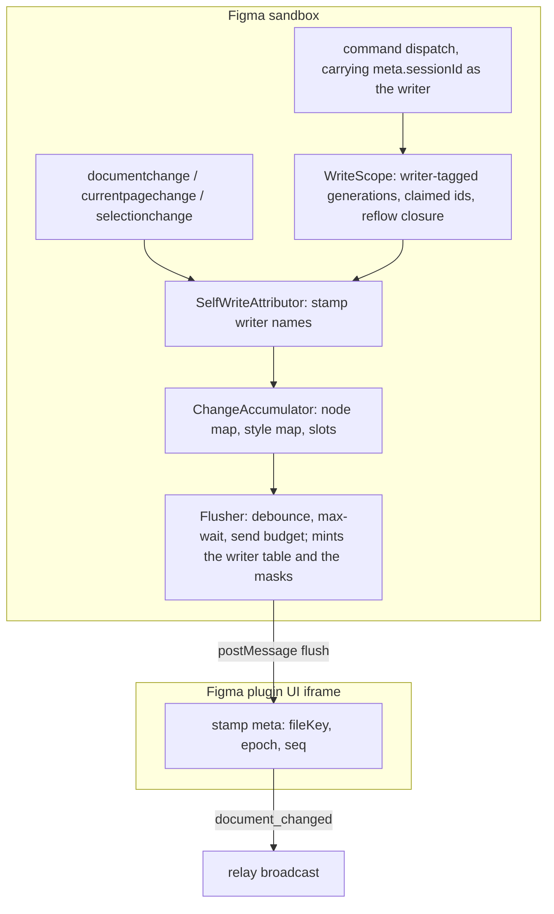
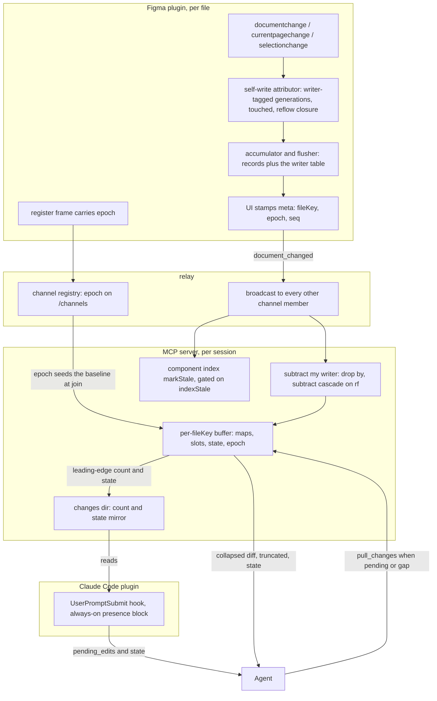

# Change Feed

> Governed by [[figma-bridge/docs/principles|the principles]]. This feature spans all three layers
> and the split is load-bearing: the listeners, the self-write attributor, the accumulator, the push
> frame and the attribution it carries, the server buffer with its per-consumer subtraction, and the
> count mirror are **bridge** (**B1** uniform contract, **B3** per-file);
> `pull_changes` is a no-opinion **tool** (**T6**, **T4**, **T10**); the mechanics of
> reading the block and draining before acting are **tool usage** and belong to the design-loop
> skill (**P1**). The feed is a **best-effort freshness hint**, never an authoritative guarantee
> (**T7**). Tool contracts are authoritative in
> [[figma-bridge/docs/specs/tool-surface|tool-surface.md]]; the wire envelope in
> [[figma-bridge/docs/specs/request-envelope|request-envelope.md]]; this spec defines the design
> those absorb.

## Overview

Between two agent turns the **file keeps changing without the agent** — the user moves, renames,
restyles and **deletes** nodes, and a second agent session on the same file writes to it too. The
agent's last read is a snapshot that silently goes stale, so it plans against nodes that have moved
or no longer exist and acts on ghosts.

The Change Feed gives the agent a cheap way to ask *"what changed that I did not cause, since I last
looked?"* right before it acts. The *I* in that question is what makes the design hard: one plugin
serves every session on the file and broadcasts one frame to all of them, so causation has to be
established where the writes happen — in the plugin, which alone knows which command touched what —
and applied where they are read, in each session's own server. While the plugin is connected it
records document mutations into a **per-file, in-memory buffer on the MCP server**; a
`pull_changes` tool **drains** that buffer on
demand; and the pending-edit **count and baseline state** are surfaced each turn as the
`pending_edits` / `pending_edits_state` fields of the always-on presence block
([[figma-bridge/docs/specs/plugin-presence|plugin-presence.md]]) — so the agent drains only on turns
where something actually changed or the baseline is not trustworthy.

It is **pull-based by necessity**: an LLM agent only perceives state when *it* calls a tool. Even
MCP resource subscriptions never reach the model's reasoning loop, so the design is a pollable tool
plus a hook that surfaces the signal — not a stream.

**It is a hint, not a guarantee (T7).** The feed is a *nudge*: it reduces stale-action surprises and
lets the agent re-plan proactively, but it never promises to have caught every change. The ultimate
guard remains that acting on a deleted node **fails loudly** (`NODE_NOT_FOUND`). The feed's job is
to make that rare, not to replace it.

## Scope

**Covers:** capturing edits from Figma events while connected; the source-side attribution of each
change to the session whose command caused it; the plugin-side accumulator and flush policy; the
`document_changed` push frame and the attribution it carries; the per-`fileKey` server buffer, the
per-consumer subtraction it applies on ingest, and its baseline states; the `pull_changes` drain; and
the on-disk count mirror that feeds `pending_edits` into the always-on presence block (the
`UserPromptSubmit` hook itself is owned by
[[figma-bridge/docs/specs/plugin-presence|plugin-presence.md]]).

**Does not cover:**

- **Offline change tracking.** Figma fires no events while the plugin is closed and exposes no
  document version number or timestamp (see Design constraints). Edits made while disconnected are
  invisible; an untrustworthy baseline is reported as such (re-read fully), it does not reconstruct
  history.
- **Variables.** `documentchange` does not fire for variable edits (a known Figma gap).
- **Rich diffs.** Records carry identity + change kind + changed-property *names*, not before/after
  values. The agent re-reads the affected nodes for detail.
- **Write arbitration.** The feed *reports*; it does not lock, queue, order or reconcile concurrent
  writers. Two sessions writing the same node both succeed, last write wins in Figma, and each is
  told afterwards what the other did. Whether an agent should then yield, redo or ask is tool usage,
  not a capability of the feed.
- **Per-property causation.** A record is attributed as a whole; the design never claims *which*
  changed property name came from *which* writer (see Limitations).
- **Sub-session attribution.** The writer key is the session. Subagents inside one session share it,
  because they share one MCP server, one buffer and one count file (see The writer key is the
  session).
- **The component index's own freshness**, which consumes the same push
  ([[figma-bridge/docs/specs/component-index|component-index.md]]); this feed is a parallel consumer
  of one frame, not a replacement.

## Three-layer placement

| Layer | Responsibility here |
|---|---|
| **Bridge** | Plugin listeners → self-write attributor → accumulator → the enriched `document_changed` push (**B1**); server buffers per `fileKey` (**B3**), each subtracting its own session's writes on ingest; the count mirror file. Carries changes faithfully; compacts events and names their writer, but never interprets node *meaning*. |
| **Tool** | `pull_changes({fileKey, limit?})` — drains and returns the buffer in a compact, bounded envelope (**T4/T10**). Pure capability, **no opinion** (**T6**). |
| **Plugin** | The count mirror feeds `pending_edits` / `pending_edits_state` in the always-on presence block; the design-loop skill states the **mechanics** of the loop — which field to read, when the drain is worth a call, what a broken baseline obliges. That is **tool usage** under **P1**, not taste: it is how the surface is operated, and it has no defensible alternative reading. Anything about *how often* to re-verify beyond that (re-read before every batch, not just before a destructive one) is a preference and lives in `figma-bridge-prefs`. |

A client without the skill can still call `pull_changes` deliberately — the tool carries no opinion
(**T6**) and the skill only documents its operation.

## Events captured

Three `figma.on(...)` listeners in the plugin sandbox. `documentchange` carries both node and style
changes (style edits surface as its `STYLE_CREATE` / `STYLE_DELETE` / `STYLE_PROPERTY_CHANGE`
subtypes — a **separate `stylechange` listener is redundant and is not used**). Node/style changes
are **accumulated** (each into its own collapsing map); page and selection are **latest-wins single
slots** so their noise cannot flood the buffer.

| Listener | Treatment | Yields | Why captured |
|---|---|---|---|
| `documentchange` | accumulate into **node map** and **style map** (keyed by id) | node `create` / `update` / `delete`; style `style_create` / `style_update` / `style_delete` | The core signal — the only source of user moves/renames/**deletes**, and (via STYLE_* subtypes) style edits. |
| `currentpagechange` | latest-wins slot | `page` record (`id`, `name` of the now-current page) | Context: where the user is. No payload — read from `figma.currentPage`. |
| `selectionchange` | latest-wins slot | `select` record (bounded `ids`, `count`) | Context: where the user is working. Ephemeral, never a mutation. No payload — read from `figma.currentPage.selection`. |

Deliberately excluded: `stylechange`, `drop`, `run`, `close`, `textreview`, codegen, FigJam timers,
ui `message`.

## Attribution — which session caused a change

`origin: 'LOCAL'` covers the user's edits and every plugin-issued edit alike (see Design
constraints), so a change is only ever separable from the agent's own work **at source**, by knowing
which command was running when it happened. That is the whole reason the write scope exists. It is
also the reason attribution cannot stop there: **one plugin serves every session on the file**, and
one `document_changed` frame is broadcast to all of them. A drop decided in the plugin is a drop for
*everyone*.

That is not a tuning question. A plugin that drops what session A caused makes A's work invisible to
session B, and B's feed then reports `pending_edits: 0` — which the design defines as *nothing
changed, the snapshot is good*. B is confidently wrong over a stale snapshot, which is the exact
failure the feed exists to prevent, reached with another agent in place of the user, and reached
**silently**.

**So the plugin attributes and the consumer subtracts.** The plugin stamps every record with the
sessions that caused it; each server drops the records stamped with *its own* session and keeps the
rest. Every other split fails on a fact of the transport:

- **The plugin cannot subtract per consumer.** The relay is a dumb broadcaster with no unicast — one
  frame reaches every member of the channel or none does. A per-consumer frame would mean N frames
  on the socket that also carries command replies, against the one budget the flusher exists to
  protect.
- **The server cannot attribute for itself.** It does see other sessions' command frames — the relay
  re-broadcasts channel messages to every member, so `meta.sessionId` and `params` of another
  session's command already arrive — but params name only the ids the agent *chose*. They cannot
  name the nodes a command **created** (the tree builder returns one root for a hundred nodes, which
  is why `claim` exists) nor the nodes a write **re-flows without naming**, which needs the document
  the server does not hold. Reconstructing causation server-side would be a second, weaker copy of
  the write scope, drifting against the real one.

Attribution therefore rides the frame, and the frame is broadcast: **every consumer sees every
session's records and discards its own.**

### The writer key is the session

The unit of attribution is the **Claude Code session**, named by `meta.sessionId`
([[figma-bridge/docs/specs/request-envelope|request-envelope.md]]), which already rides every command
frame the plugin receives. The plugin's UI realm forwards it into the sandbox alongside the B3
target, so the write scope can key on it; that is an internal message field, not a wire addition.

**Not `agentId`.** A session's subagents share its `sessionId` and are told apart only by `agentId` —
but they also share one MCP server, one buffer and one count file, so a finer writer key would have
no distinct consumer to serve. The granularity of attribution is the granularity of consumption, and
that is the session. Two subagents in one session are one writer here, and each sees the other's
work as its own — correct, because they read one buffer.

**`_unattributed` is a writer.** A command that carries no `sessionId` — the identity hook absent
(see Fallback) — opens a generation under the reserved literal `_unattributed`, and its records are
stamped with it. A server that has never received a `sessionId` subtracts that writer, so the
degraded route keeps exactly the single-agent behaviour. The literal is the same
sentinel the count mirror keys on, and it is one value in both places by construction, not by
coincidence: the writer a server subtracts and the count file it writes are both
`sessionIdentity.current() ?? '_unattributed'`. No platform session id collides with it (the same
format argument the count mirror makes), and a stray agent-supplied one is the same benign misroute.

### A record has writers, not a writer

Two sessions can both have touched one id — A created a node, B renamed it, and a deferred batch
delivers a change on it while both generations are still retained. The record is then attributed to
**both**, as a set.

Attributing it to a winner instead — the most recent claimant — would report it to the *other*
claimant as foreign, which is a false nudge, and hide it from a session that may not have caused it,
which is silence. A set preserves the single-session rule exactly: *drop for session S iff the id is
in S's touched set*, evaluated independently per S — the one-agent rule with `S` left implicit.

### Two masks, because the reflow rule is per consumer

Membership in the reflow closure is as session-scoped as membership in the touched set: an id can
sit inside A's cascade and be untouched by B. A record therefore carries **two** attributions — the
writers that **touched** the id, and the writers whose **reflow closure** contains it — and each
consumer reads its own bit out of each.

This is what keeps property-level subtraction alive under N writers rather than degrading it. It
also makes it *more* informative than the single-agent case: a cascade is noise to the session that
caused it and **news to a session that did not**, whose snapshot of that node's geometry has just
gone stale. A single global subtraction, performed in the plugin, would destroy that for every
consumer at once. Where two sessions' closures overlap the news is lost to both, and that residual is
stated in Limitations.

**The closure is computed in the plugin and consumed in the server.** Only the plugin can compute
it — it alone holds the document and the command that named the ids. The rule that *consumes* it —
subtract `CASCADE_PROPS` from `props[]`, keep the remainder, drop only when nothing survives — runs
once per consumer, at ingest, against that consumer's own `rf` bit. The algebra is the same
subtraction either way; what is session-scoped is whose closure it is evaluated against.

### What it costs

Every agent write crosses the wire, including on a file with one agent, where the sole consumer
will discard it. That cost is paid deliberately, and the shape of it matters:

- **A file only the agent writes to still emits a frame every flush window.** An eliding design emits
  nothing at all there — nothing survives to accumulate, and an empty flush is suppressed — so this is
  where carrying the agent's own writes shows most plainly: a frame per flush window for as long as a
  build runs, on a file where no other party is editing. Above that floor the cost is bytes rather
  than frames: the rate stays bounded by the accumulator plus `FLUSH_MAX_WAIT_MS` and capped again at
  `FEED_FRAMES_PER_SEC`, neither of which changes when more records fold into one flush. The budget a
  command **reply** needs is therefore preserved — the constraint that would otherwise have made this
  design impossible — but `FEED_FRAMES_PER_SEC` is a live bound during a build rather than a
  theoretical one, and the excess it refuses folds back into the accumulator.
- **The accumulator's cap is spent by the agent's own work too.** Its maps are keyed by id, so a
  hundred-node build folds to about a hundred entries rather than one per raw event. It cannot be
  sized against the largest build, because build size has no bound — a tree spec is arbitrarily
  large and a `batch` can chain several inside one flush window. So `ACCUM_CAP` is a memory bound
  that a big enough build reaches, and reaching it sets `overflow`, which breaks every consumer's
  baseline **including the builder's**: the one operation this design makes able to oblige a session
  a re-read of the file it just wrote. Disclosed in Limitations rather than argued away.
- **A co-agent's build inflates the count.** A session that builds three hundred nodes leaves three
  hundred pending things in every *other* session's buffer — honest (they did change, and none of
  them by that reader), but no longer drainable in one bounded call. The design keeps the drain
  bounded rather than special-casing size; what an agent does with a large foreign count — re-read a
  region rather than consume three hundred records — is tool usage under **P1**.

The alternative — eliding at source whenever the plugin believes it is the only session's work in
the frame — is refused, because the plugin cannot know. The relay announces no membership, a `join`
is invisible to it, and a session that joined through an explicit connect and has only ever drained
has issued no command the plugin could have seen. Eliding on that guess starves exactly the consumer
that is quietest: silence, when the guess is wrong, to save bytes.

### What a second session can stand in for

Because a second session's writes are foreign to the first **by construction**, the conditions that
otherwise need a person at the keyboard — a not-the-agent create, update, delete or rename surviving
attribution, at the same instant the agent is writing — are producible by a second agent.
Attribution is checkable without a human.

**Event-shape fidelity does not.** An agent's edits enter through the plugin's command switch; a
person's enter through Figma's own editor, and the runtime does not emit them identically. Inside an
auto-layout frame a person's arrow key **reorders** a child among its siblings and carries `parent`
alongside the positional properties (see Design constraints) — a shape no command dispatch produces.
A second session can therefore stand in for *who* caused a change, never for *what a human's change
looks like on the wire*. The two are separate claims and only the first is machine-producible.

## The change record

```ts
type ChangeOp =
  | 'create' | 'update' | 'delete'                       // nodes
  | 'style_create' | 'style_update' | 'style_delete'     // styles
  | 'page' | 'select'                                    // context slots

type ChangeRecord = {                 // the shape on the wire
  op:     ChangeOp
  id?:    string      // node / style / page id. ABSENT for op:'select'.
  type?:  string      // node/style type. On delete this plus id is ALL Figma gives.
  name?:  string      // best-effort; present on create/update/page, ABSENT on delete.
  props?: string[]    // update / style_update ONLY: changed property names, sorted, deduped.
  ids?:   string[]    // select ONLY: the current selection, capped at SELECT_IDS_CAP.
  count?: number      // select ONLY: the TRUE selection size when it exceeds SELECT_IDS_CAP.
  by?:    number      // bitmask over the frame's writers[]: sessions that TOUCHED this id.
  rf?:    number      // bitmask over the frame's writers[]: sessions whose REFLOW closure holds it.
}

// Plugin-internal, from the attributor to the flush. Writers are NAMES here: the
// bit table does not exist until a frame is assembled (see The attributor stamps names).
type AttributedRecord = Omit<ChangeRecord, 'by' | 'rf'> & {
  by?: ReadonlySet<string>
  rf?: ReadonlySet<string>
}

// What `pull_changes` returns. The masks are spent at ingest and never reach the
// agent; `src` is the residue the buffer keeps (see `src` labels the residue).
type DrainedRecord = Omit<ChangeRecord, 'by' | 'rf'> & { src?: 'agent' }
```

Three shapes, because the same record is three different things on its way through: a set of causes
in the plugin, a bitmask on the wire, and a labelled foreign change in the drain. Naming them
separately is what keeps each end's field set decidable.

- **Attribution is a bitmask over a per-frame table, not a `source` string.** The writers are named
  once per frame in `params.writers[]` (see The push frame) and each record carries the *indices*
  into it. Three reasons, in order of weight. A record needs a **set** of writers, which a single
  string cannot express. Records are numerous — one flush can carry a whole build — so the field is
  paid per record and a session id is a long opaque value to pay repeatedly; an integer is a few
  bytes against roughly fifty, and the ids themselves are paid once per frame however many records
  reference them (**T4**). And the two-letter names are the same economy: a field name on a numerous
  record is wire cost like any other, which is why the verbose alternative is the frame table, where
  it is paid once.
- **Absent means unattributed, and unattributed means everybody keeps it.** A record with no `by` is
  kept by every consumer, so every failure of attribution — a writer that won no bit, a harvest that
  missed an id, an older peer that stamps nothing — surfaces as an over-report to someone, never as
  silence. The masks fail in the same direction the rest of the attributor does.
- **`rf` is node-only.** No real `StyleChangeProperty` is a cascade property, so a style record never
  carries one; styles are decided by `by` alone. A `select` record carries **neither** mask — it has
  no id, so there is nothing to attribute it on, which is the same fact that keeps it on the
  in-flight rule.
- `name` is included on create/update/page because it materially helps the agent reason
  (*"Button/Primary was moved"*) and is cheap for non-deletes; a deleted node becomes a
  `RemovedNode` exposing only `id`, `type`, `removed:true`, so `name` is honestly absent there.
- `props[]` exists only on `update` / `style_update`. Create and delete carry no changed-property
  list — the reader re-reads the whole node.
- **`select` is bounded (T10).** A marquee over a thousand nodes must not put a thousand ids on the
  wire. `ids` is truncated to `SELECT_IDS_CAP` and `count` carries the true size when truncated. The
  cap is a tuning constant, not a contract; the invariant is that a `select` record is O(1) in wire
  size.

## The push frame

Records ride the **`document_changed`** push. The frame's *identity* fields ride in **`meta`**,
matching the push shape [[figma-bridge/docs/specs/request-envelope|request-envelope.md]] publishes —
the body is what changed, the headers are who and which connection is speaking:

```ts
// plugin → relay → every other channel member
{
  command: 'document_changed',
  params: {
    changes:    ChangeRecord[],   // may be EMPTY (see the opening flush)
    writers?:   string[],         // the sessions this frame's records are attributed to; the
                                  // table `by` / `rf` index into. Minted per frame, capped at
                                  // WRITERS_CAP, ABSENT when no record in the flush is attributed.
    indexStale: boolean,          // component-index discriminator — see Integration
    overflow?:  true,             // plugin-side accumulator hit its cap; records were dropped
    at:         number,           // flush timestamp, epoch ms (plugin clock)
  },
  meta: {
    fileKey: string,   // the ADDRESSABLE file identity (synthKey) — never null
    epoch:   string,   // plugin connection nonce, equality-compared only
    seq:     number,   // per-connection monotonic frame counter, starting at 0
  },
}
```

`packages/shared/src/ws-schemas.ts`'s `metaSchema` is the **enforcing** definition of the meta
header: the relay parses every frame and re-broadcasts the *parsed* object, so any `meta` field not
enumerated there is silently stripped before it reaches the server. A field described here that is
not in `metaSchema` does not exist on the wire. `params` is a free record and is forwarded whole.

### Why attribution rides `params`, not `meta`

`meta` answers *who is speaking and about which connection* — one value per frame. Attribution is
**per record**: one frame carries the work of every session that wrote inside the flush window, so
there is no single sender identity to put in a header. This is the same fact request-envelope.md
states from the other side: a push is unsolicited and broadcast, so it has no frame-level sender.

The allow-list makes the choice practical as well as correct. `meta` is enumerated and enforced by
the relay, so an addition there is a relay change and a stripped field is an invisible failure;
`params` is forwarded whole, so the plugin and the server can agree on the body without the
broadcaster having to know what it is carrying. The **body** is what changed and who changed it; the
**headers** stay the routing envelope.

It also keeps the realms as they are. The masks are minted in the **sandbox**, which is where the
write scope and the events live, so the sandbox assembles `writers[]` at flush and posts the whole
body across; the UI still stamps only `meta`, and still needs to know nothing about causation — the
same division that lets it stamp an unsaved file's identity without the sandbox knowing a channel.

### Wire version

`writers[]`, `by` and `rf` change the frame the server parses, so the plugin and server adopt them
together and the change **bumps the MINOR** under **B2**
([[figma-bridge/docs/specs/version-handshake|version-handshake.md]] enumerates the frame changes that
do). It is a coordinated change, not an optional field bolted on: a peer that ignores the masks does
not merely lose an enrichment, it keeps its own writes and reports them back to itself as foreign —
tolerable as a degrade, wrong as a steady state. The handshake refuses a minor skew at the file gate
before that can settle in, which is why the degrade is a transient rather than a mode.

### Identity — `meta.fileKey`, and it is the synthKey

`meta.fileKey` carries the **addressable file identity**: `figma.fileKey` when the file is saved,
and the plugin's **channel** when it is not — the `synthKey` rule the server's file gate, the
availability listing and the presence hook all apply. Because a never-saved file's channel is known
only in the plugin's **UI realm**, the frame is built there: the sandbox posts records to the UI, and
the UI stamps `meta`. The sandbox never needs to know a channel or a connection nonce.

`synthKey` is one fact and gets one home: **[[figma-bridge/docs/specs/overview|overview.md]]** defines
it as part of the addressing model; this spec, plugin-presence and the file gate reference it.

The identity is **not** in `params`, and it is **not** named `fileId`. Every other frame on this wire
carries file identity in `meta` (**B1** — one envelope, learned once; **B3** — the canonical param
name is `fileKey` everywhere). A push whose `meta.fileKey` is absent or empty is **dropped** by the
server, silently — it cannot be routed to a buffer, and inventing a route would violate B3.

The server's push handler takes `(params, meta)`. The frame shape is part of the versioned wire
contract, and [[figma-bridge/docs/specs/version-handshake|version-handshake.md]] enumerates the
changes to it that bump the minor under **B2**. A plugin at a skewed version is refused at the file
gate with `INCOMPATIBLE` before it can be acted on, so a dropped push from a skewed plugin is not a
silent degrade — the loud failure precedes it.

Addressing by synthKey also aligns the index's staleness key with its build key: the index is built
and read under the synthKey the agent passes, so identifying the push the same way is what makes an
unsaved file's index invalidatable at all.

**A never-saved file's synthKey is per-plugin-session** — a fresh random channel token each time the
plugin is (re)opened, stable only across reconnects within one plugin session
([[figma-bridge/docs/specs/overview|overview.md]]). So for an unsaved file a plugin reload presents as
a **new file** — new `fileKey`, new buffer opened with no baseline — never as a re-join. The epoch and
opening-flush machinery below therefore carries the reconnect case for **saved** files; for unsaved
files a reload lands on the same honest answer (no baseline) by a different route, and the previous
session's buffer and count file are orphaned.

### `epoch` — the baseline anchor

`epoch` is the plugin's **connection nonce**. It is published on two paths: the `register` frame —
so the channel registry holds it and `GET /channels` exposes it as a `ChannelInfo` field
([[figma-bridge/docs/specs/overview|overview.md]]) — and every push frame's `meta`. Who mints it, in
which realm, and why it rides both paths is owned by
[[figma-bridge/docs/specs/request-envelope|request-envelope.md]]. This spec owns **what a mismatch
means**: a value differing from the one the buffer holds says the plugin restarted, so pushes may
have been missed and the baseline is `gap`.

The registry path is what lets a **late joiner** establish a baseline. The relay does not replay: it
broadcasts to the members present at send time, and the join path returns only an ack with no
backlog. The MCP server joins a file's channel lazily, on the agent's first file-addressed call —
long after the plugin registered — so it can never receive that connection's opening flush. Reading
the epoch from the registry entry it already fetched to resolve the file gives it a baseline anchor
with no extra frame and no replay mechanism.

### `seq` — gap detection

`seq` counts push frames on one connection, starting at `0` for the opening flush and incrementing
by one per frame. The server tracks the last `seq` it saw per `(fileKey, epoch)`. A **gap** — a frame
whose `seq` exceeds `lastSeq + 1` — means the relay's token bucket dropped a frame, so the server
marks the baseline `gap`. `seq` restarting at `0` alongside a new `epoch` is a reconnect, not a gap,
and the epoch change is already handled.

Gap detection is **trailing**: a drop is observable only when a later frame arrives on the same
epoch. Two residuals remain and are stated in Limitations — a drop of the *last* frame of a burst
with no successor stays invisible until the next connection event, and accumulator eviction discards
records at source (reported via `overflow`, never silent).

### The opening flush

Immediately after a successful `register` the plugin sends **one** `document_changed` frame with
`changes: []`, `indexStale: false`, `seq: 0` and the fresh `epoch`.

It reaches the members already in the channel, which is exactly the case the registry path cannot
serve promptly: a server that is **already joined** when the plugin dies, misses edits and
**reconnects without the user editing again**. Without it that server would keep `state: 'ok'` and
the block would report a trustworthy `pending_edits: 0` over a baseline with a hole. With it, the
reconnect itself is the signal. It costs one empty frame per connection, and it is the **only**
deliberately empty frame: a flush with no admitted records and `indexStale: false` is otherwise
suppressed.

## Plugin-side pipeline

Four small pieces, in order. Each is independently testable; none lives inside the command switch.



### 1. `WriteScope` — where each session's own writes are known

```ts
type WriteScope = {
  /** Called on entry to every command dispatch, including each nested batch op, with
   *  the WRITER it belongs to — meta.sessionId, or '_unattributed' — and the COMMAND
   *  NAME, which is what decides event-causing versus read-only. Refcounted PER
   *  WRITER; that writer's outermost EVENT-CAUSING entry OPENS a generation tagged
   *  with it. Harvests the command's PARAMS and captures the reflow closure of every
   *  id they name, while those nodes still exist. A read-only command refcounts and
   *  harvests nothing. */
  enter(writer: string, command: string, params: unknown): Promise<void>
  /** Called ONCE per enter, when that dispatch settles (after the handler's promise
   *  resolves or rejects). Harvests the handler's RETURN into that writer's open
   *  generation. Refcounted; when that writer's count returns to 0 its generation is
   *  SEALED — it stops growing and stays RETAINED. */
  exit(writer: string, result: unknown): void
  /** True while ANY writer has a dispatch in flight, and no dispatch counts as in
   *  flight for longer than MAX_DISPATCH_MS. Governs the context slots only. */
  inFlight(): boolean
  /** Called by every node-CREATING code path at the moment of creation, with the
   *  dispatch's writer and the new node. Adds the id to that writer's open generation
   *  and folds the node into its closure. */
  claim(writer: string, node: BaseNode): void
  /** The writers known to have touched this id: harvested from params and returns,
   *  plus every id claimed at creation. Read over the open generations and every
   *  retained one — monotonic WITHIN a generation, and shrinking only by eviction. */
  writersOf(id: string): ReadonlySet<string>
  /** The writers whose writes can move this id's GEOMETRY without naming it — the
   *  reflow closure, captured eagerly (below). Read over the same generations. */
  reflowWritersOf(id: string): ReadonlySet<string>
}
```

**Generations interleave; they do not nest.** Every session's commands funnel through one dispatch
switch, so a second session's dispatch can open, seal and be evicted inside the lifetime of the
first's. The scope therefore holds **one ordered ring of writer-tagged generations**, not a ring per
session, and the refcount that decides when a generation seals is **per writer** — overlapping
dispatches from *one* writer still share its open generation, the conservative merge a single
writer's own overlapping dispatches get, but dispatches from different writers never share one.
Merging across writers would fuse A's ids into B's attribution, which is not a loss of precision but
a wrong answer.

**Harvest is generic, and its timing is part of the contract.** `enter` folds the command's params
into its writer's generation; `exit` folds its return; within a generation the set only grows. The
walk takes every string under `id` / `ids` / `nodeId` / `nodeIds` / `parentId` / `pageId` / `root` /
`componentId` / `instanceId` / `results[].id`, at any depth. Its failure mode is a **smaller**
touched set, so that writer's own records come back to it as foreign: a **false nudge**, not a lost
edit.

**Creation is claimed, not harvested.** A generic walk cannot recover ids that do not exist when the
command is dispatched: a tree-building command takes a nested *spec* of nodes-to-be and returns only
the root, so a hundred-node build would harvest exactly one id and report the other ninety-nine back
to their author. Every code path that creates a node therefore calls `claim(writer, node)` at
creation — the tree builder's per-node create, single-node create, SVG import, clone, group,
duplicate-page, flatten and boolean-op. Those are a small, enumerable set of choke points, and this
is the one place the design does **not** rely on the generic walk.

**The writer is threaded to the claim site, never inferred there.** A claim happens deep inside a
handler, and the obvious economy — let the scope remember whose dispatch is running — is unsound
here: dispatches interleave at every `await`, so a node created after a font load or an image fetch
would be claimed under whichever session dispatched in the meantime. That misattribution is silent
and lands on the silence side, since the record is then suppressed for a session that did not cause
it. So the writer is a **parameter of the dispatch**, threaded from the message that carried it in
exactly the way the B3 target already is, through the same enumerable set of creating paths. The
cost is a parameter on each of them, paid once.

**Only a dispatch that can cause an event is harvested.** A pure read mutates nothing and moves no
navigation, so it emits no `documentchange`, `currentpagechange` or `selectionchange` — there is
nothing for its membership to suppress, and every id it names is pure reach. That reach is large:
`search` returns hundreds of ids and an `inspect` of a page root folds that page's entire reflow
closure. Since membership outlives the command by design (below), a handful of reads would otherwise
put most of the document into that session's touched set, and its own server would then drop the
user's real edits wholesale while reporting nothing pending — silence, which is the direction this
design refuses. Read-only commands therefore open no generation and harvest neither their params nor
their return; they still refcount, so `inFlight()` is unaffected. Which commands are event-causing is
a **static** property of each entry in the command switch, not a runtime guess. A command wrongly
classed read-only leaves its own writes unattributed — a false nudge to its author — so the doubtful
case is classed event-causing, and a `batch` is always event-causing because its ops may be. A
session that only ever reads therefore claims nothing and sees everything, which is the right answer
for an observer.

**Retention is keyed on the command, not on the clock.** `documentchange` delivery is batched and
unbounded: the runtime decides when to hand a batch over and can defer one long past the exit of the
command that caused it (see Design constraints). Membership that expires on a timer therefore fails
**open** — when a deferred event finally lands, the timer has run out, the agent's own write is
admitted, and `pending_edits` reports the agent's work back to itself. So every event-causing dispatch
instead opens a **generation** holding its own touched set, reflow closure and writer, and the scope
keeps each writer's most recent `RETAINED_COMMANDS` sealed generations. `writersOf()` and
`reflowWritersOf()` read over the open generations and every retained one, so a deferred event still
matches the command that caused it: how long its delivery took is not part of the question, only how
much that writer has done since.

**A generation is sealed at `exit`, not at `enter`.** Commands that await (font load, image fetch)
mutate seconds after entry, so a generation must keep absorbing harvests and claims until its dispatch
settles. `exit` is the first moment the command can no longer touch anything: it is where the set
stops **growing**, not where it starts expiring.

A generation therefore seals at the earlier of its dispatch settling and `MAX_DISPATCH_MS` after it
opened — the second sized above the slowest command that honestly finishes, so a forced seal means a
wedge and not a slow font load. That clause is not a refinement. A dispatch that never settles — a
promise waiting on a font, an image or an API that never resolves — would leave its generation open
indefinitely, and an open generation is neither counted out nor released: it would grow without bound
while every later command merged into it, and `inFlight()` would stay true for the rest of the
session, suppressing every page and selection record. Sealing on age degrades that to a leak, which
is the direction the rest of the design already accepts. The forced seal also clears the refcount. A
harvest that then arrives with no open generation — a `claim`, or the late `exit` of a force-sealed
dispatch — opens a fresh generation and folds into it, so a genuinely slow command that does return
is still harvested, into a younger generation that is retained longer than its own would have been.
That is the conservative side.

**`batch` is refcounted, not re-entered.** A batch re-dispatches N ops through the same switch under
the **same writer**; the outermost `enter` owns the generation and the touched set accumulates across
all N ops into it. The same refcount absorbs that writer's overlapping dispatches — they share the
generation that is open, which is conservative: a shared generation is retained as long as the later
command's would be. Another writer's dispatch arriving mid-batch opens its own generation and shares
nothing.

**Three bounds, and they do different jobs.** A generation is a set of ids, so retention held forever
would grow without limit; reach that never lets go would eventually claim everything the agent ever
touched; and a plugin that outlives many sessions would accumulate a retained set per session. One
bound answers each, and **all three are scoped to the writer**:

- **`RETAINED_COMMANDS`** — opening a writer's generation evicts that **writer's** oldest sealed one
  beyond this count. It is what covers a deferred event, because it advances only when *that writer*
  dispatches: an event that lands long after its own command still finds it, as long as its own
  session has not dispatched past it.
- **`RETENTION_CEILING_MS`** — when a writer has entered no dispatch for this long, **that writer's**
  sealed generations are evicted at once. It is keyed on **idle time since that writer's last
  dispatch**, not on a generation's own age: while a session keeps working none of its generations is
  released and `RETAINED_COMMANDS` alone decides, and once it stops, its whole retained set lets go
  together. It is evaluated **on read** — an idle plugin dispatches nothing, so there is nothing to
  wake up, and the attributor is the only reader.
- **`RETAINED_WRITERS`** — the number of writers that may hold a retained set at once. A writer
  beyond it evicts the **whole** set of the writer that has been idle longest, never part of one:
  half-evicting a writer's ring would silently shorten its reach on somebody else's activity, which
  is the coupling this scoping exists to remove. It is a backstop, not a working bound — the ceiling
  releases an idle session's set long before a file plausibly carries this many concurrently active
  ones.

**The memory bound is the product, and it is a constant.** `RETAINED_COMMANDS × RETAINED_WRITERS`
caps the generations the scope holds however many sessions are on the file, so per-writer scoping
costs a known multiple rather than unbounded growth. That is what makes writer-scoping affordable,
and it is the reason to prefer it: **a shared ring would hand one session control of another's
correctness.** Under a global ring a peer issuing a burst of single-node updates spends the ring in
its own dispatches, and a quieter session's generations are evicted after a handful of commands it
did not issue — so that session's own deferred events return to it as foreign, at a rate its peer
sets. That is not the occasional false nudge the design accepts; it is the **systematic** leak it
rules out by name, a count that is never zero and therefore carries no signal. Hand-over is
session-scoped for the mirror-image reason: another session's activity is no evidence that the first
has handed over, and a global ceiling would let a busy session hold an idle one's claims open while
the user refines its abandoned nodes. The residual coupling that survives is `RETAINED_WRITERS`, and
it is far weaker: it takes more concurrently active sessions than the cap, not merely a fast one, and
it costs the longest-idle writer its retained set — a **false nudge** to a session that has stopped
working, the accepted direction.

The ceiling exists for **hand-over**. Without it, an agent that builds a screen and stops goes on
claiming nodes it touched twenty commands ago while the user refines them, and those refinements are
dropped in silence *for that agent* — the same class of failure the feed exists to prevent, reached
from the other side, and reached on the normal working pattern rather than an exotic one. Keying it
on idle time rather than on a generation's age is what keeps `RETAINED_COMMANDS` meaningful: an agent
round-trips through a model between calls, so under an age-based ceiling a *working* agent's older
generations would expire mid-task and the count bound would never bind at all, collapsing the design
into a wall-clock window wearing a larger constant.

The count and the ceiling are sized against the same question — how much can happen between a command
and the delivery of its events — and both trade the two failures against each other **gradually**,
never at a cliff. Sized low, retention lets go before a deferred batch lands and the agent's own
writes come back as user edits; sized high, more of the user's work on nodes the agent touched is
dropped in silence. Each degradation grows in proportion to how far the sizing is out.

The silence residual is a property of one reader, not of the file. A generation suppresses only for
**its own writer**, so a user edit lost to retention is lost to the session that claimed the node and
not to a session whose masks are clear of it — though where two sessions' reflow closures overlap it
can be lost to both (see Limitations). The sizing question is the same one either way; the failure it
sizes is narrower.

`RETAINED_COMMANDS` counts **dispatches, not work**, and that count is uneven: fifty single-node
updates spend fifty generations where one `batch` of fifty ops spends one. It is sized in tens of
commands — above the largest burst an agent issues while one of its earlier events is still
undelivered — and reads, which open no generation, do not spend it at all. Because the ring is that
writer's own, a peer's dispatch rate does not spend it either. `RETENTION_CEILING_MS` is sized in
minutes: above the seconds-scale deferral the runtime is known to permit (see Design constraints),
and above the pause an agent takes between commands, so ordinary thinking time never releases
retention mid-task. `RETAINED_WRITERS` is sized in single digits — above the number of agent sessions
a single file plausibly carries at once.

**The bounds are not sized toward over-reporting.** Everywhere the attributor is merely *unsure*, an
admitted record the agent caused is an occasional false nudge. A leak here would be systematic —
every command reporting itself back — and a count that is never zero carries no signal at all. So both
bounds are sized generously and the residual is accepted on the silence side, where it is disclosed
in Limitations. Eviction itself is silent of necessity: the events it would leak have not arrived, so
there is nothing to flag.

The ceiling's own weakness, stated: it is a wall-clock bound, and a batch deferred past it is admitted
exactly as any time-bounded rule would admit it. The difference from a rule that is the *only* thing
separating the agent's writes from the user's is margin, not kind — such a rule must be tight, so
every millisecond of slack is a leak, while a ceiling that merely has to let go once dispatching stops
can sit well above the deferral the runtime is known to permit. That margin is not unlimited: the
same constant sets how long a user's post-hand-over edits stay invisible, so it cannot simply be
raised. No upper bound on delivery is established (see Design constraints), so this is a margin, not
a proof.

**Eviction is not driven by delivery confirmation.** Evicting a generation the moment its events were
known to have arrived would turn both bounds into rarely-hit backstops. Nothing on the wire can carry
that confirmation. The events retention suppresses are precisely the ones that never become records,
so neither a frame nor a drain can report their arrival; Figma marks no end of a command's batch, so
even an observed arrival could not be told apart from the first of several still to come, and evicting
on a partial arrival is the fail-open case again under a new trigger; and the plugin broadcasts to
every member of the channel, so one consumer's drain speaks for that consumer, never for the file.
Keying a plugin-side rule on a server-side event would additionally make attribution's correctness
depend on the lossy broadcast channel whose unreliability this design exists to answer.

The attributor does observe every event itself, plugin-side, which is a signal the wire never
sees — if `documentchange` batches were handed over in the order their commands ran, an event for an
id claimed *only* by generation M would prove every older generation had finished delivering. The
design does not rest on that. Batch ordering is not a documented property of the runtime, and ids
recur across generations (an agent updates the same node repeatedly), so an arriving event rarely
belongs to exactly one generation. A rule built on it would evict early whenever either assumption
failed, which is the leak the bounds are sized to avoid.

**The reflow closure is captured eagerly and structurally.** It is computed when an id enters the open
generation's touched set — at `enter` for named ids, at `claim` for created ones — never lazily when
a record arrives. Two reasons, both fatal to a lazy lookup: a node the command **deleted** can no
longer be resolved, and deletion inside auto-layout is the largest reflow producer there is; and the
`documentchange` handler is synchronous while the node-resolution API this codebase uses is async, so
a lazy resolve inside the attributor would have to use the deprecated synchronous variant and would
silently pin the plugin manifest to non-dynamic-page document access.

The closure is the set of nodes whose geometry an agent write can move without naming them.
Hugging governs whether the **frame** resizes, not whether its **children** reflow: an auto-layout
frame re-lays its children whether or not it hugs, so a fixed-size stack still moves every sibling
after the one that changed.

```
reflow(id) =
    ∅                                        when id is a PAGE or the DOCUMENT
    descendants(id)
  ∪ { for each ancestor A of id, walking UP while A is an auto-layout frame:
      children(A), plus A itself when A HUGS along the axis its child can grow }
```

**A page and the document have an empty closure.** Neither has geometry of its own, so naming one
moves nothing — but `descendants()` of a page is every node on it, and of the document every node in
the file. Since a page id enters a writer's touched set legitimately (`set_current_page` names it,
`duplicate_page` claims one, `create_node` takes it as a parent), the general formula would put the
whole page into the closure and subtract `CASCADE_PROPS` from every record on it. The closure exists
for nodes an agent write can move *without naming*; a container with no layout moves nothing.

The walk **stops at the first ancestor that cannot resize** — a fixed-size frame absorbs the change,
so its own siblings cannot move, though its children already have. This is narrower than "all ancestors and their children" (which on a
page-root write would swallow every top-level frame) and wider than "siblings and direct children"
(which misses the nested hug chains that design-system-first construction makes the common shape).

### 2. `SelfWriteAttributor` — the attribution rule

```ts
type SelfWriteAttributor = {
  /** Map one Figma DocumentChange to a STAMPED record — the writers that touched
   *  the id in `by`, the writers whose reflow closure holds it in `rf`, both as
   *  NAMES — or null if the change is not one this feed represents. */
  admit(change: DocumentChange): AttributedRecord | null
  /** True if a page/select record should be recorded (false = a navigation caused
   *  by some dispatch in flight). */
  admitContext(rec: AttributedRecord): boolean
}
```

It **attributes**; it does not filter self-writes. The name is the behaviour: the plugin's job here
is to say who caused each change, and the drop that decision feeds belongs to the consumer, once
each, at ingest.

Node and style records carry an id and are stamped by **membership** — nothing else; the context
slots carry no mutation and have their own rule below. A style record is matched on its **key**, not
on the raw id the event carries (see Design constraints); node ids are matched exactly and never by
prefix.

| Membership of the record's id | Stamp |
|---|---|
| in writer W's touched set | add W to `by` |
| in writer W's reflow closure | add W to `rf` |
| in neither, for every writer | no mask — the record is unattributed and everyone keeps it |

A record can carry both stamps and can name several writers in each; the two are read independently.
**No record is dropped on attribution here.** A change the feed does not represent still yields
`null`, and `admitContext` still suppresses a context slot while a dispatch is in flight; what does
not happen here is a drop because of *who* caused it. **That drop belongs to the server** (see
Subtraction at ingest), for the reason the Attribution section states: one frame serves every
session, so a drop taken here is a drop taken for readers whose answer is different.

- **`CASCADE_PROPS`** is the geometry a re-flow moves on a node the agent did not name: `x`, `y`,
  `width`, `height`, `minWidth`, `maxWidth`, `minHeight`, `maxHeight`, `rotation`,
  `relativeTransform`. All are real `NodeChangeProperty` values. `name`, `parent`, `fills`,
  `characters` and everything else are **not** cascade properties — a user renaming a node the agent
  re-flowed must survive. The set is defined here because the closure is computed here; it is
  *applied* at ingest.
- **A writer in `by` loses the whole record**, with no per-property attribution. Computing
  "which Figma property names did this command set" would require a table from every tool's
  expression-object params to `NodeChangeProperty` names — enormous, drift-prone, and defeated by
  T8's grammar (one atom sets many properties). It is the same refusal that makes per-prop
  attribution impossible between two writers.
- **Context slots are decided per slot, and only the `page` slot can ride retention.**
  `admitContext(rec)` drops a record that describes a navigation some dispatch is causing: either
  slot while **any** writer has a dispatch in flight. The `page` slot is not dropped beyond that — it
  carries an id, so it is stamped like any other record and the session that navigated discards its
  own at ingest, while the others learn that the page changed under them. Without attribution the
  agent's own page switch would return as "the user just switched page" (a **T7** violation), and
  because delivery is deferred it would return that way long after the command exited, which is why
  the page slot rides membership rather than the in-flight flag alone. A `select` record cannot ride
  membership: it carries **no id**, and its `ids` are the *current selection* rather than an
  identity, so testing them against a touched set would drop the user's selection of the very nodes
  the agent just built — the most likely thing a user selects, and exactly what the slot exists to
  report. So a selection change surfaces to everyone, including the session that caused it, whenever
  it arrives after its command. Both slots are latest-wins *context*, never mutations, and never
  count toward `pending_edits`, so the cost is a wrong hint, never a wrong count; with more sessions
  on the file the in-flight window is open more often, so the slots are suppressed more often too.
  Both are disclosed in Limitations.

**The fail direction, stated exactly.** Everywhere the attributor is uncertain *whether a given
writer touched a node*, it leaves that writer out of the mask, and the record is kept by that
session — over-reporting, never silence. It trades that away deliberately in two places, both
disclosed in Limitations. The reflow mask: a user's own move or resize of a node inside a writer's
reflow closure, while the command that captured that closure is still retained, is indistinguishable
at source from the cascade and is dropped **for that writer** — not a case the design can resolve
without before/after values it does not have. And retention's reach: a node a session touched stays
claimed for as long as its generation is retained, so a user edit landing on it in that span is
dropped for that session too. Both are the price of source-side attribution, both are bounded by how
long a generation lives rather than left open-ended, and both cost the readers that hold the bit —
one, or the several whose reflow closures overlap on that node — rather than every reader on the
file.

**Membership is asked at event time and answered from what is retained then.** The `documentchange`
handler is synchronous and performs no node lookups (see Design constraints); it asks only which
writers hold the record's id at the moment the event surfaces. Nothing in that question refers to
when the event was *delivered*, which is what makes an arbitrarily deferred batch decidable at all:
the answer moves as commands are dispatched, not as an event's delivery is delayed. The one thing
elapsed time alone changes is the ceiling, which releases a writer's retained set once that writer
stops dispatching.

**The attributor stamps names; the masks are minted at the flush.** A bit index is meaningful only
against a table, and the table is a property of a *frame*: `writers[]` holds the sessions named by
the records in that flush. It cannot exist while records are being admitted — the `documentchange`
handler runs one event at a time, `FLUSH_DEBOUNCE_MS` before the frame is assembled, and a writer
first appearing late in the window would renumber bits already stamped. So `admit` returns writer
**names** (`AttributedRecord`), the accumulator folds names, and the flusher assigns indices once,
over the drained batch, in a stable order.

That is also what gives `WRITERS_CAP` its meaning: it bounds the distinct writers named **in one
flush window**, not the sessions a plugin has ever seen. A frame is a few hundred milliseconds of
document activity, so reaching the cap takes that many sessions writing *concurrently* — the mask is
an integer, so the cap sits below the platform's safe bitwise width, an order above the number of
agents a single file plausibly carries. A writer beyond the cap contributes no bit, so its records go
out unattributed and are kept by everyone including itself: over-reporting, on the safe side, and
never a wrong drop. Minting per frame is what keeps that failure a per-flush accident rather than a
state the connection can settle into.

### 3. `ChangeAccumulator` — folds immediately, evicts loudly

```ts
type ChangeAccumulator = {
  /** Fold one stamped record into the right map/slot under the collapse algebra. */
  add(rec: AttributedRecord): void
  /** Record that this batch touched an INDEX_STALE_TYPES node — set PRE-attribution. */
  markIndexStale(): void
  /** nodes.size + styles.size — mutations only; context slots never count. */
  size(): number
  indexStale(): boolean
  /** True if a map hit ACCUM_CAP and a distinct id was evicted. */
  overflowed(): boolean
  /** Take everything and reset (including the flags). Writers are still NAMES here;
   *  the flusher mints the table and the masks from this batch. */
  drain(): { changes: AttributedRecord[]; indexStale: boolean; overflow: boolean }
}
```

Every event folds in immediately; the timer only decides *when to flush*, never *what to keep*. The
accumulator is not lossless in the limit: at `ACCUM_CAP` it evicts the oldest distinct id and sets
`overflow` on the next frame, which the server treats as a broken baseline. A plugin-side loss is
reported, never silent.

**Attribution folds with the record.** The maps are keyed by id, so two writers' changes to one node
inside one flush window become one entry, and its writer sets are the **union** of theirs — the same
union-not-latest-wins rule `props` already follows, for the same reason: a set that lost a writer
would send that writer its own work back. Because the maps are id-keyed, carrying the agent's own
records costs one entry per distinct node rather than one per raw event. What it changes is who
spends `ACCUM_CAP`: the agent's own building as well as the user's editing. The cap cannot be sized
to accommodate a build, because build size has no bound — a tree spec is arbitrarily large and a
`batch` can chain several inside one window — so it stays a **memory** bound, and a build that
reaches it takes the `overflow` arm and breaks every consumer's baseline, the builder's included
(see Limitations).

### 4. Flusher — emission policy

- **Trailing debounce (`FLUSH_DEBOUNCE_MS`) with a max-wait ceiling (`FLUSH_MAX_WAIT_MS`).** The
  ceiling is what makes a continuous ten-second drag flush periodically instead of never. Both are
  tuning, traded against staleness; the **invariant** is that no record is dropped by the timer.
- **A flush with no admitted records and `indexStale: false` is suppressed**; the opening flush is
  the sole deliberate empty frame.
- **Feed frames are NOT exempt from the relay's token bucket** (50 frames/s, burst 100, silently
  dropped), and the reason the bucket must not be widened for them is the same reason the status
  stream *is* exempted: the bucket is **per socket**, and the plugin's **command replies** leave on
  that same socket. Dropping a status frame is harmless; dropping a paired command reply hangs the
  caller. So the feed must never spend budget a reply needs. The invariant is enforced at source: the
  accumulator plus `FLUSH_MAX_WAIT_MS` bound the feed to roughly one frame per flush window per file,
  and the flusher additionally caps itself at `FEED_FRAMES_PER_SEC` — an order below the bucket's
  refill — folding any excess back into the accumulator rather than dropping it. If measured peak
  frame rate ever approaches the bucket, the answer is a longer `FLUSH_MAX_WAIT_MS`, never an
  exemption. Carrying the agent's own writes changes *when* that cap binds rather than what it
  protects: a file whose only writer is the agent emits a frame per flush window for the length of a
  build, where an eliding design would emit none, so `FEED_FRAMES_PER_SEC` is a bound that actually
  engages during a build. The excess it refuses folds back into the accumulator, so the ceiling is
  paid in records per frame, and the budget a reply needs stays intact.
- **The flusher mints `writers[]` and the masks.** It takes the drained batch, collects the writer
  names it carries into a stable-ordered table, and rewrites each record's name sets as integer `by`
  / `rf` masks over it. This is the one place the two representations meet, and it is the only place
  that can be: the table is a property of the frame (see The attributor stamps names).
- **Collapse has one owner and one subordinate.** The **server's** collapse is authoritative — it
  defines the net effect the agent reads. The **plugin's** collapse is an optimisation that reduces
  frame count, and it applies the **same algebra**, so the two can never disagree; a plugin that
  collapsed differently would be a bug, not a variant.

## Server buffer model

Per `fileKey`, held in the **MCP server's memory** (not the plugin, not the relay).

```ts
type BufferEntry = {
  op:    'create' | 'update' | 'delete'
       | 'style_create' | 'style_update' | 'style_delete'
  type?: string
  name?: string
  props?: Set<string>          // update / style_update only
  src?:  'agent'               // every change folded here was caused by ANOTHER session
}

type BaselineState = 'ok' | 'no_baseline' | 'gap'

type FileBuffer = {
  fileKey:  string
  state:    BaselineState
  epoch:    string | null      // the connection this buffer's history belongs to
  lastSeq:  number | null      // last seq seen for that epoch
  nodes:    Map<string, BufferEntry>
  styles:   Map<string, BufferEntry>
  page:     DrainedRecord | null  // latest-wins slot; masks stripped at ingest, never `src`
  select:   DrainedRecord | null  // latest-wins slot; masks stripped at ingest, never `src`
}
```

`pendingCount = nodes.size + styles.size`. **Context slots never count** — a selection or page push
must not inflate the number, or the block would nudge on pure navigation and claim edits when nothing
was edited (**T7/T4**).

`pendingCount` counts **distinct changed things, not actions**. Collapse means forty drags of one
node render as `1`. Every surface that shows it says so.

**Why per-server, not per-plugin:** the buffer belongs to the *consumer*. The plugin pushes one
change; the relay **broadcasts** it to every other channel member; each session's server buffers and
drains **independently**. Both topologies then work for free — *one session, many files* (one buffer
per `fileKey`), and *many sessions, one file* (each server holds its own buffer fed by the broadcast,
so one session's drain never empties another's view). A plugin-side buffer would be one shared thing
with a drain race. Attribution makes that split load-bearing rather than merely convenient: the
buffer is where a record stops being *a change* and becomes *a change relative to a reader*.

### Subtraction at ingest — each consumer drops its own

Every arriving record is resolved against **this server's own writer** —
`sessionIdentity.current() ?? '_unattributed'`, the same value the count mirror keys its file on —
by looking that writer up in the frame's `writers[]` table to get its bit. A server whose writer is
absent from the table holds no bit and subtracts nothing, which is the correct answer: it caused
none of this frame.

| This server's bit | Node `create` / `delete` | Node `update` (`PROPERTY_CHANGE`) | style records | `page` slot |
|---|---|---|---|---|
| in `by` | **drop** | **drop** | **drop** | **drop** — the slot already held is left as it was |
| in `rf`, with `by` naming another writer | keep | **keep whole** | n/a (`rf` is node-only) | n/a |
| in `rf` only, `by` empty | keep | **subtract** `CASCADE_PROPS` from `props[]`; drop if empty | keep | n/a — a page's closure is empty |
| in neither | keep | keep | keep | keep — replaces the slot |

The **`select` slot** appears in no row: it carries no id and therefore neither mask (see The change
record), so it is always kept and always replaces the slot. Both slots have their masks **stripped as
they are stored**, which is what makes the drain's records mask-free by construction rather than by a
later filter.

Read one session at a time, this is the same rule a lone session sees. Four things follow, and each
is a deliberate consequence rather than a side effect:

- **Subtraction, not whole-record drop, still.** `PropertyChange.properties` is an array, and one
  batch can carry another party's cascade *and* a rename on the same node. Dropping the whole record
  on a partial match silently loses the rename. Subtracting the matched names and keeping the
  remainder is strictly more honest and costs nothing — and it is evaluated against **this reader's**
  closure, so it cannot discard a cascade that is news to somebody else.
- **A cascade is noise to its causer and news to a session that did not cause it.** A node moved by
  A's reflow reaches B as a plain geometry `update` whenever B's bit is in neither mask. B's snapshot
  of that node's position has genuinely gone stale, so telling B is right; telling A would be
  reporting A's work back to A. Where B's own closure also contains the node the news is lost to B as
  well, which is the overlap residual in Limitations.
- **An explicit write by somebody else outranks a cascade explanation.** Reflow closures overlap:
  two sessions working in one auto-layout parent each hold every child of it in `rf`, so a node A
  deliberately resized carries B's `rf` bit as well. If B subtracted there it would lose a named
  write to a cascade it merely *could* have caused — silence, on the most natural shape of
  multi-agent work. So a reader subtracts only when it is the sole available explanation: its bit in
  `rf` and **no other writer in `by`**. The design's fail direction applied to the cell where two
  writers meet, and it costs nothing but the extra test.
- **Ingest is where the drop is cheap.** The dropped record is discarded before it folds, so a
  session's own build costs its own buffer nothing beyond the parse — `pendingCount`, `BUFFER_CAP`
  and the collapse table only ever see foreign work.

**`src` labels the residue.** A record that survives ingest with a non-empty `by` was caused by
another session; one with no `by` was caused by the user, or by something the attributor could not
resolve. The buffer records that as `src: 'agent'` and nothing finer: another session's id is an
opaque value the reader cannot act on, and expanding it per record would spend wire on a distinction
without a decision behind it (**T4**). On collapse the label survives only while it stays true —
folding an unattributed change into an entry **clears** `src`, so a node touched by both another
agent and the user reads as unlabelled. The label degrades toward *the user may have done this*,
which is the reading that obliges more care.

### Collapse algebra — total

Applied per id, in both the plugin accumulator and the server buffer. Rows are the entry already
held; columns are the arriving record.

| held ↓ / arriving → | `create` | `update` | `delete` |
|---|---|---|---|
| *(none)* | `create` | `update` (props = arriving) | `delete` |
| `create` | `create` | **`create`** (props dropped) | *(cancel — remove the entry)* |
| `update` | `create` (props dropped) | **`update`, props = UNION** | `delete` (props, name dropped) |
| `delete` | **`create`** (undo/redo restores the same id) | `update` (props = arriving) | `delete` |

- **`update → update` merges `props` by UNION, never latest-wins.** A rename followed by a move must
  not lose `name`; a set union is the only merge that cannot lose a changed-property name.
- **`create → update` drops `props`.** The reader never saw the node and re-reads it whole, so a
  changed-property list on a create is meaningless.
- `name` and `type` on a merge take the **latest defined** value; a `delete` clears `name`
  (`RemovedNode` has none).
- **`src` survives a merge only if every folded change carried it** (above). In the plugin's
  accumulator, where the equivalent field is the pair of writer masks, the merge is instead a
  **union** — the plugin is combining causes, the server is combining what is left after its own
  cause is removed, and the two directions are not the same operation.
- **Styles use the identical table** over `style_create` / `style_update` / `style_delete`, with
  `props` drawn from `StyleChangeProperty`. Node and style ids live in **separate maps** — the id
  spaces are distinct and a collision between them would be a silent corruption.
- Cells that "cannot happen" (`update → create`, `delete → update`) are specified anyway. Event
  reordering is possible and a table with holes is a spec that says nothing at the moment it matters.

### Baseline lifecycle

**A baseline opens when the server successfully joins that file's channel** — the auto-join inside the
file gate, or an explicit connect. That is the only event that makes the server a recipient of the
file's broadcasts, so it is the only event that can start a continuous history.

- On open the buffer is created **empty with `state: 'no_baseline'`**, and its `epoch` is seeded from
  the registry entry the file gate already resolved. Seeding is what makes the buffer's history belong
  to a *known* connection from the first moment; without it the first genuine user edit would arrive
  against a `null` epoch and be read as a reconnect, forcing a full re-read on every file's first real
  change.
- **`state` clears to `'ok'` only on a drain that (a) empties the buffer and (b) has an established
  `epoch`.** A buffer that has never been anchored to a connection can never report `ok`, however many
  times it is drained. This is the rule that stops an empty-and-unwatched buffer from claiming a
  continuous history.
- **Re-joining after a close does not open a clean baseline.** Opening a baseline for a file that
  already has a buffer preserves the buffer and its state — and every server-side disconnect has
  already marked it broken.
- For a **never-saved** file a plugin reload presents as a different `fileKey` entirely: a new buffer,
  opened `no_baseline`. The old buffer and its count file are orphaned.

### The two broken-baseline states

A drain reports a state that is not `ok` whenever the buffer's continuous history is not trustworthy.
Never a silent gap while claiming `ok`. The two values differ in what they oblige, which is why they
are not one value:

| State | Meaning | What it obliges |
|---|---|---|
| `no_baseline` | The feed has no history for this file — the server has only just started watching it, or has never received a frame from the plugin's current connection. Nothing is known to be wrong; nothing is known at all. | Nothing beyond the reads the agent was going to make anyway. The snapshot it is about to take *is* the baseline. |
| `gap` | The feed *had* a history and lost part of it. A snapshot the agent already holds may straddle the hole. | Re-read what it already holds before acting on it. |

| Arm | Resulting state | Detected by |
|---|---|---|
| Buffer just opened, or never anchored to a connection | `no_baseline` | buffer created without frames on the current epoch |
| Plugin reconnect | `gap` | incoming `meta.epoch` ≠ the buffer's `epoch` (in-band via the opening flush; also visible as a changed registry `epoch`) |
| Relay frame drop | `gap` | `meta.seq` gap for the current epoch |
| Plugin-side accumulator overflow | `gap` | `params.overflow === true` |
| Server-side buffer overflow | `gap` | a map exceeded `BUFFER_CAP`; the oldest distinct id is evicted |
| Server↔relay socket close | `gap` | the client socket closed → arm on **every** open buffer |
| Watchdog death | `gap` | the command-liveness watchdog dropped this file ([[figma-bridge/docs/specs/connection-liveness|connection-liveness.md]]) |

There is deliberately **no `truncated` flag on the state**: any *dropped* change makes the whole drain
`gap`, because there is no partial-but-authoritative history. (Response truncation is a different
thing, and is carried by the drain's own `truncated` field.)

Outside these arms the drain is `ok` and authoritative *for what the feed can see* (still a hint —
see Limitations). "No silent gap" holds **while continuously connected**; every detected disconnect is
surfaced, not hidden.

### Drain-on-read

`pull_changes` returns buffered records **and removes exactly the records it returned**, so there is
no cursor: everything unretrieved is new, and the buffer *is* the position. Consequences, accepted
deliberately:

- *Single consumer per buffer.* Fine — each session has its own buffer.
- *Mid-turn gap.* Edits the user makes *after* a drain surface on the next drain. The agent re-drains
  before a critical batch if it needs the freshest view.

## Tool surface — `pull_changes`

```ts
// params
{
  fileKey:    string,   // required (B3)
  limit?:     number,   // max records this call returns; default DRAIN_LIMIT (100)
  sessionId?: string,   // reserved, hook-injected — do not set
  agentId?:   string,   // reserved, hook-injected — do not set
  agentType?: string,   // reserved, hook-injected — do not set
}

// success
{
  changes:   DrainedRecord[],                    // masks spent at ingest; may carry `src`
  truncated: boolean,                            // more remain — call again
  state:     'ok' | 'no_baseline' | 'gap',
}
```

**Every *mutation* returned is a change this session did not cause** — the buffer subtracts its own
at ingest, so the guarantee is structural rather than a promise the tool makes. The `select` slot is
the one exception, and it is exempt for a stated reason: it has no id to attribute on (see The change
record), so it may describe this session's own selection. A record may carry `src: 'agent'`, meaning
another session on this file caused it; its absence means the user did, or that the change could not
be attributed. Nothing else about the other session is exposed — the drain reports *what changed and
roughly by whom*, never a roster (**T6**: the tool carries no opinion about what to do with a
co-agent).

The wire-level masks (`by`, `rf`) and the frame's `writers[]` table do **not** appear here. They are
transport between the plugin and the buffer, spent at ingest; putting session ids in the agent's
context would cost tokens for an identifier it has nothing to do with (**T4**).

`changes` is ordered: node records in buffer-insertion order, then style records, then the `page`
slot, then the `select` slot. Records count against `limit` in that order, so a truncated drain
returns mutations first and context slots last — the slots are latest-wins and lose nothing by
waiting.

**Bounding (T10).** Two different numbers do two different jobs and are decoupled:

- **`limit`** is the *context* bound. It caps what one call puts in the agent's context; the
  continuation handle is simply calling again, because consumption is the position. This is what T10
  asks for — resumable pieces, not one flood.
- **`BUFFER_CAP`** is the *memory* bound. Exceeding it evicts and marks the baseline `gap`; it
  destroys records rather than paging them, so it can never be the T10 mechanism. It is chosen as a
  multiple of `limit`, large enough that ordinary editing never trips it.

**State survives truncation.** `state` is reported on every drain, and a broken state clears only on a
drain that leaves the buffer empty. A truncated drain can therefore never downgrade `gap` to `ok`.

| Result | When |
|---|---|
| `{changes, truncated, state}` | a buffer exists for `fileKey` |
| `{changes: [], truncated: false, state: 'no_baseline'}` | `fileKey` matches an available file but no buffer exists — the server has never watched it. The call does **not** create a buffer and does **not** join: a read must not have a join as a side effect, so this answer repeats until a real join opens a baseline. |
| `INVALID_PARAM` | `fileKey` missing or empty |
| `WRONG_FILE` | no buffer exists for `fileKey` **and** no available file matches it — the ASK error, listing `available[]` (**B3**: never guess) |

**`pull_changes` does NOT return `DISCONNECTED`, `INCOMPATIBLE`, or `TIMEOUT`, and it never
auto-joins.** It dispatches nothing to Figma; it drains the server's own memory. Routing it through
the command gate would be wrong three ways:

1. It would return `DISCONNECTED` whenever the availability registry is empty — making
   already-captured records unreachable. A buffer that exists is always drained, whatever the file's
   current liveness; the disconnect that ended the session has already marked the baseline `gap`,
   which is the honest answer.
2. It would **auto-join a channel** as the side effect of a read that needs no channel.
3. The liveness watchdog arms per *dispatched* command
   ([[figma-bridge/docs/specs/connection-liveness|connection-liveness.md]]). Nothing is in flight, so
   there is no hang for it to shorten; citing it would be describing a failure that cannot occur.

Bypassing the liveness gate is not a **B3** exemption. B3's fail-loud-and-ask clause binds commands
dispatched to a file; this dispatches none. The B3 obligation it does carry — never guess which file
the agent meant — is discharged by `WRONG_FILE`.

**Registration.** File-addressed tools reach `server.tool` only through `registerFileTool`, which is
compile-enforced to run the command gate. `pull_changes` needs the same identity handling (`fileKey`
plus the reserved headers) with a *different* gate, so it registers through a third, explicitly named
path — a sibling of the file and session wrappers whose calls
[[figma-bridge/docs/specs/tool-surface|tool-surface.md]] counts as the exposed surface:

```ts
type BufferContext = { fileKey: string; feed: ChangeFeed }

const registerBufferTool = <S extends ZodRawShape, R>(
  server: McpServer,
  client: FigmaClient,
  feed: ChangeFeed,
  name: string,
  schema: { shape: S },
  handler: (params: BufferHandlerParams<S>, ctx: BufferContext) => Promise<R>,
): void
```

The wrapper validates `fileKey`, records the session identity (below), resolves the buffer, on a miss
consults the availability registry once to choose between the `no_baseline` answer and the
`WRONG_FILE` ask, and strips the identity fields out of the forwarded params exactly as the file
wrapper does.

**Naming and shape.**

- A **consumption verb**, not `get_*`: it mutates server state on read (a queue pop, non-idempotent —
  a second immediate call returns an empty `ok`), so a `get_` prefix would falsely imply an idempotent
  read (**D5**, T1).
- The envelope is `{changes, truncated, state}` — the bounding contract (`limit` + `truncated`) with
  two deliberate differences: the payload is named `changes` because these are events, not results;
  and there is no `cursor`, because a destructive drain has no position to resume from — the buffer's
  remaining contents *are* the cursor. It is the **third output shape** under D1, alongside list reads
  and tree reads ([[figma-bridge/docs/specs/tool-surface|tool-surface.md]]).
- It is a **non-facade meta-tool** and must not inflate the facade count.

**Relationship to current-state reads (T1).** `select` / `page` records report *events* ("the user
just changed selection/page"), a different concept from the current-state reads that return the
selection or the page list. They coexist without violating "one concept, one name".

## Count mirror

The `UserPromptSubmit` hook runs in the Claude Code session as a separate process and **cannot read
the server's memory**. The server therefore mirrors the **count and the state** — never the records —
to disk.

### Path and the shared sanitizer

```
$FIGMA_BRIDGE_CHANGES_DIR                            (default: ~/.figma-agent-bridge/changes)
  └── <sanitizeKey(fileKey)>/
        ├── <sanitizeKey(sessionId)>.json
        └── _unattributed.json                       (the degrade — see Fallback)
```

The `fileKey` sanitizer three specs refer to is defined **here**, as a pure function producing a
**path segment with no extension**, so one function serves both a directory name and a file stem:

```ts
// packages/shared/src/paths.ts
export const sanitizeKey = (key: string): string =>
  key.replace(/[^A-Za-z0-9_-]/g, '_')
```

- The component index derives its filename from it: `` `${sanitizeKey(fileKey)}.json` ``
  ([[figma-bridge/docs/specs/component-index|component-index.md]]).
- **`sessionId` is sanitized by the same function.** It is untrusted platform input interpolated into
  a filesystem path.
- `_unattributed` is a fixed point of `sanitizeKey`. No session id in the platform's UUID format can
  sanitize to it, so the sentinel cannot collide with a real session's file; that guarantee is a
  property of the id format, not of the sanitizer. The same literal is the reserved **writer** name a
  frame's `writers[]` may carry, for the same reason and with the same collision argument — one
  degrade, named once.
- **The presence hook cannot import TypeScript**, so it pins an equivalent shell expression instead.
  That expression, the locale it must be run under, and the checked-in fixture table that holds the
  two implementations together over the ASCII alphabet real keys are drawn from live with the hook,
  in [[figma-bridge/docs/specs/plugin-presence|plugin-presence.md]].
- `$FIGMA_BRIDGE_CHANGES_DIR` is honoured by **both** the server and the hook. A hardcoded directory
  on one side of a two-process contract is a drift waiting to happen.

### Record

```ts
{
  schema:       1,
  fileKey:      string,          // the unsanitized addressable identity, for debuggability
  writer:       string,          // genId('srv') — the writing PROCESS, not a change's writer
  pendingCount: number,          // nodes.size + styles.size — distinct changed things
  state:        'ok' | 'no_baseline' | 'gap',
  updatedAt:    number,          // epoch ms
}
```

`writer` here names the **process** that owns the file, and exists only for the adoption check below;
it is not the per-change writer of the attribution model, which never reaches disk. The count already
has attribution folded into it — the buffer subtracted this session's own records on the way in — so
`pendingCount` is *things changed by anyone but this session*, and the session it is relative to is
the one in the file's own name.

The file **carries an explicit state field** rather than overloading `pendingCount: 0`. Overloading
`0` is precisely what makes a broken baseline unobservable: every arm leaves the buffer empty, the
count mirrors `0`, the block renders "nothing changed under me — safe to act", and a drain gated on
`> 0` never runs. Two facts need two fields — and they are the same two the drain returns, so the
block mirrors the tool envelope exactly.

**A missing file is not `0`.** Three states are distinguishable and all three are meaningful:

| On disk | Meaning | Block |
|---|---|---|
| no file | no signal for this session × file — the feed is not running, or the server has not joined | both fields **omitted** |
| `{0, ok}` | baseline continuous, nothing pending | `pending_edits: 0` |
| `{N, state}` | N distinct things changed; baseline good or broken | `pending_edits: N` (+ `pending_edits_state` when not `ok`) |

### Write triggers

Writes are atomic (write `.tmp`, then rename) — the same discipline the presence hook uses for its own
state.

| Trigger | Timing |
|---|---|
| baseline open | **immediate**, `{0, no_baseline}` |
| `pendingCount` `0 → positive` | **immediate** (leading edge — a fast edit-then-Enter must not read a stale `0`) |
| `state` changes | **immediate** |
| server-side disconnect arm (socket close, watchdog) | **immediate**, for every affected file |
| `pendingCount` positive → positive | debounced (`COUNT_DEBOUNCE_MS`, trailing) |
| drain | **immediate** |

The full log stays in memory; only the count and state touch disk.

### `sessionId` at write time

The count-file path is keyed by the Claude Code `session_id`, injected into each MCP call's arguments
by the identity `PreToolUse` hook. But **a push carries no `sessionId`** — it is unsolicited and
broadcast, so a frame-level sender identity would be meaningless — and the count-file write is
triggered by a push. A per-call read of `sessionId` therefore never evaluates on the write path.

The server closes this by **remembering** the identity — the session-identity cache
[[figma-bridge/docs/specs/request-envelope|request-envelope.md]] requires as defense-in-depth, sound
because the server is 1:1 with a Claude Code session:

```ts
// packages/server/src/session-identity.ts
export const sessionIdentity = {
  /** First non-empty id wins for the life of the process; later values are ignored. */
  remember(id: string | undefined): void
  current(): string | undefined
  /** Fired once, when the first id is remembered. */
  onAdopt(cb: (id: string) => void): void
}
```

Every tool-registration wrapper calls `remember`. The count writer keys on
`sessionIdentity.current() ?? '_unattributed'`.

**One identity, two uses.** That same expression is the writer the buffer subtracts at ingest, and it
must be: a server that filed its counts under one identity while discarding another session's records
would report a number it did not compute. The two are one lookup, so they cannot drift.

**A buffer can exist before its server has an identity, and that window is not a hazard.** It is
reachable — the session-addressed wrappers do not `remember`, because their schemas do not carry the
injected `sessionId`, yet an explicit `connect` joins the channel and opens a baseline — so a buffer
can ingest frames while `current()` is still undefined and its writer resolves to `_unattributed`.
That is the right writer for it, not a placeholder: a server with no identity also sends no
`sessionId`, so the commands it issued in that window were stamped `_unattributed` at source, and
subtracting that writer discards exactly its own work. Two consequences follow and both are benign.
The **user's** edits are never at risk: they carry no writer at all, so `by` is empty and no reader
subtracts them — being unattributed is not the same as being attributed to `_unattributed`. And
subtraction is destructive where the count file's name is repairable, so the one record this window
can wrongly discard is a *concurrent unattributed peer's* — the residual Fallback already states,
reached the same way and no wider for being reached here.

Adoption then flips the writer, and the pre-adoption records still in flight cease to match it: a
server that dispatched before adopting sees that work returned to it as foreign. A **false nudge**,
bounded by retention, and on the accepted side.

**Adoption.** A session's first Figma tool call may come *after* the user has already edited: the
server has no id yet, writes the sentinel at a nonzero count, then learns the id. On adoption the
store **migrates**: for each file directory it has written a sentinel into, it rewrites that
sentinel's content as `<sessionId>.json` and unlinks the sentinel — but only if the sentinel's
`writer` field still matches this process. Without that check a concurrent unattributed session's
sentinel would be adopted and deleted; with it, migration never touches another process's file.

**Lifecycle.** Two owners, because two kinds of file:

- The `SessionEnd` hook ([[figma-bridge/docs/specs/claude-plugin|claude-plugin.md]]) runs per session
  with a native `session_id` and removes `changes/*/<sanitizeKey(session_id)>.json`.
- The **sentinel has no session to end**. The server unlinks its own sentinels on clean shutdown, and
  because a kill leaves them behind, a reader treats a sentinel older than `SENTINEL_TTL` as no signal
  at all (fields omitted). Staleness is decided on `updatedAt`, not on existence.

On a route where the Claude Code plugin's hooks do not run, nothing is written and nothing is read:
the feature is inert there rather than half-working.

### Fallback — no `sessionId` (unattributed, never a silent never-on — T7)

The server keys this degrade on **presence, not source**: when it has **never** received a
`sessionId` — the observable signal that the injecting hook is absent — it writes the session-agnostic
sentinel, same record shape. A *missing* file reads as "no signal", so without the sentinel the
feature would silently never surface.

The hook, finding no session-scoped file for its `session_id`, **falls back to the sentinel and
renders it identically**, because under the always-on block the hook nudges nothing: it reports, and
the skill decides.

The degrade extends to attribution unchanged, because it is the same value: a command carrying no
`sessionId` opens its generation under `_unattributed`, and a server that has never received one
subtracts that writer. A lone unattributed session therefore behaves exactly as a lone attributed one
— its own writes suppressed, the user's kept — which is what makes this a *degrade* rather than a
second design.

**The two sides adopt at different granularities**, and the asymmetry is deliberate rather than
unnoticed. The plugin's writer is **per command** — whatever `meta.sessionId` that frame carried —
while the server's is **sticky**, the first identity it ever saw. So a route where the injector fires
for some calls and not others stamps those calls `_unattributed` while the server subtracts a real
id, and that session's own work returns to it as foreign. A false nudge, never silence, which is why
the sticky side is the one that can afford to be coarse.

Residuals, stated:

- **Two concurrent unattributed sessions on one file are mutually invisible.** They share the one
  writer name, so each subtracts the other's records as its own: the single-agent blind spot, exactly,
  confined to the routes where the identity hook is absent for both. This is the one place the design
  cannot see a second agent, and it is the same shared-name problem as the sentinel count file below,
  reached through the same missing hook. Installing the identity hook resolves both. **Which routes
  those are is worth naming:** `sessionId` reaches the plugin only where the identity `PreToolUse`
  hook runs, which is the Claude Code plugin route
  ([[figma-bridge/docs/specs/claude-plugin|claude-plugin.md]]). On the Desktop `.mcpb` and manual-MCP
  routes no hooks run at all, so every session there is `_unattributed` and mutual invisibility is the
  normal case rather than an edge — the seeing-a-second-agent property is scoped to the hook-bearing
  install, and the fix for the others is the hook, not the feed.
- **Two concurrent unattributed sessions on one file share the sentinel**, last-writer-wins, and
  either may adopt an id and migrate it away — which reads to the other as a transiently missing signal
  (fields omitted), restored on its next write. This is the shared path per-session namespacing exists
  to avoid, and it cannot be avoided in the degrade: the hook can only look for a name it can predict,
  and an unattributed session has no predictable name. The consequence is a mis-scaled or briefly
  absent count, never a data hazard — the value selects a count-file path and grants no access.
- **A stray agent-supplied `sessionId` with the hook absent** routes writes to a file the hook never
  looks for — a benign misroute in the single-session model.

## The presence block

Two fields per file, both owned in *definition* here and in *rendering* by
[[figma-bridge/docs/specs/plugin-presence|plugin-presence.md]]:

```yaml
figma_bridge:
  relay: connected
  online:
    - name: Design A
      fileKey: fk-a
      version: "0.3.0"
      current_page: "Icons"
      selected: 2
      pending_edits: 3                     # distinct nodes/styles changed by anyone but me
      pending_edits_state: gap             # only when the baseline is broken
  recently_offline:
    - name: Mockups
      fileKey: fk-c
      pending_edits: 5                     # captured before it went offline; still drainable
```

- `pending_edits` is **always a number** when present, and it counts **distinct changed things, not
  actions**. Both fields are **omitted together** when no count file exists — "unknown, no signal".
- **It means *changed by anyone but me*, and "me" is whoever is reading.** The same file at the same
  instant shows a different number to each session on it, because each subtracted its own writes.
  That is not an inconsistency to reconcile: a staleness signal is only ever relative to a snapshot,
  and each session holds its own. The per-session count file, which serves multi-tenancy, is what
  carries it — the block reads the file named for the session whose turn it is.
- **The block does not split the count by cause.** One number, whether it is the user, another agent
  or both; the drain's `src` carries the distinction where there is room for it. Splitting it here
  would spend a field on every file every turn to answer a question the agent asks only on the turns
  it drains (**T4**), and the decision the block drives — drain or don't — is the same either way.
- `pending_edits_state` carries the same vocabulary as the tool (`no_baseline` / `gap`), so the block
  and the drain envelope name a broken baseline identically.
- The block never carries change *records*; the hook is a separate process that cannot read server
  memory. Signals here, records in the drain.

When each field is rendered — including under `recently_offline`, where a file's buffer outlives its
connection — and how the hook resolves count files it cannot open from inside its jq program, are
owned by [[figma-bridge/docs/specs/plugin-presence|plugin-presence.md]]. What the agent *does* about
them is tool usage under **P1** and is stated by the design-loop skill
([[figma-bridge/docs/specs/claude-plugin|claude-plugin.md]] §6.1); the design fact it rests on is the
one this spec owns — the two broken states differ in what they oblige (see The two broken-baseline
states), which is why they are not one value.

## Integration with the component index

Both subsystems consume `documentchange`. The index must be marked stale **only** for
component-relevant changes, or every keystroke re-projects it; the feed needs **all** change types.
One frame serves both, discriminated by an explicit boolean.

- The plugin computes `params.indexStale` in the same pass as the feed, using the `INDEX_STALE_TYPES`
  gate that [[figma-bridge/docs/specs/component-index|component-index.md]] owns, and the server marks
  the index stale only when it is `true`. Frame arrival is not the signal.
- **`indexStale` is computed PRE-attribution**, over the raw `documentchange` batch, on
  `change.node.type`. The feed's `changes[]` answers a different question and is read through a
  consumer's own masks. If the flag were derived from what survived that reading, a session's *own*
  component writes — subtracted by that session, as they should be — would stop marking **its** index
  stale, and a component it had just created would be missing from its next search. Staleness is
  about the index's agreement with the document, and every session's writes change the document. The
  flag is therefore attribution-blind by design: one boolean, true for every consumer, whoever wrote.
- Not a second command: it would double the plugin's frame rate against the one token bucket the feed
  is trying not to trip, to carry a single boolean.
- Not re-derived server-side: the gate tests the changed node's type, and the server would have to
  infer it from a record's `type` — a *different* predicate that would silently change which edits
  refresh the index, and would move a type set component-index owns into the server.

## Data flow



## Design constraints

Figma Plugin API and architecture facts that shape this design:

- **Events fire only while the plugin runs.** No background delivery; no document version number,
  revision, or mtime is readable. "Since last read" is inherently session-scoped.
- **`documentchange` delivery is batched and unbounded.** The runtime does not call the callback
  synchronously; it batches updates and hands them over on its own schedule, and that schedule can
  defer a batch long past the exit of the command that caused it — seconds, with no documented ceiling
  and none establishable by measurement, since sampling the prompt case can never bound the deferred
  one. This is the fact that keys self-write membership on the **command**, which is indifferent to
  how late its events arrive, rather than on a time bound the delivery has to land inside.
- **`origin: 'LOCAL'` includes the plugin's own edits**, and carries no sender within them — which is
  why attribution is source-side rather than origin-based, and why it has to be the *command* that
  names the writer.
- **`PropertyChange.properties` is an array** of `NodeChangeProperty` — hence the subtraction rule
  rather than a whole-record drop.
- **Deletes yield only `id` + `type` (+ `removed: true`)** (`RemovedNode`) — hence `name` is
  best-effort and absent on delete, and hence a deleted node's structural neighbourhood must be
  captured *before* the delete.
- **Node resolution is asynchronous**, and the synchronous variant is deprecated and unusable under
  dynamic-page document access. The `documentchange` handler is synchronous, so the filter performs
  **no** node lookups: everything it needs is captured eagerly in the command path.
- **Style changes are part of `documentchange`** (STYLE_* subtypes) — no separate `stylechange`
  listener; variable changes are not covered.
- **A style's identity is its KEY, not its id string.** The id a command returns and the id the
  event carries differ in their trailing segment — empty in the result (`S:<key>,`), the page id in
  the event (`S:<key>,<pageId>`). Only the key is stable, so self-write matching and collapse key on
  it. Node ids are exact and are never prefix-matched: `1:8` and `1:80` are different nodes.
- **Inside an auto-layout frame a child cannot be freely positioned** — a drag or an arrow key
  **reorders** it among its siblings. A user reorder therefore emits `parent` alongside the
  positional properties, so `parent` is a cascade property, and one record can carry a structural
  change and a positional one together.
- **Undo/redo restores the original id**, and `documentchange` may not fire reliably on undo/redo in
  some cases — a residual soft spot the re-read backstop covers.
- **Nesting rule:** creating or deleting a parent emits one change for the top-level node only;
  descendants are implied. Consumers that care walk the subtree.
- **The relay is a dumb broadcaster with a per-socket token bucket** (50 frames/s, burst 100, silently
  dropped), it re-broadcasts wholesale to every other channel member, and it **does not replay** to a
  member that joins later. That is why the buffer is per-consumer, why the plugin accumulates instead
  of emitting per event, and why a late-joining server takes its baseline anchor from the channel
  registry rather than from a frame.
- **There is no unicast, and no membership signal.** A frame addressed to a channel reaches every
  member of it, and a `join` is announced to nobody — the plugin is never told that a consumer
  arrived or left, and cannot enumerate them. So the plugin cannot tailor a frame to one consumer,
  and cannot know whether a second one exists.
- **Command frames are broadcast too.** A server's command to the plugin reaches every other member
  of the channel, `meta.sessionId` included, so session ids already traverse the channel between
  peers; carrying them in a push's `writers[]` discloses nothing the transport does not already
  carry. It is also why a peer cannot derive attribution from what it overhears: params name chosen
  ids, never created ones or a reflow closure.
- **A single command switch serves every session.** Dispatches from different sessions interleave
  through it and suspend at every `await`, so *which session is currently dispatching* is not a
  well-defined ambient value — a writer must be carried by the dispatch, not read from a global.
- **The relay validates and re-broadcasts the parsed frame**, so the meta schema is an allow-list: an
  undeclared `meta` field is dropped in transit without error.
- **The sandbox and the UI iframe are separate realms.** The sandbox owns the events; the UI owns the
  socket, the channel and the register — so the connection nonce and the addressable identity are
  stamped where the frame is built, in the UI.

## Limitations (honesty — T7)

- **Best-effort, not exhaustive.** The relay silently drops frames over its rate limit. A `seq` gap
  converts a drop into a detected `gap` — but only once a later frame arrives on the same connection.
  **A drop of the last frame of a burst, with no successor, stays invisible** until the next connection
  event; the count silently under-reports until then. A large manual editing session should be treated
  with suspicion; the real guard is that acting on a deleted node fails loudly.
- **The accumulator can discard, and says so.** At its cap it evicts the oldest distinct id and reports
  `overflow`, which breaks the baseline. It never discards *silently*.
- **A session's own build can break its own baseline.** Every write crosses the wire, so `ACCUM_CAP`
  is spent by the agent's building as well as the user's editing, and build size has no bound. A build
  large enough to exceed the cap inside one flush window reports `overflow`, and the resulting `gap`
  obliges a re-read from every consumer — the builder included, over the file it has just written.
  This is the one operation the design makes able to break the baseline of the session that caused it.
- **Attribution has two silent-loss residuals**, both for as long as the causing command is retained
  and both scoped to the sessions that caused them: an edit on the very node a session is writing,
  and **a move or resize of a node inside its reflow closure** — an ancestor in a hug chain, one of
  that ancestor's children, or a descendant of a node it touched. Both are dropped for a session
  holding the corresponding bit. A session whose masks are clear of the node still receives them, but
  *"every other session"* would overstate it: reflow closures overlap, so where two sessions are
  working in one auto-layout parent both hold every child of it in `rf`, and a user's geometry edit on
  a shared child is dropped for both. Source-side attribution cannot eliminate either without
  before/after values it does not have; everywhere else it fails toward over-reporting rather than
  silence.
- **A cascade with several writers cannot always be attributed.** Masks are per record, not per
  property. Where two sessions' reflow closures overlap — the shared auto-layout parent above — a
  user's move of a node inside both is explained away by each of them independently, and coalescing
  aggravates it: one `documentchange` batch can carry two sessions' reflows and the user's edit on one
  node as a single record, so the loss needs no coincidence of timing to occur, only overlapping
  closures. The loss is visible to a third session, or on the user's next distinct edit. Resolving it
  would need per-property causation, which requires a table from every tool's expression-object params
  to `NodeChangeProperty` names — the same enormous, drift-prone mapping the design refuses for the
  whole-record drop, defeated the same way by T8's grammar. So the honest statement is that with N
  writers a cascade is attributable to the *set* of sessions whose closures contain the node, and no
  further. What the design does buy back is the deliberate write: a record another session's `by`
  names is kept whole (see Subtraction at ingest), so only an *unclaimed* geometry change can be lost
  this way.
- **Retention reaches past the command it belongs to.** An edit to a node a session touched within its
  own last `RETAINED_COMMANDS` dispatches — or, once it stops dispatching, before it has been idle for
  `RETENTION_CEILING_MS` — is attributed to that session and dropped for it. The reach that lets a
  deferred event find its own command is the same reach that claims a user's edit to a node the agent
  recently worked on; the two are one mechanism and cannot be separated at source. A peer's activity
  does not shorten that reach, because the ring is that writer's own; only `RETAINED_WRITERS` couples
  the sessions, and it releases the longest-idle writer's whole set at once, which returns *its* own
  deferred work to it as foreign. The sharpest case is **undo**: undo restores the original id, so a
  user undoing a node the agent just created emits a `delete` on a claimed id and is dropped. The
  consequence there is not an under-count but a **stale reference** — the agent goes on believing a
  node exists that no longer does, which is the failure the loud `NODE_NOT_FOUND` remains the guard
  for.
- **The retention ceiling is a wall-clock bound, and delivery has no proven one.** A batch deferred
  past the idle release is admitted as a user edit — the agent's own work reported back to it. The
  ceiling is sized above the deferral the runtime is known to permit, but it cannot be raised freely,
  because the same constant sets how long a user's post-hand-over edits stay invisible. This is the
  one place the design still rests on delivery being eventually prompt.
- **The `select` slot can carry the agent's own selection, and is suppressed more with company.** A
  `select` record has no id to attribute on, so it is suppressed only while some dispatch is in
  flight; a selection change a session itself caused, delivered after its command exits, is recorded
  as somebody else's. With more sessions on the file the in-flight window is open more of the time,
  so more genuine selection changes are dropped as well. The slot is latest-wins context and never
  counts toward `pending_edits`, so the count cannot inflate — but `select` may describe where *an
  agent* last worked rather than where the user is, and may go unreported on a busy file.
- **Offline edits are invisible.** Every *detected* disconnect is surfaced, but edits made while the
  plugin was closed are reported only as a broken baseline, never reconstructed.
- **An unsaved file's identity does not survive a plugin reload.** Its buffer and count file are
  orphaned and its history restarts as a new file.
- **Two concurrent unattributed sessions share one count file — and one writer.** With no `sessionId`
  to key on, both write the sentinel last-writer-wins and either may migrate it away on adoption, so
  the count either side reads can be mis-scaled or briefly absent (see Fallback); and because they
  also share the reserved writer name, each subtracts the other's records as its own and neither sees
  the other's work. This is the one configuration in which a second agent stays invisible, and it is
  reached only when the identity hook is absent for both. Never a data hazard — the value selects a
  path and a mask, and grants no access.
- **A co-agent's build arrives as a flood, honestly counted.** A session that creates several hundred
  nodes leaves several hundred pending things in every other session's buffer. The count is true and
  the drain stays bounded, so the records come back `limit` at a time — the sensible response to a
  large foreign count is to re-read the affected region rather than consume the list, and that
  judgement is tool usage, not something the feed decides.
- **Attribution is checkable without a human; event shape is not.** A second session produces foreign
  writes by construction, so the attribution rules can be exercised end to end without anyone at the
  keyboard. It does not reproduce how a *person's* edits reach the runtime — an arrow key inside an
  auto-layout frame reorders a child and emits `parent` alongside the positional properties, a shape
  no command dispatch produces. Confidence in the masks is therefore transferable; confidence in the
  handling of human event shapes is not.
