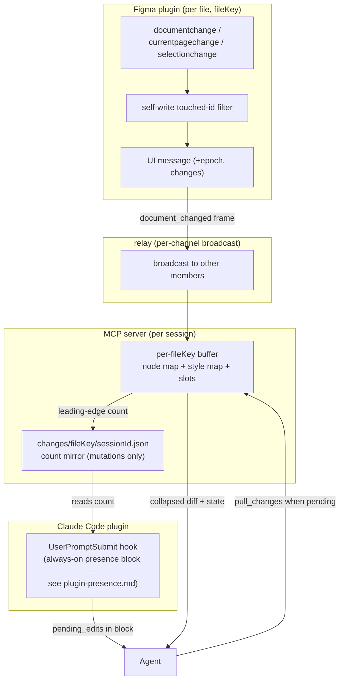

# Change Feed

> Governed by [[figma-bridge/docs/principles|the principles]]. This feature spans all three layers
> and the split is load-bearing: the buffer, listeners, and push enrichment are **bridge**
> (**B1** uniform contract, **B3** per-file); `pull_changes` is a no-opinion **tool** (**T6**,
> **T4** token-efficient, **T10** bounded + reset); the "check changes before acting" hook is
> **opinionated workflow → plugin layer** (**P1**). The feed is a **best-effort freshness hint**,
> never an authoritative guarantee (**T7**). Tool contracts are authoritative in
> [[figma-bridge/docs/specs/tool-surface|tool-surface.md]]; this spec defines the design it absorbs.

## Overview

Between two agent turns the **user keeps editing Figma** — moving, renaming, restyling, and
**deleting** nodes. The agent's last read is a snapshot that silently goes stale, so it plans against
nodes that have moved or no longer exist and acts on ghosts.

The Change Feed gives the agent a cheap way to ask *"what did the user change since I last looked?"*
right before it acts. While the plugin is connected it records document mutations into a **per-file,
in-memory buffer on the MCP server**; a `pull_changes` tool **drains** that buffer on demand; and the
pending-edit **count** is surfaced to the agent each turn — as the `pending_edits` field of the
always-on presence block ([[figma-bridge/docs/specs/plugin-presence|plugin-presence.md]]) — so the
agent drains only on turns where something actually changed.

It is **pull-based by necessity**: an LLM agent only perceives state when *it* calls a tool. Even
MCP resource subscriptions (`notifications/resources/updated`) never reach the model's reasoning
loop, so the design is a pollable tool plus a hook that surfaces the pending count — not a stream.

**It is a hint, not a guarantee (T7).** Like the component index's use of the same event, the feed
is a *nudge*: it reduces stale-action surprises and lets the agent re-plan proactively, but it never
promises to have caught every change (events fire only while connected; the relay can drop frames
under load — see Limitations). The ultimate guard remains that acting on a deleted node **fails
loudly** (`NODE_NOT_FOUND`). The feed's job is to make that rare, not to replace it.

## Scope

**Covers:** capturing user edits from Figma events while connected, buffering them per `fileKey` on
the server, draining them via `pull_changes`, and the count mirror that feeds `pending_edits` into the
always-on presence block (the `UserPromptSubmit` hook is owned by
[[figma-bridge/docs/specs/plugin-presence|plugin-presence.md]]).

**Does not cover:**
- **Offline change tracking.** Figma fires no events while the plugin is closed and exposes no
  document version number or timestamp (see Design constraints). Edits made while disconnected are
  invisible; a stale baseline returns **`reset`** (re-read fully), it does not reconstruct history.
- **Variables.** `documentchange`/`stylechange` do not fire for variable edits (a known, forum-
  acknowledged Figma gap).
- **Rich diffs.** Records carry identity + change kind + changed-property *names*, not before/after
  values. The agent re-reads the affected nodes for detail.
- **The component index's own freshness**, which already consumes `documentchange` for its
  `stale` signal ([[figma-bridge/docs/specs/component-index|component-index.md]]); this feed is a
  parallel consumer of the same event (see Integration), not a replacement.

## Three-layer placement

| Layer | Responsibility here |
|---|---|
| **Bridge** | Plugin event listeners → enriched `document_changed` push (**B1**); server buffers per `fileKey` (**B3**); the count mirror file. Carries changes faithfully; compacts events but never interprets node *meaning*. |
| **Tool** | `pull_changes({fileKey})` — drains and returns the buffer in a compact, bounded envelope (**T4/T10**). Pure capability, **no opinion** (**T6**). |
| **Plugin** | The count mirror feeds `pending_edits` in the always-on presence block; the `UserPromptSubmit` hook that injects it is owned by [[figma-bridge/docs/specs/plugin-presence|plugin-presence.md]], and the *opinion* that the agent should check for user edits before acting (**P1**) lives in the figma skill that reads the block, never in the tool. |

Keeping the "when to check" opinion in the plugin layer (the skill, not the tool) is what lets a client
without it still call `pull_changes` deliberately, and lets the opinion evolve independently.

## Events captured

Three `figma.on(...)` listeners. `documentchange` carries both node and style changes (style edits
surface as its `STYLE_CREATE`/`STYLE_DELETE`/`STYLE_PROPERTY_CHANGE` subtypes — a **separate
`stylechange` listener is redundant and is not used**). Node/style changes are **appended** (each to
its own collapsing map); page/selection are **latest-wins single slots** so their noise cannot flood
the buffer.

| Listener | Buffer treatment | Yields | Why captured |
|---|---|---|---|
| `documentchange` | append to **node map** and **style map** (keyed by id) | node `create` / `update` / `delete` (id, type, and — on update only — changed `properties[]`); style `style_create` / `style_update` / `style_delete` (style id) | The core signal — the only source of user moves/renames/**deletes**, and (via STYLE_* subtypes) style edits. |
| `currentpagechange` | latest-wins slot | `page` record (`id`, `name` of the now-current page) | Context: where the user is; flags other-page edits may be invisible. No payload — read from `figma.currentPage`. |
| `selectionchange` | latest-wins slot | `select` record (selected `ids`) | Context: where the user is working. Ephemeral, never a mutation. No payload — read from `figma.currentPage.selection`; "not necessarily called each time." |

Deliberately excluded: `stylechange` (redundant with `documentchange`), `drop`, `run`, `close`,
`textreview`, codegen, FigJam timers, ui `message`.

## Change record & push payload

Each change becomes one record. Records ride inside the **existing `document_changed` relay frame**;
its identity fields (`fileKey`, `epoch`) ride in **`meta`**, matching request-envelope's push shape
`{ command, params:{changes,at}, meta:{fileKey,epoch} }`
([[figma-bridge/docs/specs/request-envelope|request-envelope.md]]):

```
ChangeRecord = {
  op:     "create" | "update" | "delete"            // nodes
        | "style_create" | "style_update" | "style_delete"  // styles
        | "page" | "select",                        // context slots
  id?:    string,          // node / style / page id  (omitted for op:"select" — see ids)
  type?:  string,          // node/style type; for delete this is ALL Figma gives us (+ removed:true)
  name?:  string,          // best-effort; present for create/update/page, ABSENT for delete
  props?: string[],        // update / style_update only: changed property names, e.g. ["x","y"]=moved
  ids?:   string[],        // select only: the current selection
  source: "user" | "<sessionId>",   // self-write filtering (see below); forward-compat
}

// relay frame:  { command: "document_changed",
//                 params: { changes: ChangeRecord[], at }, meta: { fileKey, epoch } }
```

The server's push handler reads `meta.fileKey` to route the frame to the right per-file buffer (the
relay forwards both `params` and `meta`).

`name` is included on create/update/page because it materially helps the agent reason
(*"Button/Primary was moved"*) and is cheap for non-deletes; a deleted node becomes a `RemovedNode`
exposing only `id`, `type`, `removed:true`, so `name` is honestly absent there. `props[]` exists only
on `PROPERTY_CHANGE`/`style_update` — create/delete carry no changed-property list.

`epoch` is the plugin's **connection nonce** (set on each `register`/reconnect), **compared for
equality only** — a differing value means the plugin restarted — and used for `reset` detection (see
Buffer model). It is a connection-level field owned by
[[figma-bridge/docs/specs/request-envelope|request-envelope.md]].

## Server buffer model

Per `fileKey`, held in the **MCP server's memory** (not the plugin, not the relay). It holds:

- A **node map** keyed by node id, and a **separate style map** keyed by style id — kept apart
  because their collapse algebra differs and node/style id spaces are distinct. Each map is
  **bounded** (a cap on the number of distinct changed ids it holds); exceeding the cap drops a
  distinct change and makes the next drain `reset` (see below). The exact cap is a tuning detail
  trading memory against how often a heavy manual-edit burst forces `reset`. Each collapses to
  **net effect**:

  | Sequence on one id | Net record |
  |---|---|
  | `create` → `update` | `create` (carrying the latest state — the reader never saw the node, so it re-reads it as new) |
  | `create` → `delete` | *(cancels — drop both)* |
  | `update` → `delete` | `delete` |
  | `delete` → `create` | `create` (undo/redo restores the **same id**; the node exists again → re-read) |

  Styles collapse by the same rules over `style_create`/`style_update`/`style_delete`.

- One overwritable **`page` slot** and one **`select` slot** (latest-wins).

**Why per-server, not per-plugin:** the buffer belongs to the *consumer*. The plugin pushes one
change; the relay **broadcasts** it to every other channel member; each session's server buffers and
drains **independently**. This makes both topologies correct for free:
- *One session, many files* — one buffer per `fileKey`; `pull_changes(fileKey)` drains the one asked for.
- *Many sessions, one file* — each server holds its own buffer fed by the broadcast; one session's
  drain never empties another's view. A plugin-side buffer would be a single shared thing with a
  drain race.

### `reset` — detecting a broken baseline

A drain returns **`state: "reset"`** (re-read fully; `changes` may be partial/empty) whenever the
buffer's continuous history is not trustworthy — never a silent gap while trusting `ok`:

- **Fresh / restarted server** — the server has no continuous buffering baseline for this file (its
  prior read may predate this process). An empty buffer with no baseline is `reset`, **not** `ok`.
- **Plugin reconnect** — the incoming push `epoch` differs from the epoch the buffer was opened
  under → the plugin restarted and pushes may have been missed.
- **Server↔relay gap** — the server dropped and re-joined the relay while the plugin stayed alive;
  pushes broadcast during the gap were missed. Any server-side disconnect arms `reset`.
- **Overflow** — a map exceeded its cap, so some distinct id's change was dropped. If *any* distinct
  change is dropped the drain is `reset` (there is no partial-but-authoritative result — hence no
  `truncated` flag).

Outside these, the drain is `state: "ok"` and authoritative *for what the feed can see* (still a hint
per Limitations). "No silent gap" holds **while continuously connected**; a disconnect is surfaced as
`reset`, not hidden.

### Drain-on-read

`pull_changes` returns the buffered records **and clears them**, so there is no cursor — "everything
unretrieved is new." Consequences, accepted deliberately:
- *Single-consumer per buffer.* Fine — each session has its own buffer.
- *Mid-turn gap.* Edits the user makes *after* a drain surface on the next drain. The agent re-drains
  before a critical batch if it needs the freshest view.

## Self-write filtering

The agent's own writes arrive as `documentchange` too, with `origin: 'LOCAL'` — identical to the
user's edits, so **origin cannot distinguish them**. Filtering happens **at the source**, where the
plugin knows its own writes:

- The plugin keeps a short-TTL set of the ids (and, for property changes, the property names) it just
  mutated for a command. When a `documentchange` record matches, it is dropped as self-caused and the
  entry is **consumed on first match** (evicted immediately) — so the false-drop window shrinks to
  "the user edits the *same id+prop* in the sub-second before the agent's own async change fires."
  Correlation is **definitive for create/delete** (the command's target/returned id is known) and
  id+prop+TTL for property changes. The TTL exists because `documentchange` is async/batched — it
  fires *after* the command handler returns, so a synchronous "I'm writing" flag would already be
  cleared. The TTL is short (on the order of a couple of seconds) — a tuning detail traded against
  the false-drop window, not a contract.
- Each surviving record is stamped `source: "user"`; the residual race — a real user edit on the
  *same id+prop* within the sub-second self-write window, dropped as self-caused — is **inherent** to
  source-side filtering, not eliminable. A short single-use TTL makes it negligible; create/delete
  correlation is exact (the command's target/returned id is known).

**Multi-session attribution is forward-compat, not built now.** When two sessions edit one file, "my
write" is per-session: session A's edit must be filtered *for A* but is a real external change *for
B*. Correct handling needs the plugin to attribute each self-caused change to the **requesting
session** and each server to drop only `source === mySessionId`. The `source` field reserves room for
this; **v1 ships the single-session filter** (drop all plugin-caused changes — correct when one agent
drives the file) and leaves cross-session attribution to a later revision. v1's filter therefore
**does not key on `sessionId`** — it drops *all* plugin-caused changes without consulting it — so
v1's **only** `sessionId` consumer is the count-file path (below); attributing changes by `sessionId`
is the forward-compat multi-session work
([[figma-bridge/docs/specs/request-envelope|request-envelope.md]]).

## Count mirror

The `UserPromptSubmit` hook (owned by [[figma-bridge/docs/specs/plugin-presence|plugin-presence.md]])
runs in the Claude Code session as a separate process and **cannot read the server's memory** — so it
cannot see whether anything changed. The server therefore mirrors a **count only**
to disk, reusing the established home-dir convention (alongside `component-index/<fileKey>.json`) and
the **same fileKey sanitizer** as `component-index/store.ts` (today a private `fileName` const — to be
hoisted to a shared util). To avoid the deferred many-sessions-one-file case corrupting a shared path,
the count file is **namespaced per session**:

```
~/.figma-agent-bridge/changes/<sanitized-fileKey>/<sessionId>.json   →   { pendingCount, updatedAt }
```

- `pendingCount` is **derived from the node+style map sizes** (not a separately maintained counter,
  which could drift under drain/push interleaving). **Context slots do not count** — selection/page
  pushes must never inflate it, or the hook would nudge on pure navigation and claim "N nodes changed"
  when nothing was edited (**T7/T4**).
- Written **leading-edge on the `0 → positive` transition** (immediately, so a fast edit-then-Enter
  can't read a stale `0` and miss the nudge); same-sign coalescing and the decrement-to-`0` write may
  debounce with the existing 300 ms.
- The full log stays in memory; only the count touches disk.

The `sessionId` written into the count-file path is the Claude Code `session_id`, injected into each
MCP call by a **`PreToolUse` hook** (not a handoff file — mechanism owned by
[[figma-bridge/docs/specs/request-envelope|request-envelope.md]]). The server writes
`changes/<sanitized-fileKey>/<sessionId>.json` with that injected id; the `UserPromptSubmit` hook
reads it with its **native** `session_id` — the same value — so no correlation dance is needed.

**Fallback — no `sessionId` on the call (unattributed signal, never a silent never-on, T7).** The
server keys this degrade on **presence, not source**: whenever a command carries **no** `sessionId`
(the observable signal that the injecting `PreToolUse` hook is absent), it writes a **session-agnostic
sentinel** `~/.figma-agent-bridge/changes/<sanitized-fileKey>/_unattributed.json` (same `{pendingCount,
updatedAt}` shape) instead of a session-scoped file — otherwise the nudge would silently never fire (a
missing file reads as `0`). The `UserPromptSubmit` hook, finding no session-scoped file for its
`session_id`, **falls back to this sentinel** and reads it as "nudge unconditionally when pending." This
is the concrete mechanism request-envelope's Fallback case 2 defers here — the degrade is documented,
never a silent zero. *(Residual: if the hook is absent and a confused agent supplies a stray
`sessionId`, the server writes `<stray>.json` rather than the sentinel and the hook misses both — a
benign nudge misroute in the single-session model, never a data hazard.)*

Flow per user turn:

1. The presence hook reads the count file(s) for the session's connected `fileKey`(s) and folds each
   into the always-on block as `pending_edits`
   ([[figma-bridge/docs/specs/plugin-presence|plugin-presence.md]]).
2. `pending_edits === 0` → the block still injects (presence is always-on), signalling "no user edits —
   safe to act on existing nodes."
3. `pending_edits > 0` → the figma skill reading the block calls `pull_changes({fileKey})` before
   acting on existing nodes.
4. The server returns the collapsed diff **and clears the buffer** (count resets to 0).
5. The agent reasons over `user prompt + diff`, then acts or responds.

In the always-on presence block the count is a **data field** (`pending_edits`), not a gate — shown every
turn even when `0` ([[figma-bridge/docs/specs/plugin-presence|plugin-presence.md]] owns the injection).
The agent's *drain* is still gated on `pending_edits > 0`, so `pull_changes` runs only on turns that
actually changed.

*(The hook needs the `sessionId` to read the right count file; it uses its **native** `session_id` — the
same value the `PreToolUse` hook injects into the server's calls (see above) — so both sides agree on the
count-file path with no handoff file or correlation step.)*

## Tool surface

Takes `fileKey` (the canonical per-call file-identity param) — consistent with
[[figma-bridge/docs/specs/component-index|component-index.md]] and **B3** (the surface addresses files
per-call, not a single implicit connected file). Obeys `overview.md`'s `{error, code}` envelope.

| Tool | Contract | Error codes |
|---|---|---|
| `pull_changes` | `{fileKey}` → `{changes, state}` — **drains** the buffer | `INVALID_PARAM` (own) + `DISCONNECTED` / `WRONG_FILE` / `INCOMPATIBLE` (from the `withFile`/`requireFile` gate) |

- Named with a **consumption verb**, not `get_*`: it mutates server state on read (a queue pop, non-
  idempotent — a second immediate call returns an empty `"ok"`), so a read-only `get_` prefix would
  violate T1/D5. It is not in the `get_X` CRUD family.
- `state`: `"ok"` (authoritative for what the feed saw) \| `"reset"` (baseline broken — **re-read
  fully**; see Buffer model). No `truncated` flag: any dropped change makes the drain `reset`.
- The envelope is `{changes, state}`, deliberately diverging from D1's list shape
  `{results, truncated, cursor?}` — this is an **event drain**, not a paginated list read, so it is
  cursorless by design.
- `pull_changes` is a **file-addressed tool**, so its addressing/version errors — `DISCONNECTED` (no
  plugin for this `fileKey`), `WRONG_FILE` (unavailable `fileKey` — ASK, never guess), and
  `INCOMPATIBLE` (version skew) — come from the shared file-gate (`withFile`/`requireFile`) that every
  file tool inherits; `DISCONNECTED` is per-`fileKey`, not a global socket check. `INVALID_PARAM` is
  the tool's own. Addressing/error mechanics: [[figma-bridge/docs/specs/overview|overview.md]] +
  [[figma-bridge/docs/specs/request-envelope|request-envelope.md]].

**Relationship to current-state reads (T1).** `select`/`page` records report *events* ("the user just
changed selection/page"), which is a different concept from the current-state reads `get_selection` /
`status().joined[].selection` / `list_pages`. They coexist without violating "one concept, one name."

## Data flow



## Integration with the component index

Both subsystems consume `documentchange`. Today the plugin's single listener is **gated to
`INDEX_STALE_TYPES`** — the stale-trigger type set is **owned by**
[[figma-bridge/docs/specs/component-index|component-index.md]] (which types mark the index stale),
not restated here — and posts an `index-stale` UI message
that becomes the `document_changed` frame → the server's `markStale(fileKey)`. The Change Feed needs
**all** change types, so it enriches that same frame with `changes[]`. The enrichment **must preserve
the `INDEX_STALE_TYPES` gate for the `markStale` signal** — the component index must keep re-projecting
only on component edits, not on every keystroke-level change. The two concerns share one push frame but
stay independent: an all-types `changes[]` for the feed, a still-gated stale flag for the index.

## Design constraints

Figma Plugin API facts that shape this design:

- **Events fire only while the plugin runs.** No background/offline delivery; no document version
  number, revision, or mtime is readable (`saveVersionHistoryAsync()` only *writes* a version id).
  "Since last read" is inherently **session-scoped** → a broken baseline gets `reset`.
- **Full-document access.** The plugin runs under full-document access (consistent with the component
  index's synchronous document-wide scans), **not** `documentAccess: "dynamic-page"` — so there is no
  `loadAllPagesAsync()` requirement and no unloaded-page caveat here.
- **Deletes yield only `id` + `type` (+ `removed:true`)** (`RemovedNode`); former parent/name/geometry
  are gone — hence `name` is best-effort and absent on delete.
- **`origin: 'LOCAL'` includes the plugin's own edits** — the reason self-write filtering is
  source-side, not origin-based.
- **Style changes are part of `documentchange`** (STYLE_* subtypes) — no separate `stylechange`
  listener needed; variable changes are *not* covered (the acknowledged gap).
- **Events are batched and can be noisy** (a drag emits many `PropertyChange` batches). Collapsing by
  id and latest-wins slots absorb this.
- **Undo/redo restores the original id**, and `documentchange` may **not fire reliably on undo/redo**
  in some cases — a residual soft spot the `reset`/re-read backstop covers.
- **Nesting rule:** creating/deleting a parent emits one change for the top-level node only — subtree
  descendants are implied; consumers that care must walk the subtree.

## Limitations (honesty — T7)

- **Best-effort, not exhaustive.** The feed can miss changes: the relay enforces a per-connection rate
  limit (~50 frames/s, burst 100) and **silently drops** frames over it, so a heavy manual-edit burst
  can lose pushes the server never sees — undetectable, so it does not trigger `reset`. Collapse-at-
  source reduces frame count (and thus this risk), but does not eliminate it. The agent should treat a
  large editing session with suspicion; the real guard is that acting on a deleted node fails loudly.
- **Continuously-connected only.** Any disconnect (plugin or server) is surfaced as `reset`, never a
  silent gap — but only *detected* disconnects; a dropped frame within a live connection is not.
```
