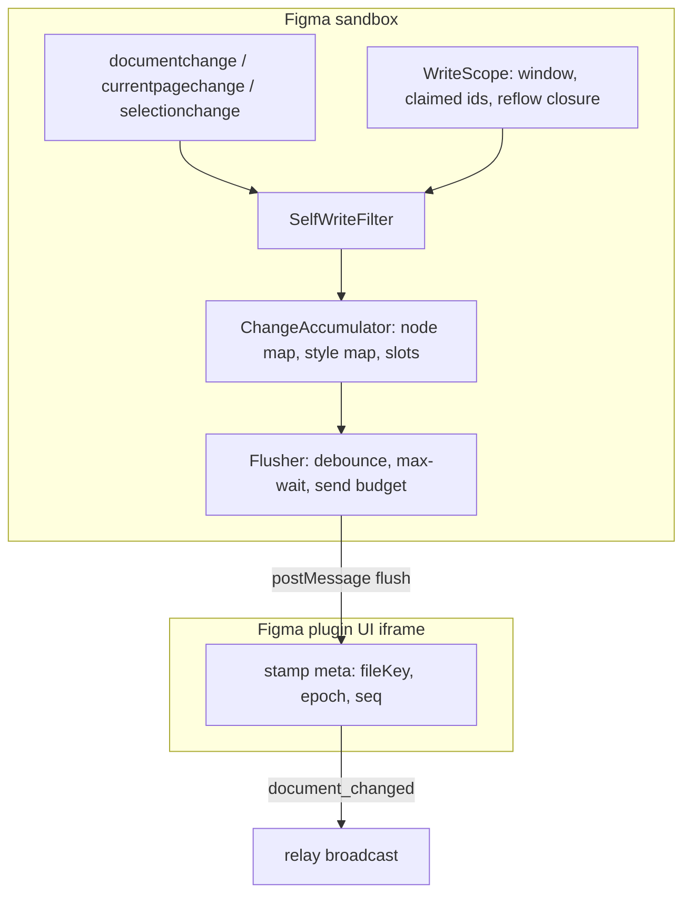
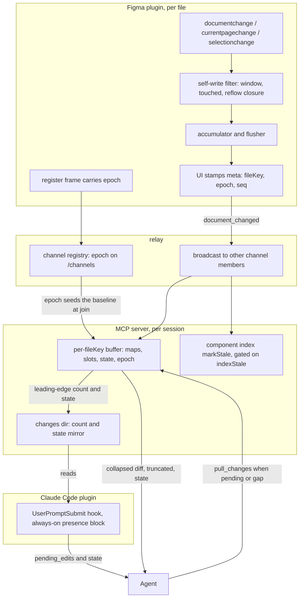

# Change Feed

> Governed by [[figma-bridge/docs/principles|the principles]]. This feature spans all three layers
> and the split is load-bearing: the listeners, the self-write filter, the accumulator, the push
> frame, the server buffer and the count mirror are **bridge** (**B1** uniform contract, **B3**
> per-file); `pull_changes` is a no-opinion **tool** (**T6**, **T4**, **T10**); the mechanics of
> reading the block and draining before acting are **tool usage** and belong to the design-loop
> skill (**P1**). The feed is a **best-effort freshness hint**, never an authoritative guarantee
> (**T7**). Tool contracts are authoritative in
> [[figma-bridge/docs/specs/tool-surface|tool-surface.md]]; the wire envelope in
> [[figma-bridge/docs/specs/request-envelope|request-envelope.md]]; this spec defines the design
> those absorb.

## Overview

Between two agent turns the **user keeps editing Figma** — moving, renaming, restyling and
**deleting** nodes. The agent's last read is a snapshot that silently goes stale, so it plans
against nodes that have moved or no longer exist and acts on ghosts.

The Change Feed gives the agent a cheap way to ask *"what did the user change since I last
looked?"* right before it acts. While the plugin is connected it records document mutations into a
**per-file, in-memory buffer on the MCP server**; a `pull_changes` tool **drains** that buffer on
demand; and the pending-edit **count and baseline state** are surfaced each turn as the
`pending_edits` / `pending_edits_state` fields of the always-on presence block
([[figma-bridge/docs/specs/plugin-presence|plugin-presence.md]]) — so the agent drains only on turns
where something actually changed or the baseline is not trustworthy.

It is **pull-based by necessity**: an LLM agent only perceives state when *it* calls a tool. Even
MCP resource subscriptions never reach the model's reasoning loop, so the design is a pollable tool
plus a hook that surfaces the signal — not a stream.

**It is a hint, not a guarantee (T7).** The feed is a *nudge*: it reduces stale-action surprises and
lets the agent re-plan proactively, but it never promises to have caught every change. The ultimate
guard remains that acting on a deleted node **fails loudly** (`NODE_NOT_FOUND`). The feed's job is
to make that rare, not to replace it.

## Scope

**Covers:** capturing user edits from Figma events while connected; the source-side self-write
filter; the plugin-side accumulator and flush policy; the `document_changed` push frame; the
per-`fileKey` server buffer and its baseline states; the `pull_changes` drain; and the on-disk count
mirror that feeds `pending_edits` into the always-on presence block (the `UserPromptSubmit` hook
itself is owned by [[figma-bridge/docs/specs/plugin-presence|plugin-presence.md]]).

**Does not cover:**

- **Offline change tracking.** Figma fires no events while the plugin is closed and exposes no
  document version number or timestamp (see Design constraints). Edits made while disconnected are
  invisible; an untrustworthy baseline is reported as such (re-read fully), it does not reconstruct
  history.
- **Variables.** `documentchange` does not fire for variable edits (a known Figma gap).
- **Rich diffs.** Records carry identity + change kind + changed-property *names*, not before/after
  values. The agent re-reads the affected nodes for detail.
- **Multi-session change attribution.** One agent per file is the model the filter is correct for;
  attributing a change to *which* session caused it needs a wire addition and is out of scope.
- **The component index's own freshness**, which consumes the same push
  ([[figma-bridge/docs/specs/component-index|component-index.md]]); this feed is a parallel consumer
  of one frame, not a replacement.

## Three-layer placement

| Layer | Responsibility here |
|---|---|
| **Bridge** | Plugin listeners → self-write filter → accumulator → the enriched `document_changed` push (**B1**); server buffers per `fileKey` (**B3**); the count mirror file. Carries changes faithfully; compacts events but never interprets node *meaning*. |
| **Tool** | `pull_changes({fileKey, limit?})` — drains and returns the buffer in a compact, bounded envelope (**T4/T10**). Pure capability, **no opinion** (**T6**). |
| **Plugin** | The count mirror feeds `pending_edits` / `pending_edits_state` in the always-on presence block; the design-loop skill states the **mechanics** of the loop — which field to read, when the drain is worth a call, what a broken baseline obliges. That is **tool usage** under **P1**, not taste: it is how the surface is operated, and it has no defensible alternative reading. Anything about *how often* to re-verify beyond that (re-read before every batch, not just before a destructive one) is a preference and lives in `figma-bridge-prefs`. |

A client without the skill can still call `pull_changes` deliberately — the tool carries no opinion
(**T6**) and the skill only documents its operation.

## Events captured

Three `figma.on(...)` listeners in the plugin sandbox. `documentchange` carries both node and style
changes (style edits surface as its `STYLE_CREATE` / `STYLE_DELETE` / `STYLE_PROPERTY_CHANGE`
subtypes — a **separate `stylechange` listener is redundant and is not used**). Node/style changes
are **accumulated** (each into its own collapsing map); page and selection are **latest-wins single
slots** so their noise cannot flood the buffer.

| Listener | Treatment | Yields | Why captured |
|---|---|---|---|
| `documentchange` | accumulate into **node map** and **style map** (keyed by id) | node `create` / `update` / `delete`; style `style_create` / `style_update` / `style_delete` | The core signal — the only source of user moves/renames/**deletes**, and (via STYLE_* subtypes) style edits. |
| `currentpagechange` | latest-wins slot | `page` record (`id`, `name` of the now-current page) | Context: where the user is. No payload — read from `figma.currentPage`. |
| `selectionchange` | latest-wins slot | `select` record (bounded `ids`, `count`) | Context: where the user is working. Ephemeral, never a mutation. No payload — read from `figma.currentPage.selection`. |

Deliberately excluded: `stylechange`, `drop`, `run`, `close`, `textreview`, codegen, FigJam timers,
ui `message`.

## The change record

```ts
type ChangeOp =
  | 'create' | 'update' | 'delete'                       // nodes
  | 'style_create' | 'style_update' | 'style_delete'     // styles
  | 'page' | 'select'                                    // context slots

type ChangeRecord = {
  op:     ChangeOp
  id?:    string      // node / style / page id. ABSENT for op:'select'.
  type?:  string      // node/style type. On delete this plus id is ALL Figma gives.
  name?:  string      // best-effort; present on create/update/page, ABSENT on delete.
  props?: string[]    // update / style_update ONLY: changed property names, sorted, deduped.
  ids?:   string[]    // select ONLY: the current selection, capped at SELECT_IDS_CAP.
  count?: number      // select ONLY: the TRUE selection size when it exceeds SELECT_IDS_CAP.
}
```

- **No `source` field.** Every record that reaches the server *is* a user-attributed change by
  construction of the source-side filter — a per-record constant with one value and no reader is
  pure wire cost on a T4 surface. Multi-session attribution needs a wire change (an optional
  per-record `source`, or a per-push session map); adding an optional field is non-breaking under
  **B2**, so nothing is reserved for it. It cannot ride in `meta`: a push is unsolicited and
  broadcast, so it carries no session identity at all.
- `name` is included on create/update/page because it materially helps the agent reason
  (*"Button/Primary was moved"*) and is cheap for non-deletes; a deleted node becomes a
  `RemovedNode` exposing only `id`, `type`, `removed:true`, so `name` is honestly absent there.
- `props[]` exists only on `update` / `style_update`. Create and delete carry no changed-property
  list — the reader re-reads the whole node.
- **`select` is bounded (T10).** A marquee over a thousand nodes must not put a thousand ids on the
  wire. `ids` is truncated to `SELECT_IDS_CAP` and `count` carries the true size when truncated. The
  cap is a tuning constant, not a contract; the invariant is that a `select` record is O(1) in wire
  size.

## The push frame

Records ride the **`document_changed`** push. The frame's *identity* fields ride in **`meta`**,
matching the push shape [[figma-bridge/docs/specs/request-envelope|request-envelope.md]] publishes —
the body is what changed, the headers are who and which connection is speaking:

```ts
// plugin → relay → every other channel member
{
  command: 'document_changed',
  params: {
    changes:    ChangeRecord[],   // may be EMPTY (see the opening flush)
    indexStale: boolean,          // component-index discriminator — see Integration
    overflow?:  true,             // plugin-side accumulator hit its cap; records were dropped
    at:         number,           // flush timestamp, epoch ms (plugin clock)
  },
  meta: {
    fileKey: string,   // the ADDRESSABLE file identity (synthKey) — never null
    epoch:   string,   // plugin connection nonce, equality-compared only
    seq:     number,   // per-connection monotonic frame counter, starting at 0
  },
}
```

`packages/shared/src/ws-schemas.ts`'s `metaSchema` is the **enforcing** definition of the meta
header: the relay parses every frame and re-broadcasts the *parsed* object, so any `meta` field not
enumerated there is silently stripped before it reaches the server. A field described here that is
not in `metaSchema` does not exist on the wire. `params` is a free record and is forwarded whole.

### Identity — `meta.fileKey`, and it is the synthKey

`meta.fileKey` carries the **addressable file identity**: `figma.fileKey` when the file is saved,
and the plugin's **channel** when it is not — the `synthKey` rule the server's file gate, the
availability listing and the presence hook all apply. Because a never-saved file's channel is known
only in the plugin's **UI realm**, the frame is built there: the sandbox posts records to the UI, and
the UI stamps `meta`. The sandbox never needs to know a channel or a connection nonce.

`synthKey` is one fact and gets one home: **[[figma-bridge/docs/specs/overview|overview.md]]** defines
it as part of the addressing model; this spec, plugin-presence and the file gate reference it.

The identity is **not** in `params`, and it is **not** named `fileId`. Every other frame on this wire
carries file identity in `meta` (**B1** — one envelope, learned once; **B3** — the canonical param
name is `fileKey` everywhere). A push whose `meta.fileKey` is absent or empty is **dropped** by the
server, silently — it cannot be routed to a buffer, and inventing a route would violate B3.

The server's push handler takes `(params, meta)`. The frame shape is part of the versioned wire
contract, and [[figma-bridge/docs/specs/version-handshake|version-handshake.md]] enumerates the
changes to it that bump the minor under **B2**. A plugin at a skewed version is refused at the file
gate with `INCOMPATIBLE` before it can be acted on, so a dropped push from a skewed plugin is not a
silent degrade — the loud failure precedes it.

Addressing by synthKey also aligns the index's staleness key with its build key: the index is built
and read under the synthKey the agent passes, so identifying the push the same way is what makes an
unsaved file's index invalidatable at all.

**A never-saved file's synthKey is per-plugin-session** — a fresh random channel token each time the
plugin is (re)opened, stable only across reconnects within one plugin session
([[figma-bridge/docs/specs/overview|overview.md]]). So for an unsaved file a plugin reload presents as
a **new file** — new `fileKey`, new buffer opened with no baseline — never as a re-join. The epoch and
opening-flush machinery below therefore carries the reconnect case for **saved** files; for unsaved
files a reload lands on the same honest answer (no baseline) by a different route, and the previous
session's buffer and count file are orphaned.

### `epoch` — the baseline anchor

`epoch` is the plugin's **connection nonce**. It is published on two paths: the `register` frame —
so the channel registry holds it and `GET /channels` exposes it as a `ChannelInfo` field
([[figma-bridge/docs/specs/overview|overview.md]]) — and every push frame's `meta`. Who mints it, in
which realm, and why it rides both paths is owned by
[[figma-bridge/docs/specs/request-envelope|request-envelope.md]]. This spec owns **what a mismatch
means**: a value differing from the one the buffer holds says the plugin restarted, so pushes may
have been missed and the baseline is `gap`.

The registry path is what lets a **late joiner** establish a baseline. The relay does not replay: it
broadcasts to the members present at send time, and the join path returns only an ack with no
backlog. The MCP server joins a file's channel lazily, on the agent's first file-addressed call —
long after the plugin registered — so it can never receive that connection's opening flush. Reading
the epoch from the registry entry it already fetched to resolve the file gives it a baseline anchor
with no extra frame and no replay mechanism.

### `seq` — gap detection

`seq` counts push frames on one connection, starting at `0` for the opening flush and incrementing
by one per frame. The server tracks the last `seq` it saw per `(fileKey, epoch)`. A **gap** — a frame
whose `seq` exceeds `lastSeq + 1` — means the relay's token bucket dropped a frame, so the server
marks the baseline `gap`. `seq` restarting at `0` alongside a new `epoch` is a reconnect, not a gap,
and the epoch change is already handled.

Gap detection is **trailing**: a drop is observable only when a later frame arrives on the same
epoch. Two residuals remain and are stated in Limitations — a drop of the *last* frame of a burst
with no successor stays invisible until the next connection event, and accumulator eviction discards
records at source (reported via `overflow`, never silent).

### The opening flush

Immediately after a successful `register` the plugin sends **one** `document_changed` frame with
`changes: []`, `indexStale: false`, `seq: 0` and the fresh `epoch`.

It reaches the members already in the channel, which is exactly the case the registry path cannot
serve promptly: a server that is **already joined** when the plugin dies, misses edits and
**reconnects without the user editing again**. Without it that server would keep `state: 'ok'` and
the block would report a trustworthy `pending_edits: 0` over a baseline with a hole. With it, the
reconnect itself is the signal. It costs one empty frame per connection, and it is the **only**
deliberately empty frame: a flush with no admitted records and `indexStale: false` is otherwise
suppressed.

## Plugin-side pipeline

Four small pieces, in order. Each is independently testable; none lives inside the command switch.



### 1. `WriteScope` — where the agent's own writes are known

```ts
type WriteScope = {
  /** Called on entry to every command dispatch, including each nested batch op.
   *  Refcounted. Harvests the command's PARAMS and captures the reflow closure
   *  of every id they name, while those nodes still exist. */
  enter(params: unknown): Promise<void>
  /** Called ONCE per enter, when that dispatch settles (after the handler's promise
   *  resolves or rejects). Harvests the handler's RETURN. Refcounted; when the count
   *  returns to 0 the window stays OPEN for SETTLE_MS, then closes. */
  exit(result: unknown): void
  /** True while the window is open (depth > 0, or within SETTLE_MS of the last exit). */
  isOpen(): boolean
  /** Called by every node-CREATING code path at the moment of creation, with the new
   *  node. Adds the id to the claimed set and folds the node into the closure. */
  claim(node: BaseNode): void
  /** Ids the agent is known to have touched: harvested from params and returns, plus
   *  every id claimed at creation. Monotonic for the window's lifetime. */
  touched(): ReadonlySet<string>
  /** Ids whose GEOMETRY the agent's writes can move without naming them — the reflow
   *  closure, captured eagerly (below). */
  reflow(): ReadonlySet<string>
}
```

**Harvest is generic, and its timing is part of the contract.** `enter` folds the command's params;
`exit` folds its return; the set only grows. The walk takes every string under
`id` / `ids` / `nodeId` / `nodeIds` / `parentId` / `root` / `componentId` / `instanceId` /
`results[].id`, at any depth. Its failure mode is a **smaller** touched set, so the agent's own
records survive the filter and surface as user edits: a **false nudge**, not a lost edit.

**Creation is claimed, not harvested.** A generic walk cannot recover ids that do not exist when the
command is dispatched: a tree-building command takes a nested *spec* of nodes-to-be and returns only
the root, so a hundred-node build would harvest exactly one id and report the other ninety-nine as
user edits. Every code path that creates a node therefore calls `claim(node)` at creation — the tree
builder's per-node create, single-node create, SVG import, clone, group, duplicate-page, flatten and
boolean-op. Those are a small, enumerable set of choke points, and this is the one place the design
does **not** rely on the generic walk.

**The window is anchored at `exit`, not `enter`.** Commands that await (font load, image fetch)
mutate seconds after entry; a TTL clocked at entry can expire before the write lands.

**`batch` is refcounted, not re-entered.** A batch re-dispatches N ops through the same switch; the
outermost `enter` owns the window and the touched set accumulates across all N ops.

**The reflow closure is captured eagerly and structurally.** It is computed when an id enters the
touched set — at `enter` for named ids, at `claim` for created ones — never lazily when a record
arrives. Two reasons, both fatal to a lazy lookup: a node the command **deleted** can no longer be
resolved, and deletion inside auto-layout is the largest reflow producer there is; and the
`documentchange` handler is synchronous while the node-resolution API this codebase uses is async, so
a lazy resolve inside the filter would have to use the deprecated synchronous variant and would
silently pin the plugin manifest to non-dynamic-page document access.

The closure is the set of nodes whose geometry an agent write can move without naming them.
Hugging governs whether the **frame** resizes, not whether its **children** reflow: an auto-layout
frame re-lays its children whether or not it hugs, so a fixed-size stack still moves every sibling
after the one that changed.

```
reflow(id) =
    descendants(id)
  ∪ { for each ancestor A of id, walking UP while A is an auto-layout frame:
      children(A), plus A itself when A HUGS along the axis its child can grow }
```

The walk **stops at the first ancestor that cannot resize** — a fixed-size frame absorbs the change,
so its own siblings cannot move, though its children already have. This is narrower than "all ancestors and their children" (which on a
page-root write would swallow every top-level frame) and wider than "siblings and direct children"
(which misses the nested hug chains that design-system-first construction makes the common shape).

### 2. `SelfWriteFilter` — the drop rule

```ts
type SelfWriteFilter = {
  /** Map one Figma DocumentChange to a record, or null if it is the agent's own.
   *  May return a record with a REDUCED props[] (subtraction, below). */
  admit(change: DocumentChange): ChangeRecord | null
  /** True if a page/selection event should be recorded (false = agent's own navigation). */
  admitContext(): boolean
}
```

The rule, in full:

| Condition | Node `create` / `delete` | Node `update` (`PROPERTY_CHANGE`) | style records | `page` / `select` |
|---|---|---|---|---|
| window closed | keep | keep | keep | keep |
| window open, `id ∈ touched()` | **drop** | **drop** | **drop** | — |
| window open, `id ∈ reflow()` | **keep** | **subtract** `CASCADE_PROPS` from `props[]`; drop if empty | keep | — |
| window open, otherwise | keep | keep | keep | **drop** |

- **`CASCADE_PROPS`** is the geometry a re-flow moves on a node the agent did not name: `x`, `y`,
  `width`, `height`, `minWidth`, `maxWidth`, `minHeight`, `maxHeight`, `rotation`,
  `relativeTransform`. All are real `NodeChangeProperty` values. `name`, `parent`, `fills`,
  `characters` and everything else are **not** cascade properties — a user renaming a node the agent
  re-flowed must survive.
- **Subtraction, not whole-record drop.** `PropertyChange.properties` is an array, and one batch can
  carry the agent's cascade *and* the user's rename on the same node. Dropping the whole record on a
  partial match silently loses the rename. Subtracting the matched names and keeping the remainder is
  strictly more honest and costs nothing.
- **For an id in `touched()` the whole record is dropped**, with no per-property attribution.
  Computing "which Figma property names did this command set" would require a table from every tool's
  expression-object params to `NodeChangeProperty` names — enormous, drift-prone, and defeated by
  T8's grammar (one atom sets many properties).
- **Context slots drop inside the window.** The agent's own navigation writes fire the same events;
  without this, the agent's own `set_current_page` returns as "the user just switched page" (a T7
  violation). The over-report-by-default rule does not bind here: a `page` / `select` record is
  context, never a mutation, and never counts toward `pending_edits`, so dropping one is harmless.

**The fail direction, stated exactly.** Everywhere the filter is uncertain *whether the agent touched
a node*, it keeps the record — over-reporting, never silence. The one place it trades that away
deliberately is the reflow row: a user's own move or resize of a node inside the reflow closure,
inside the settle window, is indistinguishable at source from the cascade and is dropped. That
residual is disclosed in Limitations; it is not a case the filter can resolve without before/after
values it does not have.

**`SETTLE_MS` is determined by measurement, not chosen.** Figma batches `documentchange` callbacks
with an undocumented period. Below the true period the filter fails **open**: every agent write reads
as a user edit, `pending_edits` never returns to `0`, and the feature is worse than nothing.
`SETTLE_MS` is fixed against the runtime's measured batch period, with a stated margin.

### 3. `ChangeAccumulator` — folds immediately, evicts loudly

```ts
type ChangeAccumulator = {
  /** Fold one admitted record into the right map/slot under the collapse algebra. */
  add(rec: ChangeRecord): void
  /** Record that this batch touched an INDEX_STALE_TYPES node — set PRE-filter. */
  markIndexStale(): void
  /** nodes.size + styles.size — mutations only; context slots never count. */
  size(): number
  indexStale(): boolean
  /** True if a map hit ACCUM_CAP and a distinct id was evicted. */
  overflowed(): boolean
  /** Take everything and reset (including the flags). */
  drain(): { changes: ChangeRecord[]; indexStale: boolean; overflow: boolean }
}
```

Every event folds in immediately; the timer only decides *when to flush*, never *what to keep*. The
accumulator is not lossless in the limit: at `ACCUM_CAP` it evicts the oldest distinct id and sets
`overflow` on the next frame, which the server treats as a broken baseline. A plugin-side loss is
reported, never silent.

### 4. Flusher — emission policy

- **Trailing debounce (`FLUSH_DEBOUNCE_MS`) with a max-wait ceiling (`FLUSH_MAX_WAIT_MS`).** The
  ceiling is what makes a continuous ten-second drag flush periodically instead of never. Both are
  tuning, traded against staleness; the **invariant** is that no record is dropped by the timer.
- **A flush with no admitted records and `indexStale: false` is suppressed**; the opening flush is
  the sole deliberate empty frame.
- **Feed frames are NOT exempt from the relay's token bucket** (50 frames/s, burst 100, silently
  dropped), and the reason the bucket must not be widened for them is the same reason the status
  stream *is* exempted: the bucket is **per socket**, and the plugin's **command replies** leave on
  that same socket. Dropping a status frame is harmless; dropping a paired command reply hangs the
  caller. So the feed must never spend budget a reply needs. The invariant is enforced at source: the
  accumulator plus `FLUSH_MAX_WAIT_MS` bound the feed to roughly one frame per flush window per file,
  and the flusher additionally caps itself at `FEED_FRAMES_PER_SEC` — an order below the bucket's
  refill — folding any excess back into the accumulator rather than dropping it. If measured peak
  frame rate ever approaches the bucket, the answer is a longer `FLUSH_MAX_WAIT_MS`, never an
  exemption.
- **Collapse has one owner and one subordinate.** The **server's** collapse is authoritative — it
  defines the net effect the agent reads. The **plugin's** collapse is an optimisation that reduces
  frame count, and it applies the **same algebra**, so the two can never disagree; a plugin that
  collapsed differently would be a bug, not a variant.

## Server buffer model

Per `fileKey`, held in the **MCP server's memory** (not the plugin, not the relay).

```ts
type BufferEntry = {
  op:    'create' | 'update' | 'delete'
       | 'style_create' | 'style_update' | 'style_delete'
  type?: string
  name?: string
  props?: Set<string>          // update / style_update only
}

type BaselineState = 'ok' | 'no_baseline' | 'gap'

type FileBuffer = {
  fileKey:  string
  state:    BaselineState
  epoch:    string | null      // the connection this buffer's history belongs to
  lastSeq:  number | null      // last seq seen for that epoch
  nodes:    Map<string, BufferEntry>
  styles:   Map<string, BufferEntry>
  page:     ChangeRecord | null   // latest-wins slot
  select:   ChangeRecord | null   // latest-wins slot
}
```

`pendingCount = nodes.size + styles.size`. **Context slots never count** — a selection or page push
must not inflate the number, or the block would nudge on pure navigation and claim edits when nothing
was edited (**T7/T4**).

`pendingCount` counts **distinct changed things, not actions**. Collapse means forty drags of one
node render as `1`. Every surface that shows it says so.

**Why per-server, not per-plugin:** the buffer belongs to the *consumer*. The plugin pushes one
change; the relay **broadcasts** it to every other channel member; each session's server buffers and
drains **independently**. Both topologies then work for free — *one session, many files* (one buffer
per `fileKey`), and *many sessions, one file* (each server holds its own buffer fed by the broadcast,
so one session's drain never empties another's view). A plugin-side buffer would be one shared thing
with a drain race.

### Collapse algebra — total

Applied per id, in both the plugin accumulator and the server buffer. Rows are the entry already
held; columns are the arriving record.

| held ↓ / arriving → | `create` | `update` | `delete` |
|---|---|---|---|
| *(none)* | `create` | `update` (props = arriving) | `delete` |
| `create` | `create` | **`create`** (props dropped) | *(cancel — remove the entry)* |
| `update` | `create` (props dropped) | **`update`, props = UNION** | `delete` (props, name dropped) |
| `delete` | **`create`** (undo/redo restores the same id) | `update` (props = arriving) | `delete` |

- **`update → update` merges `props` by UNION, never latest-wins.** A rename followed by a move must
  not lose `name`; a set union is the only merge that cannot lose a changed-property name.
- **`create → update` drops `props`.** The reader never saw the node and re-reads it whole, so a
  changed-property list on a create is meaningless.
- `name` and `type` on a merge take the **latest defined** value; a `delete` clears `name`
  (`RemovedNode` has none).
- **Styles use the identical table** over `style_create` / `style_update` / `style_delete`, with
  `props` drawn from `StyleChangeProperty`. Node and style ids live in **separate maps** — the id
  spaces are distinct and a collision between them would be a silent corruption.
- Cells that "cannot happen" (`update → create`, `delete → update`) are specified anyway. Event
  reordering is possible and a table with holes is a spec that says nothing at the moment it matters.

### Baseline lifecycle

**A baseline opens when the server successfully joins that file's channel** — the auto-join inside the
file gate, or an explicit connect. That is the only event that makes the server a recipient of the
file's broadcasts, so it is the only event that can start a continuous history.

- On open the buffer is created **empty with `state: 'no_baseline'`**, and its `epoch` is seeded from
  the registry entry the file gate already resolved. Seeding is what makes the buffer's history belong
  to a *known* connection from the first moment; without it the first genuine user edit would arrive
  against a `null` epoch and be read as a reconnect, forcing a full re-read on every file's first real
  change.
- **`state` clears to `'ok'` only on a drain that (a) empties the buffer and (b) has an established
  `epoch`.** A buffer that has never been anchored to a connection can never report `ok`, however many
  times it is drained. This is the rule that stops an empty-and-unwatched buffer from claiming a
  continuous history.
- **Re-joining after a close does not open a clean baseline.** Opening a baseline for a file that
  already has a buffer preserves the buffer and its state — and every server-side disconnect has
  already marked it broken.
- For a **never-saved** file a plugin reload presents as a different `fileKey` entirely: a new buffer,
  opened `no_baseline`. The old buffer and its count file are orphaned.

### The two broken-baseline states

A drain reports a state that is not `ok` whenever the buffer's continuous history is not trustworthy.
Never a silent gap while claiming `ok`. The two values differ in what they oblige, which is why they
are not one value:

| State | Meaning | What it obliges |
|---|---|---|
| `no_baseline` | The feed has no history for this file — the server has only just started watching it, or has never received a frame from the plugin's current connection. Nothing is known to be wrong; nothing is known at all. | Nothing beyond the reads the agent was going to make anyway. The snapshot it is about to take *is* the baseline. |
| `gap` | The feed *had* a history and lost part of it. A snapshot the agent already holds may straddle the hole. | Re-read what it already holds before acting on it. |

| Arm | Resulting state | Detected by |
|---|---|---|
| Buffer just opened, or never anchored to a connection | `no_baseline` | buffer created without frames on the current epoch |
| Plugin reconnect | `gap` | incoming `meta.epoch` ≠ the buffer's `epoch` (in-band via the opening flush; also visible as a changed registry `epoch`) |
| Relay frame drop | `gap` | `meta.seq` gap for the current epoch |
| Plugin-side accumulator overflow | `gap` | `params.overflow === true` |
| Server-side buffer overflow | `gap` | a map exceeded `BUFFER_CAP`; the oldest distinct id is evicted |
| Server↔relay socket close | `gap` | the client socket closed → arm on **every** open buffer |
| Watchdog death | `gap` | the command-liveness watchdog dropped this file ([[figma-bridge/docs/specs/connection-liveness|connection-liveness.md]]) |

There is deliberately **no `truncated` flag on the state**: any *dropped* change makes the whole drain
`gap`, because there is no partial-but-authoritative history. (Response truncation is a different
thing, and is carried by the drain's own `truncated` field.)

Outside these arms the drain is `ok` and authoritative *for what the feed can see* (still a hint —
see Limitations). "No silent gap" holds **while continuously connected**; every detected disconnect is
surfaced, not hidden.

### Drain-on-read

`pull_changes` returns buffered records **and removes exactly the records it returned**, so there is
no cursor: everything unretrieved is new, and the buffer *is* the position. Consequences, accepted
deliberately:

- *Single consumer per buffer.* Fine — each session has its own buffer.
- *Mid-turn gap.* Edits the user makes *after* a drain surface on the next drain. The agent re-drains
  before a critical batch if it needs the freshest view.

## Tool surface — `pull_changes`

```ts
// params
{
  fileKey:    string,   // required (B3)
  limit?:     number,   // max records this call returns; default DRAIN_LIMIT (100)
  sessionId?: string,   // reserved, hook-injected — do not set
  agentId?:   string,   // reserved, hook-injected — do not set
  agentType?: string,   // reserved, hook-injected — do not set
}

// success
{
  changes:   ChangeRecord[],
  truncated: boolean,                            // more remain — call again
  state:     'ok' | 'no_baseline' | 'gap',
}
```

`changes` is ordered: node records in buffer-insertion order, then style records, then the `page`
slot, then the `select` slot. Records count against `limit` in that order, so a truncated drain
returns mutations first and context slots last — the slots are latest-wins and lose nothing by
waiting.

**Bounding (T10).** Two different numbers do two different jobs and are decoupled:

- **`limit`** is the *context* bound. It caps what one call puts in the agent's context; the
  continuation handle is simply calling again, because consumption is the position. This is what T10
  asks for — resumable pieces, not one flood.
- **`BUFFER_CAP`** is the *memory* bound. Exceeding it evicts and marks the baseline `gap`; it
  destroys records rather than paging them, so it can never be the T10 mechanism. It is chosen as a
  multiple of `limit`, large enough that ordinary editing never trips it.

**State survives truncation.** `state` is reported on every drain, and a broken state clears only on a
drain that leaves the buffer empty. A truncated drain can therefore never downgrade `gap` to `ok`.

| Result | When |
|---|---|
| `{changes, truncated, state}` | a buffer exists for `fileKey` |
| `{changes: [], truncated: false, state: 'no_baseline'}` | `fileKey` matches an available file but no buffer exists — the server has never watched it. The call does **not** create a buffer and does **not** join: a read must not have a join as a side effect, so this answer repeats until a real join opens a baseline. |
| `INVALID_PARAM` | `fileKey` missing or empty |
| `WRONG_FILE` | no buffer exists for `fileKey` **and** no available file matches it — the ASK error, listing `available[]` (**B3**: never guess) |

**`pull_changes` does NOT return `DISCONNECTED`, `INCOMPATIBLE`, or `TIMEOUT`, and it never
auto-joins.** It dispatches nothing to Figma; it drains the server's own memory. Routing it through
the command gate would be wrong three ways:

1. It would return `DISCONNECTED` whenever the availability registry is empty — making
   already-captured records unreachable. A buffer that exists is always drained, whatever the file's
   current liveness; the disconnect that ended the session has already marked the baseline `gap`,
   which is the honest answer.
2. It would **auto-join a channel** as the side effect of a read that needs no channel.
3. The liveness watchdog arms per *dispatched* command
   ([[figma-bridge/docs/specs/connection-liveness|connection-liveness.md]]). Nothing is in flight, so
   there is no hang for it to shorten; citing it would be describing a failure that cannot occur.

Bypassing the liveness gate is not a **B3** exemption. B3's fail-loud-and-ask clause binds commands
dispatched to a file; this dispatches none. The B3 obligation it does carry — never guess which file
the agent meant — is discharged by `WRONG_FILE`.

**Registration.** File-addressed tools reach `server.tool` only through `registerFileTool`, which is
compile-enforced to run the command gate. `pull_changes` needs the same identity handling (`fileKey`
plus the reserved headers) with a *different* gate, so it registers through a third, explicitly named
path — a sibling of the file and session wrappers whose calls
[[figma-bridge/docs/specs/tool-surface|tool-surface.md]] counts as the exposed surface:

```ts
type BufferContext = { fileKey: string; feed: ChangeFeed }

const registerBufferTool = <S extends ZodRawShape, R>(
  server: McpServer,
  client: FigmaClient,
  feed: ChangeFeed,
  name: string,
  schema: { shape: S },
  handler: (params: BufferHandlerParams<S>, ctx: BufferContext) => Promise<R>,
): void
```

The wrapper validates `fileKey`, records the session identity (below), resolves the buffer, on a miss
consults the availability registry once to choose between the `no_baseline` answer and the
`WRONG_FILE` ask, and strips the identity fields out of the forwarded params exactly as the file
wrapper does.

**Naming and shape.**

- A **consumption verb**, not `get_*`: it mutates server state on read (a queue pop, non-idempotent —
  a second immediate call returns an empty `ok`), so a `get_` prefix would falsely imply an idempotent
  read (**D5**, T1).
- The envelope is `{changes, truncated, state}` — the bounding contract (`limit` + `truncated`) with
  two deliberate differences: the payload is named `changes` because these are events, not results;
  and there is no `cursor`, because a destructive drain has no position to resume from — the buffer's
  remaining contents *are* the cursor. It is the **third output shape** under D1, alongside list reads
  and tree reads ([[figma-bridge/docs/specs/tool-surface|tool-surface.md]]).
- It is a **non-facade meta-tool** and must not inflate the facade count.

**Relationship to current-state reads (T1).** `select` / `page` records report *events* ("the user
just changed selection/page"), a different concept from the current-state reads that return the
selection or the page list. They coexist without violating "one concept, one name".

## Count mirror

The `UserPromptSubmit` hook runs in the Claude Code session as a separate process and **cannot read
the server's memory**. The server therefore mirrors the **count and the state** — never the records —
to disk.

### Path and the shared sanitizer

```
$FIGMA_BRIDGE_CHANGES_DIR                            (default: ~/.figma-agent-bridge/changes)
  └── <sanitizeKey(fileKey)>/
        ├── <sanitizeKey(sessionId)>.json
        └── _unattributed.json                       (the degrade — see Fallback)
```

The `fileKey` sanitizer three specs refer to is defined **here**, as a pure function producing a
**path segment with no extension**, so one function serves both a directory name and a file stem:

```ts
// packages/shared/src/paths.ts
export const sanitizeKey = (key: string): string =>
  key.replace(/[^A-Za-z0-9_-]/g, '_')
```

- The component index derives its filename from it: `` `${sanitizeKey(fileKey)}.json` ``
  ([[figma-bridge/docs/specs/component-index|component-index.md]]).
- **`sessionId` is sanitized by the same function.** It is untrusted platform input interpolated into
  a filesystem path.
- `_unattributed` is a fixed point of `sanitizeKey`. No session id in the platform's UUID format can
  sanitize to it, so the sentinel cannot collide with a real session's file; that guarantee is a
  property of the id format, not of the sanitizer.
- **The presence hook cannot import TypeScript**, so it pins an equivalent shell expression instead.
  That expression, the locale it must be run under, and the checked-in fixture table that holds the
  two implementations together over the ASCII alphabet real keys are drawn from live with the hook,
  in [[figma-bridge/docs/specs/plugin-presence|plugin-presence.md]].
- `$FIGMA_BRIDGE_CHANGES_DIR` is honoured by **both** the server and the hook. A hardcoded directory
  on one side of a two-process contract is a drift waiting to happen.

### Record

```ts
{
  schema:       1,
  fileKey:      string,          // the unsanitized addressable identity, for debuggability
  writer:       string,          // genId('srv') — identifies the writing process
  pendingCount: number,          // nodes.size + styles.size — distinct changed things
  state:        'ok' | 'no_baseline' | 'gap',
  updatedAt:    number,          // epoch ms
}
```

The file **carries an explicit state field** rather than overloading `pendingCount: 0`. Overloading
`0` is precisely what makes a broken baseline unobservable: every arm leaves the buffer empty, the
count mirrors `0`, the block renders "no user edits — safe to act", and a drain gated on `> 0` never
runs. Two facts need two fields — and they are the same two the drain returns, so the block mirrors
the tool envelope exactly.

**A missing file is not `0`.** Three states are distinguishable and all three are meaningful:

| On disk | Meaning | Block |
|---|---|---|
| no file | no signal for this session × file — the feed is not running, or the server has not joined | both fields **omitted** |
| `{0, ok}` | baseline continuous, nothing pending | `pending_edits: 0` |
| `{N, state}` | N distinct things changed; baseline good or broken | `pending_edits: N` (+ `pending_edits_state` when not `ok`) |

### Write triggers

Writes are atomic (write `.tmp`, then rename) — the same discipline the presence hook uses for its own
state.

| Trigger | Timing |
|---|---|
| baseline open | **immediate**, `{0, no_baseline}` |
| `pendingCount` `0 → positive` | **immediate** (leading edge — a fast edit-then-Enter must not read a stale `0`) |
| `state` changes | **immediate** |
| server-side disconnect arm (socket close, watchdog) | **immediate**, for every affected file |
| `pendingCount` positive → positive | debounced (`COUNT_DEBOUNCE_MS`, trailing) |
| drain | **immediate** |

The full log stays in memory; only the count and state touch disk.

### `sessionId` at write time

The count-file path is keyed by the Claude Code `session_id`, injected into each MCP call's arguments
by the identity `PreToolUse` hook. But **a push carries no `sessionId`** — it is unsolicited and
broadcast, so a frame-level sender identity would be meaningless — and the count-file write is
triggered by a push. A per-call read of `sessionId` therefore never evaluates on the write path.

The server closes this by **remembering** the identity — the session-identity cache
[[figma-bridge/docs/specs/request-envelope|request-envelope.md]] requires as defense-in-depth, sound
because the server is 1:1 with a Claude Code session:

```ts
// packages/server/src/session-identity.ts
export const sessionIdentity = {
  /** First non-empty id wins for the life of the process; later values are ignored. */
  remember(id: string | undefined): void
  current(): string | undefined
  /** Fired once, when the first id is remembered. */
  onAdopt(cb: (id: string) => void): void
}
```

Every tool-registration wrapper calls `remember`. The count writer keys on
`sessionIdentity.current() ?? '_unattributed'`.

**Adoption.** A session's first Figma tool call may come *after* the user has already edited: the
server has no id yet, writes the sentinel at a nonzero count, then learns the id. On adoption the
store **migrates**: for each file directory it has written a sentinel into, it rewrites that
sentinel's content as `<sessionId>.json` and unlinks the sentinel — but only if the sentinel's
`writer` field still matches this process. Without that check a concurrent unattributed session's
sentinel would be adopted and deleted; with it, migration never touches another process's file.

**Lifecycle.** Two owners, because two kinds of file:

- The `SessionEnd` hook ([[figma-bridge/docs/specs/claude-plugin|claude-plugin.md]]) runs per session
  with a native `session_id` and removes `changes/*/<sanitizeKey(session_id)>.json`.
- The **sentinel has no session to end**. The server unlinks its own sentinels on clean shutdown, and
  because a kill leaves them behind, a reader treats a sentinel older than `SENTINEL_TTL` as no signal
  at all (fields omitted). Staleness is decided on `updatedAt`, not on existence.

On a route where the Claude Code plugin's hooks do not run, nothing is written and nothing is read:
the feature is inert there rather than half-working.

### Fallback — no `sessionId` (unattributed, never a silent never-on — T7)

The server keys this degrade on **presence, not source**: when it has **never** received a
`sessionId` — the observable signal that the injecting hook is absent — it writes the session-agnostic
sentinel, same record shape. A *missing* file reads as "no signal", so without the sentinel the
feature would silently never surface.

The hook, finding no session-scoped file for its `session_id`, **falls back to the sentinel and
renders it identically**, because under the always-on block the hook nudges nothing: it reports, and
the skill decides.

Residuals, stated:

- **Two concurrent unattributed sessions on one file share the sentinel**, last-writer-wins, and
  either may adopt an id and migrate it away — which reads to the other as a transiently missing signal
  (fields omitted), restored on its next write. This is the shared path per-session namespacing exists
  to avoid, and it cannot be avoided in the degrade: the hook can only look for a name it can predict,
  and an unattributed session has no predictable name. The consequence is a mis-scaled or briefly
  absent count, never a data hazard — the value selects a count-file path and grants no access.
- **A stray agent-supplied `sessionId` with the hook absent** routes writes to a file the hook never
  looks for — a benign misroute in the single-session model.

## The presence block

Two fields per file, both owned in *definition* here and in *rendering* by
[[figma-bridge/docs/specs/plugin-presence|plugin-presence.md]]:

```yaml
figma_bridge:
  relay: connected
  online:
    - name: Design A
      fileKey: fk-a
      version: "0.3.0"
      current_page: "Icons"
      selected: 2
      pending_edits: 3                     # distinct nodes/styles the user changed
      pending_edits_state: gap             # only when the baseline is broken
  recently_offline:
    - name: Mockups
      fileKey: fk-c
      pending_edits: 5                     # captured before it went offline; still drainable
```

- `pending_edits` is **always a number** when present, and it counts **distinct changed things, not
  actions**. Both fields are **omitted together** when no count file exists — "unknown, no signal".
- `pending_edits_state` carries the same vocabulary as the tool (`no_baseline` / `gap`), so the block
  and the drain envelope name a broken baseline identically.
- The block never carries change *records*; the hook is a separate process that cannot read server
  memory. Signals here, records in the drain.

When each field is rendered — including under `recently_offline`, where a file's buffer outlives its
connection — and how the hook resolves count files it cannot open from inside its jq program, are
owned by [[figma-bridge/docs/specs/plugin-presence|plugin-presence.md]]. What the agent *does* about
them is tool usage under **P1** and is stated by the design-loop skill
([[figma-bridge/docs/specs/claude-plugin|claude-plugin.md]] §6.1); the design fact it rests on is the
one this spec owns — the two broken states differ in what they oblige (see The two broken-baseline
states), which is why they are not one value.

## Integration with the component index

Both subsystems consume `documentchange`. The index must be marked stale **only** for
component-relevant changes, or every keystroke re-projects it; the feed needs **all** change types.
One frame serves both, discriminated by an explicit boolean.

- The plugin computes `params.indexStale` in the same pass as the feed, using the `INDEX_STALE_TYPES`
  gate that [[figma-bridge/docs/specs/component-index|component-index.md]] owns, and the server marks
  the index stale only when it is `true`. Frame arrival is not the signal.
- **`indexStale` is computed PRE-filter**, over the raw `documentchange` batch, on `change.node.type`.
  The feed's `changes[]` is post-filter and answers a different question. If the flag were derived
  from admitted records, the agent's *own* component writes — dropped by the self-write filter, as
  they should be — would stop marking the index stale, and a component the agent just created would be
  missing from the next search. Staleness is about the index's agreement with the document, and the
  agent's writes change the document.
- Not a second command: it would double the plugin's frame rate against the one token bucket the feed
  is trying not to trip, to carry a single boolean.
- Not re-derived server-side: the gate tests the changed node's type, and the server would have to
  infer it from a record's `type` — a *different* predicate that would silently change which edits
  refresh the index, and would move a type set component-index owns into the server.

## Data flow



## Design constraints

Figma Plugin API and architecture facts that shape this design:

- **Events fire only while the plugin runs.** No background delivery; no document version number,
  revision, or mtime is readable. "Since last read" is inherently session-scoped.
- **`documentchange` is batched with an undocumented period.** The runtime does not call the callback
  synchronously; it batches updates and delivers them periodically. This is the fact the self-write
  window's `SETTLE_MS` must clear, and the one parameter that cannot be settled on paper.
- **`origin: 'LOCAL'` includes the plugin's own edits** — which is why self-write filtering is
  source-side, not origin-based.
- **`PropertyChange.properties` is an array** of `NodeChangeProperty` — hence the subtraction rule
  rather than a whole-record drop.
- **Deletes yield only `id` + `type` (+ `removed: true`)** (`RemovedNode`) — hence `name` is
  best-effort and absent on delete, and hence a deleted node's structural neighbourhood must be
  captured *before* the delete.
- **Node resolution is asynchronous**, and the synchronous variant is deprecated and unusable under
  dynamic-page document access. The `documentchange` handler is synchronous, so the filter performs
  **no** node lookups: everything it needs is captured eagerly in the command path.
- **Style changes are part of `documentchange`** (STYLE_* subtypes) — no separate `stylechange`
  listener; variable changes are not covered.
- **A style's identity is its KEY, not its id string.** The id a command returns and the id the
  event carries differ in their trailing segment — empty in the result (`S:<key>,`), the page id in
  the event (`S:<key>,<pageId>`). Only the key is stable, so self-write matching and collapse key on
  it. Node ids are exact and are never prefix-matched: `1:8` and `1:80` are different nodes.
- **Inside an auto-layout frame a child cannot be freely positioned** — a drag or an arrow key
  **reorders** it among its siblings. A user reorder therefore emits `parent` alongside the
  positional properties, so `parent` is a cascade property, and one record can carry a structural
  change and a positional one together.
- **Undo/redo restores the original id**, and `documentchange` may not fire reliably on undo/redo in
  some cases — a residual soft spot the re-read backstop covers.
- **Nesting rule:** creating or deleting a parent emits one change for the top-level node only;
  descendants are implied. Consumers that care walk the subtree.
- **The relay is a dumb broadcaster with a per-socket token bucket** (50 frames/s, burst 100, silently
  dropped), it re-broadcasts wholesale to every other channel member, and it **does not replay** to a
  member that joins later. That is why the buffer is per-consumer, why the plugin accumulates instead
  of emitting per event, and why a late-joining server takes its baseline anchor from the channel
  registry rather than from a frame.
- **The relay validates and re-broadcasts the parsed frame**, so the meta schema is an allow-list: an
  undeclared `meta` field is dropped in transit without error.
- **The sandbox and the UI iframe are separate realms.** The sandbox owns the events; the UI owns the
  socket, the channel and the register — so the connection nonce and the addressable identity are
  stamped where the frame is built, in the UI.

## Limitations (honesty — T7)

- **Best-effort, not exhaustive.** The relay silently drops frames over its rate limit. A `seq` gap
  converts a drop into a detected `gap` — but only once a later frame arrives on the same connection.
  **A drop of the last frame of a burst, with no successor, stays invisible** until the next connection
  event; the count silently under-reports until then. A large manual editing session should be treated
  with suspicion; the real guard is that acting on a deleted node fails loudly.
- **The accumulator can discard, and says so.** At its cap it evicts the oldest distinct id and reports
  `overflow`, which breaks the baseline. It never discards *silently*.
- **The self-write filter has two silent-loss residuals**, both inside the settle window: a user edit
  on the very node the agent is writing, and **a user move or resize of a node inside the reflow
  closure** — an ancestor in a hug chain, one of that ancestor's children, or a descendant of a node
  the agent touched. Both are attributed to the agent and dropped. Source-side filtering cannot
  eliminate either without before/after values; everywhere else the filter fails toward over-reporting
  rather than silence.
- **Offline edits are invisible.** Every *detected* disconnect is surfaced, but edits made while the
  plugin was closed are reported only as a broken baseline, never reconstructed.
- **An unsaved file's identity does not survive a plugin reload.** Its buffer and count file are
  orphaned and its history restarts as a new file.
- **Two concurrent unattributed sessions share one count file.** With no `sessionId` to key on, both
  write the sentinel last-writer-wins and either may migrate it away on adoption, so the count either
  side reads can be mis-scaled or briefly absent (see Fallback). Never a data hazard — the value
  selects a path and grants no access.
- **Single-agent-per-file attribution.** With two sessions driving one file, session A's writes are
  filtered by the plugin for *everyone*, so session B does not see them as external changes. Correct
  handling needs per-session attribution and a wire addition.
