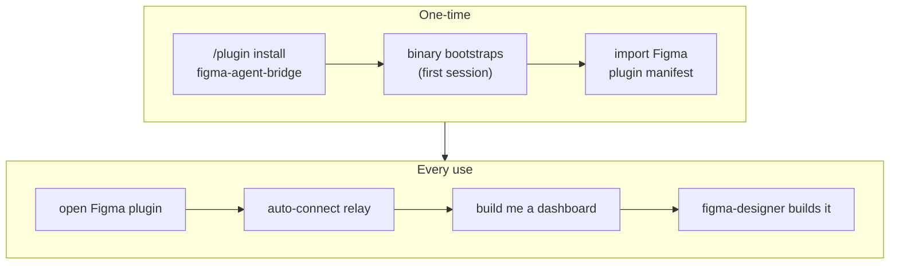

# Claude Code Plugin & Zero-Config Distribution

> **Status:** design (brainstorming output). Governs the packaging/distribution layer;
> it does not change the 47-tool surface or the tool contract in
> [[figma-bridge/docs/specs/overview|overview.md]] — it wraps them for install.

## 1. Goal & non-goals

**Goal.** A user installs one **Claude Code plugin** and opens the Figma plugin — and
everything works. They never learn what "MCP", "relay", "channel", or "port" mean, never
edit a config, and never install a language runtime.

**The two things a user does:**
1. Install the Claude Code plugin (`/plugin install figma-agent-bridge@figma-agent-bridge`; see §3).
2. Import + open the Figma plugin in Figma desktop (auto-connects).

**Non-goals (this milestone).** Windows/Linux binaries (macOS-arm64 first); the live GitHub
**Send** path (the Worker is deferred — local capture built now, per
[[figma-bridge/docs/specs/feedback-system|feedback-system.md]]); a true one-click `claude://`
install (no such scheme exists — see §3). *(The Figma plugin ships by **manifest import** — this
is the permanent path; Figma Community publish is **not pursued**.)*

## 2. End-user experience



## 3. Distribution model — repo *is* the marketplace

The existing repo `yleilu/figma-agent-bridge` doubles as a Claude Code **marketplace**
(the pattern `anthropics/claude-plugins-official` uses for its first-party plugins).

- `.claude-plugin/marketplace.json` at repo root lists one plugin with
  `"source": "./plugin"` (monorepo-subdir style — keeps the plugin cleanly out of the Bun
  workspace under `packages/*`).
- **Install commands** (what the README documents; there is **no** official `claude://`
  one-click deep link — verified against the docs). A README badge may *link* to these two
  lines, but the click itself does not install:

```
/plugin marketplace add yleilu/figma-agent-bridge
/plugin install figma-agent-bridge@figma-agent-bridge
```

The `figma-agent-bridge@figma-agent-bridge` slug is `<plugin-name>@<marketplace-name>` — both
derive from this repo (it is the marketplace **and** the plugin), hence the repeat.

## 4. Directory layout

Two artifacts in one repo, joined by a **built binary** (see §5):

```
figma-agent-bridge/                       repo == marketplace
├── .claude-plugin/
│   └── marketplace.json                  lists the plugin, source: "./plugin"
├── plugin/                               THE Claude Code plugin (NOT a Bun workspace pkg)
│   ├── .claude-plugin/
│   │   └── plugin.json                   name (required) + version/description/author/…
│   ├── .mcp.json                         mcpServers → the bootstrapped binary
│   ├── skills/
│   │   ├── figma-design/SKILL.md         + references/ (§6.1)
│   │   ├── figma-feedback/SKILL.md       + references/ (§6.3)
│   │   ├── figma-reviewer/SKILL.md       + references/ (§6.4)
│   │   └── figma-connection/SKILL.md     + references/ (§6.6)
│   ├── agents/
│   │   ├── figma-designer.md             frontmatter: tools:, model: (§6.2)
│   │   └── figma-reviewer.md             (§6.5)
│   ├── hooks/
│   │   ├── hooks.json                    SessionStart → bootstrap; PreToolUse → inject session_id; UserPromptSubmit → change-feed nudge (§ change-feed.md)
│   │   └── bootstrap                     extensionless bash; downloads binary
│   └── README.md                         install + Figma-plugin-import steps
├── packages/                             the Bun monorepo — UNCHANGED except build target
│   ├── server/                           → MCP mode of the dual-mode binary
│   └── relay/                            → --relay mode of the SAME binary (§8, option c)
├── scripts/
│   └── build-binary.sh                   bun build --compile → release artifact
└── .github/workflows/release.yml         tag → build binaries → GitHub Release
```

Conventions confirmed from real plugins: MCP config lives in `.mcp.json` at plugin root
(never inline in `plugin.json`); `plugin.json` sets only
`name, description, version, author, homepage, repository, license, keywords`; skills are
`skills/<name>/SKILL.md`; agents are flat `agents/<name>.md` with `tools:`/`model:`
frontmatter; hooks are `hooks/hooks.json` + sibling scripts (extensionless to avoid
Windows auto-`bash` mangling). Beyond the `SessionStart → bootstrap` hook, `hooks.json`
holds **two change-related hooks**: (1) a **new `PreToolUse`** hook, matcher
`mcp__figma-bridge__*`, that injects its native `session_id` into each MCP call's arguments (the
reserved `sessionId` header — see
[[figma-bridge/docs/specs/request-envelope|request-envelope.md]]); and (2) the change-feed
**`UserPromptSubmit`** count-gated nudge hook — the "check changes before acting" reminder — which
uses its **native** `session_id` (the same value the `PreToolUse` hook injects), specified in
[[figma-bridge/docs/specs/change-feed|change-feed.md]].

## 5. The MCP binary — build → release → bootstrap

The ecosystem norm is to run the server via a **preinstalled runtime** (`bun run` source,
`npx`, or `docker run`). We deliberately diverge: a **compiled standalone binary** is the
only option that needs *no* runtime on the user's machine — the whole point of "the user
knows nothing." We therefore build the bootstrap ourselves (the `docker run` case is the
nearest "compiled" precedent).

**Build.** `packages/server` + the relay entrypoint → `bun build --compile` → a **dual-mode**
`figma-mcp-<os>-<arch>` (darwin-arm64 first): `--relay` runs the shared relay, otherwise the
MCP stdio server (§8). **Production config is compiled in** via `bun build --define` — the
feedback **Worker URL** (§7). The Worker **secret is *not* compiled in** (a distributed binary can't
safely embed a shared secret — §7/§11); nothing else needs baking, so the distributed binary is a
production artifact and the user configures nothing.

**Release.** A git tag triggers CI to build per-`os-arch` binaries and attach them to a
**GitHub Release** matching the plugin `version`.

**Bootstrap.** On `SessionStart`, `hooks/bootstrap` (synchronous, generous timeout) runs a
**guarded, idempotent** download — re-downloads **only if** the binary is absent OR its
`--version` differs from `$EXPECTED_VERSION` (embedded in the bootstrap per release):

```sh
[ -f "$BIN" ] && [ "$("$BIN" --version)" = "$EXPECTED_VERSION" ] \
  || curl -fsSL "$RELEASE/figma-mcp-$OS-$ARCH.tar.gz" | tar xz
```

Keyed on `uname -s` / `uname -m`, into
**`${CLAUDE_PLUGIN_DATA}/bin/`** — the per-plugin data dir
(`~/.claude/plugins/data/<plugin>-<marketplace>/`) that **survives plugin updates** (unlike
`${CLAUDE_PLUGIN_ROOT}`, wiped on update). So it is never a fresh-every-session fetch. The artifact is
**SHA-256-verified** against a checksum published in the Release **before** `chmod +x`, so a
tampered mirror cannot yield an executable. (Precedent: `thedotmack/claude-mem` uses a
guarded `Setup`+`SessionStart` bootstrap; the official hooks docs show the same
`curl … | tar xz` guard keyed on `$OS-$ARCH`.)

**`.mcp.json`** points at the bootstrapped binary:
```json
{ "mcpServers": { "figma-agent-bridge": {
  "command": "${CLAUDE_PLUGIN_DATA}/bin/figma-mcp"
} } }
```
`.mcp.json` at plugin root is the **one reliable location**: inline `mcpServers` in
`plugin.json` (Claude Code #16143) and `mcpServers` in `.claude/settings.json` (#32145) are
both dropped by the platform.

**First-run ordering risk.** If the MCP server is launched before the `SessionStart` hook
finishes downloading, the first launch fails. Mitigation: the hook runs **synchronously**
(`"async": false`); if the VM test shows a race anyway, the `command` becomes a tiny
committed launcher (`${CLAUDE_PLUGIN_ROOT}/bin/launch.sh`) that ensures-then-`exec`s the
binary. Which of the two we ship is **decided by the §9 VM test**, not assumed.

**Integrity & trust.** The bootstrap ships *inside* the marketplace-installed plugin — it is
not a repo-controlled `.claude/settings.json` `SessionStart` hook (the RCE vector in
CVE-2025-59536). With HTTPS + a Release-pinned URL + SHA-256 verification, a malicious repo
or mirror cannot inject a binary. **Reference plugins to model after:**
`confluentinc/claude-code-confluent-plugin` (compiled local server + env expansion in
`.mcp.json`), `thedotmack/claude-mem` (guarded bootstrap keyed on the plugin dir),
`slackapi/slack-mcp-plugin` (official plugin structure).

## 6. Components

**At a glance** — four skills (the knowledge) + two agents (the executors). Skills are
introduced before the agents that consume them, except `figma-designer` (§6.2), which
forward-references the feedback/reviewer skills below:

| Concern | Skill | Agent |
|---|---|---|
| Build | `figma-design` (§6.1) | `figma-designer` (§6.2) — consumes all three build-loop skills |
| Report *tool* friction | `figma-feedback` (§6.3) | — (folds into the skill) |
| Review the *design* | `figma-reviewer` (§6.4) | `figma-reviewer` (§6.5) |
| Diagnose connection / version | `figma-connection` (§6.6) | — (main-agent guidance) |

### 6.1 Skill — `figma-design`

Purpose: teach the agent **how to operate** the 47-tool surface well. It deliberately does
**not** encode visual taste or a house style — *how the outcome looks is the user's to
specify, per request*. This keeps the skill durable: principles and mechanics age well;
baked aesthetics don't. It covers the **full surface — create, inspect, and edit** (incl.
the user's current selection); there is no create-only-vs-edit split.

**Start-of-work guard — is there a design system?** *(Design-system-first is a **decision**,
not a mandate.)* Before building, **detect** whether the file already uses one — local
variables (design tokens), shared styles, or components in use (traces of systematic design).
- **Found one → adopt it by default** — reuse and extend its tokens / styles / components
  (single source of truth); never duplicate what already exists.
- **None found → the user's call** — offer to establish a design system, but don't impose it;
  for a quick one-off or mockup, direct values are fine. **Ask when it's unclear** which the
  user wants.

**Principles** (how to work *once* a design system is in play):
- **Single source of truth** — reuse tokens/components; never duplicate.
- **Component-first** — repeated elements become components.
- **Don't hardcode a value that has a token** — bind the variable / apply the style.

**Operating rules** (run smoothly + cheaply):
- **Reuse before create** — search for an existing component/token before making a new one.
- **"check my selection"** → `inspect` the selection and describe it (read, don't assume).
- **Mind token usage** — batch, prefer scoped reads, don't re-scan the whole document.
- *(extended as new rules surface in use.)*

**Mechanics — with examples.** The fiddly, get-it-wrong-repeatedly calls ship **with exact
code snippets** (tool-usage patterns, not visual templates):
- Instance-content override: `update_node` on the compound child id `I<inst>;<masterText>`
  with a **full** text patch (content+font+color) — text-only errors on `raw.trim`.
- `sizing:['FIXED','FIXED']` for fixed frames (auto-layout defaults to HUG → collapse).
- `bind_variable` (fills → color vars) + `apply_style` (text → styles), on **masters** so
  instances inherit; `combine_variants` for variants.
- **Limits to route around:** `update_component` add doesn't bind props (`set_instance` text
  is inert → use the override above); no `delete_variables`/`delete_styles` (reuse); rotated
  bbox + `get_node` invalid-profile caveats.

**Workflow spine** (a default, not a mandate): tokens → styles → components → layout →
content → verify.

**Verification discipline:** `export` PNG + `get_node`/`inspect` read-back (read-back proves
`var(…)` bindings + `INSTANCE` types).

**Structure** (progressive disclosure, per real-plugin convention):
- `SKILL.md` — principles, operating rules, workflow spine, verification.
- `references/mechanics.md` — the with-example tool-usage patterns + limits.
- `references/grammar.md` — a **self-contained** snapshot of the atom value formats (the
  installed plugin won't ship `docs/specs/expression-formats.md`, so this can't be a live
  pointer — author it from that spec and keep in sync).

### 6.2 Agent — `figma-designer`

A subagent that **consumes** `figma-design`. Loop: request → plan (DS → components →
layout → content) → build via the MCP tools → `export` + read-back verify →
**self-review (`figma-reviewer` skill, §6.4)** → iterate.
Frontmatter declares the MCP tools it may call and `model:` (sonnet default, opus for
complex compositions). Calls `record_feedback` (§7) when it hits a tool limit — guided by the
`figma-feedback` skill (§6.3).

### 6.3 Skill — `figma-feedback`

The plugin-layer **when + how to report** guidance — feedback-system.md's named follow-up.
**Consumed by `figma-designer` (auto, inline the moment it hits friction) and the main agent
(manual "file feedback")** — so a separate feedback *agent* folds into it. It defines **two
flows, one per category, each with a standardized `record_feedback` body format and a worked
example.** After recording, the agent tells the user it's noted and that **they Send it from
the plugin** (human gate) — it never sends to GitHub itself; it never records expected errors
(the user's own invalid input); it records **one item per distinct issue** and then continues
the task (zero-friction, never derail).

**BUG — something is broken or wrong.** Signals: a **silent no-op** (success result, nothing
changed), an unexpected/confusing error, a result that **contradicts the spec**, or
**skill-misleading** — *"I thought I could do X but I can't,"* where the **skill** set a false
expectation.

*Body format:*
```
**What I did:** <tool call / action>
**Expected:** <correct behaviour>
**Actual:** <what happened>
**Repro:** <tool + params + result>
```
*Example* — `category: bugs`, `tool: update_component`, title *"update_component adds a TEXT
property but never binds it → set_instance can't change instance text"*:
```
**What I did:** update_component(add TEXT "Label"), then set_instance({Label:"Revenue"}).
**Expected:** the instance's label text becomes "Revenue".
**Actual:** the property is set on the instance but no text node updates — it's bound to nothing.
**Repro:** update_component({componentId, add:[{name:"Label",type:"TEXT",defaultValue:"x"}]})
  → set_instance({instanceId, properties:{Label:"Revenue"}}) → get_node shows unchanged text.
```

**Skill-misleading → correct the skill.** A special bug where the miss is the *skill's* fault —
it implied a capability that doesn't exist (*"I thought I could do X but I can't"*). The fix
**corrects this skill's own guidance** (folding back like an accepted shortcut), not just a tool
bug; file it under `bugs` with the misleading line quoted. *Example:* the skill said
"`set_instance` changes instance text" → it doesn't (the prop isn't bound) → the skill is
corrected to point at the compound-id override.

**PROPOSAL — it works, but could be better, or something's missing.** Signals: a **better
approach** ("*doing X this way would be better*"), a **shortcut** (a shorter path to the same
outcome), a **missing tool/arg**, **lack of docs**, or a **feature request**.

*Body format:*
```
**Context:** <what I was doing>
**Opportunity:** <better-approach | shortcut | missing tool/arg | missing docs | feature>
**Proposed change:** <concretely what would help>
**Why it helps:** <the benefit>
```
*Example* — `category: proposals`, `tool: set_instance`, title *"set_instance should accept
text overrides in one call"*:
```
**Context:** populating 4 stat-card instances took 12 update_node calls on compound child ids
  (I<inst>;<masterText>) with full text patches.
**Opportunity:** missing arg — no one-call way to set an instance's text content.
**Proposed change:** set_instance({instanceId, text:{"label":"Revenue","value":"$48.2k"}}).
**Why it helps:** N calls → 1; the compound-id + full-patch path is fiddly and error-prone.
```

**Shortcut** — a high-value proposal worth its own shape (**fold accepted ones back into this
skill's recipes**): a shorter path to the same outcome.

*Body format:*
```
**Long path:** A → B → C → outcome
**Shortcut:** D → same outcome
**Why it helps:** <fewer steps / simpler / less error-prone>
```
*Example (real):* `category: proposals`, title *"instance text-child id is deterministic — skip
the per-instance get_node"*:
```
**Long path:** per instance: get_node(instance) → parse its text-child id → update_node(childId, patch)
**Shortcut:** the child id is deterministic — I<instanceId>;<masterTextNodeId> — build it from the
  master's text-node id captured once; skip the per-instance get_node entirely.
**Why it helps:** N get_node round-trips → 0; one master-time lookup serves every instance.
```

**High-value litmus** (what's worth filing as a proposal). It earns its place when it does
**≥1** of: kills a **silent failure / drift**; collapses a repeated **A→B→C into one call**;
**unblocks** a capability that needed a hack; **cuts read tokens** on a common path; improves
**read-back fidelity**; or removes **guesswork** (least-surprise defaults, semantic ids over
opaque ones). *Skip* cosmetic, one-off, or cheaply-worked-around ideas.

The **eight high-value categories** (grounded in Anthropic's *Writing effective tools for AI
agents* + this project's own scars; full worked examples in
**`references/high-value-proposals.md`**):
1. **Workflow consolidation** — collapse A→B→C into one tool/arg (the shortcut, generalized).
2. **Token efficiency** — concise/detailed response formats, bounded/paginated scans, server-side aggregation.
3. **Actionable errors, no silent no-ops** — the worst failure mode for an agent.
4. **Missing capability / CRUD symmetry** — a `create_*` with no `delete_*`; a missing arg; an unexposed Figma API.
5. **Semantic over low-level identifiers** — names the agent can reason about, not opaque handles.
6. **Round-trip fidelity** — what you create reads back losslessly.
7. **Reliability / drift guards** — fail loudly on mismatch.
8. **Least-surprise defaults** — right behaviour without incantations.

**Skill structure** (progressive disclosure): `SKILL.md` holds the two flows, formats, and
this litmus; the full taxonomy + worked project examples live in
`references/high-value-proposals.md`, loaded only when composing a proposal.

### 6.4 Skill — `figma-reviewer`

Reviews a **design** (the artifact) against quality dimensions and emits a standardized report
— distinct from `figma-feedback`, which reviews the **tool**. Consumed by the `figma-reviewer`
agent (§6.5) and by `figma-designer` as a **self-review gate** before it calls a build done.
Reads via `inspect` / `get_node` / `export` — the read-back discipline that verified the
dashboards.

**Dimensions:**
1. **Design-system adherence** *(context-aware — only when the file has a design system; see the
   §6.1 guard)* — hardcoded values that should be tokens, text off a style, duplicated elements
   that should be components, detached instances.
2. **Consistency** — off-scale spacing/padding, inconsistent radius, type off the ramp,
   misaligned / off-grid elements.
3. **Accessibility** — text contrast vs WCAG AA (4.5:1 / 3:1 large), min text size, touch-target
   size, meaning conveyed by colour alone.
4. **Layout & structure hygiene** — absolute positioning where auto-layout fits, default names
   ("Frame 42"), pile-ups at [0,0], missing constraints, redundant nesting, orphan/hidden nodes.
5. **Fidelity to intent** — matches the request; nothing missing or extra.

**Output format** (per finding):
```
[blocker | warning | nit] <dimension> — <node name / id>
  Issue: <what's wrong>
  Fix:   <concrete suggestion>
```
Plus a **top-line verdict** + counts per severity.

**Flow — report, then offer to fix.** The reviewer **reports first** and **never auto-mutates**;
after the report it offers to apply the fixes, and on the user's approval edits the design
(reusing the `figma-design` mechanics). A finding that's actually a **tool** limitation (not a
design flaw) routes to `figma-feedback` (§6.3) instead of a fix.

**Structure:** `SKILL.md` (dimensions, output format, flow) → `references/checks.md` (the concrete
per-dimension checks + thresholds — the WCAG ratios, the spacing scale, naming rules), loaded when
reviewing.

### 6.5 Agent — `figma-reviewer`

A dedicated subagent consuming the `figma-reviewer` skill (§6.4) — matches the delegate model and
keeps a review's heavy read output out of the main context. Loop: read the target
(`inspect`/`get_node`/`export`) → check each dimension → emit the standardized report → **offer to
fix** → on approval apply edits (or route tool-gaps to `figma-feedback`). Frontmatter: `tools:`
(read tools + the edit tools for the fix step + `record_feedback`), `model:` (sonnet; opus for
large/complex reviews). Also invoked by `figma-designer` as its self-review gate.

### 6.6 Skill — `figma-connection`

Main-agent guidance for **diagnosing and recovering the connection** — a stale or mismatched
server/plugin, a failed handshake, or a "reinstall the Figma plugin" situation. Unlike the three
build-loop skills (§6.1/§6.3/§6.4) it is **not** part of the design loop; the **main agent** invokes
it when a call can't reach Figma or the version handshake reports a mismatch. The connection and
handshake **mechanism** it wraps is specced authoritatively in §8 (app-semver major.minor per B2);
this skill is the *when + how to react* layer over it. **Structure:** `SKILL.md` (symptoms →
diagnosis → recovery) → `references/` as needed.

## 7. Feedback

The feedback **mechanism** is specced authoritatively in
[[figma-bridge/docs/specs/feedback-system|feedback-system.md]]: a neutral **`record_feedback`**
MCP tool (the one documented non-Figma "meta" tool, in its own `feedback` group), a
**one-Markdown-file-per-item** store (**category = directory = one GitHub issue**), a
**human-gated Send** in the Figma plugin UI, and a **CloudFlare Worker** that files the item
as a comment on the mapped issue (the Worker holds the GitHub token; the plugin only ever
passes a file path). Nothing leaves the machine until the user clicks Send.

This milestone **packages** that mechanism and adds the plugin-layer pieces:
- `record_feedback` ships **inside the MCP binary**; the Feedback UI section ships in the
  figma-plugin — both bundled by the plugin install.
- **The production Worker URL is compiled into the binary** (a build-time constant), so the
  endpoint needs no user config; env may override for dev. **The Worker
  *secret* is NOT compiled in** — a distributed binary can't safely embed a shared secret
  (extractable); it's resolved at runtime (env / per-install token / another mitigation — §11).
- **`figma-feedback` skill (§6.3)** — new: the plugin-layer *when + how to report* guidance
  (bugs + proposals formats), used by `figma-designer` (auto) and the main agent (manual). It
  folds in what would otherwise be a separate feedback agent. **This skill is in scope for this
  milestone** — it supersedes feedback-system.md's *Out of scope* note that deferred the
  when-to-record skill (updated there).

Local Markdown capture is the built-in path; **Send → GitHub** goes live when the Worker is deployed
(URL already compiled in). The shared-**secret** handling for a *distributed* binary is the
open piece — see §11.

## 8. Connection lifecycle

**Already-built plumbing** (plus one prerequisite change) — this is why "open plugin + talk"
is most of what remains after install (see [[figma-bridge/docs/specs/overview|overview.md]] →
Connection lifecycle):
- The Figma plugin **auto-connects** on launch and rejoins its own channel, so a reload is
  deterministic. *(The plugin persists a `channel-id`. **Per-file channels** — a prerequisite
  change landing with this work — bind that channel to `fileKey` instead; a breaking wire
  change that bumps the minor, see overview *Connection lifecycle* / version-handshake.md.)*
- The MCP server **auto-discovers the relay port** and **auto-starts a shared relay** if none
  is running — a **detached singleton** on `:18080` that **outlives any single session**, so
  many Figma files (each plugin on its own channel) and many Claude Code sessions all pair
  through the one relay (`packages/relay` is already multi-channel: `channels: Map<channel,
  Set<client>>`). The **target file/channel is chosen explicitly by the agent** (`connect` by
  `fileKey` → server resolves `fileKey`→channel), never auto-guessed (B3).

**Relay in the binary (option c — resolves a distribution blocker).** `ensure-relay.ts` today
spawns `Bun.spawn(['bun','run', relayPath])`, which is **broken in a compiled binary** (no
`bun`, no embedded relay source). Fix: make the binary **dual-mode** — invoked with `--relay` it
runs the relay entrypoint, otherwise the MCP stdio server — and change the spawn to
`Bun.spawn([process.execPath, '--relay'], { detached, unref })`, so the binary launches
**itself** as the shared, detached relay. One artifact; no separate relay binary to bootstrap;
the multi-file / multi-session shared-relay model is preserved. **Required code change before
build-order step 1 (§10) is done.**

**Version / connection diagnosis (a later skill — decoupled).** The version handshake is a
**separate, prerequisite spec** ([[figma-bridge/docs/specs/version-handshake|version-handshake.md]])
built **first**; this milestone **does not depend on its mechanism** and doesn't spec it. The
plugin's only version touch-point is a small, later **diagnosis / response skill**: when the
handshake reports a mismatch (or a connection is off), the skill guides the user through the fix
(*reinstall the Figma plugin*, diagnose a stale server). The handshake is a prerequisite spec (app-semver, major.minor per B2), so this skill is authored as `figma-connection` in the skills/agents plan (Plan B) — not deferred.

## 9. Testing — remote-VM clean room

The claim under test is "a user who knows nothing succeeds." Prove it on a **fresh remote
VM** with no dev tools:
1. Install the plugin from the marketplace (`/plugin marketplace add` + `/plugin install`).
2. Assert the `SessionStart` bootstrap downloads the binary to `${CLAUDE_PLUGIN_DATA}/bin/`
   and the MCP server starts — **specifically assert first-run ordering** (hook vs. MCP
   launch; drives the §5 launcher decision).
3. Assert the skills + agents **load** and a headless-mock tool round-trip succeeds (the MCP
   starts + tools respond). **Not a live design test** — real skill/agent behaviour in Figma
   still needs live-verify per the plugin-side rule; the VM clean-room proves *install*, not
   *design quality*.
4. Assert `record_feedback` writes a well-formed Markdown item to the store.

Headless-testable in CI: the feedback harness (schema validation + sink routing) and the
`build-binary.sh` / bootstrap scripts.

## 10. Milestone build order

1. **Packaging skeleton** — `marketplace.json`, `plugin/.claude-plugin/plugin.json`,
   `.mcp.json`, `hooks/` bootstrap, `scripts/build-binary.sh`, `release.yml`. Binary builds
   + bootstraps + the MCP starts.
2. **VM clean-room test** (§9) — prove install-from-nothing; resolve the ordering/launcher
   question.
3. **Skills + agents** — author the `figma-design`, `figma-feedback`, and `figma-reviewer`
   skills (§6.1, §6.3, §6.4), then the `figma-designer` and `figma-reviewer` agents. The
   `record_feedback` tool, plugin Feedback UI, and Worker are feedback-system.md's build; this
   milestone bundles them and compiles in the Worker URL.

Rationale: front-load the *novel* packaging/bootstrap risk and prove it clean-room before
investing in skill/agent content.

## 11. Open items & deferred

- **Feedback Send (Worker → GitHub)** — deferred; local Markdown capture now
  ([[figma-bridge/docs/specs/feedback-system|feedback-system.md]]). The Worker URL compiles
  in cleanly, but the **shared secret for a *distributed* binary is unresolved** — a distributed
  binary can't safely embed it (extractable → Worker spam). Decide: per-install token,
  Worker-side rate-limiting, or accept the risk.
- **Windows/Linux binaries + polyglot hook wrapper** — deferred; darwin-arm64 first.
- **One-click install** — not possible today (no official scheme); revisit if Claude Code
  adds one.
