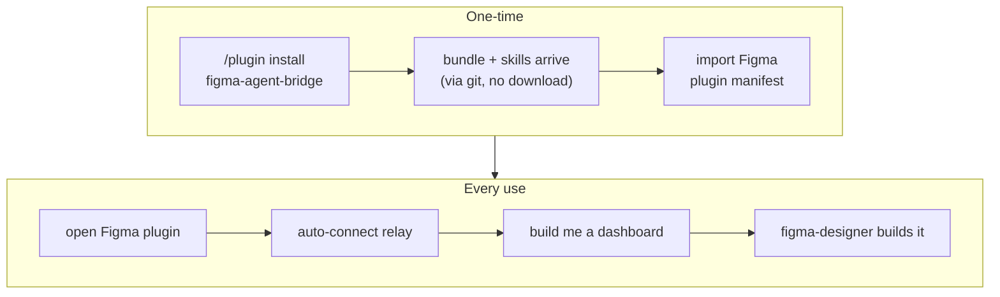

# Claude Code Plugin & Zero-Config Distribution

> **Status:** design (brainstorming output). Governs the packaging/distribution layer;
> it does not change the 47-tool surface or the tool contract in
> [[figma-bridge/docs/specs/overview|overview.md]] — it wraps them for install.

## 1. Goal & non-goals

**Goal.** A user installs one **Claude Code plugin** and opens the Figma plugin — and
everything works. They never learn what "MCP", "relay", "channel", or "port" mean and never
edit a config. **Bun is the one prerequisite** for the Claude Code (developer) route — the
README documents a one-line check-install; the plugin does not auto-install a runtime. The
designer routes (Claude Desktop, Figma download) require no runtime at all: they use a
self-contained compiled binary.

**The two things a user does:**

1. Install the Claude Code plugin (`/plugin install figma-agent-bridge@figma-agent-bridge`; see §3).
2. Import + open the Figma plugin in Figma desktop (auto-connects).

**Non-goals (this milestone).** Windows/Linux binaries (macOS-arm64 first); the live **anonymous
Send → GitHub** path (its CloudFlare Worker is deferred — local capture built first, per
[[figma-bridge/docs/specs/feedback-system|feedback-system.md]]); a true one-click `claude://`
install (no such scheme exists — see §3). _(The Figma plugin ships by **manifest import** — this
is the permanent path; Figma Community publish is **not pursued**.)_

## 2. End-user experience



## 3. Distribution model — repo _is_ the marketplace

The existing repo `yleilu/figma-agent-bridge` doubles as a Claude Code **marketplace**
(the pattern `anthropics/claude-plugins-official` uses for its first-party plugins).

- `.claude-plugin/marketplace.json` at repo root lists one plugin with
  `"source": "./plugin"` (monorepo-subdir style — keeps the plugin cleanly out of the Bun
  workspace under `packages/*`).
- **Install commands** (what the README documents; there is **no** official `claude://`
  one-click deep link — verified against the docs). A README badge may _link_ to these two
  lines, but the click itself does not install:

```
/plugin marketplace add yleilu/figma-agent-bridge
/plugin install figma-agent-bridge@figma-agent-bridge
```

The `figma-agent-bridge@figma-agent-bridge` slug is `<plugin-name>@<marketplace-name>` — both
derive from this repo (it is the marketplace **and** the plugin), hence the repeat.

## 4. Directory layout

Two artifacts in one repo, joined by a **committed Bun JS bundle** (see §5):

```
figma-agent-bridge/                       repo == marketplace
├── .claude-plugin/
│   └── marketplace.json                  lists the plugin, source: "./plugin"
├── plugin/                               THE Claude Code plugin (NOT a Bun workspace pkg)
│   ├── .claude-plugin/
│   │   └── plugin.json                   name (required) + version/description/author/…
│   ├── .mcp.json                         mcpServers → the committed bundle, run with bun
│   ├── bin/
│   │   └── server.js                     committed Bun JS bundle (deps inlined, ~1.1 MB)
│   ├── skills/
│   │   ├── figma-design/SKILL.md         + references/ (§6.1)
│   │   ├── figma-feedback/SKILL.md       + references/ (§6.3)
│   │   ├── figma-reviewer/SKILL.md       + references/ (§6.4)
│   │   ├── figma-connection/SKILL.md     + references/ (§6.6)
│   │   └── figma-setup/SKILL.md          + references/figma-bridge-prefs-template/ (SKILL.md.tmpl + references/) (§6.7)
│   ├── agents/
│   │   ├── figma-designer.md             frontmatter: tools:, model: (§6.2)
│   │   └── figma-reviewer.md             (§6.5)
│   ├── hooks/
│   │   ├── hooks.json                    PreToolUse → inject session_id (+ agent_id/agent_type on subagent calls); UserPromptSubmit → presence status block (§ plugin-presence.md)
│   └── README.md                         install + bun prerequisite check + Figma-plugin-import steps
├── packages/                             the Bun monorepo — UNCHANGED except build target
│   ├── server/                           → MCP stdio server
│   └── relay/                            → shared relay (§8, option c)
├── scripts/
│   ├── build-binary.sh                   bun build --compile → designer-route release artifact
│   └── build-bundle.sh                   bun build --target=bun → committed plugin/bin/server.js
└── .github/workflows/release.yml         tag → build designer binaries → GitHub Release
```

Conventions confirmed from real plugins: MCP config lives in `.mcp.json` at plugin root
(never inline in `plugin.json`); `plugin.json` sets only
`name, description, version, author, homepage, repository, license, keywords`; skills are
`skills/<name>/SKILL.md`; agents are flat `agents/<name>.md` with `tools:`/`model:`
frontmatter; hooks are `hooks/hooks.json` + sibling scripts (extensionless to avoid
Windows auto-`bash` mangling). `hooks.json` holds two **core** hooks (feature specs add more — see end of
section): (1) a **`PreToolUse`** hook,
matcher scoped to the figma-bridge MCP tools across both install namespaces
(`mcp__(figma-bridge|plugin_figma-agent-bridge_figma-agent-bridge)__.*`), that injects its native `session_id` — and, for subagent-originated
calls, `agent_id`/`agent_type` — into each MCP call's arguments (the reserved `sessionId`/`agentId`/
`agentType` headers — see [[figma-bridge/docs/specs/request-envelope|request-envelope.md]]); it must be
the **only** `PreToolUse` hook rewriting these arguments (parallel rewriters race). And (2) the
**`UserPromptSubmit`** presence hook — injecting the always-on status block that surfaces plugin/file
availability and pending user edits (passive plugin/file awareness) — which uses its **native**
`session_id` (the same value the `PreToolUse` hook injects), specified in
[[figma-bridge/docs/specs/plugin-presence|plugin-presence.md]] (folding in the change-feed count,
[[figma-bridge/docs/specs/change-feed|change-feed.md]]). Beyond these two core hooks, the **status
monitor** ([[figma-bridge/docs/specs/status-monitor|status-monitor.md]]) registers three more
`hooks.json` entries — `Stop`, `SubagentStop`, `SessionEnd` — for per-agent status lifecycle (owned by
that spec).

**Dev-mode fallback.** The plugin-distributed `PreToolUse` hook is scoped to the
plugin-install tool namespace, so it is inert on the dev/manual (`.mcp.json`) route, where the
server is named `figma-bridge` instead. A developer on that route who wants identity
attribution opts in by adding the equivalent hook to their project or user `settings.json`;
if they don't, the reserved `sessionId`/`agentId`/`agentType` fields simply stay absent:

```json
{
  "hooks": {
    "PreToolUse": [
      {
        "matcher": "mcp__figma-bridge__.*",
        "hooks": [
          {
            "type": "command",
            "command": "\"${CLAUDE_PROJECT_DIR}/plugin/hooks/identity\""
          }
        ]
      }
    ]
  }
}
```

## 5. The MCP server — JS bundle for the developer route

**Claude Code (developer route).** The plugin ships a **committed Bun JS bundle**
(`plugin/bin/server.js`, ~1.1 MB) — the server and relay entrypoint built with
`bun build --target=bun` so all dependencies are inlined. The bundle is present the moment
the marketplace plugin is installed (it arrives via git), so there is **no runtime download**.

**`.mcp.json`** launches the bundle with the user's `bun`:

```json
{
  "mcpServers": {
    "figma-agent-bridge": {
      "command": "bun",
      "args": ["${CLAUDE_PLUGIN_ROOT}/bin/server.js"]
    }
  }
}
```

`.mcp.json` at plugin root is the **one reliable location**: inline `mcpServers` in
`plugin.json` (Claude Code #16143) and `mcpServers` in `.claude/settings.json` (#32145) are
both dropped by the platform. `${CLAUDE_PLUGIN_ROOT}` resolves to the installed plugin
directory; the bundle lives there and is never wiped independently of the plugin.

**Bun is a documented prerequisite.** The plugin does not auto-install a runtime —
auto-installing inside a hook is a cross-platform minefield (especially on Windows). Instead,
the README documents a one-line check-install (`curl -fsSL https://bun.sh/install | bash` or
equivalent), and the plugin surfaces a clear error if `bun` is not on the PATH. Developers
using this route already work in a Bun project and are expected to have it; this keeps the
developer route on the same runtime used in development and testing.

**No `SessionStart` download bootstrap.** There is no `hooks/bootstrap` script and no binary
fetch on first run. The `SessionStart` hook used in the old design is removed; the only
packaged **core** hooks are the `PreToolUse` identity injector (`session_id` + subagent `agent_id`/
`agent_type`) and the `UserPromptSubmit` presence hook; the status monitor adds `Stop`/`SubagentStop`/
`SessionEnd` (see §4 / `hooks.json` and [[figma-bridge/docs/specs/status-monitor|status-monitor.md]]).

**Production config.** The feedback Worker URL is compiled into the bundle as a build-time
constant via `bun build --define`. The Worker **secret is _not_ compiled in** — a distributed
artifact can't safely embed a shared secret (extractable); it is resolved at runtime (env /
per-install token / another mitigation — §11).

**Designer routes retain the self-contained binary.** A compiled standalone binary (one file,
no toolchain) remains the right choice for the **Claude Desktop extension** (bundles the
binary) and the **Figma download** (hands the user the binary directly). These users are
designers who install without a development toolchain. The binary is built via
`bun build --compile` and cross-compiled per platform (macOS, Windows); a git tag triggers CI
to build the binaries and attach them to a GitHub Release. The committed JS bundle and the
compiled binary are independent outputs of the same source — they are not the same artifact.

**Integrity & trust.** The bundle ships _inside_ the marketplace-installed plugin — it is
not a repo-controlled `.claude/settings.json` hook (the RCE vector in CVE-2025-59536).
The bundle is source-equivalent to the repo at the tagged version; its integrity is guaranteed
by the plugin install mechanism (marketplace → git), not by a separate checksum step.
**Reference plugins to model after:** `confluentinc/claude-code-confluent-plugin` (local
server + env expansion in `.mcp.json`), `slackapi/slack-mcp-plugin` (official plugin
structure).

## 6. Components

**At a glance** — five skills (the knowledge) + two agents (the executors). Skills are
introduced before the agents that consume them, except `figma-designer` (§6.2), which
forward-references the feedback/reviewer skills below:

| Concern                       | Skill                     | Agent                                                          |
| ----------------------------- | ------------------------- | -------------------------------------------------------------- |
| Build                         | `figma-design` (§6.1)     | `figma-designer` (§6.2) — consumes all three build-loop skills |
| Report _tool_ friction        | `figma-feedback` (§6.3)   | — (mechanics fold into the skill; taste → figma-bridge-prefs)  |
| Review the _design_           | `figma-reviewer` (§6.4)   | `figma-reviewer` (§6.5)                                        |
| Diagnose connection / version | `figma-connection` (§6.6) | — (main-agent guidance)                                        |
| Customize house style         | `figma-setup` (§6.7)      | — (authors `figma-bridge-prefs`, not shipped)                  |

### 6.0 Skill charter — what goes where

The [[figma-bridge/docs/principles|P1]] partition, made concrete per skill — what each skill
**holds** and what it must hand **off**. This is the boundary the other subsections implement.

| Skill                                      | Purpose                               | Holds                                                                                                                                                                                                              | Never holds (→ goes to)                                                                                                                                                                                                                                        |
| ------------------------------------------ | ------------------------------------- | ------------------------------------------------------------------------------------------------------------------------------------------------------------------------------------------------------------------ | -------------------------------------------------------------------------------------------------------------------------------------------------------------------------------------------------------------------------------------------------------------- |
| `figma-design`                             | Build well                            | tool mechanics, call patterns, limits; the **basic** level of design-system-first + component-first; the naming **floor** (meaningful, non-default)                                                                | concrete values (tokens/scale/ramp/naming convention) + strict levels → `figma-bridge-prefs`                                                                                                                                                                   |
| `figma-reviewer`                           | Find issues                           | review _how-to_ (inspect/enumerate/report, the six dimensions' mechanics) + the non-overridable floor it owns: **verification discipline + destructive-op safety** + default-name detection + internal-consistency | all concrete standards come from the loaded `figma-design` + `figma-bridge-prefs`; the accessibility thresholds (WCAG/contrast/touch/text-size) specifically come from `figma-bridge-prefs` **only** (figma-design ships zero a11y); the reviewer defines none |
| `figma-feedback`                           | Report _tool_ friction                | bug/proposal categories, formats, high-value litmus, `record_feedback` mapping; the fold-back fork                                                                                                                 | design critique → `figma-reviewer`; preference content → `figma-bridge-prefs` via `figma-setup`                                                                                                                                                                |
| `figma-connection`                         | Diagnose/recover connection & version | symptoms → diagnosis → recovery                                                                                                                                                                                    | anything design/build/review                                                                                                                                                                                                                                   |
| `figma-setup`                              | Author + update `figma-bridge-prefs`  | the instantiate / tailor / update / scope flow                                                                                                                                                                     | the preference **values** (the user's, in `figma-bridge-prefs`)                                                                                                                                                                                                |
| `figma-bridge-prefs` _(user, not shipped)_ | The user's durable preferences        | concrete values, the **strict** levels, house review standards, **the accessibility thresholds (WCAG AA default)**                                                                                                 | tool mechanics; the shipped floor (verification + destructive-op safety)                                                                                                                                                                                       |

Decision rule: _a concrete value / taste / strict standard (incl. accessibility thresholds) →
`figma-bridge-prefs`; how-to-build → `figma-design`; how-to-review or the verification/destructive-op
floor → `figma-reviewer`; reporting tool friction → `figma-feedback`; connection/version →
`figma-connection`._

### 6.1 Skill — `figma-design`

Purpose: teach the agent **how to operate** the 47-tool surface well. It deliberately does
**not** encode visual taste or a house style — _how the outcome looks is the user's to
specify, per request_. This keeps the skill durable: principles and mechanics age well;
baked aesthetics don't. It covers the **full surface — create, inspect, and edit** (incl.
the user's current selection); there is no create-only-vs-edit split.

**Start-of-work guard — is there a design system?** _(Design-system-first is a **decision**,
not a mandate.)_ Before building, **detect** whether the file already uses one — local
variables (design tokens), shared styles, or components in use (traces of systematic design).

- **Found one → adopt it by default** — reuse and extend its tokens / styles / components
  (single source of truth); never duplicate what already exists.
- **None found → the user's call** — offer to establish a design system, but don't impose it;
  for a quick one-off or mockup, direct values are fine. **Ask when it's unclear** which the
  user wants.

**Principles** (how to work _once_ a design system is in play):

- **Single source of truth** — reuse tokens/components; never duplicate.
- **Component-first** — repeated elements become components.
- **Don't hardcode a value that has a token** — bind the variable / apply the style.

**Operating rules** (run smoothly + cheaply):

- **Reuse before create** — search for an existing component/token before making a new one.
- **"check my selection"** → `inspect` the selection and describe it (read, don't assume).
- **Mind token usage** — batch, prefer scoped reads, don't re-scan the whole document.
- _(extended as new rules surface in use.)_

**Mechanics — with examples.** The fiddly, get-it-wrong-repeatedly calls ship **with exact
code snippets** (tool-usage patterns, not visual templates):

- Instance-content override: `update_node` on the compound child id `I<inst>;<masterText>`
  with a **full** text patch (content+font+color) — text-only errors on `raw.trim`.
- `sizing:['FIXED','FIXED']` for fixed frames (auto-layout defaults to HUG → collapse).
- `bind_variable` (fills → color vars) + `apply_style` (text → styles), on **masters** so
  instances inherit; `combine_variants` for variants.
- **Limits to route around:** `update_component` add doesn't bind props (`set_instance` text
  is inert → use the override above); no `delete_variables`/`delete_styles` (reuse); rotated
  bbox + `get_node` invalid-profile caveats.

**Workflow spine** (a default, not a mandate): tokens → styles → components → layout →
content → verify.

figma-design ships only the **basic (reactive)** level of design-system-first / component-first; a
user's `figma-bridge-prefs` may raise them to a **strict (proactive)** level and supply concrete
values (tokens, spacing scale, type ramp, naming), and per the extension-point backstop this skill
defers to `figma-bridge-prefs` when installed — see
[[figma-bridge/docs/specs/customization|customization.md]] (P1).

**Verification discipline:** `export` PNG + `get_node`/`inspect` read-back (read-back proves
`var(…)` bindings + `INSTANCE` types).

**Structure** (progressive disclosure, per real-plugin convention):

- `SKILL.md` — principles, operating rules, workflow spine, verification.
- `references/mechanics.md` — the with-example tool-usage patterns + limits.
- `references/grammar.md` — a **self-contained** snapshot of the atom value formats (the
  installed plugin won't ship `docs/specs/expression-formats.md`, so this can't be a live
  pointer — author it from that spec and keep in sync).

### 6.2 Agent — `figma-designer`

A subagent that **consumes** `figma-design`. Loop: request → plan (DS → components →
layout → content) → build via the MCP tools → `export` + read-back verify →
**self-review (`figma-reviewer` skill, §6.4)** → iterate.
Frontmatter declares the MCP tools it may call and `model:` (sonnet default, opus for
complex compositions), and includes `Skill` (to load the overlay) + `Read` (to open its
references — the agent is otherwise MCP-only) so it **loads the user's `figma-bridge-prefs`
overlay and reads its `house-style.md` as a first step** when present (per
[[figma-bridge/docs/specs/customization|customization.md]] §7).
Calls `record_feedback` (§7) when it hits a tool limit — guided by the
`figma-feedback` skill (§6.3).

### 6.3 Skill — `figma-feedback`

The plugin-layer **when + how to report** guidance — the opinion layer over feedback-system.md's
neutral tools (P1). **Consumed by `figma-designer` (auto, inline the moment it hits friction) and
the main agent (manual "file feedback")** — so a separate feedback _agent_ folds into it. It
defines **two flows, one per category, each with a standardized `record_feedback` body format and
a worked example.** It records **one item per distinct issue**, never records expected errors (the
user's own invalid input), and continues the task (zero-friction, never derail).

**Recording, then the end-of-work review.** `record_feedback` only _captures_ an item to the local
backlog — mid-task, by whoever hits the friction (a `figma-designer` subagent, or the main agent).
It **does not send**. The human gate is a selector the **top-level agent** raises at the end of a
unit of work when the backlog is non-empty (`AskUserQuestion` is a main-agent affordance, so
subagents only record):

- **Identity (first time only).** Ask _Send anonymously_ vs _Log in with GitHub_; logging in runs
  the device-flow handshake (`github_auth_start` / `github_auth_poll`, feedback-system.md). The
  choice is **remembered** and skipped on later runs.
- **Review the backlog.** `list_feedback` fetches all pending items; the selector is a multi-select
  of them plus a free-text option for the human to describe an issue/opinion in their own words
  (the agent classifies its category). **Checked → filed via `send_feedback`; unchecked → discarded;
  dismiss → no-op** (backlog preserved). Nothing leaves the machine until the human picks it.

**BUG — something is broken or wrong.** Signals: a **silent no-op** (success result, nothing
changed), an unexpected/confusing error, a result that **contradicts the spec**, or
**skill-misleading** — _"I thought I could do X but I can't,"_ where the **skill** set a false
expectation.

_Body format:_

```
**What I did:** <tool call / action>
**Expected:** <correct behaviour>
**Actual:** <what happened>
**Repro:** <tool + params + result>
```

_Example_ — `category: bugs`, `tool: update_component`, title _"update_component adds a TEXT
property but never binds it → set_instance can't change instance text"_:

```
**What I did:** update_component(add TEXT "Label"), then set_instance({Label:"Revenue"}).
**Expected:** the instance's label text becomes "Revenue".
**Actual:** the property is set on the instance but no text node updates — it's bound to nothing.
**Repro:** update_component({componentId, add:[{name:"Label",type:"TEXT",defaultValue:"x"}]})
  → set_instance({instanceId, properties:{Label:"Revenue"}}) → get_node shows unchanged text.
```

**Skill-misleading → correct the skill.** A special bug where the miss is the _skill's_ fault —
it implied a capability that doesn't exist (_"I thought I could do X but I can't"_). The fix
**corrects this skill's own guidance** (folding back like an accepted shortcut), not just a tool
bug; file it under `bugs` with the misleading line quoted. _Example:_ the skill said
"`set_instance` changes instance text" → it doesn't (the prop isn't bound) → the skill is
corrected to point at the compound-id override. **This fold-back is mechanics-only:** a
**taste / preference** correction instead routes to `figma-bridge-prefs` via `figma-setup` and
**never** folds into a shipped skill nor rides the feedback rail off-box — see
[[figma-bridge/docs/specs/customization|customization.md]].

**PROPOSAL — it works, but could be better, or something's missing.** Signals: a **better
approach** ("_doing X this way would be better_"), a **shortcut** (a shorter path to the same
outcome), a **missing tool/arg**, **lack of docs**, or a **feature request**.

_Body format:_

```
**Context:** <what I was doing>
**Opportunity:** <better-approach | shortcut | missing tool/arg | missing docs | feature>
**Proposed change:** <concretely what would help>
**Why it helps:** <the benefit>
```

_Example_ — `category: proposals`, `tool: set_instance`, title _"set_instance should accept
text overrides in one call"_:

```
**Context:** populating 4 stat-card instances took 12 update_node calls on compound child ids
  (I<inst>;<masterText>) with full text patches.
**Opportunity:** missing arg — no one-call way to set an instance's text content.
**Proposed change:** set_instance({instanceId, text:{"label":"Revenue","value":"$48.2k"}}).
**Why it helps:** N calls → 1; the compound-id + full-patch path is fiddly and error-prone.
```

**Shortcut** — a high-value proposal worth its own shape (**fold accepted ones back into this
skill's recipes**): a shorter path to the same outcome.

_Body format:_

```
**Long path:** A → B → C → outcome
**Shortcut:** D → same outcome
**Why it helps:** <fewer steps / simpler / less error-prone>
```

_Example (real):_ `category: proposals`, title _"instance text-child id is deterministic — skip
the per-instance get_node"_:

```
**Long path:** per instance: get_node(instance) → parse its text-child id → update_node(childId, patch)
**Shortcut:** the child id is deterministic — I<instanceId>;<masterTextNodeId> — build it from the
  master's text-node id captured once; skip the per-instance get_node entirely.
**Why it helps:** N get_node round-trips → 0; one master-time lookup serves every instance.
```

**High-value litmus** (what's worth filing as a proposal). It earns its place when it does
**≥1** of: kills a **silent failure / drift**; collapses a repeated **A→B→C into one call**;
**unblocks** a capability that needed a hack; **cuts read tokens** on a common path; improves
**read-back fidelity**; or removes **guesswork** (least-surprise defaults, semantic ids over
opaque ones). _Skip_ cosmetic, one-off, or cheaply-worked-around ideas.

The **eight high-value categories** (grounded in Anthropic's _Writing effective tools for AI
agents_ + this project's own scars; full worked examples in
**`references/high-value-proposals.md`**):

1. **Workflow consolidation** — collapse A→B→C into one tool/arg (the shortcut, generalized).
2. **Token efficiency** — concise/detailed response formats, bounded/paginated scans, server-side aggregation.
3. **Actionable errors, no silent no-ops** — the worst failure mode for an agent.
4. **Missing capability / CRUD symmetry** — a `create_*` with no `delete_*`; a missing arg; an unexposed Figma API.
5. **Semantic over low-level identifiers** — names the agent can reason about, not opaque handles.
6. **Round-trip fidelity** — what you create reads back losslessly.
7. **Reliability / drift guards** — fail loudly on mismatch.
8. **Least-surprise defaults** — right behaviour without incantations.

**Skill structure** (progressive disclosure): `SKILL.md` holds the two flows, formats, and
this litmus; the full taxonomy + worked project examples live in
`references/high-value-proposals.md`, loaded only when composing a proposal.

### 6.4 Skill — `figma-reviewer`

Reviews a **design** (the artifact) against quality dimensions and emits a standardized report
— distinct from `figma-feedback`, which reviews the **tool**. Consumed by the `figma-reviewer`
agent (§6.5) and by `figma-designer` as a **self-review gate** before it calls a build done.
Reads via `inspect` / `get_node` / `export` — the read-back discipline that verified the
dashboards.

**Dimensions:**

1. **Design-system adherence** _(context-aware — only when the file has a design system; see the
   §6.1 guard)_ — hardcoded values that should be tokens, text off a style, duplicated elements
   that should be components, detached instances.
2. **Consistency** — off-scale spacing/padding, inconsistent radius, type off the ramp,
   misaligned / off-grid elements — measured against the file's **own** detected system (or the
   user's `figma-bridge-prefs` scale when installed), never a shipped baseline scale.
3. **Accessibility** — text contrast, min text size, touch-target size, meaning conveyed by colour
   alone — checked against the accessibility thresholds in the user's `figma-bridge-prefs` (WCAG AA
   is the shipped template default); unchecked when no prefs.
4. **Layout & structure hygiene** — absolute positioning where auto-layout fits, default names
   ("Frame 42"), pile-ups at [0,0], missing constraints, redundant nesting, orphan/hidden nodes.
5. **Fidelity to intent** — matches the request; nothing missing or extra.
6. **Naming & context legibility** — meaningful, non-default node names (the naming floor; the
   `/` taxonomy is a `figma-bridge-prefs` house preference) and well-formed `context` notes.

**Output format** (per finding):

```
[blocker | warning | nit] <dimension> — <node name / id>
  Issue: <what's wrong>
  Fix:   <concrete suggestion>
```

Plus a **top-line verdict** + counts per severity.

**Flow — report, then offer to fix.** The reviewer **reports first** and **never auto-mutates**;
after the report it offers to apply the fixes, and on the user's approval edits the design
(reusing the `figma-design` mechanics). A finding that's actually a **tool** limitation (not a
design flaw) routes to `figma-feedback` (§6.3) instead of a fix.

**Structure:** `SKILL.md` (dimensions, output format, flow) → `references/checks.md`, loaded when
reviewing. `checks.md` ships **only the hard floor** — verification discipline and destructive-op
safety — plus **internal-consistency** checks (does the file use its _own_ detected tokens / scale /
ramp consistently) and the accessibility _how-to_ (the contrast-ratio formula, interactive-node
detection). The concrete standards — the house scale, token set, type ramp, naming rules, **and the
accessibility thresholds (WCAG/contrast/touch-target/text-size)** — are a **user preference** supplied
by `figma-bridge-prefs/references/review-standards.md` when installed (P1) — see
[[figma-bridge/docs/specs/customization|customization.md]].

### 6.5 Agent — `figma-reviewer`

A dedicated subagent consuming the `figma-reviewer` skill (§6.4) — matches the delegate model and
keeps a review's heavy read output out of the main context. Loop: read the target
(`inspect`/`get_node`/`export`) → check each dimension → emit the standardized report → **offer to
fix** → on approval apply edits (or route tool-gaps to `figma-feedback`). Frontmatter: `tools:`
(read tools + the edit tools for the fix step + `record_feedback` + `Skill` + `Read`, so it
**loads the user's `figma-bridge-prefs` overlay and reads its `review-standards.md` as a first
step** when present — per [[figma-bridge/docs/specs/customization|customization.md]] §7), `model:` (sonnet; opus for
large/complex reviews). Also invoked by `figma-designer` as its self-review gate.

### 6.6 Skill — `figma-connection`

Main-agent guidance for **diagnosing and recovering the connection** — a stale or mismatched
server/plugin, a failed handshake, or a "reinstall the Figma plugin" situation. Unlike the three
build-loop skills (§6.1/§6.3/§6.4) it is **not** part of the design loop; the **main agent** invokes
it when a call can't reach Figma or the version handshake reports a mismatch. The connection and
handshake **mechanism** it wraps is specced authoritatively in §8 (app-semver major.minor per B2);
this skill is the _when + how to react_ layer over it. **Structure:** `SKILL.md` (symptoms →
diagnosis → recovery) → `references/` as needed.

### 6.7 Skill — `figma-setup` (customization layer)

A shipped **helper** that authors the user's **`figma-bridge-prefs`** overlay — the user-authored
preference skill (**NOT shipped**) that holds taste, concrete values (tokens, spacing scale, type
ramp, naming), and any stricter-than-basic standard, overriding the shipped skills' basic floor
upward (P1). `figma-setup` instantiates it on explicit opt-in from a shipped, inert template
(`references/figma-bridge-prefs-template/`, whose skill file ships as `SKILL.md.tmpl` and is
renamed to `SKILL.md` on copy) and owns its later updates. The whole layer — the
partition, the load path, and the hard floor the reviewer enforces — is specced authoritatively in
[[figma-bridge/docs/specs/customization|customization.md]] (its SSOT); this section only catalogs it.

## 7. Feedback

The feedback **mechanism** is specced authoritatively in
[[figma-bridge/docs/specs/feedback-system|feedback-system.md]]: neutral **meta-tools**
(`record_feedback` to capture, plus `list_feedback` / `send_feedback` / `github_auth_start` /
`github_auth_poll` to review and file — their own `feedback` group), a
**one-Markdown-file-per-item** store (**category = directory = one standing GitHub issue**), and an
**agent-driven send flow** — at the end of a unit of work the top-level agent reviews the backlog
with the human in a selector and files each chosen item as a **comment** on its category's standing
issue, either **anonymously** via a **CloudFlare Worker** (holding a shared bot token) or **as the
human's own GitHub account** (a token they authorize once, in-browser; on the public repo any
authenticated user can comment). The human gate is the selector; nothing leaves the machine until
the human picks it.

This milestone **packages** that mechanism and adds the plugin-layer pieces:

> **Note:** there is **no in-plugin Feedback UI** — the panel is the agent status monitor
> ([[figma-bridge/docs/specs/status-monitor|status-monitor.md]]), and the send flow is
> **agent-driven** (the end-of-work selector), fully specced in
> [[figma-bridge/docs/specs/feedback-system|feedback-system.md]]. `record_feedback` (the capture
> path) is unchanged.

- `record_feedback` and the send-flow meta-tools ship **inside the MCP server**; there is no
  figma-plugin feedback surface. All are bundled by the plugin install.
- **The production Worker URL is a build-time constant baked into the compiled binary** (designer
  routes), so the endpoint needs no user config; the Claude Code bundle reads it from the
  environment (feedback is off if unset), and env may override for dev. **The Worker
  _secret_ is NOT embedded** — a distributed artifact can't safely embed a shared secret
  (extractable); it's resolved at runtime (env / per-install token / another mitigation — §11).
- **`figma-feedback` skill (§6.3)** — new: the plugin-layer _when + how to report_ guidance
  (bugs + proposals formats), used by `figma-designer` (auto) and the main agent (manual). It
  folds in what would otherwise be a separate feedback agent. **This skill is in scope for this
  milestone** — it supersedes feedback-system.md's _Out of scope_ note that deferred the
  when-to-record skill (updated there).

Local Markdown capture is always available; **filing to GitHub** has two paths — the **anonymous**
path via the Worker (goes live when the Worker is deployed; URL already compiled in) and the
**logged-in** path direct to GitHub with the human's own token (no Worker). The shared-**secret**
handling for the Worker path in a _distributed_ artifact is the open piece — see §11.

## 8. Connection lifecycle

**Already-built plumbing** (plus one prerequisite change) — this is why "open plugin + talk"
is most of what remains after install (see [[figma-bridge/docs/specs/overview|overview.md]] →
Connection lifecycle):

- The Figma plugin **auto-connects** on launch and rejoins its own channel, so a reload is
  deterministic. *(The plugin persists a `channel-id`. **Per-file channels** — a prerequisite
  change landing with this work — bind that channel to `fileKey` instead; a breaking wire
  change that bumps the minor, see overview *Connection lifecycle* / version-handshake.md.)*
- The MCP server **auto-discovers the relay port** and **auto-starts a shared relay** if none
  is running — a **detached singleton** on `:18080` that **outlives any single session**, so
  many Figma files (each plugin on its own channel) and many Claude Code sessions all pair
  through the one relay (`packages/relay` is already multi-channel: `channels: Map<channel,
Set<client>>`). The **target file/channel is chosen explicitly by the agent** (`connect` by
  `fileKey` → server resolves `fileKey`→channel), never auto-guessed (B3).

**Dual-mode server — the relay ships in the same artifact (resolves a distribution blocker).**
`ensure-relay.ts` originally spawned `Bun.spawn(['bun','run', relayPath])`, which is **broken for a
compiled binary** (no `bun`, no embedded relay source). Fix: make the server **dual-mode** — invoked
with `--relay` it runs the relay entrypoint, otherwise the MCP stdio server — and self-launch the
detached, shared relay by re-invoking its **own entrypoint** with `--relay`: the compiled binary
re-invokes itself (`process.execPath --relay`), the Claude Code bundle re-invokes via `bun` (the
same code path). One artifact per route; no separate relay to bootstrap; the multi-file /
multi-session shared-relay model is preserved.

**Version / connection diagnosis (a later skill — decoupled).** The version handshake is a
**separate, prerequisite spec** ([[figma-bridge/docs/specs/version-handshake|version-handshake.md]])
built **first**; this milestone **does not depend on its mechanism** and doesn't spec it. The
plugin's only version touch-point is a small, later **diagnosis / response skill**: when the
handshake reports a mismatch (or a connection is off), the skill guides the user through the fix
(_reinstall the Figma plugin_, diagnose a stale server). The handshake is a prerequisite spec (app-semver, major.minor per B2), so this skill is authored as `figma-connection` in the skills/agents plan (Plan B) — not deferred.

## 9. Testing — remote-VM clean room

The claim under test is "a developer who installs the plugin and has `bun` succeeds." Prove
it on a **fresh remote VM** with `bun` installed but no other dev tools:

1. Install the plugin from the marketplace (`/plugin marketplace add` + `/plugin install`).
2. Assert the committed bundle is present at `${CLAUDE_PLUGIN_ROOT}/bin/server.js` and the
   MCP server starts via `bun` — verify there is no download step and no ordering race.
3. Assert the skills + agents **load** and a headless-mock tool round-trip succeeds (the MCP
   starts + tools respond). **Not a live design test** — real skill/agent behaviour in Figma
   still needs live-verify per the plugin-side rule; the VM clean-room proves _install_, not
   _design quality_.
4. Assert `record_feedback` writes a well-formed Markdown item to the store.

Headless-testable in CI: the feedback harness (schema validation + sink routing) and the
`build-bundle.sh` script.

## 10. Milestone build order

1. **Packaging skeleton** — `marketplace.json`, `plugin/.claude-plugin/plugin.json`,
   `.mcp.json`, `scripts/build-bundle.sh` (Claude Code route) and `scripts/build-binary.sh`
   (designer routes), `release.yml`. Bundle and binary build; `.mcp.json` launches the bundle
   with `bun`; the MCP server starts.
2. **VM clean-room test** (§9) — prove install-from-nothing (with `bun` present); verify no
   download step, no ordering race.
3. **Skills + agents** — author the `figma-design`, `figma-feedback`, and `figma-reviewer`
   skills (§6.1, §6.3, §6.4), then the `figma-designer` and `figma-reviewer` agents. The
   feedback meta-tools (`record_feedback` + the send flow) and Worker are feedback-system.md's
   build; this milestone bundles them and compiles in the Worker URL.

Rationale: front-load the _novel_ packaging risk and prove it clean-room before investing in
skill/agent content.

## 11. Open items & deferred

- **Anonymous Feedback Send (Worker → GitHub)** — deferred; local Markdown capture is the built-in
  path ([[figma-bridge/docs/specs/feedback-system|feedback-system.md]]). The Worker URL compiles
  in cleanly, but the **shared secret for a _distributed_ artifact is unresolved** — a distributed
  artifact can't safely embed it (extractable → Worker spam). Decide: per-install token,
  Worker-side rate-limiting, or accept the risk. _(The **logged-in** send path is direct-to-GitHub
  with the human's own device-flow token and does not use the Worker or this shared secret.)_
- **Windows/Linux designer-route binaries** — deferred; darwin-arm64 first. (The Claude Code
  bundle route has no per-platform binary; `bun` handles cross-platform.)
- **One-click install** — not possible today (no official scheme); revisit if Claude Code
  adds one.
