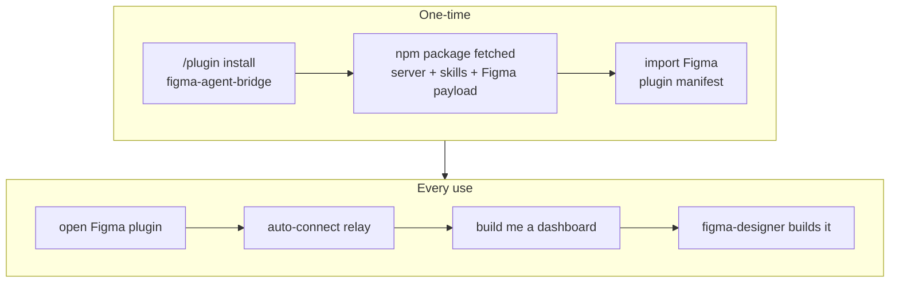

# Claude Code Plugin & Zero-Config Distribution

This spec governs the packaging/distribution layer; it does not change the tool surface
([[figma-bridge/docs/specs/tool-surface|tool-surface.md]] — authoritative for its count) or the
tool contract in [[figma-bridge/docs/specs/overview|overview.md]] — it wraps them for install.

## 1. Goal & non-goals

**Goal.** A user installs one **Claude Code plugin** and opens the Figma plugin — and
everything works. They never learn what "MCP", "relay", "channel", or "port" mean and never
edit a config. **Bun is the one prerequisite** — the README documents a one-line check-install;
the plugin does not auto-install a runtime. `npm` is needed only at **install time**, to fetch
the published package (§5).

**The two things a user does:**

1. Install the Claude Code plugin (`/plugin install figma-agent-bridge@figma-agent-bridge`; see §3).
2. Import the Figma plugin manifest `figma-setup` points at — **once** (§5.1) — then open the
   plugin in Figma desktop (auto-connects).

**Non-goals.** A **toolchain-free route** — Bun is a prerequisite of every route, and the
trade-off that follows is stated where the routes and their prerequisites are introduced
([[figma-bridge/docs/specs/dev-ops|dev-ops.md]] §3.1). Also out of scope:
the live **anonymous Send → GitHub** path (its CloudFlare Worker is deferred — local capture is
the built-in path, per
[[figma-bridge/docs/specs/feedback-system|feedback-system.md]]); a true one-click `claude://`
install (no such scheme exists — see §3). _(A **Figma Community publish** is **not offered**: the
Figma plugin arrives by **manifest import** on every route. The option set and the reason are
[[figma-bridge/docs/specs/dev-ops|dev-ops.md]] §3.8; the plan that would lift the constraint is
tracked in [[figma-bridge/docs/deferred-capabilities|deferred-capabilities.md]].)_

## 2. End-user experience



## 3. Distribution model — repo _is_ the marketplace

The existing repo `yleilu/figma-agent-bridge` doubles as a Claude Code **marketplace**
(the pattern `anthropics/claude-plugins-official` uses for its first-party plugins).

**The marketplace is git-sourced.** `.claude-plugin/marketplace.json` at repo root is a
git/GitHub-sourced Claude Code marketplace — the only kind the platform supports (a
_marketplace_ cannot be npm-sourced; only a plugin **entry** can). It lists one plugin.

**The plugin entry is npm-sourced.** The entry names the published package and the exact
version to install. `source` is an **object**, not a bare string — the source kind is a `source`
field _within_ it, and `package` is meaningful only inside that object:

```json
{
  "name": "figma-agent-bridge",
  "displayName": "Figma Bridge",
  "description": "Build and review Figma designs with an AI agent.",
  "source": {
    "source": "npm",
    "package": "figma-agent-bridge",
    "version": "<version>"
  },
  "version": "<version>"
}
```

The entry's own `version` sits alongside the source's, and both carry the version-of-record
(§5) — the source's version is what npm resolves, the entry's is what the host lists. Both are
written by the release that stamps them, alongside the plugin manifest
([[figma-bridge/docs/specs/dev-ops|dev-ops.md]] §6.3).

Claude Code resolves that entry at **install time** — it runs npm to fetch the package, then
copies it into its own per-version plugin cache. The delivery mechanism, and everything the
package carries, is §5.

**Install commands** (what the README documents; there is **no** official `claude://`
one-click deep link — verified against the docs). A README badge may _link_ to these two lines,
but the click itself does not install:

```
/plugin marketplace add yleilu/figma-agent-bridge
/plugin install figma-agent-bridge@figma-agent-bridge
```

The `figma-agent-bridge@figma-agent-bridge` slug is `<plugin-name>@<marketplace-name>` — the
marketplace name comes from this repo's `marketplace.json` and the plugin name from the
package's `plugin.json`; both are `figma-agent-bridge`, hence the repeat.

## 4. Directory layout

**Nothing that is built is committed.** The server bundle and the Figma plugin payload are
produced at release and travel inside the **published package** (§5), so the repo tree and the
package tree differ — both are given here.

**(a) The repo.**

```
figma-agent-bridge/                       repo == marketplace
├── .claude-plugin/
│   └── marketplace.json                  lists the plugin, source: "npm"
├── plugin/                               the package source (NOT a Bun workspace pkg)
│   ├── .claude-plugin/
│   │   └── plugin.json                   name + version (both required) + description/author/…
│   ├── package.json                      npm metadata — name + version + bin; no deps, no scripts (§5)
│   ├── .mcp.json                         mcpServers → bin/server.js, run with bun
│   ├── skills/
│   │   ├── figma-design/SKILL.md         + references/ (§6.1)
│   │   ├── figma-feedback/SKILL.md       + references/ (§6.3)
│   │   ├── figma-reviewer/SKILL.md       + references/ (§6.4)
│   │   ├── figma-connection/SKILL.md     + references/ (§6.6)
│   │   └── figma-setup/SKILL.md          + references/figma-bridge-prefs-template/ (SKILL.md.tmpl + references/) (§6.7)
│   ├── agents/
│   │   ├── figma-designer.md             frontmatter: model: (no tools: — inherit all, §6.2)
│   │   └── figma-reviewer.md             (§6.5)
│   ├── hooks/
│   │   ├── hooks.json                    PreToolUse → inject session_id (+ agent_id/agent_type on subagent calls); UserPromptSubmit → presence status block (§ plugin-presence.md)
│   │   └── identity, presence, …         the hook scripts (extensionless)
│   └── README.md                         install + bun prerequisite check + Figma-plugin-import steps
├── packages/                             the Bun monorepo
│   ├── server/                           → MCP stdio server
│   ├── relay/                            → shared relay (§8)
│   └── figma-plugin/                     → the Figma plugin: manifest + code/UI build
├── scripts/
│   ├── build-bundle.sh                   bun build --target=bun → the package's bin/server.js
│   └── stamp-version.ts                  stamps the one version of record into every artifact
├── .github/workflows/release.yml         tag → gate → build → publish the package + the fig-plugin archive
└── LICENSE                               the project's licence — source of truth for the packaged copy
```

The package's `bin/server.js` and `figma-plugin/` have no counterpart in this tree: they are
build outputs, added when the package is assembled at release. The package's `LICENSE` is a build
output too, but a copied one: the repo-root `LICENSE` is the single source of truth, and package
assembly copies it to `plugin/LICENSE` so the tree carries no duplicate.

**(b) The published package** — what the registry serves, and what Claude Code copies into its
per-version plugin cache; `${CLAUDE_PLUGIN_ROOT}` resolves to its root:

```
figma-agent-bridge/                       == the installed plugin root
├── .claude-plugin/
│   └── plugin.json                       name + version (version REQUIRED — §5, lockstep)
├── package.json                          name + version + a `bin` entry → bin/server.js;
│                                         no dependencies, no scripts (§5)
├── .mcp.json                             mcpServers → bin/server.js, run with bun
├── bin/
│   └── server.js                         deps-inlined Bun JS bundle of the server + relay
├── skills/                               the five skills (§6)
├── agents/                               figma-designer, figma-reviewer
├── hooks/                                hooks.json + its scripts
├── figma-plugin/                         the built Figma plugin payload (§5.1)
│   ├── manifest.json
│   └── dist/
│       ├── code.js
│       └── ui.html
├── README.md
└── LICENSE
```

Conventions confirmed from real plugins: MCP config lives in `.mcp.json` at plugin root
(never inline in `plugin.json`); `plugin.json` sets only
`name, displayName, description, version, author, homepage, repository, license, keywords` (**`version` is
required**, not optional — §5); the plugin ships **no `commands/`** — its surfaces are skills,
agents, and hooks; skills are
`skills/<name>/SKILL.md`; agents are flat `agents/<name>.md` with a `model:` frontmatter (and
**no `tools:`** — inherit all; a bare-name allowlist doesn't resolve MCP tools, §6.2); hooks are
`hooks/hooks.json` + sibling scripts (extensionless to avoid
Windows auto-`bash` mangling). `hooks.json` holds two **core** hooks (feature specs add more — see end of
section): (1) a **`PreToolUse`** hook,
matcher scoped to the figma-bridge MCP tools across both install namespaces
(`mcp__(figma-bridge|plugin_figma-agent-bridge_figma-agent-bridge)__.*`), that injects its native `session_id` — and, for subagent-originated
calls, `agent_id`/`agent_type` — into each MCP call's arguments (the reserved `sessionId`/`agentId`/
`agentType` headers — see [[figma-bridge/docs/specs/request-envelope|request-envelope.md]]); it must be
the **only** `PreToolUse` hook rewriting these arguments (parallel rewriters race). And (2) the
**`UserPromptSubmit`** presence hook — injecting the always-on status block that surfaces plugin/file
availability and pending user edits (passive plugin/file awareness) — which uses its **native**
`session_id` (the same value the `PreToolUse` hook injects), specified in
[[figma-bridge/docs/specs/plugin-presence|plugin-presence.md]] (folding in the change-feed count,
[[figma-bridge/docs/specs/change-feed|change-feed.md]]). Beyond these two core hooks, the **status
monitor** ([[figma-bridge/docs/specs/status-monitor|status-monitor.md]]) registers three more
`hooks.json` entries — `Stop`, `SubagentStop`, `SessionEnd` — for per-agent status lifecycle (owned by
that spec). The **`SessionEnd`** entry carries a **second responsibility** on top of that lifecycle:
deleting this session's Change Feed count files (`changes/<file>/<sanitized session_id>.json`), the
per-session mirror the presence hook reads — it is the one packaged hook that runs, with a native
`session_id`, exactly when that session's mirror stops being meaningful. The session-agnostic
`_unattributed` sentinel is **not** covered by that sweep — it belongs to no session, so no session
ending can retire it: the server unlinks its own on clean shutdown, and a reader treats one older than
its TTL as no signal at all, deciding staleness on the record's `updatedAt` rather than on the file's
existence (record, path, and TTL owned by [[figma-bridge/docs/specs/change-feed|change-feed.md]]).
The **feedback system** ([[figma-bridge/docs/specs/feedback-system|feedback-system.md]])
adds **no hooks**: its end-of-work review is an **agent-driven finish-step** carried by the
`figma-design` skill (the main agent offers the review when a unit of work recorded new friction),
not a `Stop` hook — see [[figma-bridge/docs/specs/feedback-system|feedback-system.md]].

**Routes without the packaged hooks.** The packaged `PreToolUse` matcher covers **both** MCP
namespaces — the plugin install's and the dev/manual `figma-bridge` one — so the injector is **not**
inert on the dev route. It is absent only where the Claude Code plugin itself is not installed (the
from-source and standalone-server routes), and there **no** packaged hook runs: no
`sessionId`/`agentId`/`agentType` is injected, no status block is injected, and nothing writes or
reads the count mirror. The features those hooks carry are inert **by construction** on such a route —
nothing written, nothing read — rather than half-working. A developer running that way who wants
identity attribution opts in by adding the equivalent hook to their project or user `settings.json`;
if they don't, the reserved `sessionId`/`agentId`/`agentType` fields simply stay absent:

```json
{
  "hooks": {
    "PreToolUse": [
      {
        "matcher": "mcp__figma-bridge__.*",
        "hooks": [
          {
            "type": "command",
            "command": "\"${CLAUDE_PROJECT_DIR}/plugin/hooks/identity\""
          }
        ]
      }
    ]
  }
}
```

## 5. Packaging & delivery — the npm-published plugin

**The plugin ships from npm.** The marketplace's plugin entry is npm-sourced (§3), and Claude
Code resolves it at **install time**: it runs npm to fetch the package, then copies the package
into its own per-version plugin cache. The built server therefore never lives in git — it is
published to the registry as part of the plugin package and arrives when the user installs.

**The package carries the whole agent-side product** (tree: §4b) — `plugin.json` (name +
version), `package.json`, `.mcp.json`, `bin/server.js` (the deps-inlined Bun JS bundle of the
server + relay, built with `bun build --target=bun`), the five `skills/`, the two `agents/`,
`hooks/` (`hooks.json` + its scripts), the built `figma-plugin/` payload (§5.1), `README.md`,
and `LICENSE`. One install delivers every agent-side piece.

**`package.json` declares a `bin` entry** pointing at `bin/server.js`, so the server can also be
launched straight from the registry by a package runner — the standalone-server route. The `bin`
key carries the **package's own name**, `figma-agent-bridge`, so a package runner resolves the
command from the package name alone and there is no second name to learn. The bundle is built
`--target=bun`, so that runner must be **Bun's**; a Node-based runner cannot execute it. A `bin`
entry is neither a dependency nor an install script, so it does not touch the inert constraint
below.

**The package is inert: no dependencies, no `optionalDependencies`, no install scripts, no
lockfile.** This is a deliberate constraint, not an accident. A package that carries
dependencies or a lockfile invokes Claude Code's post-copy dependency-install step, whose
behaviour varies with the user's npm version and whose failure is **silent** — the plugin
installs and enables, but its server never starts. An inert package has no such failure mode.
Inlining every dependency into `bin/server.js` at build time is what earns the package the
right to declare none.

**`.mcp.json`** launches the bundle with the user's `bun`:

```json
{
  "mcpServers": {
    "figma-agent-bridge": {
      "command": "bun",
      "args": ["${CLAUDE_PLUGIN_ROOT}/bin/server.js"]
    }
  }
}
```

`.mcp.json` at plugin root is the **one reliable location**: inline `mcpServers` in
`plugin.json` (Claude Code #16143) and `mcpServers` in `.claude/settings.json` (#32145) are
both dropped by the platform. `${CLAUDE_PLUGIN_ROOT}` resolves to the installed plugin
directory — the per-version cache copy of the package — where the bundle sits; it is never
wiped independently of the plugin.

**Bun is a documented prerequisite; npm is needed only at install time.** The plugin does not
auto-install a runtime — auto-installing inside a hook is a cross-platform minefield
(especially on Windows). Instead, the README documents a one-line check-install
(`curl -fsSL https://bun.sh/install | bash` or equivalent), and the plugin surfaces a clear
error if `bun` is not on the PATH. Every route runs on the user's own Bun
([[figma-bridge/docs/specs/dev-ops|dev-ops.md]] §3.1), so the shipped server always executes on
the same runtime it is built and tested against. `npm` is not a runtime
dependency: it runs once, when Claude Code resolves the npm-sourced entry, and is never invoked
again.

**Version lockstep.** There is one version of record: `plugin.json`'s version, the npm package
version, and the marketplace entry's version are **always equal**. `plugin.json` **must** carry
a version — Claude Code derives the plugin's cache directory from it, so a missing version
collapses every release into a single directory. The plugin↔server match is therefore
_structural_: the server bundle and the plugin metadata are the same artifact, shipped
together. The Figma-plugin↔server match is enforced at connect time by the version handshake
(principle B2 — [[figma-bridge/docs/specs/version-handshake|version-handshake.md]]). The
pipeline that stamps that version, builds the artifacts, and publishes them — triggered by a release
pull request merging, and tagging the commit it stamps — is
[[figma-bridge/docs/specs/dev-ops|dev-ops.md]].

**No bootstrap hook.** Nothing is fetched at session start or on first run: resolution happens
once, at install time. The only packaged **core** hooks are the `PreToolUse` identity injector
(`session_id` + subagent `agent_id`/`agent_type`) and the `UserPromptSubmit` presence hook; the
status monitor adds `Stop`/`SubagentStop`/`SessionEnd` (see §4 / `hooks.json` and
[[figma-bridge/docs/specs/status-monitor|status-monitor.md]]).

**Production config.** The feedback Worker URL is a build-time constant of the **server bundle**,
baked in via `bun build --define`. **Nothing else** accompanies it: a distributed artifact can't
safely hold a shared secret (extractable), so the anonymous path ships **no client credential at
all** and the Worker gates itself with per-IP rate limiting instead — see
[[figma-bridge/docs/specs/feedback-system|feedback-system.md]].

**Install routes are not specified here.** The route set, what each route delivers, its
prerequisites, and its steps are owned by
[[figma-bridge/docs/specs/dev-ops|dev-ops.md]] §3. This spec owns only the **packaging
mechanism** the routes consume: what the package carries, the inert constraint, the npm source,
and the Figma payload.

One packaging fact the routes depend on: **the from-source path touches no package.** Nothing
described in this section reaches it — it runs the server from the repository under Bun.

**Integrity & trust.** The server ships _inside_ the installed plugin — it is not a
repo-controlled `.claude/settings.json` hook (the RCE vector in CVE-2025-59536). Its integrity
comes from the **registry**: the published package is immutable at its version, the marketplace
entry pins that exact version, and that same version is what the plugin metadata and the
handshake report — so there is no separate checksum step to get wrong.
**Reference plugins to model after:** `confluentinc/claude-code-confluent-plugin` (local
server + env expansion in `.mcp.json`), `slackapi/slack-mcp-plugin` (official plugin
structure).

### 5.1 The Figma plugin payload

The package carries the **built Figma plugin** — `manifest.json` plus `dist/code.js` and
`dist/ui.html`. `figma-setup` (§6.7) materialises it at a stable, **user-owned** location,
because the plugin's own install directory is version-keyed and ephemeral while Figma stores
absolute paths to the files it imports:

```
~/.figma-agent-bridge/
├── versions/<version>/     manifest.json + dist/{code.js, ui.html} — per-version copy: history, rollback
└── figma-plugin/           a REAL directory holding the active version's files
    ├── manifest.json
    └── dist/
        ├── code.js
        └── ui.html
```

The user imports `~/.figma-agent-bridge/figma-plugin/manifest.json` into Figma **once**. On
upgrade, `figma-setup` copies the new version's files over those same paths; because Figma
re-reads its registered files on each run, the new code is picked up **without a re-import**.

The shape follows from four constraints:

1. Figma persists **absolute paths** — the manifest plus the code and UI files, resolved at
   import time.
2. Figma **re-reads** those files on each plugin run, so overwriting content at a stable path
   upgrades the plugin in place.
3. `figma-plugin/` is a **real directory, not a symlink**: whether Figma records a symlink's
   own path or its resolved target is unspecified, and a resolved target would silently defeat
   the indirection.
4. The files are **copied**, never symlinked into the plugin's install directory, which is
   ephemeral and reclaimed.

A stale payload is safe: the version handshake refuses a mismatched Figma plugin loudly
(principle B2 — [[figma-bridge/docs/specs/version-handshake|version-handshake.md]]).

## 6. Components

**At a glance** — five skills (the knowledge) + two agents (the executors). Skills are
introduced before the agents that consume them, except `figma-designer` (§6.2), which
forward-references the feedback/reviewer skills below:

| Concern                       | Skill                     | Agent                                                          |
| ----------------------------- | ------------------------- | -------------------------------------------------------------- |
| Build                         | `figma-design` (§6.1)     | `figma-designer` (§6.2) — consumes all three build-loop skills |
| Report _tool_ friction        | `figma-feedback` (§6.3)   | — (mechanics fold into the skill; taste → figma-bridge-prefs)  |
| Review the _design_           | `figma-reviewer` (§6.4)   | `figma-reviewer` (§6.5)                                        |
| Diagnose connection / version | `figma-connection` (§6.6) | — (main-agent guidance)                                        |
| Set up Figma; customize style | `figma-setup` (§6.7)      | — (materialises the Figma payload; authors `figma-bridge-prefs`, not shipped) |

### 6.0 Skill charter — what goes where

The [[figma-bridge/docs/principles|P1]] partition, made concrete per skill — what each skill
**holds** and what it must hand **off**. This is the boundary the other subsections implement.

| Skill                                      | Purpose                               | Holds                                                                                                                                                                                                              | Never holds (→ goes to)                                                                                                                                                                                                                                        |
| ------------------------------------------ | ------------------------------------- | ------------------------------------------------------------------------------------------------------------------------------------------------------------------------------------------------------------------ | -------------------------------------------------------------------------------------------------------------------------------------------------------------------------------------------------------------------------------------------------------------- |
| `figma-design`                             | Build well                            | tool mechanics, call patterns, limits; how to read the turn-start presence block (when the drain is worth a call, what a broken baseline obliges); the **basic** level of design-system-first + component-first; the naming **floor** (meaningful, non-default)                                                                | concrete values (tokens/scale/ramp/naming convention) + strict levels → `figma-bridge-prefs`                                                                                                                                                                   |
| `figma-reviewer`                           | Find issues                           | review _how-to_ (inspect/enumerate/report, the six dimensions' mechanics) + the non-overridable floor it owns: **verification discipline + destructive-op safety** + default-name detection + internal-consistency | all concrete standards come from the loaded `figma-design` + `figma-bridge-prefs`; the accessibility thresholds (WCAG/contrast/touch/text-size) specifically come from `figma-bridge-prefs` **only** (figma-design ships zero a11y); the reviewer defines none |
| `figma-feedback`                           | Report _tool_ friction                | bug/proposal categories, formats, high-value litmus, `record_feedback` mapping; the fold-back fork                                                                                                                 | design critique → `figma-reviewer`; preference content → `figma-bridge-prefs` via `figma-setup`                                                                                                                                                                |
| `figma-connection`                         | Diagnose/recover connection & version | symptoms → diagnosis → recovery                                                                                                                                                                                    | anything design/build/review; the presence block's drain mechanics → `figma-design`                                                                                                                                                                                                                                   |
| `figma-setup`                              | Set up Figma; author + update `figma-bridge-prefs` | materialising the packaged Figma plugin payload + the import path (§5.1); the instantiate / tailor / update / scope flow                                                                               | the preference **values** (the user's, in `figma-bridge-prefs`)                                                                                                                                                                                                |
| `figma-bridge-prefs` _(user, not shipped)_ | The user's durable preferences        | concrete values, the **strict** levels, house review standards, **the accessibility thresholds (WCAG AA default)**                                                                                                 | tool mechanics; the shipped floor (verification + destructive-op safety)                                                                                                                                                                                       |

Decision rule: _a concrete value / taste / strict standard (incl. accessibility thresholds) →
`figma-bridge-prefs`; how-to-build → `figma-design`; how-to-review or the verification/destructive-op
floor → `figma-reviewer`; reporting tool friction → `figma-feedback`; connection/version →
`figma-connection`._

### 6.1 Skill — `figma-design`

Purpose: teach the agent **how to operate** the tool surface well. It deliberately does
**not** encode visual taste or a house style — _how the outcome looks is the user's to
specify, per request_. This keeps the skill durable: principles and mechanics age well;
baked aesthetics don't. It covers the **full surface — create, inspect, and edit** (incl.
the user's current selection); there is no create-only-vs-edit split.

**Start-of-work guard — is there a design system?** _(Design-system-first is a **decision**,
not a mandate.)_ Before building, **detect** whether the file already uses one — local
variables (design tokens), shared styles, or components in use (traces of systematic design).

- **Found one → adopt it by default** — reuse and extend its tokens / styles / components
  (single source of truth); never duplicate what already exists.
- **None found → the user's call** — offer to establish a design system, but don't impose it;
  for a quick one-off or mockup, direct values are fine. **Ask when it's unclear** which the
  user wants.

**Principles** (how to work _once_ a design system is in play):

- **Single source of truth** — reuse tokens/components; never duplicate.
- **Component-first** — repeated elements become components.
- **Don't hardcode a value that has a token** — bind the variable / apply the style.

**Operating rules** (run smoothly + cheaply):

- **Reuse before create** — search for an existing component/token before making a new one.
- **"check my selection"** → `inspect` the selection and describe it (read, don't assume).
- **Mind token usage** — batch, prefer scoped reads, don't re-scan the whole document.
- _(extended as new rules surface in use.)_

**Reading the turn-start presence block.** Every turn opens with the injected `figma_bridge:` block
([[figma-bridge/docs/specs/plugin-presence|plugin-presence.md]]); its per-file `pending_edits` /
`pending_edits_state` fields say what the user changed since the last drain. What to do about them is
**tool usage** (P1) — how this surface is operated, with no defensible alternative reading — so it
belongs to the design loop, not to the connection skill (§6.6):

- **`pending_edits > 0`** → call `pull_changes({fileKey})` **before acting on that file's existing
  nodes**: the user edited them since your last read, and acting blind risks clobbering the change.
- **`pending_edits_state: gap`** → the feed lost part of the history: drain, then **re-read what you
  already hold** — what came back cannot be assumed to be everything that happened.
- **`pending_edits_state: no_baseline`** on a file you have not read yet obliges nothing: the reads
  you were going to make *are* the baseline.
- **Both fields absent** → "unknown, no signal" — never read as `0`.

How often to re-verify beyond that (re-read before every batch, not only before a destructive op) is a
preference and lives in `figma-bridge-prefs`.

**Mechanics — with examples.** The fiddly, get-it-wrong-repeatedly calls ship **with exact
code snippets** (tool-usage patterns, not visual templates):

- Instance-content override: `update_node` on the compound child id `I<inst>;<masterText>`
  with a **full** text patch (content+font+color) — text-only errors on `raw.trim`.
- `sizing:['FIXED','FIXED']` for fixed frames (auto-layout defaults to HUG → collapse).
- `bind_variable` (fills → color vars) + `apply_style` (text → styles), on **masters** so
  instances inherit; `combine_variants` for variants.
- **Limits to route around:** `update_component` add doesn't bind props (`set_instance` text
  is inert → use the override above); no `delete_variables`/`delete_styles` (reuse); rotated
  bbox + `get_node` invalid-profile caveats.

**Workflow spine** (a default, not a mandate): tokens → styles → components → layout →
content → verify.

figma-design ships only the **basic (reactive)** level of design-system-first / component-first; a
user's `figma-bridge-prefs` may raise them to a **strict (proactive)** level and supply concrete
values (tokens, spacing scale, type ramp, naming), and per the extension-point backstop this skill
defers to `figma-bridge-prefs` when installed — see
[[figma-bridge/docs/specs/customization|customization.md]] (P1).

**Verification discipline:** `export` PNG + `get_node`/`inspect` read-back (read-back proves
`var(…)` bindings + `INSTANCE` types).

**Structure** (progressive disclosure, per real-plugin convention):

- `SKILL.md` — principles, operating rules, workflow spine, verification.
- `references/mechanics.md` — the with-example tool-usage patterns + limits.
- `references/grammar.md` — a **self-contained** snapshot of the atom value formats (the
  installed plugin won't ship `docs/specs/expression-formats.md`, so this can't be a live
  pointer — author it from that spec and keep in sync).

### 6.2 Agent — `figma-designer`

A subagent that **consumes** `figma-design`. Loop: request → plan (DS → components →
layout → content) → build via the MCP tools → `export` + read-back verify →
**self-review (`figma-reviewer` skill, §6.4)** → iterate.
Frontmatter sets **`model:`** (sonnet default, opus for complex compositions) and **omits
`tools:`** so the subagent **inherits all session tools**. A bare-name `tools:` allowlist
(`connect`, `create_node`, …) does **not** resolve to the namespaced MCP tools
(`mcp__<server>__*`) — it strips every Figma tool and leaves only the built-ins — and inheriting
all is the only form that attaches the MCP tools across **both** the plugin (`mcp__plugin_…__*`)
and dev (`mcp__figma-bridge__*`) namespaces. Inheriting keeps `Skill` (to load the overlay) +
`Read` (to open references), so it **loads the user's `figma-bridge-prefs` overlay and reads its
`house-style.md` as a first step** when present (per
[[figma-bridge/docs/specs/customization|customization.md]] §7).
Calls `record_feedback` (§7) when it hits a tool limit — guided by the
`figma-feedback` skill (§6.3).

### 6.3 Skill — `figma-feedback`

The plugin-layer **when + how to report** guidance — the opinion layer over feedback-system.md's
neutral tools (P1). **Consumed by `figma-designer` (auto, inline the moment it hits friction) and
the main agent (manual "file feedback")** — so a separate feedback _agent_ folds into it. It
defines **two flows, one per category, each with a standardized `record_feedback` body format and
a worked example.** It records **one item per distinct issue**, never records expected errors (the
user's own invalid input), and continues the task (zero-friction, never derail).

**Recording, then the end-of-work review.** `record_feedback` only _captures_ an item to the local
backlog — mid-task, by whoever hits the friction (a `figma-designer` subagent, or the main agent).
It **does not send**. The human gate is a whole-batch review the **top-level agent** raises as a
wrap-up finish-step (carried by the `figma-design` skill, **not** a hook) when **the unit of work
recorded new friction** — an optional courtesy, not mandatory; a purely-deferred older backlog does
not re-raise on its own (`AskUserQuestion` is a main-agent affordance, so subagents only record then
flag it in their report) — the human is **never asked to triage issues one by one**:

- **Gate — one three-way choice on the whole batch** (always shown). _"I hit N tool limitation(s) —
  ‹a few titles› — what should I do?"_ **Report → file all N**; **Defer (or dismiss) → stop:**
  nothing is sent, nothing is deleted, the backlog is kept for later; **Discard → delete all N
  unsent.** For a returning user the Report option carries the remembered attribution (_Report as
  `name <email>`_ or _Report anonymously_) so they see whose account will author the comments. The
  user-facing presentation is a **fixed `AskUserQuestion` template** owned by the skill — labels
  _Yes, send_ / _Not now_ / _Delete_ (= Report / Defer / Discard), in that order, with **_Yes, send_
  the default and Delete never the default** — so the gate is identical every run and a destructive
  option can't be fat-fingered (the agent must not reword or reorder it).
- **"Something else" — an add on any Report.** The gate always offers a free-text _"something else"_
  so the human can add one issue in their own words on any Report, which the agent **investigates
  and rewrites** into a proper bug/proposal (the raw text never leaves the machine), filed as
  `send_feedback`'s `add` — independent of the first-run attribution step below.
- **Attribution — first-time users only.** On the first **Report** (no identity remembered) the
  human is asked _under my GitHub account_ vs _anonymously_; logging in runs the device-flow
  handshake via `github_auth_start` / `github_auth_poll`. **Either choice is remembered**, so a
  returning user skips this step and Reports straight through.
- **Filing.** **Report** files every pending item (`send_feedback`) as a comment, the composed item
  riding `add`; **Discard** hard-deletes every pending item (`discard_feedback`). The human chooses
  once for the whole batch — no per-item selection.

**BUG — something is broken or wrong.** Signals: a **silent no-op** (success result, nothing
changed), an unexpected/confusing error, a result that **contradicts the spec**, or
**skill-misleading** — _"I thought I could do X but I can't,"_ where the **skill** set a false
expectation.

_Body format:_

```
**What I did:** <tool call / action>
**Expected:** <correct behaviour>
**Actual:** <what happened>
**Repro:** <tool + params + result>
```

_Example_ — `category: bugs`, `tool: update_component`, title _"update_component adds a TEXT
property but never binds it → set_instance can't change instance text"_:

```
**What I did:** update_component(add TEXT "Label"), then set_instance({Label:"Revenue"}).
**Expected:** the instance's label text becomes "Revenue".
**Actual:** the property is set on the instance but no text node updates — it's bound to nothing.
**Repro:** update_component({componentId, add:[{name:"Label",type:"TEXT",defaultValue:"x"}]})
  → set_instance({instanceId, properties:{Label:"Revenue"}}) → get_node shows unchanged text.
```

**Skill-misleading → correct the skill.** A special bug where the miss is the _skill's_ fault —
it implied a capability that doesn't exist (_"I thought I could do X but I can't"_). The fix
**corrects this skill's own guidance** (folding back like an accepted shortcut), not just a tool
bug; file it under `bugs` with the misleading line quoted. _Example:_ the skill said
"`set_instance` changes instance text" → it doesn't (the prop isn't bound) → the skill is
corrected to point at the compound-id override. **This fold-back is mechanics-only:** a
**taste / preference** correction instead routes to `figma-bridge-prefs` via `figma-setup` and
**never** folds into a shipped skill nor rides the feedback rail off-box — see
[[figma-bridge/docs/specs/customization|customization.md]].

**PROPOSAL — it works, but could be better, or something's missing.** Signals: a **better
approach** ("_doing X this way would be better_"), a **shortcut** (a shorter path to the same
outcome), a **missing tool/arg**, **lack of docs**, or a **feature request**.

_Body format:_

```
**Context:** <what I was doing>
**Opportunity:** <better-approach | shortcut | missing tool/arg | missing docs | feature>
**Proposed change:** <concretely what would help>
**Why it helps:** <the benefit>
```

_Example_ — `category: proposals`, `tool: set_instance`, title _"set_instance should accept
text overrides in one call"_:

```
**Context:** populating 4 stat-card instances took 12 update_node calls on compound child ids
  (I<inst>;<masterText>) with full text patches.
**Opportunity:** missing arg — no one-call way to set an instance's text content.
**Proposed change:** set_instance({instanceId, text:{"label":"Revenue","value":"$48.2k"}}).
**Why it helps:** N calls → 1; the compound-id + full-patch path is fiddly and error-prone.
```

**Shortcut** — a high-value proposal worth its own shape (**fold accepted ones back into this
skill's recipes**): a shorter path to the same outcome.

_Body format:_

```
**Long path:** A → B → C → outcome
**Shortcut:** D → same outcome
**Why it helps:** <fewer steps / simpler / less error-prone>
```

_Example (real):_ `category: proposals`, title _"instance text-child id is deterministic — skip
the per-instance get_node"_:

```
**Long path:** per instance: get_node(instance) → parse its text-child id → update_node(childId, patch)
**Shortcut:** the child id is deterministic — I<instanceId>;<masterTextNodeId> — build it from the
  master's text-node id captured once; skip the per-instance get_node entirely.
**Why it helps:** N get_node round-trips → 0; one master-time lookup serves every instance.
```

**High-value litmus** (what's worth filing as a proposal). It earns its place when it does
**≥1** of: kills a **silent failure / drift**; collapses a repeated **A→B→C into one call**;
**unblocks** a capability that needed a hack; **cuts read tokens** on a common path; improves
**read-back fidelity**; or removes **guesswork** (least-surprise defaults, semantic ids over
opaque ones). _Skip_ cosmetic, one-off, or cheaply-worked-around ideas.

The **eight high-value categories** (grounded in Anthropic's _Writing effective tools for AI
agents_ + this project's own scars; full worked examples in
**`references/high-value-proposals.md`**):

1. **Workflow consolidation** — collapse A→B→C into one tool/arg (the shortcut, generalized).
2. **Token efficiency** — concise/detailed response formats, bounded/paginated scans, server-side aggregation.
3. **Actionable errors, no silent no-ops** — the worst failure mode for an agent.
4. **Missing capability / CRUD symmetry** — a `create_*` with no `delete_*`; a missing arg; an unexposed Figma API.
5. **Semantic over low-level identifiers** — names the agent can reason about, not opaque handles.
6. **Round-trip fidelity** — what you create reads back losslessly.
7. **Reliability / drift guards** — fail loudly on mismatch.
8. **Least-surprise defaults** — right behaviour without incantations.

**Skill structure** (progressive disclosure): `SKILL.md` holds the two flows, formats, and
this litmus; the full taxonomy + worked project examples live in
`references/high-value-proposals.md`, loaded only when composing a proposal.

### 6.4 Skill — `figma-reviewer`

Reviews a **design** (the artifact) against quality dimensions and emits a standardized report
— distinct from `figma-feedback`, which reviews the **tool**. Consumed by the `figma-reviewer`
agent (§6.5) and by `figma-designer` as a **self-review gate** before it calls a build done.
Reads via `inspect` / `get_node` / `export` — the read-back discipline that verified the
dashboards.

**Dimensions:**

1. **Design-system adherence** _(context-aware — only when the file has a design system; see the
   §6.1 guard)_ — hardcoded values that should be tokens, text off a style, duplicated elements
   that should be components, detached instances.
2. **Consistency** — off-scale spacing/padding, inconsistent radius, type off the ramp,
   misaligned / off-grid elements — measured against the file's **own** detected system (or the
   user's `figma-bridge-prefs` scale when installed), never a shipped baseline scale.
3. **Accessibility** — text contrast, min text size, touch-target size, meaning conveyed by colour
   alone — checked against the accessibility thresholds in the user's `figma-bridge-prefs` (WCAG AA
   is the shipped template default); unchecked when no prefs.
4. **Layout & structure hygiene** — absolute positioning where auto-layout fits, default names
   ("Frame 42"), pile-ups at [0,0], missing constraints, redundant nesting, orphan/hidden nodes.
5. **Fidelity to intent** — matches the request; nothing missing or extra.
6. **Naming & context legibility** — meaningful, non-default node names (the naming floor; the
   `/` taxonomy is a `figma-bridge-prefs` house preference) and well-formed `context` notes.

**Output format** (per finding):

```
[blocker | warning | nit] <dimension> — <node name / id>
  Issue: <what's wrong>
  Fix:   <concrete suggestion>
```

Plus a **top-line verdict** + counts per severity.

**Flow — report, then offer to fix.** The reviewer **reports first** and **never auto-mutates**;
after the report it offers to apply the fixes, and on the user's approval edits the design
(reusing the `figma-design` mechanics). A finding that's actually a **tool** limitation (not a
design flaw) routes to `figma-feedback` (§6.3) instead of a fix.

**Structure:** `SKILL.md` (dimensions, output format, flow) → `references/checks.md`, loaded when
reviewing. `checks.md` ships **only the hard floor** — verification discipline and destructive-op
safety — plus **internal-consistency** checks (does the file use its _own_ detected tokens / scale /
ramp consistently) and the accessibility _how-to_ (the contrast-ratio formula, interactive-node
detection). The concrete standards — the house scale, token set, type ramp, naming rules, **and the
accessibility thresholds (WCAG/contrast/touch-target/text-size)** — are a **user preference** supplied
by `figma-bridge-prefs/references/review-standards.md` when installed (P1) — see
[[figma-bridge/docs/specs/customization|customization.md]].

### 6.5 Agent — `figma-reviewer`

A dedicated subagent consuming the `figma-reviewer` skill (§6.4) — matches the delegate model and
keeps a review's heavy read output out of the main context. Loop: read the target
(`inspect`/`get_node`/`export`) → check each dimension → emit the standardized report → **offer to
fix** → on approval apply edits (or route tool-gaps to `figma-feedback`). Frontmatter **omits
`tools:`** (inherits all session tools — §6.2 — which keeps the read/edit tools + `record_feedback`
+ `Skill` + `Read`, so it **loads the user's `figma-bridge-prefs` overlay and reads its
`review-standards.md` as a first step** when present — per
[[figma-bridge/docs/specs/customization|customization.md]] §7), `model:` (sonnet; opus for
large/complex reviews). Also invoked by `figma-designer` as its self-review gate.

### 6.6 Skill — `figma-connection`

Main-agent guidance for **diagnosing and recovering the connection** — a stale or mismatched
server/plugin, a failed handshake, or a Figma payload that needs refreshing (§5.1). Unlike the three
build-loop skills (§6.1/§6.3/§6.4) it is **not** part of the design loop; the **main agent** invokes
it when a call can't reach Figma or the version handshake reports a mismatch. The connection and
handshake **mechanism** it wraps is specced authoritatively in §8 (app-semver major.minor per B2);
this skill is the _when + how to react_ layer over it. It reads the presence block only for what it
diagnoses — which files are addressable, and which just went offline; the block's **drain mechanics**
(`pending_edits` / `pending_edits_state`) are design-loop tool usage and live in `figma-design`
(§6.1). **Structure:** `SKILL.md` (symptoms → diagnosis → recovery) → `references/` as needed.

### 6.7 Skill — `figma-setup` (Figma plugin setup + customization layer)

A shipped **helper** with **two responsibilities**:

1. **Materialise the Figma plugin payload** — copy the packaged `figma-plugin/` files to
   `~/.figma-agent-bridge/` and tell the user the exact manifest path to import into Figma
   (§5.1). On an upgrade it overwrites the same paths, so no re-import is needed.
2. **Author and update the user's `figma-bridge-prefs` overlay** (below).

**The overlay.** `figma-bridge-prefs` is the user-authored
preference skill (**NOT shipped**) that holds taste, concrete values (tokens, spacing scale, type
ramp, naming), and any stricter-than-basic standard, overriding the shipped skills' basic floor
upward (P1). `figma-setup` instantiates it on explicit opt-in from a shipped, inert template
(`references/figma-bridge-prefs-template/`, whose skill file ships as `SKILL.md.tmpl` and is
renamed to `SKILL.md` on copy) and owns its later updates. The whole layer — the
partition, the load path, and the hard floor the reviewer enforces — is specced authoritatively in
[[figma-bridge/docs/specs/customization|customization.md]] (its SSOT); this section only catalogs it.

## 7. Feedback

The feedback **mechanism** is specced authoritatively in
[[figma-bridge/docs/specs/feedback-system|feedback-system.md]]: neutral **meta-tools**
(`record_feedback` to capture, plus `list_feedback` / `send_feedback` / `discard_feedback` /
`github_auth_start` / `github_auth_poll` to review, file, and drop — their own `feedback` group), a
**one-Markdown-file-per-item** store (**category = directory = one standing GitHub issue**), and an
**agent-driven send flow** — when a unit of work recorded new friction, the top-level agent runs a
**fast three-way gate** with the human — **Report**, **Defer**, or **Discard** — and on **Report** files
**every recorded item** as a **comment** on its category's standing issue, either **anonymously**
via a **CloudFlare Worker** (holding a shared bot token) or **as the human's own GitHub account** (a
token they authorize once, in-browser; on the public repo any authenticated user can comment).
**Defer** keeps the backlog; **Discard** deletes it unsent. The human gate is that choice; nothing
leaves the machine until the human picks **Report**.

The plugin package carries that mechanism and adds the plugin-layer pieces:

> **Note:** there is **no in-plugin Feedback UI** — the panel is the agent status monitor
> ([[figma-bridge/docs/specs/status-monitor|status-monitor.md]]), and the send flow is
> **agent-driven** (the end-of-work review), fully specced in
> [[figma-bridge/docs/specs/feedback-system|feedback-system.md]]. `record_feedback` (the capture
> path) is unchanged.

- `record_feedback` and the send-flow meta-tools ship **inside the MCP server**; there is no
  figma-plugin feedback surface. All are bundled by the plugin install.
- **The production Worker URL is a build-time constant** baked into the packaged server bundle,
  so the endpoint needs no user config; a from-source run reads it from the environment (feedback
  is off if unset). **No client credential accompanies the URL** — a distributed artifact can't
  safely embed a shared secret (extractable), so the Worker is openly reachable and protects
  itself with per-IP rate limiting
  ([[figma-bridge/docs/specs/feedback-system|feedback-system.md]]).
- **`figma-feedback` skill (§6.3)** — the plugin-layer _when + how to report_ guidance
  (bugs + proposals formats), used by `figma-designer` (auto) and the main agent (manual). It
  folds in what would otherwise be a separate feedback agent, and is part of the packaging layer
  rather than the feedback mechanism itself.

Local Markdown capture is always available; **filing to GitHub** has two paths — the **anonymous**
path via the Worker (goes live when the Worker is deployed; URL already baked in) and the
**logged-in** path direct to GitHub with the human's own token (no Worker). Neither path puts a
shared credential on the client.

## 8. Connection lifecycle

Connection plumbing is why "open plugin + talk" is all a user does after install (see
[[figma-bridge/docs/specs/overview|overview.md]] → Connection lifecycle):

- The Figma plugin **auto-connects** on launch and rejoins its own channel, so a reload is
  deterministic. *(The channel is bound to the file's `fileKey` — **per-file channels**, see
  overview *Connection lifecycle* / version-handshake.md.)*
- The MCP server **auto-discovers the relay port** and **auto-starts a shared relay** if none
  is running — a **detached singleton** on `:18080` that **outlives any single session**, so
  many Figma files (each plugin on its own channel) and many Claude Code sessions all pair
  through the one relay (`packages/relay` is already multi-channel: `channels: Map<channel,
Set<client>>`). The **target file/channel is chosen explicitly by the agent** (`connect` by
  `fileKey` → server resolves `fileKey`→channel), never auto-guessed (B3).

**Dual-mode server.** The server and the relay ship in the **same artifact**. Invoked with
`--relay` the entrypoint runs the relay; otherwise it runs the MCP stdio server. To bring up the
detached, shared relay the server re-invokes its **own entrypoint** with `--relay` under `bun` —
the same code path whether that entrypoint is the packaged bundle or the repository source. One
artifact; no separate relay to bootstrap; the multi-file / multi-session shared-relay model is
preserved.

**Version / connection diagnosis — decoupled.** The version handshake is specified separately
([[figma-bridge/docs/specs/version-handshake|version-handshake.md]]: app-semver, major.minor per
B2); the packaging layer does not restate its mechanism. The plugin's only version touch-point is a
**diagnosis / response skill** — `figma-connection` (§6.6): when the handshake reports a mismatch
(or a connection is off), the skill guides the user through the fix (_update the plugin and re-run
`figma-setup`_, which replaces the Figma payload's contents at its stable path — §5.1, no re-import
— or diagnose a stale server).

## 9. Testing — remote-VM clean room

The claim under test is "a developer who installs the plugin and has `bun` succeeds." Prove
it on a **fresh remote VM** with `bun` installed but no other dev tools. The gate is an
**install assertion**: install from a clean state and assert the MCP server connects — that is
what proves a release actually works.

**This section owns _what_ is asserted**; _where_ the assertion runs and _what it installs from_
are owned by [[figma-bridge/docs/specs/dev-ops|dev-ops.md]] §4.2, which runs it in two forms — from
a locally packed tarball before publication, and from the **published** package after it. The list
below is written for the published form; on the tarball form assertion 1's **entry-resolution**
check does not apply, because nothing is on the registry yet. Every other assertion holds on both.

1. Install the plugin from the marketplace (`/plugin marketplace add` + `/plugin install`)
   against the **published** package, from a plugin cache with no prior copy.
2. Assert Claude Code resolved the npm-sourced entry, that `${CLAUDE_PLUGIN_ROOT}/bin/server.js`
   exists in the per-version cache copy, and that the **MCP server connects** when launched
   with `bun`.
3. Assert the package installed **inert** — it declares no dependencies and no install scripts,
   so no post-copy dependency-install step ran.
4. Assert the skills + agents **load** and a headless-mock tool round-trip succeeds (the MCP
   starts + tools respond). **Not a live design test** — real skill/agent behaviour in Figma
   still needs live-verify per the plugin-side rule; the VM clean-room proves _install_, not
   _design quality_.
5. Assert `figma-setup` materialises `~/.figma-agent-bridge/figma-plugin/` (§5.1) with a
   manifest and both `dist/` files at the paths it reports.
6. Assert `record_feedback` writes a well-formed Markdown item to the store.

Headless-testable in CI: the feedback harness (schema validation + sink routing) and the
package build (server bundle + Figma payload assembly).

## 10. Open items & deferred

- **One-click install** — not possible today (no official scheme); revisit if Claude Code
  adds one.
