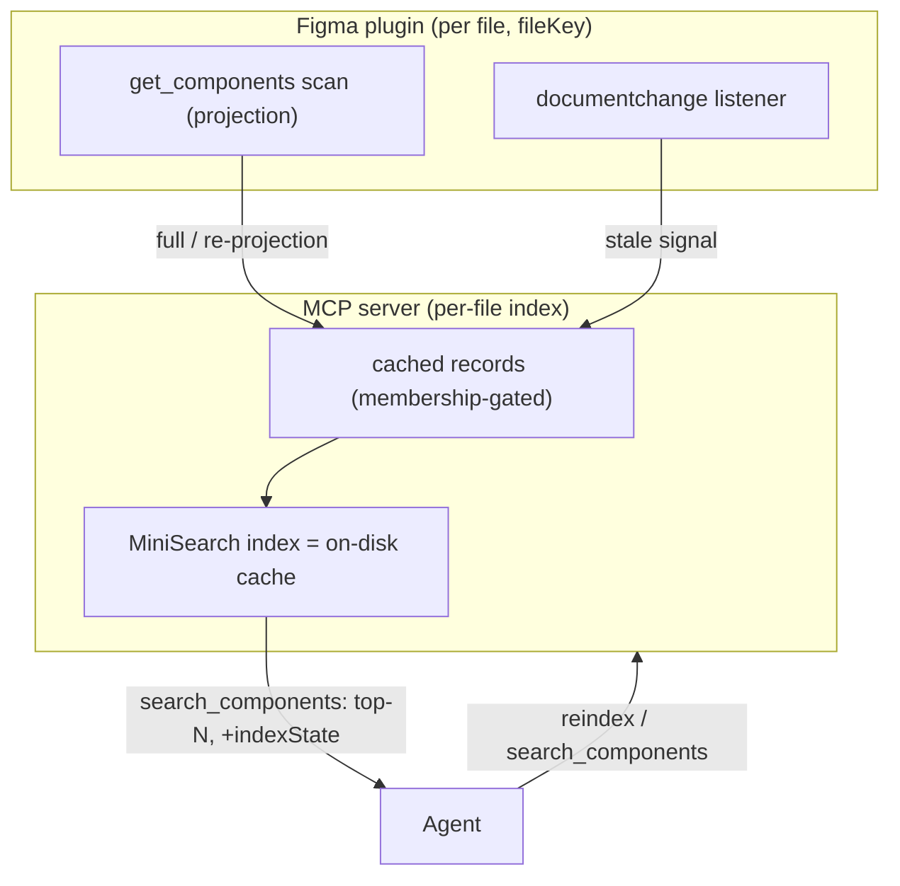

# Component Index

> Governed by [[figma-bridge/docs/principles|the principles]] (**T1** symmetry, **T6/T7** honest
> capability, **T10** bounded reads). Tool contracts are authoritative in
> [[figma-bridge/docs/specs/tool-surface|tool-surface.md]]; this spec defines the design it absorbs.
> The [[figma-bridge/docs/specs/team-library-registry|Team-Library Registry]] layers on this engine to
> add published-library search.

## Overview

The agent finds the right component fast in files with thousands of components, without re-scanning the
document per query or dumping the catalog into context. A per-file **component index** — cached,
searchable, and kept current — is maintained over the file's **local** components.

## Scope

**Covers:** the local component index — search, cache, and freshness.

**Does not cover:**
- **Team libraries** — the [[figma-bridge/docs/specs/team-library-registry|Team-Library Registry]]
  layers registered-library search on this engine.
- **Semantic / embedding search**, cross-file node copy (the multi-file workspace foundation), styles &
  variables indexes, and the content of the `context` field (a separate plugin_data workstream).

## File identity & integration

- Each file is identified by **`figma.fileKey`**. It is exposed only when the manifest sets
  `"enablePrivatePluginApi": true` — permitted because the plugin is distributed by **manifest import**
  (the flag is rejected only on Community-published plugins). `figma.root.id` is `"0:0"` for every file
  and is not a file identifier.
- Every tool takes a **`fileKey`** (the canonical per-call file-identity param); the index and its
  cache are keyed by `fileKey`. A
  `fileKey` resolves to the plugin connected for that file; addressing **multiple** files concurrently is
  provided by the **multi-file workspace foundation**, with which this subsystem integrates through
  `fileKey`. The `fileKey` addressing model is owned by [[figma-bridge/docs/specs/overview|overview.md]];
  its wire envelope by [[figma-bridge/docs/specs/request-envelope|request-envelope.md]] (this spec is a
  consumer of both).
- The key the index is built and read under is the **addressable** file identity — the `synthKey`
  (`fileKey ?? channel`) defined in [[figma-bridge/docs/specs/overview|overview.md]]. The staleness
  push identifies its file the same way, so the **invalidation key is the build key**: an index built
  for a never-saved file under its channel-derived key is reachable by the frame that marks it stale,
  which is what makes an unsaved file's index invalidatable at all.

## Component taxonomy

| Type | Definition |
|---|---|
| **Local component** | `COMPONENT` / `COMPONENT_SET` defined in this file — the indexed unit |
| **Instance** | a placed node whose main resolves to a local component (a use of a local component) or a remote one (evidence of external use, handled by the registry) |

Local components are indexed; instances are not indexed themselves but are how external usage is
detected (see the registry).

## The index

### Record

```
{
  id:          string        // node id
  key:         string        // global component key
  name:        string
  type:        'COMPONENT' | 'COMPONENT_SET'
  page:        string        // containing page name
  source:      'local'       // the registry adds 'team-library'
  fileKey:     string        // the file this entry belongs to
  description?: string        // Figma component description
  variantAxes?: Record<string, string[]>
  signature:   string        // content digest of this record's projected definitions (see Cache)
  context?:    unknown        // reserved: plugin_data-derived context (separate workstream)
}
```

`key` / `id` / `fileKey` / `signature` are returned but not primary search targets; `name` (with
`description`, `context`) are.

### Search — `search_components`

- **Agent-only:** match and return; the agent's LLM makes the final choice. No custom ranking — the
  search library's default ordering is surfaced as-is.
- `search_components({ fileKey, query, type?, limit? })` → a bounded **top-N** (T10), scoped to
  `fileKey`. Matching is **MiniSearch** multi-field (name, description, context) with prefix + fuzzy; the
  agent re-queries with a synonym if needed.
- The result is a **bounded ranked set, not a paginated list**: because ranking is per-query, there is
  no stable position cursor — so unlike Rule-A list reads, `search_components` returns no `cursor`, and a
  full set means "narrow the query," not "page again."
- The result carries an **index state** — a deliberate extension of the list envelope (as
  `get_reactions`/`get_annotations` extend it with `warnings?`) — so an empty result is never mistaken
  for "the file has no components":
  - `warm` — index current; results are authoritative.
  - `stale` — the file changed since projection; results may lag (a refresh is in flight or pending).
  - `building` — first projection in progress.
  - `cold` — no index yet for this file; a build was triggered.

### Cache

Enumeration is cheap (`findAllWithCriteria` yields `{id, name, key}` without touching property
definitions); the **per-component projection** (property/variant definitions) is the cost. Two distinct
digests keep the cache honest **without ever projecting just to decide whether to project**:

- A **membership fingerprint** — a hash of the ordered `{id, name, key}` set, computed from the cheap
  enumerate. It detects components **added / removed / renamed**, and is the gate for reconcile.
- A per-component **content signature** — a digest of a component's projected definitions (property
  names, types, default values, variant axes), computed as a **byproduct of projection** and stored on
  the record. It detects whether a (re-)projected component actually changed, so an unchanged component
  never churns the search index.

The projected records are cached, keyed by `fileKey`. The serialized **MiniSearch index is the on-disk
cache**, stamped with a version that covers both the record shape and the index config, so either change
invalidates a stale cache. The store lives at
**`~/.figma-agent-bridge/component-index/<sanitizeKey(fileKey)>.json`**, where `sanitizeKey` is the
shared path sanitizer defined by the Change Feed
([[figma-bridge/docs/specs/change-feed|change-feed.md]]). It returns a path **segment** with no
extension — the `.json` is appended by the caller — so the one function serves both this file stem and
the feed's sibling `changes/<sanitizeKey(fileKey)>/` directory name.

The store **directory** is overridable by the `COMPONENT_INDEX_DIR` environment variable — when set it
replaces `~/.figma-agent-bridge/component-index/` wholesale, so tests (and any caller wanting an
isolated cache) can point the index at a throwaway location without touching the home directory.

### Freshness

The index is built once (a full projection) and then kept current, cheapest-mechanism-first:

- **Live staleness signal.** While connected, a `documentchange` listener marks the file's index
  **`stale`** when a `COMPONENT`/`COMPONENT_SET` (or a node within one) changes — a cheap signal, no
  projection. The server then re-projects the affected components (before the next search, or eagerly
  debounced). `documentchange` is a **nudge**, not the source of truth, so its exact granularity is not
  load-bearing — correctness comes from re-projection. This path — `documentchange` → `index-stale` UI
  message → `document_changed` frame → `markStale(fileKey)` — is **shared with the Change Feed**
  ([[figma-bridge/docs/specs/change-feed|change-feed.md]]), which carries an all-types `changes[]` +
  `epoch` on the same frame. The shared path is therefore **discriminated, not implicit**: frame arrival
  is not the staleness signal, and `markStale` fires only when the frame's `params.indexStale === true`.
  The `INDEX_STALE_TYPES` gate (`COMPONENT` / `COMPONENT_SET` / `INSTANCE`) lives **in the plugin** and
  is untouched by the sharing — it is what computes that boolean — because the feed consumes **all**
  change types while the index keeps re-projecting **only** on component edits. The flag is computed
  **pre-filter**, over the raw `documentchange` batch, so the agent's *own* component writes still mark
  the index stale even though the feed's self-write filter drops them from `changes[]`: staleness is the
  index's agreement with the **document**, and the agent's writes change the document.
- **Reconcile on connect.** A cheap membership enumerate diffed against the cache re-projects
  **added / removed / renamed** components. A property-only edit made while the plugin was *closed* is
  the one residual gap — closed by the live signal on reconnect or an explicit `reindex`.
- **Mutation hooks.** Component-writing tools (`create_component`, `update_component`,
  `combine_variants`, delete) mark the affected entries `stale`; they are re-projected on next read
  rather than patched in place, since a tool's return omits some index fields.
- **`reindex`.** An explicit full rebuild.

## Tool surface

Both tools take `fileKey` and obey `overview.md`'s `{error, code}` envelope.

| Tool | Contract | Error codes |
|---|---|---|
| `search_components` | `{fileKey, query, type?, limit?}` → `{results, indexState, truncated}` | `INVALID_PARAM` |
| `reindex` | `{fileKey}` → force a full rebuild → `{indexState, count}` | `INVALID_PARAM` |

- `search_components` is named to avoid collision with the `search` node-finder (T1: one
  concept, one name). `get_components` is the underlying scan/projection primitive that feeds the index;
  `search_components` reads the index.
- `truncated: true` means more components matched than `limit` — refine the query (no cursor; see
  Search).

## Data flow



## Design constraints

Figma Plugin API facts that shape this design:

- **`figma.fileKey` requires `enablePrivatePluginApi`** in the manifest — it is the only stable per-file
  identifier (`figma.root.id` is `"0:0"` for every file).
- The subsystem operates under the plugin's **full-document access** (the synchronous document-wide
  `findAllWithCriteria` scans it builds on), not `documentAccess: 'dynamic-page'`.
- A full `get_components` scan of a large file is on the order of **hundreds of components / seconds /
  tens of thousands of tokens** — the reason the cache and top-N search exist.
- **Enumeration is cheap; projection is expensive** — the cost split the membership-gated cache is built
  around.
