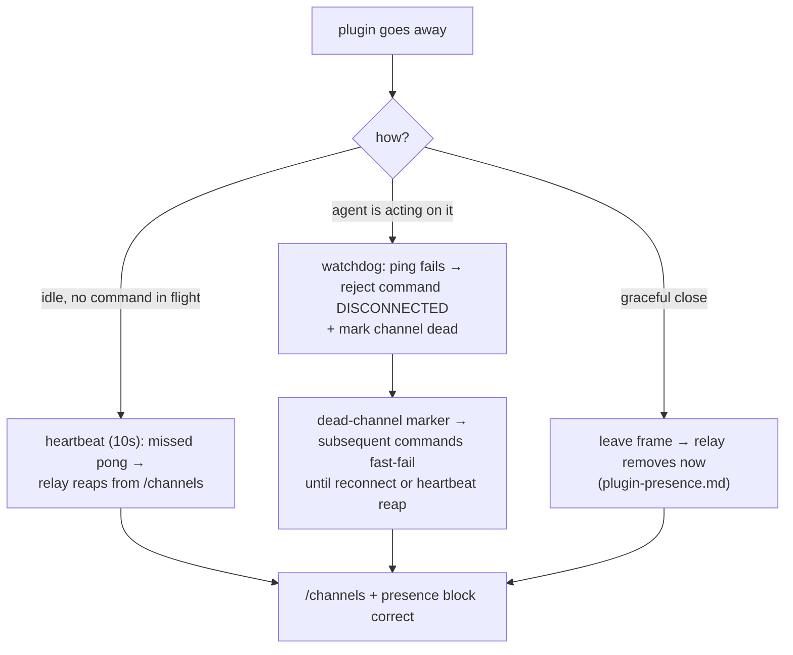

# Connection Liveness

> Governed by [[figma-bridge/docs/principles|the principles]]. This is **bridge** mechanism (**B1** —
> a reliable pipe that fails fast and honestly; **B3** — a command addressed to a file with no live
> plugin must fail loudly, never hang). It is a **best-effort** detection layer (**T7**): it makes a
> dead-plugin failure *fast and clear* rather than a 30-second hang, but the authoritative guard remains
> that a command to a dead file fails loudly. The availability registry and its heartbeat are owned by
> [[figma-bridge/docs/specs/overview|overview.md]]; the presence block and the `leave` frame by
> [[figma-bridge/docs/specs/plugin-presence|plugin-presence.md]]. This spec owns the **command-liveness
> watchdog**, the **app-level `ping`/`pong`**, and the **server-side dead-channel marker**, and it sets
> the heartbeat interval.

## Overview

A Figma plugin can die **silently** — a closed tab, a quit app, a crash, a dropped network — sending no
`leave` frame and no clean socket close (a "half-open" connection). Two bad things then happen until
something notices:

- **A command to that file hangs for the full ~30s command timeout**, because the server can't tell a
  *dead* plugin from a *slow-but-alive* one — so it waits out the timeout.
- **The file keeps showing as online** in the availability registry (and the presence block) until the
  heartbeat reaps it.

The core problem is that the server **conflates two questions**: *"is the plugin alive?"* (should be
cheap and fast) and *"has this — possibly slow — command finished?"* (legitimately slow: big scans,
exports). Connection Liveness separates them, across **three complementary layers**:

| Layer | Detects | Latency | Owner |
|---|---|---|---|
| **`leave` frame** | a **graceful** close (user closes the plugin) | instant | [[figma-bridge/docs/specs/plugin-presence|plugin-presence.md]] |
| **Command-liveness watchdog** | a plugin that **died while the agent is acting on it** | ~seconds | this spec |
| **Heartbeat** | an **idle** plugin that died (tab/quit/crash) and isn't being acted on | ~one interval | [[figma-bridge/docs/specs/overview|overview.md]] (interval set here) |

It is **best-effort (T7).** The watchdog shrinks the fire-on-dead-file hang from ~30s to a few seconds;
the shorter heartbeat shrinks the registry-staleness window. The ultimate guard is unchanged: a command
to a dead file fails **loudly** with `DISCONNECTED` — the feature's job is to make that failure *fast*.

## Scope

**Covers:** the command-liveness watchdog (server); the app-level `ping`/`pong` command answered in the
plugin UI; the server-side **dead-channel marker** that fast-fails subsequent commands; and the heartbeat
**interval** value.

**Does not cover:**
- **The heartbeat mechanism itself** (the ws-transport ping/pong, the `alive` reaper) — owned by
  [[figma-bridge/docs/specs/overview|overview.md]]; this spec only sets its interval.
- **The `leave` frame and the presence block** — owned by
  [[figma-bridge/docs/specs/plugin-presence|plugin-presence.md]]; this spec makes the `DISCONNECTED`
  they rely on prompt.
- **The `{error, code}` envelope / addressing** — owned by [[figma-bridge/docs/specs/overview|overview.md]]
  and [[figma-bridge/docs/specs/request-envelope|request-envelope.md]]; the watchdog rejects with the
  existing `DISCONNECTED` code.

## The command-liveness watchdog

Every command the agent fires carries its **full timeout** (the standard command timeout — long enough for
slow scans/exports). The watchdog runs **concurrently**, and only when needed:

- **Fast commands never trigger it.** A command that replies within a short **grace window** completes
  normally; the watchdog never starts. Zero overhead on the common path.
- **On a slow command, probe liveness — not the command.** If the grace window elapses with no reply, the
  server begins sending a lightweight **`ping`** (short timeout) on the same channel, **concurrently**
  with the still-pending real command:
  - **Pong received** → the plugin is **alive**; the command is merely slow → keep waiting (the real
    command's own timeout is untouched), and keep probing.
  - **Consecutive missed pongs** (a small threshold, to ignore a transient blip) → the plugin is
    **dead** → **reject the pending real command immediately with `DISCONNECTED`** (do not wait out its
    timeout) and set the **dead-channel marker** (below).

The grace window, ping interval, and missed-pong threshold are **tuning details** (traded against
false-kill risk vs. detection latency), not contract. The **invariants** are: (1) the real command's
timeout is never shortened; (2) a slow-but-alive command is kept alive by pongs; (3) a dead plugin fails
in *seconds*, not the full command timeout.

**Settle-once and teardown (invariant).** The pending real command settles **exactly once**: the
watchdog's `DISCONNECTED` reject and the real reply race the same pending entry, so whichever arrives
first wins and a late reply for an already-settled request is a no-op. When the real command settles — by
reply, reject, or its own timeout — the watchdog loop **and** any outstanding liveness-`ping` pending
entries are torn down.

**Why this beats the alternatives:** shortening the command timeout would break legitimately-slow
commands; a mandatory pre-flight ping would tax every command. Probing **only when a command is already
slow** is exactly when "slow vs. dead" is ambiguous — so the cost is paid only when it buys information.

## The app-level `ping` / `pong`

The watchdog needs a probe that a **dead** plugin fails but a **busy-but-alive** one answers. This forces
one load-bearing design choice.

### The main-thread vs. UI-iframe split (load-bearing)

The plugin is two separate JS contexts: the **main thread** runs `figma.*` and the actual commands; the
**UI iframe** holds the WebSocket. A command is "slow" precisely when the **main thread is busy** (e.g. a
large synchronous scan). Therefore:

- **The `ping` MUST be answered by the UI iframe, and MUST NOT be forwarded to the main thread.** The
  iframe's event loop stays free while the main thread is blocked, so a busy-but-alive plugin still pongs.
  A ping routed to the main thread (like every normal command) would time out during a slow command and
  **false-kill a live command mid-scan** — the exact trap this avoids.

### The command

- `ping` is a **bridge-internal command** (not an agent-facing tool — the same class as the
  `close_plugin` lifecycle command). It is a `command: 'ping'` inside a normal message frame — **not** a
  transport-level frame type, and distinct from both the removed legacy `Ping`/`Pong` *frames* and the
  server↔relay **port-discovery** probe (both referenced in
  [[figma-bridge/docs/specs/version-handshake|version-handshake.md]] /
  [[figma-bridge/docs/specs/overview|overview.md]]). Adding it to the command set is a **wire-surface
  change carried under the B2 handshake** (a minor bump): a pre-`ping` plugin is flagged **`INCOMPATIBLE`
  at connect**, so the watchdog never reaches it and never false-kills it for not answering a command it
  doesn't know.
- The server sends it through the normal request path (its own `requestId`, a short timeout), so its
  **pong resolves through the standard reply-correlation path** — no special server-side channel.
- The plugin's UI **intercepts `ping` on receipt and replies directly** with a minimal pong — the normal
  reply frame (`{ meta: { requestId }, result }`) echoing the ping's `requestId` — **before** the command
  would otherwise be forwarded to the main thread. The relay forwards the `ping` like any other command
  (it interprets nothing — **B1**); only the plugin UI treats it specially.

## The dead-channel marker

The watchdog detecting death must make **subsequent** commands fast-fail too, without re-probing — and
without waiting for the relay's heartbeat to reap the entry from `/channels`. The file gate re-reads
`/channels` each call (there is no availability cache), so the marker lives beside it.

- On a watchdog death, the server records the **dead instance's identity** — the `/channels` entry's
  **`connectedAt`** (a fresh value minted by every `register`/reconnect) — as **declared-dead**, and drops
  the file from its joined set. The **file gate** then returns **`DISCONNECTED`** for that file — the
  plugin *was* live and died (not `WRONG_FILE`, which is for a `fileKey` that was never available) —
  **only while the current `/channels` entry's `connectedAt` still matches the declared-dead value** (no
  auto-join, no re-probe). (`connectedAt` is a real `ChannelInfo`/`/channels` field the gate reads; the
  connection `epoch` is **not** — it rides only on frame `meta` — so the marker keys on `connectedAt`.)
- **Keyed on the instance's `connectedAt`, not the channel — this is load-bearing.** A saved file's
  channel id is deterministic (`file-<fileKey>`), so a reconnect reuses the **same** channel and
  overwrites the `/channels` entry **in place** — the entry never *disappears*, so a channel-string
  marker would stick and wrongly `DISCONNECTED` the healthy reopened plugin. A reconnect mints a fresh
  `connectedAt`, so the overwritten entry no longer matches the declared-dead value → the marker
  **self-clears the instant a fresher instance registers**. For an *idle* death with no reconnect, the
  entry is simply reaped by the heartbeat and the marker becomes moot.
- The server **does not tell the relay to reap.** The relay's heartbeat owns its own registry (clean
  layering — **B1**); the marker is purely the server's fast-fail bridge between *watchdog detection*
  (instant) and either *reconnect* (marker clears) or *heartbeat reap* (~one interval).

This is also what corrects the **presence block**: once the file is dropped from `/channels` (heartbeat)
the block stops listing it and surfaces it in `recently_offline`
([[figma-bridge/docs/specs/plugin-presence|plugin-presence.md]]); the shorter heartbeat makes that prompt
for idle files, and the marker makes it prompt for a file the agent just touched.

## Heartbeat interval

The availability-registry heartbeat (owned by [[figma-bridge/docs/specs/overview|overview.md]]) is a
**ws-transport** ping/pong answered by the socket layer — so it detects a silently-dead **idle** plugin
that the watchdog never probes (because no command was in flight). Its interval is set to **10 seconds**
(worst-case idle detection ≈ two missed ticks ≈ ~20s, down from ~60s). The cost is a tiny transport ping
per connection every 10s — negligible. This is the one lever that covers *idle* deaths uniformly, since
it needs nothing from the peer.

## How the three layers coordinate

- **Graceful close** → `leave` frame → instant.
- **Fire-on-dead-file** → watchdog → `DISCONNECTED` in seconds; the marker keeps it fast until the
  heartbeat reaps.
- **Idle death** → heartbeat (10s) → reaped within ~one to two intervals.

The layers are complementary, not redundant: the `leave` frame is prompt but only fires on a graceful
close; the watchdog is prompt but only for a file with a command in flight; the heartbeat covers
everything else but is the slowest. Together they make "the plugin is gone" reach the agent *fast* on
every path.

## Design constraints

Figma / architecture facts that shape this design:

- **The plugin is two JS contexts** — main thread (`figma.*`, the command handlers) and UI iframe (the
  WebSocket). A slow command blocks the main thread; the iframe stays responsive. This is *why* the
  `ping` must be answered by the UI iframe, not the main thread.
- **The relay is a dumb transport (B1).** It forwards `message` frames to channel members without
  interpreting the command — so the app-level `ping` rides through like any command; only the plugin UI
  and the server give it meaning.
- **The transport heartbeat is a separate mechanism** — the relay's ws-level `ping()`/`pong` is answered
  by the socket layer, independent of the plugin's JS, and detects idle deaths. The *app-level* `ping`
  (this spec) is a different thing: it proves the *plugin UI* is alive and is correlated by `requestId`.
- **Each command carries its own timeout** — the 30s default, with slow ops like `export` / large
  `create_tree` overriding to a larger value ([[figma-bridge/docs/specs/overview|overview.md]]). The
  watchdog preserves **whatever timeout the command carries** — it never shortens it — and adds no
  per-command tuning of its own.
- **A silently-dead peer sends nothing** — no `leave`, no clean close. The only way to detect it is a
  probe that times out (the watchdog's `ping`, or the heartbeat). Detection latency is therefore bounded
  below by the probe cadence — it cannot be zero.

## Limitations (honesty — T7)

- **Watchdog covers only in-flight commands.** A plugin that dies while the agent is *not* acting on it
  is caught by the heartbeat (~10–20s), not the watchdog. That is the intended division of labour.
- **An irreducible first-fire window.** The very first command after a silent death still waits the grace
  window plus a probe cycle before failing — a few seconds, not instant. There is no way to fail *before*
  probing a peer that looks connected.
- **Best-effort, not a guarantee.** The watchdog reduces the hang; it does not replace the loud
  `DISCONNECTED` that is the real guard. A pathological plugin that answers pings but never answers the
  real command would still ride its full command timeout — correctly, since by the ping it *is* alive.
