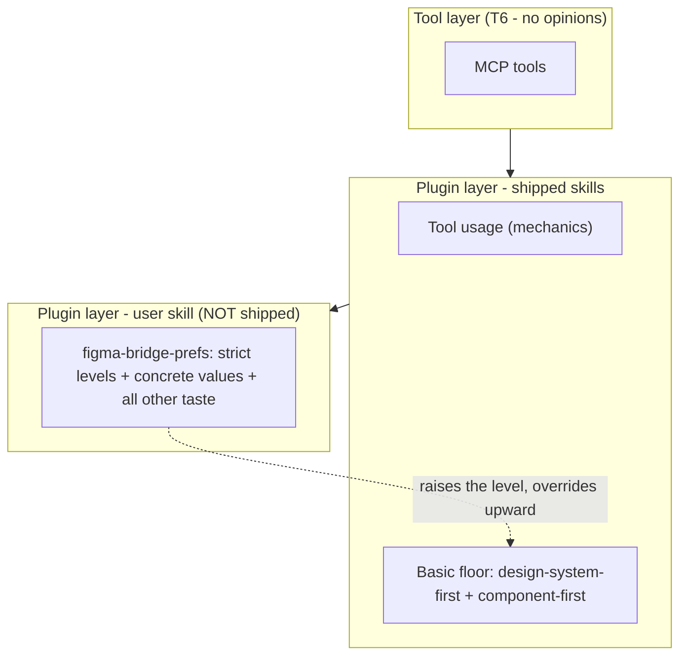

# User Customization Layer

> **Status:** design. Defines the user-authored **preference layer** that sits on top of the
> shipped plugin skills — the sanctioned home for taste, concrete values, and stricter-than-basic
> standards. Governs a **new user skill** (`figma-bridge-prefs`), a **shipped helper**
> (`figma-setup`), and a **shipped, inert template**. It changes no tool in
> [[figma-bridge/docs/specs/overview|overview.md]]; it partitions the *plugin* layer per
> [[figma-bridge/docs/principles|P1]].

## 1. Goal & non-goals

**Goal.** Give every user's — and every team's — durable Figma preferences a **single, owned,
editable home** that overrides the shipped skills where opinions legitimately differ, while the
shipped skills stay universal. A user who customizes nothing still gets a professional baseline;
a user who runs one helper gets their house style applied to both building **and** review.

**The partition (from [[figma-bridge/docs/principles|P1]]).** A shipped skill carries only
**tool usage** and a **basic level of the two universal professional practices**
(design-system-first, component-first). **Everything else is a preference** and lives in the
user skill `figma-bridge-prefs`: all concrete values, and any stricter-than-basic standard.

**Non-goals.**

- **No auto-seed / no install-time write.** Nothing is written into the user's config until they
  explicitly run the helper (see §6, §10). There is no `SessionStart` hook — this layer adds no
  hook at all.
- **No new tool.** This is a skills/template layer over the existing surface.
- **The dev/test instance** used to exercise this layer is not shipped and is out of scope here.

## 2. The layered model

**Three buckets, one discriminator.** Guidance is one of:

| Bucket | Home | Examples |
| --- | --- | --- |
| **Tool usage** | shipped `figma-design` | mechanics, exact call patterns, limits to route around |
| **Basic professional practice** | shipped `figma-design` | the *basic level* of design-system-first + component-first |
| **Preference** | `figma-bridge-prefs` (user skill) | all concrete values (tokens, scale, type ramp, naming), and the *strict level* of the two practices |

The discriminator for **why the two practices may ship a default at all** (and a brand colour or
spacing scale may not): **a preference ships a default only if it has a universally-defensible
floor.** Design-system-first and component-first do — a *mild* "prefer systematic design" baseline
no professional objects to. A brand colour or spacing scale has no universal default; any default
there imposes one team's taste on all, so it ships nothing. This is the P1 rule, applied.

## 3. The two levels

The same two practices appear in **both** layers at **different levels**. The shipped skill holds
the **basic** level (the floor a non-customizing user gets); the `figma-bridge-prefs` template
ships the **strict** level. Absent `figma-bridge-prefs`, the basic floor is the default; present,
it **raises the level** and supplies concrete values.

| | **Basic — shipped `figma-design`** (default when no prefs) | **Strict — `figma-bridge-prefs` template** (opt-in) |
| --- | --- | --- |
| **Design-system-first** | *Reactive:* if a design system exists, adopt & extend it; don't duplicate; use an existing token/style over a raw literal. Blank file → offer, don't impose. | *Proactive:* always establish tokens/styles first, even for a one-off; never place a raw value that could be a token; every value bound. |
| **Component-first** | Reuse an existing component before creating; a meaningfully repeated element *can* become a component. | Any element used ≥2× **must** be a component; prefer variants over duplicates; never detach; name by role. |

These are **defaults**, not hard floors — a user may tune them in any direction (e.g. relax
design-system-first for a throwaway mockup). The **hard, non-overridable** floor is separate
(§7): verification discipline, destructive-op safety, and accessibility minimums.

## 4. `figma-bridge-prefs` — the user skill (not shipped)

A single user-authored skill overlaying the shipped skills. It is **not shipped** — it lives in
the user's own skills directory (§8) and is the SSOT for that user's/team's preferences.

**Structure** (mirrors the repo's own `SKILL.md` + `references/` convention, so each shipped
skill loads only the concern it consumes):

- `SKILL.md` — thin: the precedence declaration (§7) + pointers to the references below.
- `references/house-style.md` — the strict levels of design-system-first / component-first, plus
  concrete values (tokens, spacing scale, type ramp, naming). Consumed by `figma-design`.
- `references/review-standards.md` — the house scale / token set / type ramp the reviewer checks
  against (§9). Consumed by `figma-reviewer`.
- `references/feedback-prefs.md` — how this user wants tool friction recorded. Consumed by
  `figma-feedback`.

`figma-connection` has no section — it is pure mechanics/safety and takes no preference overlay;
`figma-setup` (the helper) authors the overlay rather than receiving it. So `figma-bridge-prefs`
overlays the **three build-loop skills** — `figma-design`, `figma-reviewer`, `figma-feedback`.

## 5. `figma-setup` — the shipped helper

A lightweight, Figma-specific skill-creator shipped in the plugin
(`plugin/skills/figma-setup/`). It **authors and updates** `figma-bridge-prefs` — the user skill
is never written by any other path.

- **Instantiate on opt-in.** On the user's explicit request, it reads the shipped template (§6),
  writes `figma-bridge-prefs` to the chosen scope (§8), then tailors it by interview.
- **Fixed target name.** It always writes the skill named **`figma-bridge-prefs`** — the name is
  never taken from user input, so there is no path-traversal surface. (Any future name
  interpolation must validate `^[a-z][a-z0-9-]*$`, reject `..`/separators/absolute paths, and
  assert the resolved path stays under the intended skills directory.)
- **Owns updates** (§9), never clobbering user edits.

## 6. The template — shipped, inert, git-tracked

`plugin/skills/figma-setup/references/figma-bridge-prefs-template/` — a **shipped, git-tracked
template directory** mirroring the `figma-bridge-prefs` skill structure (§4): a thin skill file
plus `references/house-style.md`, `review-standards.md`, `feedback-prefs.md`. The skill file
ships as **`SKILL.md.tmpl`** (not `SKILL.md`) and `figma-setup` renames it to `SKILL.md` on copy —
so the template can **never** be globbed as a live shipped skill, whatever Claude Code's skill
discovery does. It is a **supporting asset** — never auto-loaded as a skill; inert until
`figma-setup` copies it wholesale into the user's skills directory. This is how good defaults ship without violating P1: taste ships only as
an opt-in template the user consciously adopts and then owns, never as active shipped-skill
guidance. The `template_version` (§9) lives in the template `SKILL.md` frontmatter.

**Content.** The **strict level** of design-system-first / component-first (§3) plus concrete
starter values (a spacing scale, a token set, a type ramp) — the user's editable starting point.

**Safety contract on the template.**

- **Additive / stricter-only.** The template may only *tighten* — add a scale, a stricter
  standard. It must **never** contain a directive that relaxes verification, destructive-op
  safety, or accessibility. A floor-preserving header states this.
- **Lint-gated in CI.** Valid frontmatter, size under a cap, and a check that it introduces no
  `skip`/`relax`/`disable` of verify/safety/a11y. Reviewed with the same rigor as a shipped skill.
- **Provenance stamped.** The instantiated file carries `seeded_by: figma-agent-bridge` and the
  `template_version` (§9), so it is identifiable for later update/repair and honest about origin.

## 7. Trigger & precedence

**Trigger — how `figma-bridge-prefs` reaches the build loop.** The shipped skills are consumed
inside the `figma-designer` / `figma-reviewer` subagents, where description-based co-discovery is
not guaranteed. So the load path is explicit, not incidental:

1. **Agent-def load (primary).** The `figma-designer` and `figma-reviewer` agent definitions load
   `figma-bridge-prefs` as a **first step**, and list the `Skill` invocation in their `tools:`
   whitelist so they *can*.
2. **Extension-point backstop.** Each shipped build-loop skill (`figma-design`, `figma-reviewer`,
   `figma-feedback`) ends with: *"If a skill named `figma-bridge-prefs` is in your available
   skills and not yet loaded, load it now; it raises the level of these defaults and supplies
   concrete values."* The check matches the **exact** name `figma-bridge-prefs` (never a
   substring — so it can never match the `figma-setup` helper). `figma-connection` carries no such
   line.
3. **Description co-fire (best-effort only).** `figma-bridge-prefs` may carry a description that
   co-fires on design/review intents, but nothing depends on it.

**Precedence — override upward, within a hard floor.**

- `figma-bridge-prefs` **wins on taste, policy, and defaults**: it raises the level of
  design-system-first / component-first and supplies the concrete values. Absent it, the shipped
  basic floor is the default.
- It **cannot cross the hard floor.** Verification discipline (export + read-back; never fabricate
  a read-back), destructive-op safety, and **accessibility minimums** are non-overridable. A
  customization may make a check **stricter**, never suppress it.
- **The reviewer is the enforcer**, not skill-prose ordering. `figma-reviewer` flags a
  contrast/verification violation regardless of what `figma-bridge-prefs` says. A WCAG finding may
  at most be **down-ranked** on an explicit, acknowledged override token in `figma-bridge-prefs` —
  it is **never skipped**, and the check always runs.

## 8. Scope & the shadowing guard

`figma-bridge-prefs` may live at **user scope** (`~/.claude/skills/figma-bridge-prefs/`, applies
across all the user's Figma work, per-machine) or **project scope**
(`<project>/.claude/skills/figma-bridge-prefs/`, git-committed, shareable with a team).

- **Default: user scope**, offered up front. The helper is **context-aware**: inside a git repo
  that already uses a design system, it *offers* project scope as well (a house style is a team
  artifact best shared via a committed skill).
- **Shadowing guard.** Claude Code resolves same-named skills **personal (user) > project**, so a
  user-scope `figma-bridge-prefs` **silently shadows** a project-scope one. Before writing a
  project-scope file, `figma-setup` **detects an existing user-scope `figma-bridge-prefs` and
  warns** ("a user-scope figma-bridge-prefs will shadow this project one") rather than producing a
  silent wrong result. Documented here so the interaction is never a surprise.

## 9. Updates & the contract version

The template evolves; an instantiated `figma-bridge-prefs` is the user's and diverges. `figma-setup`
owns the reconciliation:

- **`template_version` is a contract version**, not a cosmetic marker — it tracks the
  extension-point wording, the precedence semantics, and the section/keys the reviewer reads.
- On a later `figma-setup` run, it compares the file's `template_version` to the shipped one and
  **offers a diff / selective merge**. A **pristine** seed (byte-identical to its template, never
  edited) may be refreshed safely; an **edited** file is **never clobbered**.
- **Graceful degradation.** The reviewer treats an absent or unparseable `review-standards` as
  *"no house standard"* — it falls back to **internal consistency** (does the file use its own
  detected tokens/scale/ramp consistently?) plus the hard floor (WCAG, verification), **never** a
  shipped concrete scale (there is none). It never errors on a malformed or missing preference file.

## 10. Onboarding

There is **no auto-seed**. Instead:

- The shipped build-loop skills' extension-point line adds: *"if no `figma-bridge-prefs` exists,
  offer to run `figma-setup`."* — zero-config discovery, no filesystem side effects.
- The README documents `figma-setup` as the way to set house style.

## 11. Relationship to other specs

- **[[figma-bridge/docs/principles|principles.md P1]]** — the governing partition (tool
  usage + basic professional-practice floor ship; all else is a preference in the user skill).
  This spec is the mechanism; P1 is the rule. T6/T9 (tool layer) are unaffected.
- **[[figma-bridge/docs/specs/claude-plugin|claude-plugin.md]]** — catalogs `figma-setup` and the
  user preference layer in §6 (§6.1 states the basic floor; §6.7 points here as SSOT).
- **[[figma-bridge/docs/specs/feedback-system|feedback-system.md]]** — keeps opinion out of the
  neutral meta-tools (its Layer split, P1). This spec adds the further guard (§below) that a
  taste/preference correction routes to `figma-bridge-prefs`, never a shipped skill, and
  `figma-bridge-prefs` content **never** rides the feedback rail off-box.
- `figma-reviewer`'s `references/checks.md` ships **only the hard floor** (WCAG ratios,
  verification discipline, destructive-op safety) **and internal-consistency checks** (does the
  file use its own detected system consistently) — **not** a concrete house scale / token set /
  type ramp, which are preferences. `figma-bridge-prefs` `review-standards` supplies those when
  installed; absent it, the reviewer checks internal consistency plus the floor.

**Fold-back split (privacy + the maintenance guard).** The `figma-feedback` skill-correction /
fold-back loop is scoped to **shipped skills only**: a *mechanics* correction folds into the
shipped skill; a *taste / preference / default* correction routes to `figma-bridge-prefs` via
`figma-setup` and **never enters a shipped skill** (this is the guard that keeps one user's
opinions from accreting into the shipped skills over time). `figma-bridge-prefs` content is
**never quoted** into `record_feedback` / `send_feedback` — the feedback rail must not carry a
user's private house style / tokens / client conventions off the machine.

## 12. Acceptance criteria

- [ ] A user with no `figma-bridge-prefs` gets the **basic** design-system-first / component-first
      floor from `figma-design`, and nothing writes into their config.
- [ ] `figma-setup` instantiates `figma-bridge-prefs` from the template only on explicit request,
      at the chosen scope, and tailors it by interview.
- [ ] With `figma-bridge-prefs` present, `figma-designer` and `figma-reviewer` load it (agent-def
      step + exact-name backstop) and apply its strict levels + concrete values.
- [ ] `figma-bridge-prefs` **raises** design-system-first / component-first and supplies values,
      but cannot suppress verification, destructive-op safety, or a WCAG check; the reviewer still
      emits accessibility findings.
- [ ] The exact-name backstop matches `figma-bridge-prefs` and never `figma-setup`.
- [ ] `figma-setup` warns when a user-scope `figma-bridge-prefs` would shadow a project-scope one.
- [ ] The template passes the CI lint (valid frontmatter, size cap, no relax/skip of
      verify/safety/a11y) and carries provenance + `template_version`.
- [ ] `figma-bridge-prefs` content never appears in a `record_feedback` / `send_feedback` body.
- [ ] A missing or malformed `figma-bridge-prefs` degrades to shipped defaults, never an error.

## 13. Open items

- **Concrete starter values.** The exact spacing scale / token set / type ramp the template ships
  is a design task for the template itself (built with shipped-skill review rigor).
- **Description co-fire wording.** Whether `figma-bridge-prefs` carries a co-firing description
  (best-effort) or relies solely on the agent-def + backstop load is settled at authoring time;
  the load guarantee comes from the explicit paths (§7.1, §7.2), not the description.
