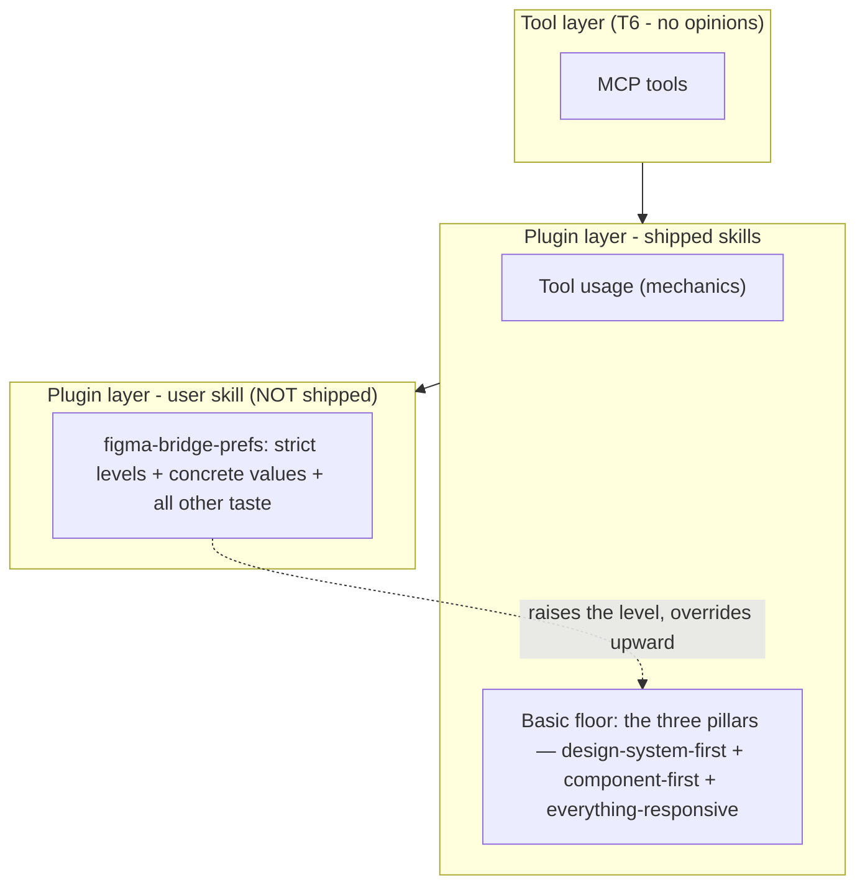

# User Customization Layer

> **Status:** design. Defines the user-authored **preference layer** that sits on top of the
> shipped plugin skills — the sanctioned home for taste, concrete values, and stricter-than-basic
> standards. Governs a **new user skill** (`figma-bridge-prefs`), the **customization half of the
> shipped helper** `figma-setup`, and a **shipped, inert template**. It changes no tool in
> [[figma-bridge/docs/specs/overview|overview.md]]; it partitions the _plugin_ layer per
> [[figma-bridge/docs/principles|P1]].

## 1. Goal & non-goals

**Goal.** Give every user's — and every team's — durable Figma preferences a **single, owned,
editable home** that overrides the shipped skills where opinions legitimately differ, while the
shipped skills stay universal. A user who customizes nothing still gets a professional baseline;
a user who spends one interview with `figma-setup` gets their house style applied to both building
**and** review.

**The partition (from [[figma-bridge/docs/principles|P1]]).** A shipped skill carries only
**tool usage** and a **basic level of the three universal professional practices — the pillars**
(design-system-first, component-first, everything-responsive). **Everything else is a preference** and lives in the
user skill `figma-bridge-prefs`: all concrete values, and any stricter-than-basic standard.

**Non-goals.**

- **No auto-seed of preferences.** No preference file is written into the user's skills directory
  until they explicitly ask for one (see §6, §10). There is no `SessionStart` hook — this layer adds
  no hook at all. (The helper that authors the overlay, `figma-setup`, is itself run by every user
  and does write outside the plugin directory, because it also materialises the Figma plugin payload
  — [[figma-bridge/docs/specs/claude-plugin|claude-plugin.md]] §5.1. That write carries no
  preferences and is out of scope here; see §5.)
- **No new tool.** This is a skills/template layer over the existing surface.
- **The dev/test instance** used to exercise this layer is not shipped. On a dev checkout it is a
  symlink onto the template, never a copy — §6 "Dev mode".

## 2. The layered model

**Three buckets, one discriminator.** Guidance is one of:

| Bucket                          | Home                              | Examples                                                                                            |
| ------------------------------- | --------------------------------- | --------------------------------------------------------------------------------------------------- |
| **Tool usage**                  | shipped `figma-design`            | mechanics, exact call patterns, limits to route around                                              |
| **Basic professional practice** | shipped `figma-design`            | the _basic level_ of the three pillars: design-system-first + component-first + everything-responsive |
| **Preference**                  | `figma-bridge-prefs` (user skill) | all concrete values (tokens, scale, type ramp, naming, breakpoints, icon grid), and the _strict level_ of the three pillars |

The discriminator for **why the three pillars may ship a default at all** (and a brand colour or
spacing scale may not): **a preference ships a default only if it has a universally-defensible
floor.** The three pillars do — a _mild_ "prefer systematic design / reuse / responsive" baseline
no professional objects to (everything-responsive's floor is directional too: masters hug,
text wraps, squeeze-check before done — no number in any of it). A brand colour or spacing scale has no universal default; any default
there imposes one team's taste on all, so it ships nothing. This is the P1 rule, applied. The
same test seems to admit accessibility — "text should be legible" is likewise
universally-defensible — yet a11y still ships nothing, because the pillars are
construction **discipline** (a directional "prefer systematic design" is actionable with no
number), whereas an accessibility check is **inert without a concrete threshold** (you cannot
flag contrast without a ratio), so it behaves like every other concrete value (tokens / scale /
ramp) and ships nothing, not like a process floor.

### 2.1 The layer law (2026-08-26)

The bucket table above, stated as law, with the fourth bucket named:

- The plugin skill carries **tool knowledge + the three pillars + the agent working
  contract** (the always-on obligations: verify, census, narrate).
- The prefs skill carries **preferences, numbers, and house taste**.
- **Patterns ship nowhere.** A design pattern — a card-header arrangement, a list-item
  layout, a separator convention — becomes a fixture line, a prefs entry, or dissolves
  into an existing rule. It never enters a shipped skill.

Three structural rules follow: one concern one skill, one fact one home (a second
statement becomes a pointer); a SKILL.md body carries only always-on content; every
reference earns a named load trigger. The audit that enforces all of this is the
`plugin-reviewer` skill (user-side), run after any batch of skill edits.

## 3. The two levels

The same three pillars appear in **both** layers at **different levels**. The shipped skill holds
the **basic** level (the floor a non-customizing user gets); the `figma-bridge-prefs` template
ships the **strict** level. Absent `figma-bridge-prefs`, the basic floor is the default; present,
it **raises the level** and supplies concrete values.

|                         | **Basic — shipped `figma-design`** (default when no prefs)                                                                                                   | **Strict — `figma-bridge-prefs` template** (opt-in)                                                                                      |
| ----------------------- | ------------------------------------------------------------------------------------------------------------------------------------------------------------ | ---------------------------------------------------------------------------------------------------------------------------------------- |
| **Design-system-first** | _Reactive:_ if a design system exists, adopt & extend it; don't duplicate; use an existing token/style over a raw literal. Blank file → offer, don't impose. | _Proactive:_ always establish tokens/styles first, even for a one-off; never place a raw value that could be a token; every value bound. |
| **Component-first**     | The four-question litmus (repeats / states / role-or-asset / screen-level block) decides component-or-frame; reuse before create; the census makes it run.    | _Everything placed on a page is an instance_; prefer variants over duplicates; never detach; name by role.                               |
| **Everything responsive** | Nothing FIXED without a reason; masters hug, instances fill; text wraps; floors on containers; squeeze-check before done.                                   | Every component survives any width; min/max contract required on text-bearing masters; house breakpoint widths and measure cap.          |

These are **defaults**, not hard floors — a user may tune them in any direction (e.g. relax
design-system-first for a throwaway mockup). The **hard, non-overridable** floor is separate
(§7): verification discipline and destructive-op safety. Accessibility is **not** in the floor —
it is a preference shipped as the template's WCAG AA default, so a user without `figma-bridge-prefs`
has no accessibility check at all.

## 4. `figma-bridge-prefs` — the user skill (not shipped)

A single user-authored skill overlaying the shipped skills. It is **not shipped** — it lives in
the user's own skills directory (§8) and is the SSOT for that user's/team's preferences.

**Structure** (mirrors the repo's own `SKILL.md` + `references/` convention, so each shipped
skill loads only the concern it consumes):

- `SKILL.md` — thin: the precedence declaration (§7) + pointers to the references below.
- `references/house-style.md` — the strict levels of the three pillars (design-system-first /
  component-first / everything-responsive), plus concrete values (tokens, spacing scale, type
  ramp, breakpoint widths, the icon grid, naming, file organization — the page scheme and where
  masters sit — and data display, how a delta or a status renders). Consumed by `figma-design`.
- `references/review-standards.md` — the house scale / token set / type ramp the reviewer checks
  against (§9). Consumed by `figma-reviewer`.

`figma-connection` (pure mechanics/safety) and `figma-feedback` take no preference overlay;
`figma-setup` (the helper) authors the overlay rather than receiving it. So `figma-bridge-prefs`
overlays the **two build-loop skills** — `figma-design` and `figma-reviewer`.

## 5. `figma-setup` — the shipped helper

A lightweight, Figma-specific skill-creator shipped in the plugin
(`plugin/skills/figma-setup/`). The skill carries **two responsibilities**, and **every user runs
it**: materialising the Figma plugin payload and reporting the manifest path to import — a mandatory
install step, specced in [[figma-bridge/docs/specs/claude-plugin|claude-plugin.md]] §5.1 — and the
one this spec owns, below. The two are independent: the payload half carries no preferences, and
running the helper to install the Figma plugin seeds nothing.

**The customization half.** It **authors and updates** `figma-bridge-prefs` — the user skill is never
written by any other path — and stays **opt-in**: a user may run the helper, get the Figma plugin
installed, and customize nothing.

- **Instantiate on opt-in.** On the user's explicit request, it reads the shipped template (§6),
  writes `figma-bridge-prefs` to the chosen scope (§8), then tailors it by interview.
- **Fixed target name.** It always writes the skill named **`figma-bridge-prefs`** — the name is
  never taken from user input, so there is no path-traversal surface. (Any future name
  interpolation must validate `^[a-z][a-z0-9-]*$`, reject `..`/separators/absolute paths, and
  assert the resolved path stays under the intended skills directory.)
- **Owns updates** (§9), never clobbering user edits.

## 6. The template — shipped, inert, git-tracked

`plugin/skills/figma-setup/references/figma-bridge-prefs-template/` — a **shipped, git-tracked
template directory** mirroring the `figma-bridge-prefs` skill structure (§4): a thin skill file
plus `references/house-style.md` and `review-standards.md`. The skill file
ships as **`SKILL.md.tmpl`** (not `SKILL.md`) and `figma-setup` renames it to `SKILL.md` on copy —
so the template can **never** be globbed as a live shipped skill, whatever Claude Code's skill
discovery does. It is a **supporting asset** — never auto-loaded as a skill; inert until
`figma-setup` copies it wholesale into the user's skills directory. This is how good defaults ship without violating P1: taste ships only as
an opt-in template the user consciously adopts and then owns, never as active shipped-skill
guidance. The `template_version` (§9) lives in the template `SKILL.md` frontmatter.

**Content.** The **strict level** of design-system-first / component-first (§3) plus concrete
starter values (a spacing scale, a token set, a type ramp) — the user's editable starting point.

**Dev mode — the instance is a symlink.** A real user gets a **copy** on the initial install and
owns it from that moment (§5, §9). A dev checkout inverts this: the local `figma-bridge-prefs` is a
real directory holding **entry-level symlinks onto this template** (`SKILL.md → SKILL.md.tmpl`,
`references → references/`), never a copy. Editing the template IS testing it — the dev machine
always runs the latest example, and the example is exactly what users install. Two consequences:

- Every local prefs edit on a dev checkout is a **shipped-example edit**. The template carries no
  user-specific provenance, no temporary markers, and no personal values — only defensible defaults
  an installing user would accept as-is.
- `figma-setup` must never copy, tailor, or update over a symlinked instance — the symlink marks a
  dev checkout, and a wholesale copy would write **through** the link into the template itself (the
  guard lives in figma-setup Part 2).

A directory-level symlink is impossible by design: the template ships `SKILL.md.tmpl` precisely so
it can never be globbed as a live skill, which is why dev mode links the two entries individually.
`install:local --dev` is the sanctioned way to create or repair the links (dev-ops.md §3.6); it
also removes a user-scope duplicate that would shadow them, and it never touches a divergent copy.

**Safety contract on the template.**

- **Additive / stricter-only.** The template may only _tighten_ — add a scale, a stricter
  standard. It must **never** contain a directive that relaxes verification or destructive-op
  safety. A floor-preserving header states this. (It **does** set accessibility thresholds — those
  are a preference, shipped as the WCAG AA default the user then edits.)
- **Lint-gated in CI.** Valid frontmatter, size under a cap, and a check that it introduces no
  `skip`/`relax`/`disable` of verify/safety. The lint intentionally **no longer scans the
  accessibility thresholds** (they are a preference, not a floor); the shipped a11y default is
  instead guaranteed by shipped-skill review rigor plus a positive lint assertion that the
  template still ships its WCAG AA default. Reviewed with the same rigor as a shipped skill.
- **Provenance stamped.** The instantiated file carries `seeded_by: figma-agent-bridge` and the
  `template_version` (§9), so it is identifiable for later update/repair and honest about origin.

## 7. Trigger & precedence

**Trigger — how `figma-bridge-prefs` reaches the build loop.** The shipped skills are consumed
inside the `figma-designer` / `figma-reviewer` subagents, where description-based co-discovery is
not guaranteed. So the load path is explicit, not incidental:

1. **Agent-def load (primary).** The `figma-designer` and `figma-reviewer` agent definitions load
   `figma-bridge-prefs` as a **first step**, then **read its `references/house-style.md` /
   `review-standards.md`** for the concrete values. Both `Skill` (to load the skill) and `Read`
   (to open its references — these agents are otherwise MCP-only, so without `Read` the overlay's
   references are unreachable) are in their `tools:` whitelist so they _can_.
2. **Extension-point backstop.** Each shipped build-loop skill that consumes an overlay
   (`figma-design`, `figma-reviewer`) ends with: _"If a skill named `figma-bridge-prefs` is in
   your available skills and not yet loaded, load it now; it raises the level of these defaults
   and supplies concrete values."_ The check matches the **exact** name `figma-bridge-prefs`
   (never a substring — so it can never match the `figma-setup` helper). `figma-connection` and
   `figma-feedback` carry no such line.
3. **Description co-fire (best-effort only).** `figma-bridge-prefs` may carry a description that
   co-fires on design/review intents, but nothing depends on it.

**Precedence — override upward, within a hard floor.**

- `figma-bridge-prefs` **wins on taste, policy, and defaults**: it raises the level of
  design-system-first / component-first, supplies the concrete values, **and sets the accessibility
  thresholds** (the template ships WCAG AA as the default). Absent it, the shipped basic floor is
  the default and accessibility is **unchecked**.
- It **cannot cross the hard floor.** Verification discipline (export + read-back; never fabricate
  a read-back) and destructive-op safety are non-overridable. A customization may make any other
  check **stricter**, never suppress the floor. Accessibility is **not** in this floor — it is a
  preference the user sets, so with no prefs there is no accessibility check to suppress.
- **The reviewer is the enforcer** of the floor, not skill-prose ordering. `figma-reviewer` flags a
  verification / destructive-op violation regardless of what `figma-bridge-prefs` says. Accessibility
  it checks against the **loaded `figma-bridge-prefs` thresholds** (WCAG AA by the template default);
  with no prefs it asserts no threshold and the dimension is unchecked.

## 8. Scope & the shadowing guard

`figma-bridge-prefs` may live at **user scope** (`~/.claude/skills/figma-bridge-prefs/`, applies
across all the user's Figma work, per-machine) or **project scope**
(`<project>/.claude/skills/figma-bridge-prefs/`, git-committed, shareable with a team).

- **Default: user scope**, offered up front. The helper is **context-aware**: inside a git repo
  that already uses a design system, it _offers_ project scope as well (a house style is a team
  artifact best shared via a committed skill).
- **Shadowing guard (bidirectional).** Claude Code resolves same-named skills **personal (user) >
  project**, so a user-scope `figma-bridge-prefs` **silently shadows** a project-scope one.
  `figma-setup` guards **both** write directions rather than producing a silent wrong result:
  before writing a **project**-scope file it detects an existing user-scope `figma-bridge-prefs`
  and warns ("a user-scope figma-bridge-prefs will shadow this project one"); before writing a
  **user**-scope file (the default) it detects an existing project-scope
  `<repo>/.claude/skills/figma-bridge-prefs/` in the current git repo and warns ("a user-scope
  figma-bridge-prefs will shadow this project's committed one"). Documented here so the
  interaction is never a surprise.

## 9. Updates & the contract version

The template evolves; an instantiated `figma-bridge-prefs` is the user's and diverges. `figma-setup`
owns the reconciliation:

- **`template_version` is a contract version**, not a cosmetic marker — it tracks the
  extension-point wording, the precedence semantics, and the section/keys the reviewer reads.
- On a later `figma-setup` run, it compares the file's `template_version` to the shipped one and
  **offers a diff / selective merge**. A **pristine** seed (byte-identical to its template, never
  edited) may be refreshed safely; an **edited** file is **never clobbered**.
- **Graceful degradation.** The reviewer treats an absent or unparseable `review-standards` as
  _"no house standard"_ — it falls back to **internal consistency** (does the file use its own
  detected tokens/scale/ramp consistently?) plus the hard floor (verification, destructive-op
  safety), **never** a shipped concrete scale (there is none). Accessibility is **unchecked** in
  that state (its thresholds live in `review-standards`). It never errors on a malformed or missing
  preference file.

## 10. Onboarding

Every user already meets `figma-setup` while installing, since it is what materialises the Figma
plugin payload (§5). That encounter seeds **no preferences** — there is **no auto-seed**. Instead:

- The shipped build-loop skills' extension-point line adds: _"if no `figma-bridge-prefs` exists,
  offer to run `figma-setup`."_ — zero-config discovery, no preference written.
- The README documents `figma-setup` — the helper the user has already run to install the Figma
  plugin — as the way to set house style too.

## 11. Relationship to other specs

- **[[figma-bridge/docs/principles|principles.md P1]]** — the governing partition (tool
  usage + basic professional-practice floor ship; all else is a preference in the user skill).
  This spec is the mechanism; P1 is the rule. T6/T9 (tool layer) are unaffected.
- **[[figma-bridge/docs/specs/claude-plugin|claude-plugin.md]]** — catalogs `figma-setup` and the
  user preference layer in §6 (§6.1 states the basic floor; §6.7 points here as SSOT), and owns
  `figma-setup`'s other, mandatory half — materialising the Figma plugin payload (§5.1).
- **[[figma-bridge/docs/specs/feedback-system|feedback-system.md]]** — keeps opinion out of the
  neutral meta-tools (its Layer split, P1). This spec adds the further guard (see Fold-back split, below) that a
  taste/preference correction routes to `figma-bridge-prefs`, never a shipped skill, and
  `figma-bridge-prefs` content **never** rides the feedback rail off-box.
- `figma-reviewer`'s `references/checks.md` ships **only the hard floor** (verification discipline,
  destructive-op safety) **and internal-consistency checks** (does the file use its own detected
  system consistently), plus the accessibility _how-to_ (the contrast-ratio formula) — **not** a
  concrete house scale / token set / type ramp / naming rule, **nor the accessibility thresholds**,
  which are preferences. `figma-bridge-prefs` `review-standards` supplies those (including the WCAG
  AA accessibility default) when installed; absent it, the reviewer checks internal consistency plus
  the floor, and accessibility is unchecked.

**Fold-back split (privacy + the maintenance guard).** The `figma-feedback` skill-correction /
fold-back loop is scoped to **shipped skills only**: a _mechanics_ correction folds into the
shipped skill; a _taste / preference / default_ correction routes to `figma-bridge-prefs` via
`figma-setup` and **never enters a shipped skill** (this is the guard that keeps one user's
opinions from accreting into the shipped skills over time). `figma-bridge-prefs` content is
**never quoted** into `record_feedback` / `send_feedback` — the feedback rail must not carry a
user's private house style / tokens / client conventions off the machine.

## 12. Acceptance criteria

- [ ] A user with no `figma-bridge-prefs` gets the **basic** design-system-first / component-first
      floor from `figma-design`, and no preference file exists in their skills directory — including
      after running `figma-setup` for the Figma plugin install and declining to customize.
- [ ] `figma-setup` instantiates `figma-bridge-prefs` from the template only on explicit request,
      at the chosen scope, and tailors it by interview.
- [ ] With `figma-bridge-prefs` present, `figma-designer` and `figma-reviewer` load it (agent-def
      step + exact-name backstop) and apply its strict levels + concrete values.
- [ ] `figma-bridge-prefs` **raises** design-system-first / component-first and supplies values
      (including the accessibility thresholds), but cannot suppress verification or destructive-op
      safety; the reviewer still emits those findings.
- [ ] A user with **no** `figma-bridge-prefs` has accessibility **unchecked** — the reviewer asserts
      no contrast / touch-target / text-size threshold — while the template ships WCAG AA as the
      default the user adopts.
- [ ] The exact-name backstop matches `figma-bridge-prefs` and never `figma-setup`.
- [ ] `figma-setup` warns when a user-scope `figma-bridge-prefs` would shadow a project-scope one.
- [ ] The template passes the CI lint (valid frontmatter, size cap, no relax/skip of
      verify/safety) and carries provenance + `template_version`.
- [ ] `figma-bridge-prefs` content never appears in a `record_feedback` / `send_feedback` body.
- [ ] A missing or malformed `figma-bridge-prefs` degrades to shipped defaults, never an error.

## 13. Open items

- **Concrete starter values.** The exact spacing scale / token set / type ramp the template ships
  is a design task for the template itself (built with shipped-skill review rigor).
- **Trigger reliability (settled).** The load guarantee is the **explicit** agent-def load +
  backstop (§7, paths 1–2); the `figma-bridge-prefs` description co-fire (§7, path 3) is a
  supplementary best-effort. The agents carry `Read` so the read-the-reference step in paths 1–2
  actually completes — without it the overlay's `references/*.md` would be unreachable.
