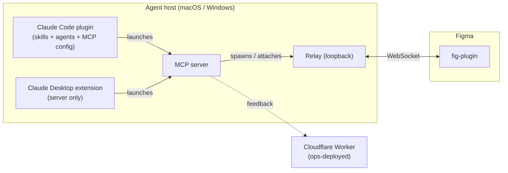

# Dev-Ops Workflow

**What this governs:** how a change becomes a **published, version-locked release** across the
project's user-facing products, and the gates it must pass on the way. It is the single source of
truth for the **distribution model, versioning, the verify gates, the release pipeline, and the git
model**.

**What it does not govern:** the _creative_ inner loop (idea → brainstorm → spec → plan →
implement) — that is individual working process. Runtime observability of end-user installs is also
out of scope.

**Governing documents:** `docs/principles.md` (B2 wire-compat, T-series surface obligations),
`docs/specs/version-handshake.md` (major.minor compatibility), `docs/live-verification.md`
(the live plugin gate), `docs/specs/overview.md` (connection lifecycle).

---

## 1. The hybrid model

Development is **local-first**; GitHub is the **integration, release, and distribution hub**.

- **Local-first day-to-day.** Work happens in isolated worktrees, merges land on the integration
  branch locally, and the verify gate runs on the developer's machine. No cloud round-trip is
  required to make progress.
- **GitHub as the hub.** The repository is published so users install from it. Tags cut releases;
  the verify gate runs in cloud CI on shared branches; merges to those branches are gated by it.

---

## 2. Artifacts & topology

Three user-facing products plus one ops-deployed service, all built from one repository and carrying
the **same version** (§6).

| Product                                    | Contents                                             | Runtime    |
| ------------------------------------------ | ---------------------------------------------------- | ---------- |
| **Agent-side package** _(two forms)_       | see below                                            | —          |
| **fig-plugin**                             | the Figma plugin                                     | Figma      |
| **server + relay**                         | a Bun program; the server owns the relay's lifecycle | Bun        |
| **feedback worker** _(not user-installed)_ | edge worker                                          | Cloudflare |

The **agent-side package** ships in two forms, because the agent hosts are different systems with no
shared plugin artifact:

| Host               | Form                        | Carries                                                                     |
| ------------------ | --------------------------- | --------------------------------------------------------------------------- |
| **Claude Code**    | repo **marketplace plugin** | skills + agents + commands + the MCP configuration that launches the server |
| **Claude Desktop** | **extension bundle**        | the server only — no skills/agents/commands                                 |

Both wrap the **identical server + relay**; only the wrapper differs.

**The server owns the relay.** The server ensures exactly one relay is running: it spawns a relay
when the port is free and attaches to the existing one otherwise. Installing "the server" therefore
yields server **and** relay — there is no separate relay install. The relay **binds a loopback
address by default**; the bind host is configurable for development, but under Claude Desktop it must
remain loopback — the host blocks Desktop-spawned processes from connecting to private-range LAN
addresses, while loopback is unrestricted.

---

## 3. Distribution & install routes

### 3.1 One runtime (Bun); a compiled binary for the packaged routes

The server + relay run on **Bun** — the same runtime used in development and testing, so there is no
dev/prod runtime divergence and the test suite exercises the shipped runtime. How Bun reaches a
user's machine depends on the route:

- **The packaged routes** (Claude Code, Claude Desktop, Figma) deliver a **self-contained
  Bun-compiled binary** — one file, nothing to install. It is cross-compiled per platform (macOS and
  Windows) from a single build. The Claude Code plugin fetches the matching binary from the release
  on first run; the Claude Desktop extension bundles it; the Figma route hands the user the download.
- **The manual route** clones the repository and **runs from source under Bun** — a developer
  cloning the repo already has, or readily installs, Bun.

Either way the server owns a loopback-bound relay (§2).

### 3.2 Install routes

There are three entry points. **No single artifact is self-sufficient** — every working install
needs the fig-plugin in Figma, the server+relay on the machine, and the agent-side package in the
agent. Whichever door a user enters bootstraps the other two, all pinned to the same version.

| Route                   | User installs                | Server + relay arrive via                                                | fig-plugin arrives via                                |
| ----------------------- | ---------------------------- | ------------------------------------------------------------------------ | ----------------------------------------------------- |
| **1a · Claude Code**    | the marketplace plugin       | the plugin fetches the matching Bun binary from the release on first run | the plugin's setup command links to the Figma install |
| **1b · Claude Desktop** | the extension bundle         | a self-contained Bun binary bundled in the extension                     | the extension's onboarding links to the Figma install |
| **2 · Figma**           | the fig-plugin (Org publish) | the plugin directs the user to the self-contained Bun binary             | _(already installed)_                                 |
| **3 · Manual**          | clones the repo              | runs from source under Bun                                               | dev-imports the plugin                                |

- **Claude Code.** The repository provides a marketplace manifest listing the plugin; the plugin
  carries its skills, agents, commands, and an MCP configuration. On first run the plugin fetches the
  matching self-contained Bun binary from the release (checksum-verified) into a persistent
  per-plugin location and launches it — the developer needs no toolchain.
- **Claude Desktop.** An extension bundle carrying a manifest and the **self-contained Bun binary**,
  installed by double-click, drag-into-settings, or the extensions panel; the binary runs directly
  with no toolchain. The manifest declares any install-time configuration, surfaced as a settings
  UI. Self-hosted bundles require no signing or review; only a listing in the host's directory
  would.
- **fig-plugin.** The plugin reads the Figma file key through a **private Figma API**, which Figma
  permits only for private / Organization plugins. It is therefore **published privately to the
  Figma Organization**: one-click install into members' menu, no review, no dev-mode. Public Figma
  Community distribution is deferred; see `docs/deferred-capabilities.md` (Distribution &
  publishing) for the plan to keep the file-key contract while self-generating its value.

### 3.3 Platform & identity constraints

- **Claude Desktop supports macOS and Windows only** (no Linux); the binary is compiled for those
  two platforms.
- The relay binds **loopback** (see §2).
- The version-matched triplet is guaranteed by coordinated releases (§7) plus the runtime
  handshake (§6), not by an install-time version selector.

---

## 4. Verify gates

A change is **green** only when it passes the gate. The gate is enforced on two surfaces: **locally**
on every change, and in the **cloud** on shared branches.

### 4.1 The headless gate

Lint, type-check, and the test suite must pass. The test suite drives a **mock plugin over the real
relay**, so it validates all transport and handler mechanics without a GUI. It runs through the
project's own toolchain — never an external package resolver, which pulls a different formatter and
produces phantom lint failures.

### 4.2 The live-plugin gate

Plugin-side changes **must be live-verified** against real Figma before they are green. The headless
mock cannot exercise the Figma runtime — apply ordering, strict validation, and connection lifecycle
only surface live. This gate is manual and GUI-bound (see `docs/live-verification.md`).

### 4.3 Cloud CI

The **headless gate** runs in cloud CI on push and pull request, distinct from the release pipeline.
The **live-plugin gate cannot run in cloud CI** (no GUI), so it remains a local, human-performed step
and is never a cloud-CI job.

---

## 5. Git model

- **Branches.** An integration branch, a stable/release branch, and feature branches; isolated work
  uses worktrees.
- **Merges.** Feature branches merge with a non-fast-forward, `merge:`-prefixed commit, preserving a
  legible topology.
- **Commits.** Conventional Commits with scopes discovered from history; commits are created only
  with **explicit human approval**.
- **Push.** The **human performs all pushes**; automation never pushes to origin. Merges to shared
  branches are gated by a passing verify gate, via pull request.

---

## 6. Versioning

### 6.1 Single version-of-record

There is **one authoritative version**. A release **stamps** it into every artifact's own version
field, so a release is a single number across all three products; per-artifact versions are derived
by the stamp, never edited independently.

### 6.2 Semver & the handshake

Semantic versioning applies. Per principle **B2**, a **breaking wire change bumps the minor**;
patch differences are always compatible. At connect time the plugin and server compare
**major.minor only** (`docs/specs/version-handshake.md`); a mismatch is refused. Matched-build pairs
— the normal case, since all products ship together — always agree.

### 6.3 Tags & the install-time limitation

Releases are tagged; the marketplace additionally pins by a per-plugin tag. Installation fetches the
**latest** matching tag — there is no install-time selector for a specific version. "Exact same
version across the triplet" is therefore guaranteed by **releasing all three products together**
(§7) and enforced at runtime by the **handshake** (§6.2), not by pinning at install.

---

## 7. Release

A release is triggered by the human pushing a release tag. The release pipeline:

1. **Install** dependencies reproducibly from the committed lockfile.
2. **Gate** — run the headless gate (§4.1). A failing gate aborts the release; nothing is published
   on red.
3. **Stamp** the single version-of-record into every artifact (§6.1).
4. **Build** the Bun binary (macOS and Windows) and package the three products.
5. **Changelog** — generate release notes from the Conventional Commits since the previous tag.
6. **Publish** a release carrying the artifacts and the changelog, and publish the fig-plugin to the
   Figma Organization.

---

## 8. Local install-and-test

The whole triplet can be **built and installed on the developer's own machine** to exercise the real
install routes (§3) before a release. This path builds all three products, installs or refreshes the
agent-side package — with its skills and agents — into the local agent environment, prepares the
fig-plugin for import, starts the server + relay, and verifies a round-trip. It complements the fast
per-change plugin reload loop used during development.

---

## See also

- `docs/principles.md` — B2 (wire compatibility), T-series (surface obligations)
- `docs/specs/version-handshake.md` — major.minor compatibility check
- `docs/specs/overview.md` — connection lifecycle, per-file channels
- `docs/live-verification.md` — the live plugin gate
- `docs/deferred-capabilities.md` — public Figma Community distribution (deferred)
