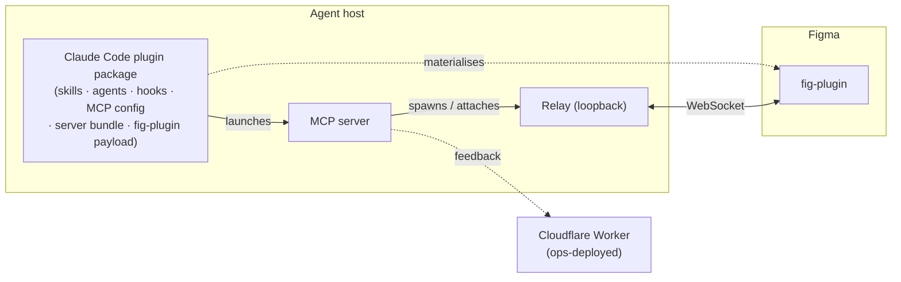

# Dev-Ops Workflow

**What this governs:** how a change becomes a **published, version-locked release** across the
project's user-facing products, and the gates it must pass on the way. It is the single source of
truth for the **distribution model, versioning, the verify gates, the release pipeline, and the git
model**.

**What it does not govern:** the _creative_ inner loop (idea → brainstorm → spec → plan →
implement) — that is individual working process. Runtime observability of end-user installs is also
out of scope.

**Governing documents:** `docs/principles.md` (B2 wire-compat, T-series surface obligations),
`docs/specs/claude-plugin.md` (the plugin package — what it contains and how it is delivered),
`docs/specs/version-handshake.md` (major.minor compatibility), `docs/live-verification.md`
(the live plugin gate), `docs/specs/overview.md` (connection lifecycle).

---

## 1. The hybrid model

Development is **local-first**; GitHub is the **integration and release hub**, and a release
publishes outward from it.

- **Local-first day-to-day.** Work happens in isolated worktrees, merges land on the integration
  branch — made locally and pushed, or by pull request — and the verify gate runs on the developer's
  machine. No cloud round-trip is required to make progress.
- **GitHub as the hub.** The repository is published: it carries the marketplace a user adds, and
  **merging a release pull request** — the ordinary path (§5) — cuts the release that pushes the
  built artifacts to where each is consumed: the plugin package to **npm**, the fig-plugin archive
  to the release itself (§7). The verify gate runs in cloud CI on every push and pull request to the
  shared branches; what protects a **release** is that the release pipeline runs the gate again, on
  the merged result, before it publishes (§7).

---

## 2. Artifacts & topology

Three user-facing products plus one ops-deployed service, all built from one repository and carrying
the **same version** (§6).

| Product                                    | Contents                                                                                     | Runtime    |
| ------------------------------------------ | -------------------------------------------------------------------------------------------- | ---------- |
| **Agent-side package**                     | skills + agents + hooks + the MCP configuration + the server bundle + the fig-plugin payload | —          |
| **fig-plugin**                             | the Figma plugin                                                                             | Figma      |
| **server + relay**                         | a Bun program; the server owns the relay's lifecycle                                         | Bun        |
| **feedback worker** _(not user-installed)_ | edge worker                                                                                  | Cloudflare |

The **agent-side package** is the plugin package the Claude Code host installs. It wraps the
**server + relay** and carries the knowledge layer — skills, agents, and hooks — along with it, which
is why the plugin route is the primary one (§3.2).

The plugin package is also the **fig-plugin's delivery vehicle**: it carries the built Figma plugin
payload, which the `figma-setup` skill materialises at a stable, user-owned path for import into
Figma. What the package contains, how a host resolves and copies it, and where the payload lands are
specified in full by `docs/specs/claude-plugin.md`; this spec covers the distribution, versioning,
and release view of the same package.

**The server owns the relay.** The server ensures exactly one relay is running: it spawns a relay
when the port is free and attaches to the existing one otherwise. Installing "the server" therefore
yields server **and** relay — there is no separate relay install. The relay **binds a loopback
address by default**; the bind host is configurable for development, but inside the Claude Desktop
app it must remain loopback — the app blocks the processes it spawns from connecting to private-range
LAN addresses, while loopback is unrestricted.

---

## 3. Distribution & install routes

### 3.1 One runtime (Bun) on every route

The server + relay run on **Bun** — the same runtime used in development and testing, so there is no
dev/prod runtime divergence and the test suite exercises the shipped runtime. **Every route runs the
server under the user's own Bun**; only how the server's code reaches that runtime differs (§3.2):

- **R1 · Claude Code plugin** — the server arrives **inside the published plugin package** as a
  deps-inlined Bun JS bundle, built at release and run with `bun`.
- **R2 · Manual / from source** — the server runs from source.
- **R3 · Standalone MCP server** — the published package's `bin` entry runs under **Bun's own
  package runner** (`bunx`); the bundle is built `--target=bun`, so a Node-based runner cannot
  execute it.

**Bun is therefore a prerequisite of every route**, and it must be on the PATH **before the agent
host starts** (§3.9). The trade-off is deliberate: **there is no toolchain-free route**, so a user
who will not install a runtime cannot run the product. One runtime everywhere is the boundary the
project chooses — it keeps a single shipped server, exercised by the same test suite, on every route.

On every route the server owns a loopback-bound relay (§2).

### 3.2 Install routes at a glance

**No single artifact is self-sufficient.** Every working install needs **three legs**: the
**fig-plugin** in Figma, the **server + relay** on the machine, and the **agent-side package** in the
agent host. A **route** is how the agent side and the server arrive; the **Figma leg** is
cross-cutting and enumerated separately (§3.8). Every route takes exactly one Figma-leg option, and
all three legs carry the same version (§6).

**Figma desktop is a prerequisite of every route.** The fig-plugin reaches Figma by **manifest
import** (§3.8), and manifest import exists **only in the Figma desktop app** — Figma in the browser
cannot import one. The per-route column below therefore lists **toolchain** prerequisites only;
Figma desktop is assumed on all of them, and any per-route list reproduced elsewhere must carry it.

| Route                                   | Who it is for                                                                | What they install                                                                              | How the server arrives                                                          | Toolchain prerequisites                                    | Figma leg |
| --------------------------------------- | ---------------------------------------------------------------------------- | ------------------------------------------------------------------------------------------------ | ----------------------------------------------------------------------------------- | ------------------------------------------------------------ | --------- |
| **R1 · Claude Code plugin** _(primary)_ | anyone driving Figma from Claude Code — CLI or the desktop app's Code surface | the marketplace plugin: server bundle + 5 skills + 2 agents + 5 hooks + the fig-plugin payload | inside the published package, as a Bun JS bundle launched with the user's `bun` | Bun (before the host starts), npm (install time only), git | **F1**    |
| **R2 · Manual / from source**           | contributors working on the project itself                                   | a clone of the repository                                                                     | run from source under Bun                                                       | Bun, git                                                   | **F3**    |
| **R3 · Standalone MCP server**          | an MCP client that is not Claude Code, or a hand-wired Claude Code entry      | the server alone — **the raw tool surface**                                                   | the published package's `bin` entry, launched by Bun's package runner           | Bun (it provides the package runner)                       | **F2**    |

Two further routes exist for **development only** (§3.6) and are not user routes; what the project
deliberately does **not** offer is enumerated in §3.7 so the boundary is explicit.

### 3.3 R1 · Claude Code plugin — the primary route

**Audience.** Anyone driving Figma from Claude Code, on the CLI or on the desktop app's Code surface.

**It delivers everything:** the server bundle, the **five skills**, the **two agents**, the **five
hooks**, and the **fig-plugin payload**. One install puts every agent-side piece in place, and it is
the only route that carries the knowledge layer — which is what makes it primary.

**What to obtain — one artifact, nothing downloaded by hand.** R1 is the only route whose Figma leg
needs no separate download: the host fetches the plugin package, and the fig-plugin payload rides
inside it (**F1** — §3.8). The two legs still install **separately** — the host puts down the server
leg, and `figma-setup` plus a Figma import puts down the Figma leg — so the sequence below runs to
the end even though there is only one thing to fetch.

**Prerequisites.**

- **Bun** — the runtime the server is launched with. It must be installed **before** the agent host
  is opened, and an already-running session must be reopened afterwards: a session keeps the PATH it
  started with, so it will not see a freshly installed `bun` (§3.9).
- **npm** — **install time only**. Claude Code runs it once to fetch the published package and never
  invokes it again; it is not a runtime dependency.
- **git** — the marketplace is git-sourced.
- **Figma desktop** — universal to every route (§3.2), because the Figma leg is a manifest import.

**Steps** (the command form — entry surfaces b, c, and d below). Steps 1–4 are the **server leg**;
steps 5–7 are the **Figma leg**:

1. Install Bun, then **reopen the agent host** — a session keeps the PATH it started with.
2. Add the marketplace: `/plugin marketplace add yleilu/figma-agent-bridge`
3. Install the plugin: `/plugin install figma-agent-bridge@figma-agent-bridge`
4. **Reload or restart** the host so the MCP server is picked up.
5. **Ask the agent to run the `figma-setup` skill.** It materialises the fig-plugin payload and
   reports back the one path to import.
6. **Import that path into Figma** (**F1** — §3.8, procedure in §3.8.1).
7. **Open the plugin from a Figma design file.** It connects on its own (§3.8.1).

The plugin's own name is `figma-agent-bridge` — which is what step 3's slug uses — but it is
**listed** under its display name, **Figma Bridge** (branding.md). Anywhere the user reads a list
rather than types a slug (entry surface a below, the host's installed-plugin list, an uninstall
prompt), that is the name to look for.

**The plugin ships no slash commands.** Its surfaces are **skills, agents, and hooks**, so
`figma-setup` is invoked by asking the agent for it — never as a `/figma-setup` command. The two
slash commands in steps 2–3 are the **host's own** plugin commands, not this plugin's.

The install slug is `<plugin-name>@<marketplace-name>`; both names derive from this repository, hence
the repeat. The marketplace source, the npm-sourced entry that pins an exact version, the inert
package, and the per-version plugin cache are the **packaging mechanism**, specified by
`docs/specs/claude-plugin.md` §3 (marketplace and entry) and §5 (package contents, npm source, inert
constraint, and version lockstep); this route consumes it and does not restate it.

**Four entry surfaces.** All four write the **same plugin state** (`~/.claude/plugins/`), so the
choice is purely a matter of where the user already is:

|     | Surface                        | What the user does                                                                                                                       |
| --- | ------------------------------ | ------------------------------------------------------------------------------------------------------------------------------------------ |
| a   | Desktop app — **Directory UI** | use the Directory's **add-a-repository** action, pointed at this repository — which syncs the marketplace only — then **install** the listed plugin from the resulting entry (see the note) |
| b   | Desktop app — **Code surface** | the two slash commands above                                                                                                              |
| c   | CLI — **in session**           | the same two slash commands                                                                                                               |
| d   | CLI — **shell**                | `claude plugin marketplace add yleilu/figma-agent-bridge`, then `claude plugin install figma-agent-bridge@figma-agent-bridge`             |

> **The Directory flow is two steps.** Adding the repository syncs the **marketplace**; the **plugin
> is installed separately**, from the listing, afterwards. Adding the repository on its own installs
> nothing — a user who stops there concludes the install failed — so both steps belong wherever this
> surface is documented. The two-step structure is the load-bearing fact; the dialog's control labels
> and the exact input format it accepts belong to the host's UI, not to this spec, and must be read
> off the surface rather than reproduced from here.

**Verifying it worked.** Two checks, one per leg — a plugin that reports itself installed proves
neither:

1. **The server leg: the MCP server appears in the host's MCP listing**, and its tools are namespaced
   `mcp__plugin_figma-agent-bridge_figma-agent-bridge__*`. The install succeeding says only that
   files were copied; the listing is what proves the server was launched and answered. If the tools
   on offer are `mcp__figma-bridge__*` instead, they belong to a **hand-registered** entry (R2/R3),
   not to the plugin — a distinction worth making before a stale hand-registration is mistaken for a
   working R1.
2. **The Figma leg: opening the plugin in a Figma design file connects on its own** (§3.8.1).

**Upgrading.** An upgrade re-runs the install's two steps and adds a host reload and a payload
refresh, in this order:

1. **Refresh the marketplace** — the entry is git-sourced, so a stale local copy still names the old
   package version and would resolve it again.
2. **Update the plugin**, which resolves the newly pinned package version into its own cache
   directory (the version is the cache key — `docs/specs/claude-plugin.md` §5).
3. **Reload or restart** the host so the new server is launched.
4. **Ask the agent to re-run `figma-setup`.** This is what replaces the Figma payload's contents at
   the stable path — nothing refreshes it automatically.
5. **No Figma re-import** — the import path is unchanged (**F1** — §3.8).

Skipping step 4 leaves the Figma leg on the old build, which the connect-time handshake then refuses
(§6.2) — loudly, but it is a failure the sequence above avoids entirely.

**Removing it.** One install artifact, but state in three places — the agent host, Figma, and the
filesystem — so a clean teardown is three steps:

1. **Uninstall the plugin, then remove the marketplace entry** — both through the host's own plugin
   surfaces, the inverse of steps 2–3. Order matters only in that removing the marketplace alone
   leaves the plugin installed and merely orphans its source.
2. **Remove Agent Bridge from Figma's list of plugins in development** (§3.8.1). Nothing on the agent
   side reaches into Figma to do this.
3. **Delete the materialised fig-plugin payload directory.** `figma-setup` writes it at a
   user-owned path deliberately outside the plugin's version-keyed install directory, so uninstalling
   the plugin does not reclaim it; `docs/specs/claude-plugin.md` §5.1 names the location.

### 3.4 R2 · Manual / from source

**Audience.** Contributors — anyone working on the project itself.

**What to obtain — one clone, two legs built out of it.** Nothing is downloaded from a release. The
clone supplies **both** legs, but they are still two installs: the server leg is a configuration
entry registered with the agent host, and the Figma leg is a build output imported into Figma. The
Figma leg does **not exist** in a bare clone — its build output is not committed — so the build step
is not optional.

**Prerequisites.** Bun and git; **Figma desktop**, as on every route (§3.2).

**Steps.** Steps 1–4 are the **server leg**; steps 5–6 are the **Figma leg**:

1. Clone the repository.
2. **Install dependencies** — the workspace install in the repository README's Quickstart, which
   is where the commands for this step and the next are given.
3. **Build the fig-plugin.** Its build output is not committed, so a bare clone has nothing
   importable until this runs.
4. **Register the server with the agent host**, pointing at the **server package's entrypoint in
   the clone** — the same dual-mode entrypoint the release bundles (`docs/specs/claude-plugin.md`
   §8) — launched under `bun`, with an **absolute interpreter path** and an **absolute script
   path**: a bare interpreter name or a relative script path resolves against an environment the
   host does not guarantee.
5. **Dev-import** the fig-plugin just built, from the manifest in the clone (**F3** — §3.8,
   procedure in §3.8.1).
6. **Open the plugin from a Figma design file.** It connects on its own (§3.8.1).

**Verifying it worked.** The server appears in the MCP client's listing under whatever name the
step-4 entry was registered as — this project's own dev registration uses `figma-bridge`, so on
Claude Code its tools read `mcp__figma-bridge__*`, distinct from R1's
`mcp__plugin_figma-agent-bridge_figma-agent-bridge__*`. Then, as on every route, opening the plugin
in a Figma design file connects on its own (§3.8.1).

**Removing it.** Delete the step-4 server entry from the agent host's MCP configuration, and remove
**Agent Bridge** from Figma's list of plugins in development (§3.8.1). Deleting the clone without
doing the second **breaks** the import rather than removing it — Figma keeps the registration and the
stored path, which now resolves to nothing (§3.8.1).

This route **never touches the published package**: nothing is fetched from a registry, and the
packaging model does not reach it.

### 3.5 R3 · Standalone MCP server

**Audience.** An MCP client that is **not** Claude Code — or a Claude Code user who wants to wire the
server by hand instead of installing the plugin.

The published package is **`figma-agent-bridge`**, and it declares a **`bin` entry** pointing at
its server bundle under that same name (`docs/specs/claude-plugin.md` §4b, §5 — the package's own
description of what it carries), so the server can be launched straight from the registry by a
package runner, addressed by the package name alone. The bundle is built `--target=bun`, so the
runner must be **Bun's** (`bunx`); a Node-based runner cannot execute it (§3.1).

**What to obtain — two legs, one of them a real download.** The server leg is **not** downloaded: the
package runner fetches the published package on launch, so it arrives as a configuration entry. The
Figma leg is a file the user fetches by hand, and the two must agree on version (§6.2, §6.3).

| #   | Artifact                                   | Leg    | How it arrives                                                                                     |
| --- | ------------------------------------------ | ------ | ---------------------------------------------------------------------------------------------------- |
| 1   | the published package `figma-agent-bridge`, via its `bin` entry | server | fetched by **Bun's** package runner at a pinned exact version — `bunx figma-agent-bridge@<version>`; nothing to download by hand |
| 2   | the fig-plugin archive, `figma-plugin.zip` | Figma  | downloaded from the GitHub release at `github.com/yleilu/figma-agent-bridge`, **at the same version pinned in the entry** — a single file, no per-platform choice |

**Prerequisites.** Bun — it supplies both the runtime and the package runner; **Figma desktop**, as
on every route (§3.2).

**Steps.** Steps 1–2 are the **server leg**; steps 3–6 are the **Figma leg**:

1. Point the MCP client's server configuration at the package's `bin` entry, launched through Bun's
   package runner at a **pinned exact version** — command `bunx`, arguments
   `["figma-agent-bridge@<version>"]` (the version-lockstep guarantee is per-version — §6.3).
2. **Restart the MCP client** so it launches the newly configured server.
3. Download `figma-plugin.zip` from that repository's GitHub release **at that same version**.
4. Unzip it into a directory you own and intend to keep — Figma stores the path (**F2** — §3.8.1).
5. Import the `manifest.json` sitting at the root of what you unzipped (**F2** — §3.8.1).
6. **Open the plugin from a Figma design file.** It connects on its own (§3.8.1).

**Verifying it worked.** The server appears in the MCP client's listing under the name the step-1
entry was registered as, and opening the plugin in a Figma design file connects on its own (§3.8.1).

**Removing it.** Delete the step-1 server entry from the MCP client's configuration, remove **Agent
Bridge** from Figma's list of plugins in development (§3.8.1), and delete the directory you unzipped
`figma-plugin.zip` into. There is nothing else to undo on the server leg: the package was fetched by
the runner, never placed by the user.

**What it does not deliver.** The raw tool surface arrives with **no skills, agents, or hooks**. It
is documented as such rather than presented as equivalent to R1 (§3.9).

### 3.6 Development-only routes

Not user-facing. They are named so they are not mistaken for install routes:

- **R4 · Local-path marketplace.** Add the working tree itself as a marketplace and install the
  plugin from it — the inner loop for testing packaging changes without publishing.
- **R5 · Skills-directory plugin.** A plugin scaffolded into the user's own skills directory, which
  auto-loads. Useful for authoring, not for distribution.

### 3.7 Not offered

Enumerated so the boundary is explicit:

- **Curated host directory listing.** The host's own plugin directory is a **discovery** surface,
  reached by submission and review. Distribution does not depend on it — the repository route (R1)
  works without any listing — so listing is a discoverability question, not an install mechanism.
- **Managed-fleet policy distribution.** An administrator can pre-approve marketplaces for an
  organization. The same mechanism can **block** the repository route for managed users, which is why
  it is named here rather than passed over in silence.

### 3.8 The Figma leg

The fig-plugin reaches Figma by **manifest import** on every route; only the source of the manifest
differs. Manifest import exists **only in the Figma desktop app**, which is why Figma desktop is a
prerequisite of every route (§3.2). Each route takes **exactly one** of these options:

| Option | How the manifest arrives                                                                             | Used by      | Support         |
| ------ | ------------------------------------------------------------------------------------------------------ | ------------ | --------------- |
| **F1** | `figma-setup` materialises the payload the plugin package carries and reports the path to import      | **R1**       | supported       |
| **F2** | hand-import from the release's fig-plugin archive                                                      | **R3**       | supported       |
| **F3** | dev-import from a clone's build output                                                                 | **R2**       | supported       |
| **F4** | organization-private publish inside Figma                                                              | —            | **not offered** |
| **F5** | public Figma Community publish                                                                         | —            | **not offered** |

The **procedure is identical on F1, F2, and F3** — only the manifest's origin differs — so it is
given once, in §3.8.1, and the three options below say only where their manifest comes from.

- **F1.** `figma-setup` materialises the payload and reports the manifest path; the user imports that
  path **once** (§3.8.1). On an upgrade, **re-running `figma-setup`** replaces the payload's contents
  at that same stable path, so no re-import is needed — the refresh is what the user triggers, not
  something that happens on its own (the upgrade sequence is §3.3). The payload's contents and its
  stable location are specified by `docs/specs/claude-plugin.md` §5.1.
- **F2.** The release's fig-plugin archive is `figma-plugin.zip` (§7). Its **root holds
  `manifest.json` and the `dist/` folder directly** — there is no wrapping folder — so unzipping it
  yields the importable pair immediately. The user unzips it **somewhere stable** and imports the
  `manifest.json` from there (§3.8.1). That directory then becomes load-bearing: Figma stores the
  path it imported from, so **moving or deleting the folder later breaks the import**, and the repair
  is a re-import from the new location. Upgrading is a re-download and an overwrite of the same
  directory, with no re-import.
- **F3.** The manifest sits in the clone alongside the `dist/` its build writes, and is imported from
  there (§3.8.1). Because the build output is not committed, the import has nothing to resolve until
  the fig-plugin is built (§3.4) — and the clone's location is load-bearing for the same reason F2's
  unzipped directory is.
- **F4 — not offered.** An organization-private publish reaches only members of that organization and
  requires an organization plan.
- **F5 — not offered.** The plugin reads file identity through a **private Figma API** that Figma
  permits for privately distributed plugins but that Community distribution does not allow. See
  `docs/deferred-capabilities.md` (Distribution & publishing) for the path that would keep the
  file-key contract while self-generating its value.

#### 3.8.1 Importing the fig-plugin

The import is the same on **F1, F2, and F3**; only the manifest's location differs, which is the one
thing each option supplies. The procedure:

1. Open the **Figma desktop app**. The browser client cannot import a manifest, which is why Figma
   desktop is a prerequisite of every route (§3.2).
2. Go to **Plugins → Development → Import plugin from manifest…**
3. Select the `manifest.json` — the path `figma-setup` reported (F1), the one at the root of the
   unzipped archive (F2), or the one in the clone (F3).
4. The plugin now appears under **Plugins → Development**, listed by its manifest name, **Agent
   Bridge**.
5. Open it **from a Figma design file**.

Three facts decide whether that sequence appears to work:

- **It appears only in a Figma design file.** The manifest declares `editorType: ["figma"]`, so the
  entry is simply absent in FigJam, Slides, and Dev Mode. A user looking in the wrong editor sees
  nothing and concludes the import failed — so the editor is worth naming wherever step 5 is
  documented, not left implicit.
- **Opening it is the whole of running it.** The plugin **auto-connects**: there is no Connect
  button, and no channel id to copy from the agent side. Opening it in a design file and having it
  connect on its own is the Figma leg verified — which is why every route's verification ends here.
- **The manifest and its `dist/` must stay together.** The manifest names `dist/code.js` and
  `dist/ui.html` **relative to itself**, and Figma both stores the path it imported from and re-reads
  those files on every run. Keeping the pair intact and the folder in place is therefore what makes
  an in-place upgrade work with no re-import (F1's stable path, and F2's re-download over the same
  directory); moving or deleting the folder breaks the import instead, and is repaired by re-importing
  from the new location, never by reinstalling the server leg.

### 3.9 Cross-cutting facts

- The **desktop app and the CLI share one plugin state** — installing on one surfaces on the other,
  which is why R1's four entry surfaces (§3.3) are interchangeable.
- On the desktop app the **Code surface is the supported one**: on its chat surfaces the skills load,
  but the plugin's MCP tools are not guaranteed to be bridged, which leaves an agent holding
  knowledge it cannot act on.
- **Bun must be present before the agent host starts**, or the server cannot be launched — a session
  keeps the PATH it started with.
- **The relay listens on loopback, port `18080`**, and the fig-plugin dials that port. Loopback never
  leaves the host, so **Figma, the relay, and the server must all be on the same machine** — there is
  no remote-Figma or remote-server arrangement on any route. One consequence is worth knowing before
  it is diagnosed as an install failure: because the server **attaches** to an existing listener
  rather than spawning a second one (§2), a foreign or stale process already holding the port
  satisfies that check, and the symptom is the Figma panel never connecting.
- **The standalone route (R3) delivers the tool surface without the guidance layer.** **R1 is the
  only complete route**, and the only one that carries the skills, agents, hooks, and the Figma
  payload together.
- **Platform support is per-route**, and R1's hook layer carries a constraint the tool surface does
  not — §3.10.

### 3.10 Platform & identity constraints

- **R1 supports macOS and Linux.** The MCP tool surface itself is platform-neutral — it is the
  **hook layer** that carries the constraint: the plugin's **five hooks are POSIX shell scripts that
  call `jq` and `curl`**, so they run only where a POSIX shell with both on the PATH does. **Native
  Windows provides neither**, so R1 on Windows requires a POSIX shell that supplies them. Without one
  the hooks simply do not run — identity injection and the presence status block are lost — while
  **the MCP tools keep working**, which is why a missing `jq` or `curl` degrades the route rather than
  blocking it, and why the failure is quiet enough to be worth stating up front. R2 and R3 carry no
  hooks and so no such constraint.
- The version-matched triplet is guaranteed by the **version lockstep** (§6.3) — on R1 the
  agent-side legs travel in one package, pinned to one version by the marketplace entry; on the other
  routes they come from the one release that stamps them all (§7) — plus the runtime **handshake**
  (§6.2) for the Figma leg, which no installer reaches.

---

## 4. Verify gates

A change is **green** only when it passes the gate. The gate runs on two surfaces: **locally**
on every change, and in the **cloud** on shared branches.

### 4.1 The headless gate

Lint, type-check, and the test suite must pass. The test suite drives a **mock plugin over the real
relay**, so it validates all transport and handler mechanics without a GUI. It runs through the
project's own toolchain — never an external package resolver, which pulls a different formatter and
produces phantom lint failures.

### 4.2 The install assertion

A green test suite proves the code works; it says nothing about whether the product **installs**.
The install assertion closes that gap: from a **clean state** — no marketplace entry, no plugin
cache, no leftover configuration — install the plugin, then assert it came up. Packaging defects are
exactly the class of failure that is invisible to the test suite and total for the user.

**What it asserts** is owned by `docs/specs/claude-plugin.md` §9, which enumerates the assertions
(entry resolution, the server bundle present in the cache copy, the MCP server connecting, the
package installed inert, skills and agents loading, `figma-setup` materialising the payload,
`record_feedback` writing). **Where it runs, and against what, is owned here** — because before
publication there is nothing on the registry to install from, so the assertion takes **two forms**,
and only one of them is a gate:

| Form               | Installs from                                                        | Who runs it                                                                                                        | Proves                                                                                             | Cannot prove                                   |
| ------------------ | -------------------------------------------------------------------- | -------------------------------------------------------------------------------------------------------------------- | ------------------------------------------------------------------------------------------------ | ---------------------------------------------- |
| **Packed tarball** | a **locally packed tarball** of the package as built from the branch | **automation** — on every push and pull request, the release PR included (§4.4), and again inside the release, before publish (§7) | the package is complete, copies correctly, installs **inert**, and its server launches and answers | registry resolution — nothing is published yet |
| **Published**      | the **published** package, via the marketplace entry                 | a **human**, after the release — never the pipeline                                                                | the full list, registry resolution included — the artifact users actually receive                  | —                                              |

The tarball form is the only one available before publication, so it is what gates a change — and,
because an ordinary release is proposed as a pull request (§7), it is also what gates the decision to
release at all. It is **the release's last gate**: the pipeline publishes once it passes (§7). It is
deliberately scoped to what a tarball can prove, and registry resolution is outside that scope.

**The published form is a human post-release verification, not a pipeline step, and it cannot be
one.** Installing the published package means installing it into a real, **authenticated Claude Code
host** — which a CI runner is not and cannot be made into. So the published form is an **obligation
the operator carries**, performed on their own machine once the release is out. Nothing in the
pipeline catches what it catches; a release that publishes has passed every automated gate there is,
and this check is what a person does afterwards to confirm users can actually install it.

**When that check fails**, the operator does not leave the release standing: the published version is
**withdrawn from resolution** — deprecated, or unpublished where the registry still permits it — and
the fix ships as a **new patch version**, released the ordinary way and verified the same way again.
A published version is immutable, so repair is always forward.

**What withdrawal changes, and what it does not.** It acts on the **registry alone**, so that
resolving that version warns or fails. It rewrites no history — by the time it happens the release
commit, its tag, and the GitHub release all exist, and they **stay**, the GitHub release marked as
withdrawn so the record says what happened. And it leaves the **marketplace entry on `main` naming
the withdrawn version**, because the entry moves only when a release commit stamps it (§6.4), and
withdrawal stamps nothing.

That leaves a stated interval in which the entry names a version a user can no longer cleanly
install: it opens at withdrawal and closes when the **follow-up patch release's release commit lands
on `main`** and stamps the entry to the new number. Nothing else closes it — there is no way to move
the entry off a bad version except by releasing a better one, which is the whole urgency of that
patch. `main`'s tags are therefore the versions that **were released**, never the versions that are
installable, and the entry is the versions the project **currently offers**, which during this
interval is not the same as the versions that currently resolve.

Neither form needs a GUI — Figma is not involved in either. What separates them is the **host**: the
tarball form needs nothing but a runner, so it runs in cloud CI as readily as locally, while the
published form needs an authenticated agent host and so is only ever run by a person.

### 4.3 The live-plugin gate

Plugin-side changes **must be live-verified** against real Figma before they are green. The headless
mock cannot exercise the Figma runtime — apply ordering, strict validation, and connection lifecycle
only surface live. This gate is manual and GUI-bound (see `docs/live-verification.md`).

### 4.4 Cloud CI

The **headless gate** and the **install assertion in its packed-tarball form** (§4.2) run in cloud CI
on **push and pull request**, distinct from the release pipeline — the published form has no meaning
there, because a branch has nothing on the registry and a runner is no place to run it (§4.2).
Running on push as well as on pull request is what makes the gate reach every write to a shared
branch, however it arrived: a merge pushed straight to `dev` is gated by the push, and so is the
release pipeline's back-merge onto `dev`.

**The release PR is a pull request like any other**, so this same job is what stands between a
proposed release and the merge that cuts it (§7) — but a release is not protected by that pass. **The
release pipeline runs the gate again, on the merged result, before it publishes** (§7), and that
re-run is the guarantee: no branch's history has to be trusted, because the thing about to be
published is gated as it stands. A **hotfix committed straight to `main`** (§5) meets the same job on
the push, so its gate runs after the commit lands rather than before — and it still meets the
pipeline's gate before anything is published.

The **live-plugin gate cannot run in cloud CI** (no GUI), so it remains a local, human-performed step
and is never a cloud-CI job.

---

## 5. Git model

- **Branches.** `dev` is the **integration branch**; `main` is the **release and versioning branch**.
  Feature branches merge into `dev`, and isolated work uses worktrees. **`dev` carries no release
  guarantee** — it is where work is integrated, not a branch that is releasable by definition. `main`
  is also the repository's **default branch** — a settled property of the repository, not a
  convention that varies — which is what makes a release reachable by a user (§6.4). It takes **no
  feature merges**, and its writers are a **closed set of three**: the **merge of a release PR**, the
  **release pipeline's** release commit and tag (§7), and the owner's **hotfix commit**, written
  directly through the GitHub web UI on the exceptional terms below. **A release pull request is the
  only merge into `main`** — ordinary work reaches it by landing on `dev` first and travelling in the
  next release. The hotfix is the one change that arrives another way, and it arrives as a commit
  rather than a merge. `main`'s tags are the list of versions that were **released** (§4.2).
- **What branch protection does, and what it does not.** Protection on `main` **requires a pull
  request carrying a passing gate**, and **exempts named actors** from that requirement — here the
  **release pipeline** and the **owner**. That is the whole of what the platform enforces, and it
  binds to **actors and to the act of pushing**, never to intent: it cannot tell a web-UI commit from
  a command-line push by the same exempted owner, nor a release pull request from any other pull
  request. So it does catch the two failures that matter most in practice — **an unexempted writer
  pushing straight to `main`**, and **a pull request merged over a red gate** — and it does not catch
  an exempted actor writing whatever they like, nor a non-release pull request being merged. The
  closed set of three writers above is therefore **a discipline the owner keeps, not a rule the
  platform enforces**. What a lapse costs is what the hotfix path costs below, minus the
  deliberation: content on `main` that no gate saw before it landed, that no release has cut, and
  that `dev` knows nothing about.
- **The release flow.** An ordinary release is proposed as a **pull request from `dev` into `main`**,
  and **merging it cuts the release** (§7). It merges with a **true merge commit** — non-fast-forward,
  **never squashed and never rebased**. That is load-bearing rather than stylistic: a squash or a
  rebase would discard the `dev`↔`main` ancestry, and every later back-merge would then replay the
  same conflicts forever. After the release, **`main` is merged back into `dev`**, so the integration
  branch carries the version that was just released instead of drifting permanently behind it. The
  back-merge carries **everything `main` holds that `dev` lacks**, not the release commit alone, so a
  hotfix commit travels back exactly like the release commit and needs no route of its own.
- **How hard the back-merge is depends on what it carries.** Intact ancestry is what keeps it from
  replaying old history, but it does not make every back-merge trivial by itself. The **release
  commit** is trivial: it touches nothing but the stamped version files (§7), and no one edits those
  by hand on `dev` (§6.5), so nothing on `dev` can compete with it — and after an ordinary release
  that is the whole of what the back-merge brings. A **hotfix carries code**, and that code can meet
  a `dev` that has moved in the same files, so **a hotfix back-merge can conflict**. It is not
  guaranteed conflict-free, which is exactly why step 9 of the pipeline (§7) hands a back-merge it
  cannot complete to a human instead of failing the release over it.
- **How work reaches `dev` — either way is fine.** A feature branch lands on `dev` **either by pull
  request, or by a merge made locally and pushed**. Both are allowed and neither is mandatory; the
  choice is about how much review a change wants, not about what a release may contain. Cloud CI
  gates both, running on **push as well as on pull request** (§4.4), so a locally-made merge is gated
  the moment it is pushed rather than before. And what a release rests on is not `dev`'s history but
  the **release pipeline's own gate, run on the merged result before anything is published** (§7).
  Every ordinary change goes this way and reaches users in the next release PR; urgency on its own is
  no reason to leave the path, and the one case that is, is the hotfix below.
- **The hotfix is the one exception, and it is deliberate.** A fix may be committed **directly to
  `main` through the GitHub web UI**, and released by **manual dispatch with an explicit version**
  (§7) — the case dispatch exists to serve, since `main` has then advanced without a release pull
  request and there is no label from which to compute a number.
  - **What it is for:** an urgent fix that cannot wait for everything else `dev` is holding.
    Releasing from `dev` releases all of `dev`; when that is the obstacle, and only then, the fix
    goes straight to `main`.
  - **What it costs — which is less than it looks.** It does **not** skip the gate that protects
    releases: the pipeline runs the headless gate and the packed-tarball install assertion against
    `main` before it publishes anything (§7), exactly as it would for a release cut from `dev`. What
    the hotfix actually skips is **integration on `dev`** — the change is not exercised alongside
    whatever `dev` is holding until the back-merge brings the two together — and **review before
    landing**, since a web-UI commit carries no pull request and cloud CI meets it only on the push,
    after the fact (§4.4). If it touches the fig-plugin it also skips the **live-plugin gate**
    (§4.3), which no pipeline can run. Those are the real costs, and the operator carries them
    knowingly; that is what makes this a stated exception rather than a shortcut available to
    ordinary work.
  - **What it obliges:** the fix must be **released promptly**, and the back-merge that release
    performs must be **finished** — by hand if it conflicts (§7, step 9). Until the release, `main`
    carries content `dev` has never seen, the next release from `dev` is not the whole of what `main`
    holds, and — because the marketplace entry only moves when a release commit stamps it — no user
    has the fix (§6.4). A hotfix committed and left there is not a shipped fix; one released but left
    out of `dev` is a fix the next release will not carry.
- **Merges.** Feature branches merge with a non-fast-forward, `merge:`-prefixed commit, preserving a
  legible topology.
- **Commits.** **Human-authored** commits — the hotfix commit written straight onto `main` included —
  use Conventional Commits with scopes discovered from history, and are created only with **explicit
  human approval**. The release pipeline authors exactly one commit of its own — `Release X.Y.Z`
  (§7) — deliberately outside that convention, so a release is unmistakable in the log. Its only
  other write is the back-merge onto `dev`, which **authors** nothing: it moves what `main` already
  carries, fast-forwarding where it can and otherwise recording the merge commit that a merge
  requires.
- **Push.** Pushing to origin is a **human** act, with exactly one exception: **the release
  pipeline** pushes on its own behalf. Its writes are **direct pushes, never pull requests** — which
  is what its actor exemption exists for — and they are enumerated and closed: the release commit on
  `main`, the tag on that commit, and the back-merge onto `dev` (§7). It writes to no other branch,
  and it authors no content beyond the release commit. Everything else — feature work, integration
  merges, the release PR itself — is pushed by a human.

---

## 6. Versioning

### 6.1 Single version-of-record

There is **one authoritative version**, and it lives in the **repository's root manifest**. A release
bumps that number and **stamps** it into every artifact's own version field, so a release is a single
number across all three products; per-artifact versions are derived by the stamp, never edited
independently. Which number it takes on at each release is decided by a label on the release pull
request and computed by the pipeline (§6.5) — or, where there is no pull request to label, given
explicitly on manual dispatch (§7).

### 6.2 Semver & the handshake

Semantic versioning applies. Per principle **B2**, a **breaking wire change bumps the minor**;
patch differences are always compatible — which is why the label a breaking release carries is
`release:minor` and not `release:major` (§6.5). At connect time the plugin and server compare
**major.minor only** (`docs/specs/version-handshake.md`); a mismatch is refused. Matched-build pairs
— the normal case, since all products ship together — always agree.

### 6.3 Version lockstep

Every version field in the repository is **always equal** to every other, each being a rendering of
the single version-of-record (§6.1) and all of them stamped together by one release. The complete
set — the source the stamp reads, and the four fields it writes — is what a release commit carries
(§7):

| Field                                                       | Role                     | Read by                                                          |
| ----------------------------------------------------------- | ------------------------ | ---------------------------------------------------------------- |
| the **root manifest's** version                             | the **version-of-record** | the stamp, as its source; the pipeline, to compute the next bump |
| the Claude Code plugin manifest's version (`plugin.json`)   | stamped                  | the agent host — it is the plugin's **cache key**                |
| the published npm package's manifest version                | stamped                  | npm, at install time                                             |
| the marketplace entry's own version                         | stamped                  | the host, when listing and checking the entry                    |
| the marketplace entry's nested **npm source** version       | stamped                  | the host, to decide which package version to fetch               |

The marketplace entry carries **two** version fields — its own and the nested one naming the npm
source — and the stamp writes both; an entry whose source version lagged would resolve a package the
entry does not describe. Why the plugin manifest **must** carry a version — the host uses it as the
cache key — and the shape of the entry itself are packaging mechanism, specified by
`docs/specs/claude-plugin.md` §3 and §5. What follows from it here is the release consequence: one
number is stamped into every field at once, so a release is a single version across every artifact.

The lockstep makes two of the three legs need no runtime check. The **server bundle and the plugin
metadata are the same artifact**, so a server/plugin version mismatch is structurally impossible.
Only the **Figma leg** can drift — it is imported by the user and never silently updated — and that
is precisely what the connect-time handshake refuses (§6.2).

### 6.4 Tags & install-time resolution

Every release is tagged `vX.Y.Z`, on the one commit that carries its stamped version files (§7). The
marketplace entry names the **exact package version**, so an install resolves that version rather
than whatever happens to be newest, and the fig-plugin payload rides along inside the same package
at the same version. "Exact same version across the triplet" is
therefore carried by the package for the agent-side legs and enforced at runtime by the
**handshake** (§6.2) for the leg the user imports by hand.

**The user-facing marketplace entry is read from `main`.** The marketplace is git-sourced from this
repository (`docs/specs/claude-plugin.md` §3), and what a user's marketplace-add and marketplace-
refresh resolve is the repository's **default branch** — which is `main`, settled (§5). That is what
makes the release commit user-visible: the version a user can install is the one stamped into the
entry **on `main`**, so a release is only reachable once its release commit has been pushed there —
and only then can the operator's published-form check be made at all (§4.2).

**Reaching `main` is not the same as being released.** The entry moves only when a release commit
stamps it, so a commit that arrives on `main` outside a release — a hotfix awaiting dispatch (§5), or
a merge whose pipeline aborted (§7) — changes nothing a user resolves: the entry still names the last
released version. This is what obliges a hotfix to be released rather than merely committed.

### 6.5 How the version is chosen

**No version field is ever edited by hand.** The pipeline is the only writer: it settles the number,
then stamps it into every artifact (§6.1, §7). An ordinary release settles it from a **label on the
release pull request** (§5) — the pipeline reads the label and applies that bump to the current
version-of-record. Where there is no pull request to label, which is the hotfix path (§5), the number
is supplied to the pipeline at dispatch and stamped the same way (§7).

| Label on the release PR | Bump      | When it is applied                                                                        |
| ----------------------- | --------- | ----------------------------------------------------------------------------------------- |
| `release:patch`         | **patch** | when the release **breaks nothing** — the ordinary case                                    |
| `release:minor`         | **minor** | whenever the release contains a change that **breaks compatibility**                       |
| `release:major`         | **major** | by the human alone, to mark a **milestone**; it carries no compatibility meaning whatsoever |
| _(no label)_            | **patch** | the fallback — an unlabelled release resolves to a patch release                            |

**Every release PR is expected to carry a label.** The label is a statement, not a requirement: an
unlabelled release still resolves to a patch, and the pipeline computes the same number either way.
What differs is what a reviewer can read. `release:patch` says the compatibility question was asked
and answered — this release breaks nothing. Silence answers nothing, and an unlabelled release is
indistinguishable from one nobody thought about, which is precisely the failure below. That is why
the explicit patch label exists and why it is preferred to the fallback.

**The labels are named for the number they move, not for the size of the change** — and under
principle **B2** those two things come apart. B2 shifts this project's semver down one level: **a
breaking change bumps the MINOR**, and patch is reserved for non-breaking changes (§6.2). Ordinary
semver instinct — breaking → major, minor → "a small change" — is therefore wrong here, and wrong in
both directions:

- **Reading `release:minor` as "a minor change", and so leaving a breaking release unlabelled — or
  labelling it `release:patch`** — ships a breaking change as a **patch**. This is the dangerous
  mistake: patch differences are declared always compatible, so the connect-time handshake — which
  compares major.minor only — waves the mismatched pair straight through (§6.2). The break then
  surfaces as corrupted behaviour instead of a refused connection, which is the exact failure B2
  exists to prevent. A patch label asserts compatibility; it does not establish it, and a wrong one
  is as damaging as none.
- **Reaching for `release:major` because the release breaks compatibility** is wrong the other way.
  It is at least safe — a major bump trips the handshake too — but it spends a milestone number on
  an ordinary breaking change and leaves the history unable to say which releases were milestones.
  `release:major` states significance, never compatibility.

The single check that catches both: **does this release break compatibility? If yes, it is
`release:minor`** — whatever else it may also be. The release PR's **Breaking changes** section says
the same thing in words, which is what makes the label reviewable (§7).

A release PR carries **exactly one** of these labels. Should more than one be present, the **larger**
bump wins — a simple, predictable resolution chosen over a hard failure. It can only over-state the
version, never under-state it, which is the direction that matters: an over-stated version still
trips the handshake, an under-stated one does not (§6.2). Over-stating is not free, though —
`release:patch` alongside `release:major` releases a **major**, spending a milestone number nobody
meant to spend. The rule resolves a contradiction safely; it does not make loose labelling safe, and
it is no defence at all against the mislabelling above, which under-states by carrying the wrong
label or none.

**The labels are read as of the merge.** The pipeline is keyed on the merge event and reads the
labels the pull request carried at that moment, so **a label added, changed, or removed afterwards
does not change the release** — and a re-run replays the same event, so it reads the same labels and
computes the same number. Re-labelling and re-running is therefore not the correction it looks like.
The correction for a mislabelled release is **manual dispatch with an explicit version** (§7), which
replaces this computation entirely.

---

## 7. Release

An ordinary release is a **pull request from `dev` into `main`** (§5). Opening it proposes the
release; **merging it cuts the release**. Nothing is versioned, built, or published by hand — the
version is computed from a label on that pull request (§6.5), and everything after the merge is the
pipeline's work. The one path that does not begin with a pull request is a **hotfix released by
manual dispatch** (§5, and the triggers below); it runs the same pipeline against `main` and differs
only in how it is triggered and where its version comes from.

**The human's part is three acts:**

1. **Open the release PR** from `dev` into `main`, with the title and body below.
2. **Label it** — `release:patch` when the release breaks nothing, `release:minor` if it contains a
   breaking change, `release:major` for a milestone. One label, always present: an unlabelled PR
   still releases as a patch, but the label is what makes the version decision reviewable (§6.5).
   **Read §6.5 before labelling:** under B2 a breaking change bumps the _minor_, so the label is
   named for the number it moves, not for the size of the change, and ordinary semver instinct gets
   it wrong.
3. **Merge it**, once the pull-request gate is green — the release PR is a pull request like any
   other, so §4.4's headless gate and packed-tarball install assertion run on it before it can land.

**The release PR's title and body** are the human-written half of the release notes, so they take
one standard shape:

- **Title** — `release: <one line naming what this release contains>`. It carries no version number:
  the number does not exist until the pipeline computes it.
- **Body** — three headings, all three always present: **Highlights** (what changed, told to a
  user), **Breaking changes** (`none` when there are none), **Upgrade notes** (what an installed user
  must do, or `none`).

A non-empty **Breaking changes** section and the `release:minor` label imply each other. Either one
without the other is a mislabelled release, and checking that pair against itself is the one review
the release PR needs beyond its gate.

**On the merge, the pipeline runs.** It is keyed on the pull request closing **as merged** — the
label the version depends on lives on the pull request, so the pull-request event is the one that
carries it. The run checks out **`main` as it stands**, never a pull request's merge ref, and the
release commit it prepares takes that tip as its parent.

**The one precondition: has `main` moved?** Before doing any work, a merge-triggered run checks that
**`main`'s tip is still the commit that triggered it**; if it is not, it **refuses and does nothing**
— no gate, no stamp, no build. That single check is the whole of the pipeline's concurrency and
staleness discipline, because every way a release goes wrong here is the same event: a second release
PR merged behind this one, a hotfix landing while the run started, a run that waited its turn. A
**queued run is guaranteed to fail it**, since the run ahead pushes a `Release` commit onto `main`.

**Manual dispatch is exempt** — it has no triggering commit, and it is the deliberate override:
_release whatever `main` holds now, at the version given_. A refusal is therefore a handoff, never a
dead end.

Its steps:

1. **Install** dependencies reproducibly from the committed lockfile.
2. **Gate** — run the headless gate (§4.1). A failing gate aborts the release; nothing is published
   on red, and the merge stands (below).
3. **Settle and stamp the version** — on the merge trigger, derive the bump from the labels the pull
   request carried at that moment (§6.5) and apply it to the version-of-record in the root manifest;
   on manual dispatch, take the version string given. Either way, **stamp** that number into every
   version field (§6.1, §6.3). The stamped files become the release commit, which is prepared here
   and pushed at step 7.
4. **Build** — the server bundle and the fig-plugin payload into the plugin package, and the
   fig-plugin archive.
5. **Assert the install, packed-tarball form** (§4.2) against the just-built package, from a clean
   state. A failure aborts the release for the same reason a red gate does: an artifact that cannot
   be installed is not a release. **This is the release's last gate** — everything after it is
   publication and record-keeping, and what a tarball cannot reach is covered by the operator's
   published-form check afterwards (§4.2).
6. **Publish** — the plugin package to **npm**. A published version is immutable, so the run never
   publishes over an existing version: if that exact number is already on the registry, publish is
   **skipped as already done** and the run continues into the git steps. The precondition above is
   what makes that safe — `main` has not moved, so the number on the registry is this release's.
7. **Push the release commit and its tag** to `main`, on top of the tip the run checked out — the
   release PR's merge commit after an ordinary release, the hotfix or other commit that advanced the
   branch on a dispatched one. The push is a fast-forward and is **never forced**: should `main` have
   moved in the interval since the checkout, the push is refused and the run stops, leaving the
   published-but-unpushed residue governed below.
8. **Create the GitHub release** at that tag, carrying the fig-plugin archive and the release notes.
   The notes are the commit list generated from the Conventional Commits since the previous tag,
   preceded by the human-written half where one exists: the **release PR's body** on the merge
   trigger, and **nothing** on dispatch, which has no pull request to take a body from. A dispatched
   release's notes are therefore the commit list alone, and are edited afterwards on the GitHub
   release when more is wanted — which is exactly what nothing published can be. A GitHub release
   already sitting at that tag is **updated, not duplicated**.
9. **Back-merge `main` into `dev`** — one of the pipeline's direct pushes (§5) — so the
   integration branch carries the version just released rather than drifting behind it. This step
   alone cannot fail the release: by the time it runs the version is published and tagged, so a
   back-merge the pipeline cannot complete on its own is left to a human to finish, and nothing is
   unwound.

**The pipeline is re-runnable**, because **each step is a no-op once its own effect exists**,
independently of how the run was triggered: the publish is skipped when the number is on the registry
(step 6), the tag push is skipped when the tag is already there, and the GitHub release is updated
rather than duplicated. And because the stamp is deterministic — one bump applied to one
version-of-record — a re-run rebuilds the identical release commit, which is what lets it push git
state a previous attempt built and lost.

What differs between the two triggers is **who guarantees the effects a re-run finds are its own**. On
the merge-triggered path the precondition does it: the run only gets that far if `main` is still the
commit that triggered it. On **manual dispatch — which is exempt from the precondition, and is the
trigger every recovery routes to** — nothing checks it, so the operator asserts it by choosing the
version: naming a number whose published artifact was built from different content is the one way to
attach a release to something it does not describe, and no mechanism prevents it.

The predicate throughout is **whether `main` moved**, never whether two builds match. The release
build is not byte-reproducible, so comparing artifacts would refuse honest re-runs; branch movement is
the question that can actually be answered.

**When the pipeline does not release, the merge stands.** A refused precondition, a red gate at step
2, or a failed tarball assertion at step 5 all stop the release, but the release PR has already
merged, so `main` sits **ahead of its last tag**, carrying what the merge brought. That is a **valid
resting state, not a corruption**: `main`'s invariant is that its tags are the versions that were
released, not that its tip is always tagged. Nothing is unwound and no revert is warranted.

The recovery depends on what failed, and **"back-merge" is not one of the routes** — that word names
the pipeline's `main` → `dev` push (§5), which cannot carry a fix in the direction a release needs.

- **`main` moved** — the precondition refused the run, so nothing at all happened: no gate, no
  publish, no push. The release is cut by **manual dispatch**, which releases `main` as it now stands
  at the version the operator supplies. There is nothing to undo first, which is the point of
  checking before doing any work.
- **The failure was transient** — infrastructure, a flake, a step that will pass unchanged. **Re-run
  the same workflow run.** It replays the same event and reads the same labels (§6.5), so it cuts the
  same release — unless `main` moved meanwhile, in which case the precondition refuses it and the
  case above applies.
- **The failure was the content.** The fix is ordinary work: it lands on `dev` the way any change
  does, and then a **new release PR from `dev` into `main`** carries it across and cuts the
  release on merging, exactly as any release does. That merge sweeps up the untagged merge already
  sitting on `main` — `dev` holds its content already, since the aborted release came from `dev` —
  so nothing has to be rescued out of `main` by hand.
- **The number itself has to change** — a mislabelled release (§6.5), or a version that must be
  chosen rather than derived. That is **manual dispatch with an explicit version**, below.

**Publishing precedes the push, deliberately.** Git must never claim more than the registry holds. A
published version is immutable, so if the commit and tag went first and the publish then failed, git
would permanently record a release that does not exist and burn the number recording it. The reverse
residue — **published, not yet pushed** — is the recoverable one: the release commit lives only in
the run's workspace and does not outlive it, but the stamp is deterministic, so a **re-run or a
manual dispatch at that same number, while `main` is unmoved, rebuilds that identical commit and
pushes it**, skipping the publish that already succeeded.

**Reconciling that residue is the next act, not an optional tidy-up**, and it is time-sensitive: once
anything lands on `main`, that number can no longer be finished, because the release commit would no
longer sit where it was built to sit. The release is then simply **cut again at a new number** by
manual dispatch — every release stamps its own commit, so a fresh number is always available and
nothing is ever overwritten — and the stranded version is **withdrawn from resolution** (§4.2): no
release ever cut it, no marketplace entry ever named it, and leaving it installable would offer users
a version the project never stood behind. There is never a rewrite of `main`.

**The release commit.** The pipeline lands **exactly one commit of its own** on `main` per release,
on top of whatever advanced the branch. After an ordinary release that leaves **two** commits: the
release PR's merge commit, and the release commit on top of it. After a dispatched release it leaves
one, sitting on whatever advanced `main` without a pull request — a hotfix commit (§5), or a merge
whose release the pipeline failed to cut. The release commit's message is `Release X.Y.Z`, and its
content is the **stamped version files and nothing else** — the root manifest, the plugin manifest,
the published package's manifest, and the marketplace entry including both its own version and its
nested npm source version (§6.1, §6.3). The tag `vX.Y.Z` sits on **that** commit — always the release
commit, never whatever it was stacked on. `main`'s tags are therefore the list of releases that were
cut, each naming the version its commit stamped.

**Triggers.** Two, and no others:

| Trigger                                                                   | Which version is released                                          | What it is for                        |
| ------------------------------------------------------------------------- | ------------------------------------------------------------------- | --------------------------------------- |
| the **release PR merging** into `main`                                     | computed from the pull request's label (§6.5)                       | every ordinary release                 |
| **manual dispatch** from the GitHub web UI, given an explicit version string | exactly the string given — the label computation is not consulted | releasing a `main` that no pull request produced — a **hotfix** (§5) above all |

Manual dispatch runs the same steps against `main` as it stands, and is **exempt from the
precondition** — it has no triggering commit to compare against, and releasing a `main` that has
moved is precisely what it is for. Its defining case is a **`main` that advanced without a release
pull request** — which is exactly what a hotfix commit leaves behind (§5). There is then no label to
read, so the version cannot be computed and must be supplied; the operator settles it by the same
question the labels ask, since a hotfix either breaks compatibility or does not (§6.5). The same path
answers a run the precondition refused, a pipeline that failed partway, a mislabelled release (§6.5),
and a number that has to be chosen rather than derived.

**The version a dispatch is given** must be **at least** the current version-of-record — a lower
number would stamp every artifact backwards. **The pipeline does not check this; it stamps the string
it is given.** Like the closed writer set on `main` (§5), this is **operator discipline**, and it is
left there deliberately: dispatch is the override, and an operator choosing the number is the whole
point of the trigger. Giving a number that is **already published** has one legitimate use only —
finishing the git side of a **published-but-unpushed** version while `main` is unmoved (above).
Anything else on `main` takes a **new number**, which is always available, since every release stamps
its own commit. A dispatched release's notes are the generated commit list alone (step 8).

**What a release leaves behind:** the `Release X.Y.Z` commit on `main` with the tag `vX.Y.Z` on it —
preceded by the release PR's merge commit on an ordinary release, and by whatever advanced `main` on
a dispatched one — one published npm version, and one GitHub release at that tag carrying the
fig-plugin archive and the notes. It also **starts** a back-merge of `main` into `dev`, carrying
everything `main` holds that `dev` lacks; the pipeline completes it where it can and hands it to a
human where it conflicts (step 9, §5), so a finished back-merge is what the release is **obliged** to
end with, not something its success alone proves.

A release publishes **two artifacts**, and nothing else:

| Artifact                                                                                        | Consumed by                                                                      |
| ------------------------------------------------------------------------------------------------- | ---------------------------------------------------------------------------------- |
| the published **plugin package** (server bundle + skills + agents + hooks + fig-plugin payload) | the Claude Code route (**R1**), and the standalone server's `bin` entry (**R3**) |
| the **fig-plugin archive**                                                                      | the hand-imported Figma leg (**F2**) — route **R3**                              |

**Nothing that is built is committed.** Build outputs are produced by the release and published to
their registries; the repository carries source. The release commit is not an exception — it carries
**stamped version files only**, never the server bundle or the fig-plugin payload it stamps. The
server bundle is therefore not in git, and needs no freshness check: an artifact and its source
cannot drift when the artifact only ever exists downstream of a release. What a release does need to
prove is that the thing it ships installs, and that is the **install assertion** (§4.2) — the
packed-tarball form as the release's last gate, and the operator's published-form check after it.

---

## 8. Local install-and-test

The whole triplet can be **built and installed on the developer's own machine** to exercise the real
install routes (§3) before a release. This path builds all three products, installs or refreshes the
agent-side package — with its skills, agents, and hooks — into the local agent environment, prepares
the fig-plugin for import, starts the server + relay, and verifies a round-trip. It is the local
counterpart of the install assertion (§4.2), and it complements the fast per-change plugin reload
loop used during development.

---

## See also

- `docs/principles.md` — B2 (wire compatibility), T-series (surface obligations)
- `docs/specs/claude-plugin.md` — the plugin package: contents, delivery, and the fig-plugin payload
- `docs/specs/version-handshake.md` — major.minor compatibility check
- `docs/specs/overview.md` — connection lifecycle, per-file channels
- `docs/live-verification.md` — the live plugin gate
- `docs/deferred-capabilities.md` — public Figma Community distribution (deferred)
