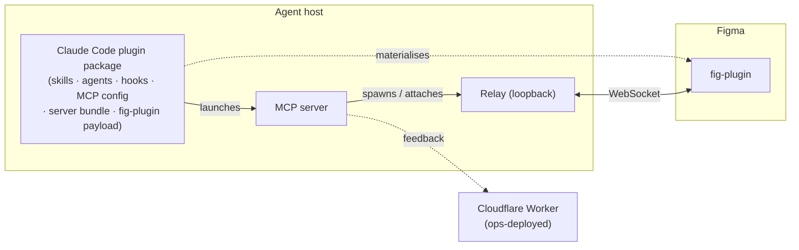

# Dev-Ops Workflow

**What this governs:** how a change becomes a **published, version-locked release** across the
project's user-facing products, and the gates it must pass on the way. It is the single source of
truth for the **distribution model, versioning, the verify gates, the release pipeline, and the git
model**.

**What it does not govern:** the _creative_ inner loop (idea → brainstorm → spec → plan →
implement) — that is individual working process. Runtime observability of end-user installs is also
out of scope.

**Governing documents:** `docs/principles.md` (B2 wire-compat, T-series surface obligations),
`docs/specs/claude-plugin.md` (the plugin package — what it contains and how it is delivered),
`docs/specs/version-handshake.md` (major.minor compatibility), `docs/live-verification.md`
(the live plugin gate), `docs/specs/overview.md` (connection lifecycle).

---

## 1. The hybrid model

Development is **local-first**; GitHub is the **integration and release hub**, and a release
publishes outward from it.

- **Local-first day-to-day.** Work happens in isolated worktrees, merges land on the integration
  branch locally, and the verify gate runs on the developer's machine. No cloud round-trip is
  required to make progress.
- **GitHub as the hub.** The repository is published: it carries the marketplace a user adds, and
  its tags cut the releases that push the built artifacts to where each is consumed — the plugin
  package to **npm**, the fig-plugin archive to the release itself (§7). The verify gate runs in
  cloud CI on shared branches; merges to those branches are gated by it.

---

## 2. Artifacts & topology

Three user-facing products plus one ops-deployed service, all built from one repository and carrying
the **same version** (§6).

| Product                                    | Contents                                                                                     | Runtime    |
| ------------------------------------------ | -------------------------------------------------------------------------------------------- | ---------- |
| **Agent-side package**                     | skills + agents + hooks + the MCP configuration + the server bundle + the fig-plugin payload | —          |
| **fig-plugin**                             | the Figma plugin                                                                             | Figma      |
| **server + relay**                         | a Bun program; the server owns the relay's lifecycle                                         | Bun        |
| **feedback worker** _(not user-installed)_ | edge worker                                                                                  | Cloudflare |

The **agent-side package** is the plugin package the Claude Code host installs. It wraps the
**server + relay** and carries the knowledge layer — skills, agents, and hooks — along with it, which
is why the plugin route is the primary one (§3.2).

The plugin package is also the **fig-plugin's delivery vehicle**: it carries the built Figma plugin
payload, which the `figma-setup` skill materialises at a stable, user-owned path for import into
Figma. What the package contains, how a host resolves and copies it, and where the payload lands are
specified in full by `docs/specs/claude-plugin.md`; this spec covers the distribution, versioning,
and release view of the same package.

**The server owns the relay.** The server ensures exactly one relay is running: it spawns a relay
when the port is free and attaches to the existing one otherwise. Installing "the server" therefore
yields server **and** relay — there is no separate relay install. The relay **binds a loopback
address by default**; the bind host is configurable for development, but inside the Claude Desktop
app it must remain loopback — the app blocks the processes it spawns from connecting to private-range
LAN addresses, while loopback is unrestricted.

---

## 3. Distribution & install routes

### 3.1 One runtime (Bun) on every route

The server + relay run on **Bun** — the same runtime used in development and testing, so there is no
dev/prod runtime divergence and the test suite exercises the shipped runtime. **Every route runs the
server under the user's own Bun**; only how the server's code reaches that runtime differs (§3.2):

- **R1 · Claude Code plugin** — the server arrives **inside the published plugin package** as a
  deps-inlined Bun JS bundle, built at release and run with `bun`.
- **R2 · Manual / from source** — the server runs from source.
- **R3 · Standalone MCP server** — the published package's `bin` entry runs under **Bun's own
  package runner** (`bunx`); the bundle is built `--target=bun`, so a Node-based runner cannot
  execute it.

**Bun is therefore a prerequisite of every route**, and it must be on the PATH **before the agent
host starts** (§3.9). The trade-off is deliberate: **there is no toolchain-free route**, so a user
who will not install a runtime cannot run the product. One runtime everywhere is the boundary the
project chooses — it keeps a single shipped server, exercised by the same test suite, on every route.

On every route the server owns a loopback-bound relay (§2).

### 3.2 Install routes at a glance

**No single artifact is self-sufficient.** Every working install needs **three legs**: the
**fig-plugin** in Figma, the **server + relay** on the machine, and the **agent-side package** in the
agent host. A **route** is how the agent side and the server arrive; the **Figma leg** is
cross-cutting and enumerated separately (§3.8). Every route takes exactly one Figma-leg option, and
all three legs carry the same version (§6).

**Figma desktop is a prerequisite of every route.** The fig-plugin reaches Figma by **manifest
import** (§3.8), and manifest import exists **only in the Figma desktop app** — Figma in the browser
cannot import one. The per-route column below therefore lists **toolchain** prerequisites only;
Figma desktop is assumed on all of them, and any per-route list reproduced elsewhere must carry it.

| Route                                   | Who it is for                                                                | What they install                                                                              | How the server arrives                                                          | Toolchain prerequisites                                    | Figma leg |
| --------------------------------------- | ---------------------------------------------------------------------------- | ------------------------------------------------------------------------------------------------ | ----------------------------------------------------------------------------------- | ------------------------------------------------------------ | --------- |
| **R1 · Claude Code plugin** _(primary)_ | anyone driving Figma from Claude Code — CLI or the desktop app's Code surface | the marketplace plugin: server bundle + 5 skills + 2 agents + 5 hooks + the fig-plugin payload | inside the published package, as a Bun JS bundle launched with the user's `bun` | Bun (before the host starts), npm (install time only), git | **F1**    |
| **R2 · Manual / from source**           | contributors working on the project itself                                   | a clone of the repository                                                                     | run from source under Bun                                                       | Bun, git                                                   | **F3**    |
| **R3 · Standalone MCP server**          | an MCP client that is not Claude Code, or a hand-wired Claude Code entry      | the server alone — **the raw tool surface**                                                   | the published package's `bin` entry, launched by Bun's package runner           | Bun (it provides the package runner)                       | **F2**    |

Two further routes exist for **development only** (§3.6) and are not user routes; what the project
deliberately does **not** offer is enumerated in §3.7 so the boundary is explicit.

### 3.3 R1 · Claude Code plugin — the primary route

**Audience.** Anyone driving Figma from Claude Code, on the CLI or on the desktop app's Code surface.

**It delivers everything:** the server bundle, the **five skills**, the **two agents**, the **five
hooks**, and the **fig-plugin payload**. One install puts every agent-side piece in place, and it is
the only route that carries the knowledge layer — which is what makes it primary.

**What to obtain — one artifact, nothing downloaded by hand.** R1 is the only route whose Figma leg
needs no separate download: the host fetches the plugin package, and the fig-plugin payload rides
inside it (**F1** — §3.8). The two legs still install **separately** — the host puts down the server
leg, and `figma-setup` plus a Figma import puts down the Figma leg — so the sequence below runs to
the end even though there is only one thing to fetch.

**Prerequisites.**

- **Bun** — the runtime the server is launched with. It must be installed **before** the agent host
  is opened, and an already-running session must be reopened afterwards: a session keeps the PATH it
  started with, so it will not see a freshly installed `bun` (§3.9).
- **npm** — **install time only**. Claude Code runs it once to fetch the published package and never
  invokes it again; it is not a runtime dependency.
- **git** — the marketplace is git-sourced.
- **Figma desktop** — universal to every route (§3.2), because the Figma leg is a manifest import.

**Steps** (the command form — entry surfaces b, c, and d below). Steps 1–4 are the **server leg**;
steps 5–7 are the **Figma leg**:

1. Install Bun, then **reopen the agent host** — a session keeps the PATH it started with.
2. Add the marketplace: `/plugin marketplace add yleilu/figma-agent-bridge`
3. Install the plugin: `/plugin install figma-agent-bridge@figma-agent-bridge`
4. **Reload or restart** the host so the MCP server is picked up.
5. **Ask the agent to run the `figma-setup` skill.** It materialises the fig-plugin payload and
   reports back the one path to import.
6. **Import that path into Figma** (**F1** — §3.8, procedure in §3.8.1).
7. **Open the plugin from a Figma design file.** It connects on its own (§3.8.1).

The plugin's own name is `figma-agent-bridge` — which is what step 3's slug uses — but it is
**listed** under its display name, **Agent Bridge**. Anywhere the user reads a list rather than types
a slug (entry surface a below, the host's installed-plugin list, an uninstall prompt), that is the
name to look for.

**The plugin ships no slash commands.** Its surfaces are **skills, agents, and hooks**, so
`figma-setup` is invoked by asking the agent for it — never as a `/figma-setup` command. The two
slash commands in steps 2–3 are the **host's own** plugin commands, not this plugin's.

The install slug is `<plugin-name>@<marketplace-name>`; both names derive from this repository, hence
the repeat. The marketplace source, the npm-sourced entry that pins an exact version, the inert
package, and the per-version plugin cache are the **packaging mechanism**, specified by
`docs/specs/claude-plugin.md` §3 (marketplace and entry) and §5 (package contents, npm source, inert
constraint, and version lockstep); this route consumes it and does not restate it.

**Four entry surfaces.** All four write the **same plugin state** (`~/.claude/plugins/`), so the
choice is purely a matter of where the user already is:

|     | Surface                        | What the user does                                                                                                                       |
| --- | ------------------------------ | ------------------------------------------------------------------------------------------------------------------------------------------ |
| a   | Desktop app — **Directory UI** | use the Directory's **add-a-repository** action, pointed at this repository — which syncs the marketplace only — then **install** the listed plugin from the resulting entry (see the note) |
| b   | Desktop app — **Code surface** | the two slash commands above                                                                                                              |
| c   | CLI — **in session**           | the same two slash commands                                                                                                               |
| d   | CLI — **shell**                | `claude plugin marketplace add yleilu/figma-agent-bridge`, then `claude plugin install figma-agent-bridge@figma-agent-bridge`             |

> **The Directory flow is two steps.** Adding the repository syncs the **marketplace**; the **plugin
> is installed separately**, from the listing, afterwards. Adding the repository on its own installs
> nothing — a user who stops there concludes the install failed — so both steps belong wherever this
> surface is documented. The two-step structure is the load-bearing fact; the dialog's control labels
> and the exact input format it accepts belong to the host's UI, not to this spec, and must be read
> off the surface rather than reproduced from here.

**Verifying it worked.** Two checks, one per leg — a plugin that reports itself installed proves
neither:

1. **The server leg: the MCP server appears in the host's MCP listing**, and its tools are namespaced
   `mcp__plugin_figma-agent-bridge_figma-agent-bridge__*`. The install succeeding says only that
   files were copied; the listing is what proves the server was launched and answered. If the tools
   on offer are `mcp__figma-bridge__*` instead, they belong to a **hand-registered** entry (R2/R3),
   not to the plugin — a distinction worth making before a stale hand-registration is mistaken for a
   working R1.
2. **The Figma leg: opening the plugin in a Figma design file connects on its own** (§3.8.1).

**Upgrading.** An upgrade re-runs the install's two steps and adds a host reload and a payload
refresh, in this order:

1. **Refresh the marketplace** — the entry is git-sourced, so a stale local copy still names the old
   package version and would resolve it again.
2. **Update the plugin**, which resolves the newly pinned package version into its own cache
   directory (the version is the cache key — `docs/specs/claude-plugin.md` §5).
3. **Reload or restart** the host so the new server is launched.
4. **Ask the agent to re-run `figma-setup`.** This is what replaces the Figma payload's contents at
   the stable path — nothing refreshes it automatically.
5. **No Figma re-import** — the import path is unchanged (**F1** — §3.8).

Skipping step 4 leaves the Figma leg on the old build, which the connect-time handshake then refuses
(§6.2) — loudly, but it is a failure the sequence above avoids entirely.

**Removing it.** One install artifact, but state in three places — the agent host, Figma, and the
filesystem — so a clean teardown is three steps:

1. **Uninstall the plugin, then remove the marketplace entry** — both through the host's own plugin
   surfaces, the inverse of steps 2–3. Order matters only in that removing the marketplace alone
   leaves the plugin installed and merely orphans its source.
2. **Remove Agent Bridge from Figma's list of plugins in development** (§3.8.1). Nothing on the agent
   side reaches into Figma to do this.
3. **Delete the materialised fig-plugin payload directory.** `figma-setup` writes it at a
   user-owned path deliberately outside the plugin's version-keyed install directory, so uninstalling
   the plugin does not reclaim it; `docs/specs/claude-plugin.md` §5.1 names the location.

### 3.4 R2 · Manual / from source

**Audience.** Contributors — anyone working on the project itself.

**What to obtain — one clone, two legs built out of it.** Nothing is downloaded from a release. The
clone supplies **both** legs, but they are still two installs: the server leg is a configuration
entry registered with the agent host, and the Figma leg is a build output imported into Figma. The
Figma leg does **not exist** in a bare clone — its build output is not committed — so the build step
is not optional.

**Prerequisites.** Bun and git; **Figma desktop**, as on every route (§3.2).

**Steps.** Steps 1–4 are the **server leg**; steps 5–6 are the **Figma leg**:

1. Clone the repository.
2. **Install dependencies** — the workspace install in the repository README's Quickstart, which
   is where the commands for this step and the next are given.
3. **Build the fig-plugin.** Its build output is not committed, so a bare clone has nothing
   importable until this runs.
4. **Register the server with the agent host**, pointing at the **server package's entrypoint in
   the clone** — the same dual-mode entrypoint the release bundles (`docs/specs/claude-plugin.md`
   §8) — launched under `bun`, with an **absolute interpreter path** and an **absolute script
   path**: a bare interpreter name or a relative script path resolves against an environment the
   host does not guarantee.
5. **Dev-import** the fig-plugin just built, from the manifest in the clone (**F3** — §3.8,
   procedure in §3.8.1).
6. **Open the plugin from a Figma design file.** It connects on its own (§3.8.1).

**Verifying it worked.** The server appears in the MCP client's listing under whatever name the
step-4 entry was registered as — this project's own dev registration uses `figma-bridge`, so on
Claude Code its tools read `mcp__figma-bridge__*`, distinct from R1's
`mcp__plugin_figma-agent-bridge_figma-agent-bridge__*`. Then, as on every route, opening the plugin
in a Figma design file connects on its own (§3.8.1).

**Removing it.** Delete the step-4 server entry from the agent host's MCP configuration, and remove
**Agent Bridge** from Figma's list of plugins in development (§3.8.1). Deleting the clone without
doing the second **breaks** the import rather than removing it — Figma keeps the registration and the
stored path, which now resolves to nothing (§3.8.1).

This route **never touches the published package**: nothing is fetched from a registry, and the
packaging model does not reach it.

### 3.5 R3 · Standalone MCP server

**Audience.** An MCP client that is **not** Claude Code — or a Claude Code user who wants to wire the
server by hand instead of installing the plugin.

The published package is **`figma-agent-bridge`**, and it declares a **`bin` entry** pointing at
its server bundle under that same name (`docs/specs/claude-plugin.md` §4b, §5 — the package's own
description of what it carries), so the server can be launched straight from the registry by a
package runner, addressed by the package name alone. The bundle is built `--target=bun`, so the
runner must be **Bun's** (`bunx`); a Node-based runner cannot execute it (§3.1).

**What to obtain — two legs, one of them a real download.** The server leg is **not** downloaded: the
package runner fetches the published package on launch, so it arrives as a configuration entry. The
Figma leg is a file the user fetches by hand, and the two must agree on version (§6.2, §6.3).

| #   | Artifact                                   | Leg    | How it arrives                                                                                     |
| --- | ------------------------------------------ | ------ | ---------------------------------------------------------------------------------------------------- |
| 1   | the published package `figma-agent-bridge`, via its `bin` entry | server | fetched by **Bun's** package runner at a pinned exact version — `bunx figma-agent-bridge@<version>`; nothing to download by hand |
| 2   | the fig-plugin archive, `figma-plugin.zip` | Figma  | downloaded from the GitHub release at `github.com/yleilu/figma-agent-bridge`, **at the same version pinned in the entry** — a single file, no per-platform choice |

**Prerequisites.** Bun — it supplies both the runtime and the package runner; **Figma desktop**, as
on every route (§3.2).

**Steps.** Steps 1–2 are the **server leg**; steps 3–6 are the **Figma leg**:

1. Point the MCP client's server configuration at the package's `bin` entry, launched through Bun's
   package runner at a **pinned exact version** — command `bunx`, arguments
   `["figma-agent-bridge@<version>"]` (the version-lockstep guarantee is per-version — §6.3).
2. **Restart the MCP client** so it launches the newly configured server.
3. Download `figma-plugin.zip` from that repository's GitHub release **at that same version**.
4. Unzip it into a directory you own and intend to keep — Figma stores the path (**F2** — §3.8.1).
5. Import the `manifest.json` sitting at the root of what you unzipped (**F2** — §3.8.1).
6. **Open the plugin from a Figma design file.** It connects on its own (§3.8.1).

**Verifying it worked.** The server appears in the MCP client's listing under the name the step-1
entry was registered as, and opening the plugin in a Figma design file connects on its own (§3.8.1).

**Removing it.** Delete the step-1 server entry from the MCP client's configuration, remove **Agent
Bridge** from Figma's list of plugins in development (§3.8.1), and delete the directory you unzipped
`figma-plugin.zip` into. There is nothing else to undo on the server leg: the package was fetched by
the runner, never placed by the user.

**What it does not deliver.** The raw tool surface arrives with **no skills, agents, or hooks**. It
is documented as such rather than presented as equivalent to R1 (§3.9).

### 3.6 Development-only routes

Not user-facing. They are named so they are not mistaken for install routes:

- **R4 · Local-path marketplace.** Add the working tree itself as a marketplace and install the
  plugin from it — the inner loop for testing packaging changes without publishing.
- **R5 · Skills-directory plugin.** A plugin scaffolded into the user's own skills directory, which
  auto-loads. Useful for authoring, not for distribution.

### 3.7 Not offered

Enumerated so the boundary is explicit:

- **Curated host directory listing.** The host's own plugin directory is a **discovery** surface,
  reached by submission and review. Distribution does not depend on it — the repository route (R1)
  works without any listing — so listing is a discoverability question, not an install mechanism.
- **Managed-fleet policy distribution.** An administrator can pre-approve marketplaces for an
  organization. The same mechanism can **block** the repository route for managed users, which is why
  it is named here rather than passed over in silence.

### 3.8 The Figma leg

The fig-plugin reaches Figma by **manifest import** on every route; only the source of the manifest
differs. Manifest import exists **only in the Figma desktop app**, which is why Figma desktop is a
prerequisite of every route (§3.2). Each route takes **exactly one** of these options:

| Option | How the manifest arrives                                                                             | Used by      | Support         |
| ------ | ------------------------------------------------------------------------------------------------------ | ------------ | --------------- |
| **F1** | `figma-setup` materialises the payload the plugin package carries and reports the path to import      | **R1**       | supported       |
| **F2** | hand-import from the release's fig-plugin archive                                                      | **R3**       | supported       |
| **F3** | dev-import from a clone's build output                                                                 | **R2**       | supported       |
| **F4** | organization-private publish inside Figma                                                              | —            | **not offered** |
| **F5** | public Figma Community publish                                                                         | —            | **not offered** |

The **procedure is identical on F1, F2, and F3** — only the manifest's origin differs — so it is
given once, in §3.8.1, and the three options below say only where their manifest comes from.

- **F1.** `figma-setup` materialises the payload and reports the manifest path; the user imports that
  path **once** (§3.8.1). On an upgrade, **re-running `figma-setup`** replaces the payload's contents
  at that same stable path, so no re-import is needed — the refresh is what the user triggers, not
  something that happens on its own (the upgrade sequence is §3.3). The payload's contents and its
  stable location are specified by `docs/specs/claude-plugin.md` §5.1.
- **F2.** The release's fig-plugin archive is `figma-plugin.zip` (§7). Its **root holds
  `manifest.json` and the `dist/` folder directly** — there is no wrapping folder — so unzipping it
  yields the importable pair immediately. The user unzips it **somewhere stable** and imports the
  `manifest.json` from there (§3.8.1). That directory then becomes load-bearing: Figma stores the
  path it imported from, so **moving or deleting the folder later breaks the import**, and the repair
  is a re-import from the new location. Upgrading is a re-download and an overwrite of the same
  directory, with no re-import.
- **F3.** The manifest sits in the clone alongside the `dist/` its build writes, and is imported from
  there (§3.8.1). Because the build output is not committed, the import has nothing to resolve until
  the fig-plugin is built (§3.4) — and the clone's location is load-bearing for the same reason F2's
  unzipped directory is.
- **F4 — not offered.** An organization-private publish reaches only members of that organization and
  requires an organization plan.
- **F5 — not offered.** The plugin reads file identity through a **private Figma API** that Figma
  permits for privately distributed plugins but that Community distribution does not allow. See
  `docs/deferred-capabilities.md` (Distribution & publishing) for the path that would keep the
  file-key contract while self-generating its value.

#### 3.8.1 Importing the fig-plugin

The import is the same on **F1, F2, and F3**; only the manifest's location differs, which is the one
thing each option supplies. The procedure:

1. Open the **Figma desktop app**. The browser client cannot import a manifest, which is why Figma
   desktop is a prerequisite of every route (§3.2).
2. Go to **Plugins → Development → Import plugin from manifest…**
3. Select the `manifest.json` — the path `figma-setup` reported (F1), the one at the root of the
   unzipped archive (F2), or the one in the clone (F3).
4. The plugin now appears under **Plugins → Development**, listed by its manifest name, **Agent
   Bridge**.
5. Open it **from a Figma design file**.

Three facts decide whether that sequence appears to work:

- **It appears only in a Figma design file.** The manifest declares `editorType: ["figma"]`, so the
  entry is simply absent in FigJam, Slides, and Dev Mode. A user looking in the wrong editor sees
  nothing and concludes the import failed — so the editor is worth naming wherever step 5 is
  documented, not left implicit.
- **Opening it is the whole of running it.** The plugin **auto-connects**: there is no Connect
  button, and no channel id to copy from the agent side. Opening it in a design file and having it
  connect on its own is the Figma leg verified — which is why every route's verification ends here.
- **The manifest and its `dist/` must stay together.** The manifest names `dist/code.js` and
  `dist/ui.html` **relative to itself**, and Figma both stores the path it imported from and re-reads
  those files on every run. Keeping the pair intact and the folder in place is therefore what makes
  an in-place upgrade work with no re-import (F1's stable path, and F2's re-download over the same
  directory); moving or deleting the folder breaks the import instead, and is repaired by re-importing
  from the new location, never by reinstalling the server leg.

### 3.9 Cross-cutting facts

- The **desktop app and the CLI share one plugin state** — installing on one surfaces on the other,
  which is why R1's four entry surfaces (§3.3) are interchangeable.
- On the desktop app the **Code surface is the supported one**: on its chat surfaces the skills load,
  but the plugin's MCP tools are not guaranteed to be bridged, which leaves an agent holding
  knowledge it cannot act on.
- **Bun must be present before the agent host starts**, or the server cannot be launched — a session
  keeps the PATH it started with.
- **The relay listens on loopback, port `18080`**, and the fig-plugin dials that port. Loopback never
  leaves the host, so **Figma, the relay, and the server must all be on the same machine** — there is
  no remote-Figma or remote-server arrangement on any route. One consequence is worth knowing before
  it is diagnosed as an install failure: because the server **attaches** to an existing listener
  rather than spawning a second one (§2), a foreign or stale process already holding the port
  satisfies that check, and the symptom is the Figma panel never connecting.
- **The standalone route (R3) delivers the tool surface without the guidance layer.** **R1 is the
  only complete route**, and the only one that carries the skills, agents, hooks, and the Figma
  payload together.
- **Platform support is per-route**, and R1's hook layer carries a constraint the tool surface does
  not — §3.10.

### 3.10 Platform & identity constraints

- **R1 supports macOS and Linux.** The MCP tool surface itself is platform-neutral — it is the
  **hook layer** that carries the constraint: the plugin's **five hooks are POSIX shell scripts that
  call `jq` and `curl`**, so they run only where a POSIX shell with both on the PATH does. **Native
  Windows provides neither**, so R1 on Windows requires a POSIX shell that supplies them. Without one
  the hooks simply do not run — identity injection and the presence status block are lost — while
  **the MCP tools keep working**, which is why a missing `jq` or `curl` degrades the route rather than
  blocking it, and why the failure is quiet enough to be worth stating up front. R2 and R3 carry no
  hooks and so no such constraint.
- The version-matched triplet is guaranteed by the **version lockstep** (§6.3) — on R1 the
  agent-side legs travel in one package, pinned to one version by the marketplace entry; on the other
  routes they come from the one release that stamps them all (§7) — plus the runtime **handshake**
  (§6.2) for the Figma leg, which no installer reaches.

---

## 4. Verify gates

A change is **green** only when it passes the gate. The gate is enforced on two surfaces: **locally**
on every change, and in the **cloud** on shared branches.

### 4.1 The headless gate

Lint, type-check, and the test suite must pass. The test suite drives a **mock plugin over the real
relay**, so it validates all transport and handler mechanics without a GUI. It runs through the
project's own toolchain — never an external package resolver, which pulls a different formatter and
produces phantom lint failures.

### 4.2 The install assertion

A green test suite proves the code works; it says nothing about whether the product **installs**.
The install assertion closes that gap: from a **clean state** — no marketplace entry, no plugin
cache, no leftover configuration — install the plugin, then assert it came up. Packaging defects are
exactly the class of failure that is invisible to the test suite and total for the user.

**What it asserts** is owned by `docs/specs/claude-plugin.md` §9, which enumerates the assertions
(entry resolution, the server bundle present in the cache copy, the MCP server connecting, the
package installed inert, skills and agents loading, `figma-setup` materialising the payload,
`record_feedback` writing). **Where it runs, and against what, is owned here** — because before
publication there is nothing on the registry to install from, so the gate takes **two forms**:

| Form                 | Installs from                                                        | Runs                                                     | Proves                                                                                             | Cannot prove                                     |
| -------------------- | -------------------------------------------------------------------- | -------------------------------------------------------- | ---------------------------------------------------------------------------------------------------- | -------------------------------------------------- |
| **Packed tarball**   | a **locally packed tarball** of the package as built from the branch | on every push and pull request (§4.4), and at release before publish (§7) | the package is complete, copies correctly, installs **inert**, and its server launches and answers | registry resolution — nothing is published yet |
| **Published**        | the **published** package, via the marketplace entry                 | at release, **after** publish (§7)                        | the full list, registry resolution included — the artifact users actually receive                      | —                                                  |

The tarball form is the only one available before publication, so it is what gates a change, and it
is deliberately scoped to what a tarball can prove. Registry resolution is provable **only after
publish**, which is why the published form runs as a **post-publish gate** rather than before it —
and why the version that gates a release is the version users get, not a rehearsal of it.

**When the post-publish gate fails**, the release is not silently left standing: the published
version is withdrawn from resolution — deprecated, or unpublished where the registry still permits
it — and the fix ships as a **new patch version** that must pass the same gate. A published version
is immutable, so repair is always forward.

Neither form needs a GUI — Figma is not involved — so both run as a cloud-CI job as readily as a
local one.

### 4.3 The live-plugin gate

Plugin-side changes **must be live-verified** against real Figma before they are green. The headless
mock cannot exercise the Figma runtime — apply ordering, strict validation, and connection lifecycle
only surface live. This gate is manual and GUI-bound (see `docs/live-verification.md`).

### 4.4 Cloud CI

The **headless gate** and the **install assertion in its packed-tarball form** (§4.2) run in cloud CI
on push and pull request, distinct from the release pipeline — the published-package form has no
meaning there, because a branch has nothing on the registry. The **live-plugin gate cannot run in
cloud CI** (no GUI), so it remains a local, human-performed step and is never a cloud-CI job.

---

## 5. Git model

- **Branches.** An integration branch, a stable/release branch, and feature branches; isolated work
  uses worktrees.
- **Merges.** Feature branches merge with a non-fast-forward, `merge:`-prefixed commit, preserving a
  legible topology.
- **Commits.** Conventional Commits with scopes discovered from history; commits are created only
  with **explicit human approval**.
- **Push.** The **human performs all pushes**; automation never pushes to origin. Merges to shared
  branches are gated by a passing verify gate, via pull request.

---

## 6. Versioning

### 6.1 Single version-of-record

There is **one authoritative version**. A release **stamps** it into every artifact's own version
field, so a release is a single number across all three products; per-artifact versions are derived
by the stamp, never edited independently.

### 6.2 Semver & the handshake

Semantic versioning applies. Per principle **B2**, a **breaking wire change bumps the minor**;
patch differences are always compatible. At connect time the plugin and server compare
**major.minor only** (`docs/specs/version-handshake.md`); a mismatch is refused. Matched-build pairs
— the normal case, since all products ship together — always agree.

### 6.3 Version lockstep

Three version fields are **always equal**, being three renderings of the single version-of-record
(§6.1), stamped together by one release:

| Field                          | Read by                                                    |
| ------------------------------ | ---------------------------------------------------------- |
| the Claude Code plugin manifest's version (`plugin.json`) | the agent host — it is the plugin's **cache key** |
| the published npm package's version | npm, at install time                                  |
| the version in the marketplace entry | the host, to decide which package version to fetch     |

Why the plugin manifest **must** carry a version — the host uses it as the cache key — is packaging
mechanism, specified by `docs/specs/claude-plugin.md` §5 (Version lockstep). What follows from it
here is the release consequence: one number is stamped into all three fields at once, so a release is
a single version across every artifact.

The lockstep makes two of the three legs need no runtime check. The **server bundle and the plugin
metadata are the same artifact**, so a server/plugin version mismatch is structurally impossible.
Only the **Figma leg** can drift — it is imported by the user and never silently updated — and that
is precisely what the connect-time handshake refuses (§6.2).

### 6.4 Tags & install-time resolution

Releases are tagged. The marketplace entry names the **exact package version**, so an install
resolves that version rather than whatever happens to be newest, and the fig-plugin payload rides
along inside the same package at the same version. "Exact same version across the triplet" is
therefore carried by the package for the agent-side legs and enforced at runtime by the
**handshake** (§6.2) for the leg the user imports by hand.

---

## 7. Release

A release is cut by the human pushing a release tag, and the work splits at that line.

**Locally, before the tag.** Bump the single version-of-record and **stamp** it into every artifact
that carries a version (§6.1, §6.3). The stamped files are committed, and the tag names that same
version — so the tag, the manifest, the package, and the marketplace entry agree before anything is
built.

**On the pushed tag, CI:**

1. **Install** dependencies reproducibly from the committed lockfile.
2. **Gate** — run the headless gate (§4.1). A failing gate aborts the release; nothing is published
   on red.
3. **Build** — the server bundle and the fig-plugin payload into the plugin package, and the
   fig-plugin archive.
4. **Assert the install, packed-tarball form** (§4.2) against the just-built package, from a clean
   state. A failure aborts the release for the same reason a red gate does: an artifact that cannot
   be installed is not a release. This form cannot reach the registry, which is why step 7 exists.
5. **Changelog** — generate release notes from the Conventional Commits since the previous tag.
6. **Publish** — the plugin package to **npm**, and the GitHub release carrying the fig-plugin
   archive and the changelog.
7. **Assert the install, published form** (§4.2) — install from the marketplace entry, against the
   version just published, and assert it resolves and comes up. This is the gate that can only run
   here; a failure is answered by withdrawing that version from resolution and shipping a patch
   (§4.2), never by editing what was published.

A release publishes **two artifacts**, and nothing else:

| Artifact                                                                                        | Consumed by                                                                      |
| ------------------------------------------------------------------------------------------------- | ---------------------------------------------------------------------------------- |
| the published **plugin package** (server bundle + skills + agents + hooks + fig-plugin payload) | the Claude Code route (**R1**), and the standalone server's `bin` entry (**R3**) |
| the **fig-plugin archive**                                                                      | the hand-imported Figma leg (**F2**) — route **R3**                              |

**Nothing that is built is committed.** Build outputs are produced by the release and published to
their registries; the repository carries source. The server bundle is therefore not in git, and
needs no freshness check: an artifact and its source cannot drift when the artifact only ever exists
downstream of a tag. What a release does need to prove is that the published thing installs, and
that is the **install assertion** (§4.2) — the gate that checks the product by doing what a user
does.

---

## 8. Local install-and-test

The whole triplet can be **built and installed on the developer's own machine** to exercise the real
install routes (§3) before a release. This path builds all three products, installs or refreshes the
agent-side package — with its skills, agents, and hooks — into the local agent environment, prepares
the fig-plugin for import, starts the server + relay, and verifies a round-trip. It is the local
counterpart of the install assertion (§4.2), and it complements the fast per-change plugin reload
loop used during development.

---

## See also

- `docs/principles.md` — B2 (wire compatibility), T-series (surface obligations)
- `docs/specs/claude-plugin.md` — the plugin package: contents, delivery, and the fig-plugin payload
- `docs/specs/version-handshake.md` — major.minor compatibility check
- `docs/specs/overview.md` — connection lifecycle, per-file channels
- `docs/live-verification.md` — the live plugin gate
- `docs/deferred-capabilities.md` — public Figma Community distribution (deferred)
