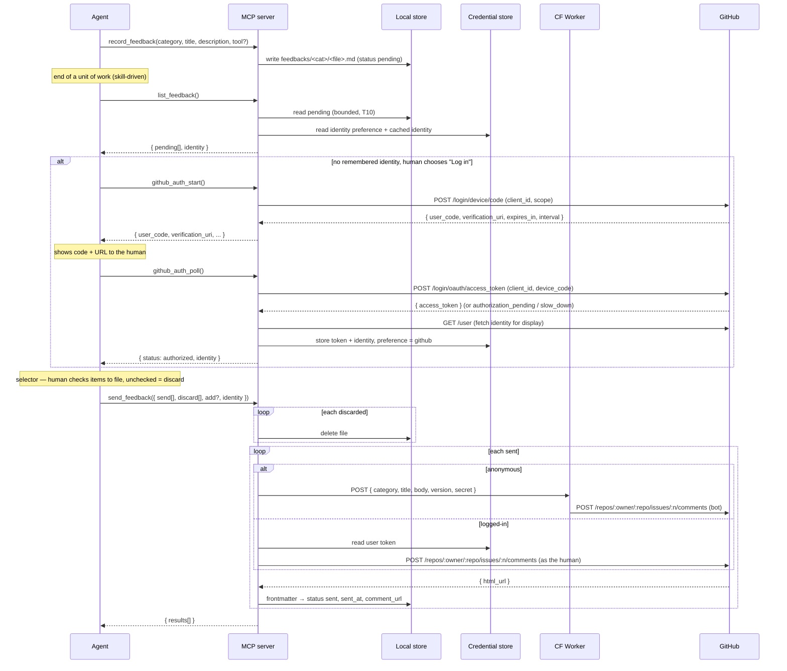

# figma-agent-bridge — Feedback System

> Defines a dogfooding loop: the agent **records** friction it hits while driving the MCP; at
> the end of a unit of work the agent **reviews the backlog with the human** through a selector
> and **files** the chosen items as comments on the project's GitHub issues — either
> **anonymously** (a shared bot identity, via a CloudFlare Worker) or **as the human's own
> GitHub account** (a token the human authorizes once, in-browser). Governed by
> `docs/principles.md`; transport reuses `docs/architecture.md`.

> **The agent records; the human decides what ships, and under whose name.** Nothing is filed
> until the human picks it in the selector — that is the human gate. *When* to record and *when*
> to raise the selector is plugin-layer guidance (the `figma-feedback` skill, P1), never a tool
> opinion — the tools themselves are neutral mechanisms.

## Purpose

While the agent uses the MCP it encounters friction — a tool that silently no-ops, a missing
capability, a confusing result. Today that signal evaporates at the end of the session. This
feature captures it at the moment it happens and, on human approval, routes it into the
project's own GitHub issues so it can be triaged weekly.

The design goals, in priority order:

1. **Zero-friction capture** — one neutral tool call (`record_feedback`) persists an item
   mid-task without derailing. The tool holds no opinion about *when* to call it; that guidance
   is a plugin-layer skill (P1).
2. **Human gate** — nothing is filed automatically. At the end of a unit of work the human
   reviews the backlog in a selector, picks what to file, and **the items they do not pick are
   discarded**. Dismissing the selector files and discards nothing (the backlog is preserved).
3. **Attributable** — the human files either **anonymously** (a shared bot identity) or **as
   themselves** (their own GitHub account, so the comment is authored by them). The choice is
   made once and **remembered**.
4. **Easy weekly triage** — one GitHub issue per category, so a weekly read is one API call per
   stream with no filtering. Both identity paths comment on the same two standing issues; only
   the comment's author differs.
5. **Rides existing rails** — reuse the store and the tool/handler patterns; add the minimum new
   surface, and keep the bridge contract uniform (B1).

### Layer split (P1)

The feature is divided across layers so no opinion leaks into the tools:

- **Tool layer** — neutral capabilities: `record_feedback` (capture), and `list_feedback` /
  `send_feedback` / `github_auth_start` / `github_auth_poll` (the review-and-file mechanism and
  the identity handshake). None of them decide *when* to fire or *what* to send. They are
  **non-facade meta-tools** — the documented T6/T7 carve-out (see [Principle
  alignment](#principle-alignment)), siblings of `record_feedback` and `report_status`.
- **Plugin layer** — the **`figma-feedback` skill** teaches the agent *when* to record and
  *when/how* to raise the selector, triage the backlog, and resolve identity. This opinionated
  workflow lives in [[figma-bridge/docs/specs/claude-plugin|claude-plugin.md]] §6.3 (P1), never
  in a tool description.

## Architecture

The **record path** persists a `pending` item to a local store (below). The **send path** is
**agent-driven**: at the end of a unit of work the agent reads the backlog (`list_feedback`),
raises a selector (owned by the skill), and files the chosen items (`send_feedback`). There are
two identity paths, differing only in the comment's author:

- **Anonymous** → MCP server → **CloudFlare Worker** (holds the shared bot PAT) → issue comment.
- **Logged-in** → MCP server → **GitHub API directly**, with the human's own OAuth token → issue
  comment **authored by the human**.

Feedback flows **agent → MCP server → (Worker | GitHub)**. It never traverses the relay or the
plugin iframe: the relay carries **no feedback semantics**, and the Figma sandbox thread
(`packages/figma-plugin/src/code.ts`) is never involved. The plugin panel renders the agent
status monitor ([[figma-bridge/docs/specs/status-monitor|status-monitor.md]]) and shows no
feedback surface.



## Identity & authentication

The logged-in path authors comments as the human, so it needs a GitHub token that acts as the
human. It is obtained with the **GitHub OAuth App device flow** — the flow GitHub prescribes for
headless/CLI clients — and the human **never pastes a token to the agent**; they authorize
in-browser.

- **Public client, no secret shipped.** The device-flow token exchange requires only the OAuth
  App's **`client_id`** (public) — GitHub's docs are explicit that *"the `client_secret` is not
  needed for the device flow."* The `client_id` is embedded in the build; no secret is ever
  distributed. The OAuth App must have **"Enable Device Flow"** turned on (an app-owner setting,
  set once).
- **Scope.** A single build-time constant `OAUTH_SCOPE`. The target state (a **public** repo)
  needs only **`public_repo`**; while the repo is **private** it needs **`repo`**, and only repo
  **collaborators** can log in and author comments as themselves — non-collaborators use the
  anonymous path. Flipping the repo public narrows the scope to `public_repo` and opens the
  logged-in path to any GitHub user.
- **The handshake** (`github_auth_start` → `github_auth_poll`):
  1. `github_auth_start` requests a device + user code and returns
     `{ user_code, verification_uri, expires_in, interval }`.
  2. The agent shows the human the `user_code` and `verification_uri`
     (`https://github.com/login/device`).
  3. `github_auth_poll` polls the token endpoint, honoring `interval` and backing off on
     `slow_down`. It resolves to `authorized` (token obtained), `pending`, `denied`
     (`access_denied` — the human cancelled), or `expired` (`expired_token` — restart).
  4. On `authorized` the server fetches the identity (`GET /user`) and caches it.
- **Token lifetime.** An OAuth App user token does not expire by default (GitHub revokes it only
  after a year unused), so the human authorizes **once**; there is no refresh loop.
- **Identity for display.** `GET /user` yields `login`, `name`, and `email`. `email` is `null`
  when the human keeps it private; the display email then falls back to the GitHub noreply
  address `{id}+{login}@users.noreply.github.com`, and the display name falls back to `login`.
  The selector shows `name <email>`.
- **No access.** If the logged-in send returns `403`/`404` (not a collaborator on a still-private
  repo), the item is kept and the human is offered the anonymous path instead.

**Prerequisites (provided out-of-band by the app owner):** register one OAuth App with Device
Flow enabled (→ `client_id`); set the two standing issue numbers (`BUGS_ISSUE`,
`PROPOSALS_ISSUE`); keep logged-in users as repo collaborators until the repo is public.

## Credential & preference store

A local store (`~/.figma-agent-bridge`, the same root as the feedback store) holds the identity
**preference** (`anonymous` | `github`), the human's **OAuth token**, and the **cached identity**
(`login`, `name`, `email`). It is the piece that lets the selector show `name <email>` across
restarts and lets `send_feedback` reuse the remembered choice without re-asking.

- **Secure by default, with a fallback.** The token is written via **`Bun.secrets`** — Bun's
  built-in credential API, which maps to the macOS **Keychain**, Windows **Credential Manager**
  (DPAPI-encrypted), and Linux **libsecret**, and works inside a `bun build --compile` binary
  with no native addon. `Bun.secrets` is feature-detected (it is recent and experimental); when
  it is unavailable the store falls back to a **`0600` file** at
  `~/.figma-agent-bridge/credentials.json` (POSIX perms are a no-op on Windows — a DPAPI-encrypted
  file is the Windows hardening option).
- **The client-side credential is the human's own.** It is minimally scoped, device-flow
  authorized (never pasted, never a shared secret), and lives only on the human's machine. The
  **shared bot PAT stays in the Worker** and is used only for the anonymous path.
- **Reset.** A send that returns `401` (revoked/invalid token) clears the stored token and marks
  the identity unauthenticated, so the next selector re-offers login.

## Data model — one item, one Markdown file

The store is a directory tree under a configurable root (default `~/.figma-agent-bridge/feedbacks`).
**Each feedback item is one Markdown file. The subdirectory is the category, and each category
maps 1:1 to a GitHub issue.** The file path is the item's identity — the handle the agent passes
to `send_feedback`. There is no separate id field.

```
~/.figma-agent-bridge/
  feedbacks/
    bugs/        → BUGS_ISSUE
      2026-07-06T2014-resize-node-locked.md
    proposals/   → PROPOSALS_ISSUE
      2026-07-06T2030-batch-postop.md
```

Frontmatter holds everything needed to **list** an item in the selector; the body is natural
language for the human weekly read (and becomes the GitHub comment body).

```markdown
---
title: resize_node silently no-ops on locked nodes
status: pending          # pending → sent | failed
version: 0.0.1           # figma-agent-bridge version at record time (from package.json)
created: 2026-07-06T20:14:00+08:00
tool: resize_node        # optional context chip; omitted if not tool-specific
sent_at:                 # ISO 8601, filled on successful send
comment_url:             # GitHub comment URL, filled on successful send
---

Called resize_node on a locked frame; got a success result but nothing changed.
Expected either a mutation or an explicit "node is locked" error.
```

| Field | Source | Purpose |
|---|---|---|
| `title` | agent (`record_feedback`) | Selector label; GitHub comment heading |
| `status` | server | `pending` → `sent` \| `failed` |
| `version` | server (`package.json`) | Ties the report to the build it came from |
| `created` | server | Sort order |
| `tool` | agent (optional) | Context chip; may be absent |
| `sent_at` | server | Audit; set on successful send |
| `comment_url` | server (from GitHub) | Trace a filed comment back to its item |

The **category is the directory**, not a frontmatter field — routing is unambiguous end to end
(file → issue). The category value **is** the directory name — so `bugs` and `proposals` are the
two categories to start; adding one is a new subdirectory + an issue mapping (see *Extending
categories*).

**Discard deletes the file.** An item the human does not pick in the selector is removed from the
store entirely — it is not a status, it is gone.

### Filename convention

`<ISO-8601-compact>-<slug>.md`, e.g. `2026-07-06T2014-resize-node-locked.md`. The timestamp keeps
files sorted and unique; the slug (derived from the title) keeps them human-scannable. The server
owns filename generation.

## Components

### `packages/shared`
- A `FeedbackItem` type and a `FeedbackCategory` enum (`bugs` | `proposals` — values equal the
  directory names), colocated with the existing schema exports. **No feedback frame types in
  `ws-schemas`** — feedback does not travel over the relay.

### `packages/server`
- **`record_feedback` MCP tool** — a neutral capture capability. Runs entirely server-side: it
  writes the Markdown file with `status: pending`. Params: `{ category, title, description,
  tool? }`.
- **`feedback-store.ts`** — the only module that touches the feedback filesystem: create dirs,
  write an item, parse/serialize frontmatter, list `pending` (bounded), update status
  (`markSent` / `markFailed`), and **`discard`** (delete a file). Frontmatter round-trips
  losslessly.
- **`credential-store.ts`** (new) — the identity preference + OAuth token + cached identity,
  backed by `Bun.secrets` with a `0600`-file fallback (see [Credential &
  preference store](#credential--preference-store)).
- **`github-client.ts`** (new) — the direct GitHub client for the logged-in path: the device
  flow (`startDeviceAuth`, `pollDeviceAuth`), `fetchIdentity` (`GET /user`), and
  `postIssueComment(issueNumber, body, token)`.
- **`worker-client.ts`** — the anonymous path: an HTTPS POST to the CloudFlare Worker sending
  `{ category, title, body, version, secret }`, returning `{ comment_url }`.
- **The review-and-file meta-tools** — global (machine-scoped, no `fileKey`): they do **not**
  spread the `fileTargetParamsSchema` mixin, exactly like `record_feedback`.
  - `list_feedback({ cursor?, limit?=100 }) → { pending: FeedbackItem[], truncated, cursor?, identity: { preference, name?, login?, email? } | null }`
    — a bounded page of the pending backlog (Rule A, T10 — the skill drains the `cursor` until
    exhausted to present the whole backlog) plus the remembered identity, so the agent can build
    the selector and decide whether to ask about identity.
  - `send_feedback({ send: path[], discard: path[], add?: { title, description, category }, identity?: 'anonymous' | 'github' }) → { results: [...] }`
    — files each `send` item (anonymous → Worker; github → direct as the human), **deletes** each
    `discard` item, and, when `add` is present, creates that human-authored item and files it.
    `identity` defaults to the remembered preference.
  - `github_auth_start() → { user_code, verification_uri, expires_in, interval }` — begins the
    device flow.
  - `github_auth_poll() → { status: 'pending' | 'authorized' | 'expired' | 'denied', identity?, interval? }`
    — polls for the token; on `authorized`, the token + identity are stored and returned.
- **Config:** `FEEDBACK_DIR` (default `~/.figma-agent-bridge/feedbacks`); `WORKER_URL`,
  `WORKER_SECRET` (anonymous path); `REPO`, `BUGS_ISSUE`, `PROPOSALS_ISSUE` (required client-side
  for the direct logged-in path); `OAUTH_CLIENT_ID`, `OAUTH_SCOPE` (device flow).

### `packages/figma-plugin`
- **No feedback UI and no feedback relay handling.** The panel is the status monitor; feedback
  is agent-driven and never reaches the iframe. `code.ts` is not involved.

### `packages/worker` (CloudFlare Worker — anonymous path)
- Validates the shared secret (`SHARED_SECRET`), maps `category → issue#` by convention
  (`<CATEGORY>_ISSUE`), and files a comment via the GitHub API
  (`POST /repos/:owner/:repo/issues/:n/comments`) using `GITHUB_TOKEN` (a fine-grained bot PAT
  with issues:write, held as a Worker secret). Composes the body from `title`, `body`, `version`;
  returns `{ comment_url }`. Secrets: `GITHUB_TOKEN`, `SHARED_SECRET`. Vars: `REPO`, `BUGS_ISSUE`,
  `PROPOSALS_ISSUE`.

## The selector (plugin layer — `figma-feedback` skill, P1)

*When* to raise the selector and *how* to triage is opinion, owned by the `figma-feedback` skill
([[figma-bridge/docs/specs/claude-plugin|claude-plugin.md]] §6.3). Summarized here only to make
the mechanism above legible; the skill is the source of truth:

- **When.** At the end of a unit of work, when the pending backlog is non-empty. The **top-level
  agent** raises it (the selector is `AskUserQuestion`, a main-agent affordance; subagents only
  `record_feedback`).
- **Identity (first time only).** Ask *Send anonymously* vs *Log in with GitHub*. Logging in runs
  the device-flow handshake; the choice is then remembered and this question is skipped on later
  runs.
- **Issues.** A multi-select of **all** pending items, plus a free-text option to describe an
  issue/opinion in the human's own words (the agent classifies its category and files it as the
  `add` item). **Checked → filed; unchecked → discarded; dismiss → no-op** (backlog preserved).

## Error handling

| Failure | Behaviour |
|---|---|
| Record — dir/write fails | `record_feedback` returns an error result; no file. |
| Send (anonymous) — Worker unreachable / non-2xx / 401 secret | Item's frontmatter → `failed`; `send_feedback` reports it in `results`; the item is kept for a later selector. |
| Send (logged-in) — GitHub `401` (revoked/invalid token) | Clear the stored token, mark identity unauthenticated; item kept; next selector re-offers login. |
| Send (logged-in) — GitHub `403`/`404` (no repo access) | Item kept; the human is offered the anonymous path. |
| Device flow — `access_denied` / `expired_token` / `slow_down` | Cancelled → stop; expired → restart `github_auth_start`; slow_down → adopt the new `interval`. |
| Discard — delete fails | Reported in `results`; the item is kept. |
| Server not running | The agent cannot call the tools; nothing is filed. |

The **shared bot secret never leaves the Worker**; the **human's own token never leaves their
machine** (server env + OS keychain). No shared credential is ever shipped in the build or sent to
the agent.

## Principle alignment

- **T6 / T7 — non-facade meta-tools (documented exception).** `record_feedback`, `list_feedback`,
  `send_feedback`, `github_auth_start`, and `github_auth_poll` are meta-tools about the bridge
  experience, not Figma capabilities. They are admitted knowingly (the agent has no other channel
  to capture and file friction), quarantined in the `feedback` group, and recorded in
  [[figma-bridge/docs/specs/tool-surface|tool-surface.md]]'s count formula as non-facade —
  siblings of `report_status`. Precedent: `get_document_info` / `close_plugin`.
- **P1 — no opinion in the tools.** *When* to record and *when/how* to raise the selector lives in
  the `figma-feedback` skill. Every feedback tool description states only what the tool does.
- **B1 — uniform contract; the relay stays dumb.** Every feedback tool uses the standard MCP
  result/error contract. Feedback carries **no relay frames at all** — it never touches the pipe,
  so the bridge gains no feedback semantics.
- **T10 — bounded by default.** `list_feedback` returns a bounded page of pending items, never an
  unbounded flush of a large backlog.
- **No shared secret on the client (a design property; principles.md is silent on credentials).**
  No *shared* secret ever reaches the client — the bot PAT stays in the Worker (anonymous path).
  The only client-side credential is the **human's own** token: device-flow-authorized (no client
  secret shipped, nothing pasted), minimally scoped, OS-keychain-stored, on the human's own machine.

## Extending categories

Adding a category (e.g. `questions`) touches: (1) the `FeedbackCategory` enum in
`packages/shared`; (2) a new subdirectory under `feedbacks/` (created on first write); (3) a
`category → issue#` entry — a `QUESTIONS_ISSUE` var in the Worker (anonymous path) and the
client-side issue map (logged-in path). No new tools, no relay changes.

## Testing

- **server unit** — `feedback-store` frontmatter round-trip, status update, and `discard`
  (delete); `credential-store` round-trip against a `Bun.secrets` mock **and** the `0600`-file
  fallback (incl. feature-detect); `github-client` device flow (`start`/`poll`, including
  `slow_down` / `expired_token` / `access_denied`), `fetchIdentity`, and `postIssueComment`
  against a mocked `fetch`; `send_feedback` triage — `send` (anonymous → mocked Worker; github →
  mocked GitHub, authored), `discard` (file deleted), `add` (created + filed).
- **e2e (mock plugin)** — `record_feedback` → file written; `list_feedback` → bounded pending +
  identity; `send_feedback` anonymous → mocked Worker POST + status flip; `send_feedback` github →
  mocked GitHub POST + status flip; `discard` → file gone.
- **live-verify** — the real `AskUserQuestion` selector; one real device-flow login; a real
  comment posted **as the human** and **as the bot**; unchecked items discarded; a dismissed
  selector leaves the backlog intact.

## Out of scope (YAGNI)

- **Switching a remembered identity mid-flow / an explicit logout tool.** Re-auth happens
  automatically on a `401`; a deliberate identity switch is deferred.
- **A GitHub App / fine-grained least-privilege token.** The OAuth App device flow is the chosen
  mechanism; the repo becomes public, so `public_repo` suffices.
- **Editing feedback bodies from the selector** — edit the Markdown file or the comment on GitHub.
- **Auto-send** — the selector gate is the point.
- **Reading GitHub comments back into the tool** — weekly triage is a separate read of the issues.
- **Per-item arbitrary issue targeting** — category → issue is the routing model.
