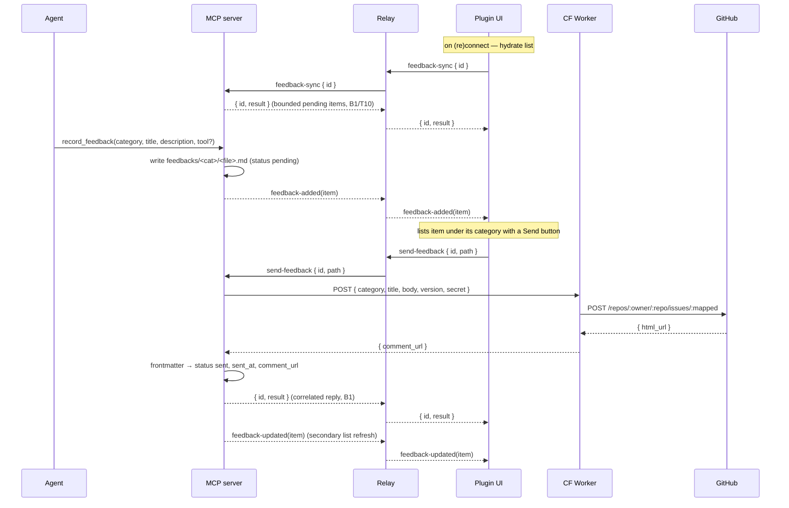

# figma-agent-bridge — Feedback System

> **⚠ Superseded in part by [[figma-bridge/docs/specs/status-monitor|status-monitor.md]].** That redesign
> removes the in-plugin **Feedback UI and the human-gated Send button** from the plugin panel (the panel
> becomes the agent status monitor). The **record path** (`record_feedback` writing an item) is unchanged;
> what is being replaced is the *review-and-send* surface — the agent-driven send flow that succeeds the
> Send button is a **pending follow-up spec**. Read the plugin-UI parts of this doc (the `App.tsx`
> Feedback section, the Send button, the `feedback-added`/`feedback-updated` render path) as the *prior*
> design pending that follow-up; the tool/store/Worker mechanism still stands.

> Defines a dogfooding
> loop: the agent records friction it hits while driving the MCP, the human reviews it in
> the Figma plugin, and one click files it as a comment on a GitHub issue via a CloudFlare
> Worker. Governed by `docs/principles.md`; transport reuses `docs/architecture.md`
> (relay/WS). It rides existing plumbing and holds to the layer rule — with **one
> deliberate, documented exception** to T6/T7 (the tool is not a Figma capability), spelled
> out in [Principle alignment](#principle-alignment).

> The agent records; the human decides what ships. Nothing leaves the machine until the
> user clicks **Send**. *When* to record is plugin-layer guidance (a skill), not a tool
> opinion (P1) — the tool itself is neutral.

## Purpose

While the agent uses the MCP it encounters friction — a tool that silently no-ops, a
missing capability, a confusing result. Today that signal evaporates at the end of the
session. This feature captures it at the moment it happens and routes it, on human
approval, into the project's own GitHub issues so it can be triaged weekly.

The design goals, in priority order:

1. **Zero-friction capture** — one neutral tool call (`record_feedback`) persists an item mid-task without derailing. The tool holds no opinion about *when* to call it; that guidance is a plugin-layer skill (P1).
2. **Human gate** — nothing is filed automatically; the user reviews each item in the plugin and clicks Send.
3. **Easy weekly triage** — one GitHub issue per category, so a weekly read is one API call per stream with no filtering.
4. **Rides existing rails** — reuse the relay/WS transport and the tool/handler patterns; add the minimum new surface, and keep the bridge contract uniform (B1).

### Layer split (P1)

The feature is deliberately divided across two layers so no opinion leaks into the tools:

- **Tool layer** — `record_feedback`, a neutral capability to persist a feedback item. No opinion about when it should fire. It is the one tool that does not map to a Figma API — a documented T6/T7 exception (see [Principle alignment](#principle-alignment)).
- **Plugin layer** — a **skill/command** teaches the agent *when and how* to record (on a silent no-op, a missing capability, a confusing result). This is opinionated workflow guidance and lives here per P1, never in the tool description. **Follow-up deliverable**, out of scope for this spec's implementation but required for the loop to work as intended.

## Architecture

One request already crosses four hops (`Agent → MCP server → relay → plugin`; see
[[figma-bridge/docs/architecture]]). This feature adds **three new message flows over the
same relay** plus **one new external hop** (server → CloudFlare Worker → GitHub).

The relay stays dumb — it broadcasts any `{ type, channel, message }` envelope, so it
needs **no logic change** and **no new named Zod frame types**: the feedback messages ride
the existing generic `commandMessageSchema` envelope in `packages/shared/src/ws-schemas.ts`.
It **only routes** these messages; their meaning lives entirely in the server and the UI, so
the bridge stays semantics-free (B1). The three new flows are:

- **Server → plugin push** — `feedback-added`, `feedback-updated`. Unsolicited
  notifications; no reply is awaited. (New: today the server only sends `command`
  envelopes and awaits an `{ id, result }`.) These are list-refresh pushes, not the
  authoritative reply to any request.
- **Plugin → server hydrate/sync** — `feedback-sync { id }`. Plugin-initiated on each
  successful (re)connect — so it is the **earliest plugin→server traffic that is not a
  `command-result`** (it precedes any `send-feedback`). It is **correlated like a command**:
  the plugin generates an `id`, the server replies `{ id, result }` with a **bounded** set of
  `pending` items (T10) or `{ id, error }` — the same B1 envelope `send-feedback` uses. It
  hydrates the list so it survives plugin reloads.
- **Plugin → server request** — `send-feedback { id, path }`. User-initiated. To keep B1's
  uniform contract, it is **correlated like a command**: the plugin generates an `id`, the
  server replies `{ id, result }` or `{ id, error }` — the same shape every other bridge
  message uses. The `feedback-updated` broadcast is a secondary refresh for the list, *not*
  the send's result.

The Figma sandbox thread (`packages/figma-plugin/src/code.ts`) is **untouched** — the
feedback list lives entirely in the React UI iframe and never touches `figma.*`.



## Principle alignment

This feature touches the bridge and tool layers, so it is checked explicitly against
`docs/principles.md`. Most of it rides existing rails cleanly; the deviations are named,
justified, and confined.

- **T6 / T7 — the one non-Figma tool (deliberate, documented exception).** The tool layer is
  a facade over Figma: "every tool maps to a real Figma API," one tool per `figma.*`
  capability. `record_feedback` is the sole exception — it is a **meta tool** about the
  bridge experience itself, not a Figma capability. It is admitted knowingly because the
  agent has no other channel to emit a signal, and it is **quarantined**: placed in its own
  `feedback` group, absent from the Figma concept groups, and flagged as an exception in
  `tool-surface.md`. Precedent: `get_document_info` / `close_plugin` are already non-facade
  lifecycle commands. This keeps the exception a labelled carve-out, never a silent leak.
- **P1 — no opinion in the tool.** "*What to do and when*" is plugin-layer guidance.
  `record_feedback` is therefore a **neutral capability** with a description that never tells
  the agent when to record. The *when* (silent no-op, missing capability, confusing result)
  lives in a plugin-layer **skill** — a separate follow-up deliverable (see
  [Layer split](#layer-split-p1)).
- **B1 — uniform result/error contract.** The send is **correlated like a command**
  (`send-feedback { id, path }` → `{ id, result | error }`), so every bridge message keeps
  one shape. `feedback-added` / `feedback-updated` are unsolicited *refresh* pushes, not the
  authoritative reply to a request — the send's truth is its correlated reply. The relay
  gains no feedback semantics; it only routes envelopes.
- **T10 — bounded by default.** Hydration is a plugin-initiated `feedback-sync` request on
  each successful (re)connect, which the server answers with a **capped** set of `pending`
  items — never an unbounded O(store) flush, so a large backlog can never blow up the channel.
- **Layer containment.** The bridge stays semantics-free (routing only); design meaning is
  never introduced (no node interpretation); the plugin's `code.ts` and `figma.*` are
  untouched. Feedback state lives server-side (files) and in the UI, not in the pipe.

## Data model — one item, one Markdown file

The store is a directory tree under a configurable root (default `~/.figma-agent-bridge/feedbacks`).
**Each feedback item is one Markdown file. The subdirectory is the category, and each
category maps 1:1 to a GitHub issue.** The file path is the item's identity — the handle
the plugin passes back on Send. There is no separate id field.

```
~/.figma-agent-bridge/
  feedbacks/
    bugs/        → BUGS_ISSUE
      2026-07-06T2014-resize-node-locked.md
    proposals/   → PROPOSALS_ISSUE
      2026-07-06T2030-batch-postop.md
```

Frontmatter holds everything the plugin UI needs to **list** an item; the body is natural
language for the human weekly read (and becomes the GitHub comment body).

```markdown
---
title: resize_node silently no-ops on locked nodes
status: pending          # pending → sent | failed
version: 0.0.1           # figma-agent-bridge version at record time (from package.json)
created: 2026-07-06T20:14:00+08:00
tool: resize_node        # optional context chip; omitted if not tool-specific
sent_at:                 # ISO 8601, filled on successful send
comment_url:             # GitHub comment URL, filled on successful send
---

Called resize_node on a locked frame; got a success result but nothing changed.
Expected either a mutation or an explicit "node is locked" error.
```

| Field | Source | Purpose |
|---|---|---|
| `title` | agent (`record_feedback`) | List label; GitHub comment heading |
| `status` | server | `pending` → `sent` \| `failed`; drives the Send button state |
| `version` | server (`package.json`) | Ties the report to the build it came from |
| `created` | server | Sort order in the list |
| `tool` | agent (optional) | Context chip in the UI; may be absent |
| `sent_at` | server | Audit; set on successful send |
| `comment_url` | server (from Worker) | Trace a filed comment back to its item |

The **category is the directory**, not a frontmatter field — routing is unambiguous end to
end (file → server → Worker → issue). The category value **is** the directory name — no
mapping, no pluralization rule — so `bugs` and `proposals` are the two categories to start;
adding one is a new subdirectory + a Worker mapping entry (see *Extending categories*).

### Filename convention

`<ISO-8601-compact>-<slug>.md`, e.g. `2026-07-06T2014-resize-node-locked.md`. The
timestamp keeps files sorted and unique; the slug (derived from the title) keeps them
human-scannable in the directory. The server owns filename generation.

## Components

### `packages/shared`
- **No new named `ws-schemas` frame types.** The four feedback messages (`feedback-added`,
  `feedback-updated`, `feedback-sync`, `send-feedback`) travel through the existing
  generic/permissive `commandMessageSchema` envelope (the `command` string + `params`), so no
  new named Zod frame types are needed — the cleaner B1-aligned choice.
- A `Feedback` type (the item shape the UI consumes) and a `FeedbackCategory` enum
  (`bugs` | `proposals` — values equal the directory names), colocated with the existing
  schema exports.

### `packages/server`
- **`record_feedback` MCP tool** — registered in `src/index.ts`, params in
  `packages/shared/src/tool-params.ts`. **Grouped under its own `feedback` group, separate
  from the Figma concept groups** — it is a meta tool, not part of the Figma facade
  (documented T6/T7 exception; see [Principle alignment](#principle-alignment)). The tool
  description is **neutral** — it states what the tool does, never *when* to call it (that is
  the plugin-layer skill's job, P1). Its handler runs **entirely server-side**: it does
  **not** `sendCommand` to the plugin. It writes the Markdown file, then broadcasts
  `feedback-added`. Params: `{ category, title, description, tool? }`.
- **`feedback-store.ts`** — the only module that touches the filesystem: create dirs,
  write an item, parse/serialize frontmatter, list `pending` (bounded — see below), update
  status. Frontmatter read/write round-trips losslessly.
- **`worker-client.ts`** — HTTPS POST to the CloudFlare Worker. The **first external HTTP
  client in the codebase** (today all `fetch` targets the local relay). Sends
  `{ category, title, body, version, secret }`, returns `{ comment_url }`.
- **inbound `send-feedback` handler** — added to `src/figma-client.ts`. On a
  `send-feedback { id, path }` message: read the file, call `worker-client`, update
  frontmatter, then **reply `{ id, result }` / `{ id, error }`** (correlated, B1) and also
  broadcast `feedback-updated` as a secondary list refresh.
- **Hydrate on plugin (re)connect (bounded, T10)** — the plugin issues a `feedback-sync`
  request on each successful (re)connect, and the server answers with the current `pending`
  items so the list survives plugin reloads. This is a **plugin-pull, not a server-push**:
  the relay is a blind forwarder and the server cannot reliably detect a plugin join, so a
  client-pull on connect is the correct realization of the same T10-bounded intent. The
  answer is **bounded by default** — a cap (e.g. the N most recent `pending` items) with the
  rest available on demand — rather than an unbounded O(store) flush. At human scale this cap
  is rarely hit, but the surface never emits an unbounded list (T10).
- **Config (env):** `FEEDBACK_DIR` (default `~/.figma-agent-bridge/feedbacks`), `WORKER_URL`,
  `WORKER_SECRET`.

### `packages/figma-plugin`
- `hooks/useRelay.ts` — handle inbound `feedback-added` / `feedback-updated` into feedback
  list state, keyed by file path.
- `App.tsx` — a new **Feedback** section grouped by category. Each row: title, timestamp,
  status chip, and a **Send** button (disabled once `sent`; shows *Retry* on `failed`).
  Send generates an `id`, posts `send-feedback { id, path }` over WS, and resolves on the
  correlated `{ id, result | error }` reply (the row's optimistic state reconciles with the
  `feedback-updated` push). Follows existing `figma-*` Tailwind tokens.
- `code.ts` — **no change.**

### `packages/worker` (new — CloudFlare Worker)
- Deployed with Wrangler (the `cloudflare` skill covers the CLI). Single POST endpoint.
- Validates the shared secret (`SHARED_SECRET`), maps `category → issue#` by convention
  (`<CATEGORY>_ISSUE`, e.g. `bugs → BUGS_ISSUE`), and files a comment via the GitHub API
  (`POST /repos/:owner/:repo/issues/:n/comments`) using `GITHUB_TOKEN` (a fine-grained PAT
  with issues:write, held as a Worker secret — the "linked to my GitHub account" piece).
- Composes the comment body from `title`, `body`, and `version`. Returns `{ comment_url }`.
- Secrets: `GITHUB_TOKEN`, `SHARED_SECRET`. Vars: `REPO` (`owner/repo`), `BUGS_ISSUE`, `PROPOSALS_ISSUE`.

## Error handling

| Failure | Behaviour |
|---|---|
| Record — dir/write fails | `record_feedback` returns an error result; no broadcast, no file. |
| Send — Worker unreachable / non-2xx | Frontmatter `status: failed`; server replies `{ id, error }` (B1) and broadcasts `feedback-updated`; plugin shows *Failed* + Retry. |
| Send — bad shared secret | Worker returns 401; treated as a failed send (above). |
| Send — item already `sent` | Server-side no-op (idempotent); replies `{ id, result }` with the existing state and re-broadcasts it. |
| Server not running at send time | Send routes through the server, so it requires the MCP alive — which it is whenever the agent/relay is active. Plugin greys out Send while disconnected. |

The GitHub token and shared secret **never reach the plugin** — the plugin only ever sends
a file path. All privileged material lives in the server env and the Worker secrets.

## Extending categories

Adding a category (e.g. `questions`) touches three places:

1. `FeedbackCategory` enum in `packages/shared`.
2. A new subdirectory under `feedbacks/` (created on first write by `feedback-store`).
3. A `category → issue#` entry in the Worker — a `QUESTIONS_ISSUE` var (the `<CATEGORY>_ISSUE` convention).

No new message types, no plugin logic beyond rendering the new group.

## Testing

- **server unit** — `feedback-store` frontmatter round-trip + status update; `worker-client`
  against a mocked `fetch`; the `send-feedback` handler flips status and broadcasts.
- **e2e (existing mock plugin)** — `record_feedback` → assert file written + `feedback-added`
  broadcast; inject `send-feedback { id, path }` → assert Worker POST (mocked) + status flip +
  correlated `{ id, result }` reply + `feedback-updated` push. Also assert the failed-send
  path replies `{ id, error }`.
- **worker** — category→issue mapping and secret check against a mocked GitHub API
  (vitest / miniflare).
- **live-verify** — the plugin UI section MUST be live-verified in real Figma (per the
  plugin-side live-verify rule; the headless mock cannot exercise the iframe UI). Covers:
  item appears on record, Send flips to *sent*, failed send shows Retry, list survives a
  plugin reload (hydrate-on-join).

## Out of scope (YAGNI)

- **The when-to-record skill is specced in the plugin milestone** — as the **`figma-feedback` skill** in [[figma-bridge/docs/specs/claude-plugin|claude-plugin.md]] §6.3 (no longer a separate future follow-up). This spec still owns the tool/bridge/UI/Worker mechanism; the plugin-layer skill that teaches the agent *when* to call `record_feedback` (P1) lives there and is required before the loop behaves as intended.
- No editing/deleting feedback from the plugin — the agent records, the human sends; edits happen in the Markdown file or on GitHub.
- No auto-send — the human gate is the point.
- No reading GitHub comments back into the tool — the weekly triage is a separate manual/agent read of the issues.
- No per-item arbitrary issue targeting — category→issue is the routing model.
