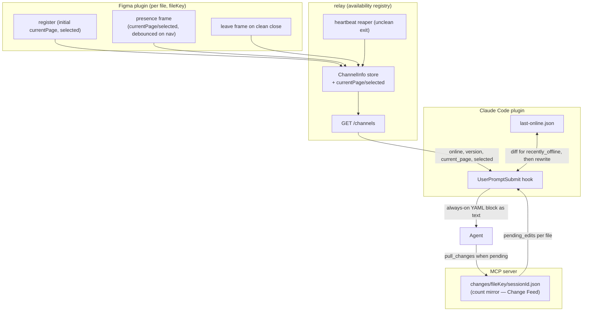

# Plugin Presence

> Governed by [[figma-bridge/docs/principles|the principles]]. Like the Change Feed this spans layers:
> the enriched **availability registry** is **bridge** (**B1** uniform transport, **B3** per-file
> identity); the always-on status block is surfaced by the **plugin-layer** `UserPromptSubmit` hook
> (**P1** opinion — "know the plugin/file state before you act"), and the "pull before acting" directive
> stays in the figma skill (**P1**), never in the payload. Presence is a **best-effort awareness hint**,
> never an authoritative guarantee (**T7**). The availability registry itself is owned by
> [[figma-bridge/docs/specs/overview|overview.md]]; this spec defines the presence enrichment and the
> injected block that consume it.

## Overview

An agent only perceives state when *it* calls a tool, so between turns it is blind to the plugin/file
side: a file the user closed still looks addressable, a file on a skewed plugin looks usable, and the
agent discovers the truth only by a call that fails. Plugin Presence makes the agent **passively aware**
of plugin/file status **at the start of every turn**: a `UserPromptSubmit` hook injects a compact
**always-on YAML status block** describing which files are online, where the user is in each, whether any
just went offline, and how many user edits are pending per file.

The block combines **two reads**:

- **Presence** — the relay's **availability registry**, read over HTTP at `GET /channels`. This read also
  tells the hook which `fileKey`s to look up pending-edit counts for.
- **Pending edits** — the per-file change count, read from the Change Feed's on-disk count mirror
  ([[figma-bridge/docs/specs/change-feed|change-feed.md]]).

It is a **hint, not a guarantee (T7).** The registry can briefly list a plugin that crashed (it rides
the heartbeat until reaped), and presence is only as fresh as the last turn. The ultimate guards remain
the loud failures — `DISCONNECTED` (no plugin for this file), `INCOMPATIBLE` (version skew), and
`WRONG_FILE` (unavailable target — ASK, never guess, **B3**). Presence makes those rare and lets the
agent re-plan proactively; it does not replace them.

## Scope

**Covers:** enriching the availability registry with per-file *current page* and *selection count*; the
plugin-emitted `presence` (refresh) and `leave` (clean-close) frames; the `UserPromptSubmit` hook that
injects the always-on status block; the block's YAML contract; and the `recently_offline` one-turn
transition.

**Does not cover:**
- **The availability registry's existence, identity fields, and removal lifecycle** (`channel`,
  `fileName`, `fileKey`, `connectedAt`; add-on-`register`, remove-on-`leave`/`close`/heartbeat) — owned by
  [[figma-bridge/docs/specs/overview|overview.md]]; this spec adds the presence *fields* and the
  plugin-side frames that feed them.
- **The change records themselves** (which node changed, how) — owned by
  [[figma-bridge/docs/specs/change-feed|change-feed.md]] and delivered by `pull_changes`. This spec
  surfaces only the *count* (`pending_edits`), never the records.
- **On-demand status reads** — `status()` remains the agent-pull view of the same availability data
  ([[figma-bridge/docs/specs/tool-surface|tool-surface.md]]); the block is its passive, turn-start
  counterpart (see Relationship to `status()`).
- **Version-skew detection and pre-flagging** — the compare is owned by
  [[figma-bridge/docs/specs/version-handshake|version-handshake.md]] (the server owns it). The block does
  **not** render skew — the hook cannot run that compare, and an incompatible plugin is surfaced by the
  loud `INCOMPATIBLE` failure on first use, not by a block field.

## Three-layer placement

| Layer | Responsibility here |
|---|---|
| **Bridge** | The plugin self-reports `currentPage` / `selected` — initial on `register`, refreshed via a dedicated `presence` frame (**B1**); the relay stores them without parsing traffic; a clean-close `leave` frame drops the entry promptly. Carries facts faithfully; interprets nothing. |
| **Tool** | None new. The block reuses the relay's `GET /channels` and the Change Feed's count mirror; `status()` already exposes the same availability on demand. |
| **Plugin** | The `UserPromptSubmit` hook that reads both sources and injects the always-on block — the *opinion* that the agent should know plugin/file state before acting (**P1**). The "pull before acting" directive lives in the figma skill that reads the block, not in the payload. |

## The status block

The hook prints one YAML document to **stdout**; Claude Code injects that text as turn-start context
(`additionalContext`). It is **injected every turn** — presence is passive awareness the agent should have
before it acts — so it carries the current state even when nothing changed; a fully idle Figma still
yields a block (an empty `online` list is itself the awareness).

```yaml
# figma_bridge — injected every turn (UserPromptSubmit). Passive status, not from the user.
figma_bridge:
  relay: connected                 # or: unreachable  (then online: [])
  online:                          # files with a live plugin now
    - name: Design A
      fileKey: fk-a
      version: "0.2.0"
      current_page: "Icons"        # where the user is now
      selected: 2                  # count of nodes selected now
      pending_edits: 3             # user node/style edits since your last pull_changes (0 = none)
    - name: "(unsaved)"
      fileKey: sess-9f2c8d…        # unsaved file → fileKey is the channel (synthKey)
      version: "0.2.0"
      current_page: "Page 1"
      selected: 0
      pending_edits: 0
  recently_offline:                # online the previous turn, gone now — calls fail DISCONNECTED
    - name: Mockups
      fileKey: fk-c
```

### Field sourcing

| Field | Source | Kind |
|---|---|---|
| `relay` | whether `GET /channels` responded | infra state |
| `online[]` · `name` · `fileKey` · `version` | `/channels` (`ChannelInfo`) | current state |
| `current_page` · `selected` | `/channels` (`ChannelInfo`, **enriched** — see below) | current state |
| `pending_edits` | Change Feed count mirror, keyed by the file's address + `sessionId` | folded-in count |
| `recently_offline[]` | previous online set minus current (hook's `last-online.json`) | one-turn transition |

- **Unsaved files:** `fileKey` is `null` in the registry; the block uses the entry's `channel` (the
  `synthKey` — the per-session channel an unsaved file registers under, per
  [[figma-bridge/docs/specs/overview|overview.md]]) as both the address **and** the `pending_edits`
  count-file key — consistent with how unsaved files are addressed everywhere; the Change Feed keys that
  file's buffer and count by the same `synthKey`.
- **`pending_edits` counts mutations only** (nodes + styles), never selection/page navigation — a `0`
  means "no user *edits*," so navigation alone never inflates it (**T4/T7**), matching the count mirror's
  own rule.
- **The block never carries change *records*.** `pending_edits: N` is a signal; the records come from
  the agent's own `pull_changes({fileKey})` call (see Two tiers).

### Degraded and empty cases (T7)

- **Relay unreachable** (`curl` fails) → `relay: unreachable`, `online: []`, and `recently_offline` is
  **omitted** — a transport blip is not a set of file closes, and flagging every file as offline would be
  noise. The hook **does not overwrite** `last-online.json` in this case, so the baseline survives the
  blip and the next successful turn diffs correctly.
- **Relay up, no plugins** → `relay: connected`, `online: []`. Still injected — "nothing connected" is
  itself the passive awareness the agent needs.

## Presence enrichment — `current_page` and `selected`

`ChannelInfo` (owned by [[figma-bridge/docs/specs/overview|overview.md]]) gains two optional fields so the
block can answer "where is the user":

```
ChannelInfo = {
  channel, fileName, fileKey, connectedAt, version?,   // identity (overview.md)
  currentPage?: string,   // page NAME  (detail via list_pages)
  selected?:    number,   // count of selected nodes  (ids via get_selection)
}
```

`currentPage` is the page **name** and `selected` a **count** — deliberately shallow: the block is for
*awareness*, and the agent fetches detail with `list_pages` / `get_selection` when it needs it (**T4**).
Both are optional; an older plugin that does not report them simply omits the fields. Enriching
`ChannelInfo` enriches **both** consumers at once — the hook's `/channels` read **and** `status().available[]`
— from one source (one fact, one place).

### Staying fresh — the plugin self-reports (B1)

The registry's invariant is preserved: **it holds facts the plugin reports about itself; the relay never
infers presence from traffic** (a faithful, non-interpreting transport — **B1**). `currentPage` /
`selected` are self-reported, like `fileName` / `version`:

- **Initial values ride `register`.** On connect the `register` frame carries the opening `currentPage` /
  `selected`, so a just-connected entry is already complete.
- **Refreshes ride a dedicated `presence` frame — not a re-`register`.** The plugin emits a light
  `presence` frame (added to the relay's incoming set alongside `join` / `message` / `register` / `leave`)
  carrying only `{ currentPage, selected }`, **debounced**, whenever the user navigates — reusing the
  plugin's existing `currentpagechange` / `selectionchange` listeners (the same listeners the Change Feed
  uses). The relay updates that channel's `ChannelInfo` in place and parses nothing else.
- **Why not re-`register`:** `register` mints the connection `epoch` (and drives the version handshake and
  `connectedAt`), so re-sending it on every navigation would churn `epoch` and force a spurious Change-Feed
  `reset` each time. A separate `presence` frame touches **only** `currentPage` / `selected`; the
  connection-level fields are untouched.
- **Debounce** coalesces rapid selection/navigation churn into at most one update per short window — a
  tuning detail traded against staleness, not a contract. Freshness only has to hold **at turn start**
  (when the hook reads `/channels`), so a short debounce is ample.

This is why the relay stays a dumb transport: it never reaches into `document_changed` records to harvest
presence (which would couple the transport to the Change Feed's record schema). The plugin reports presence
explicitly; the relay only stores it.

## Offline detection

The availability registry's removal triggers — socket `close`, a missed heartbeat, and the clean-close
`leave` frame — are owned by [[figma-bridge/docs/specs/overview|overview.md]]. What matters for the block:

- **Clean close** drops the file from `/channels` **promptly** via the `leave` frame — the plugin's
  explicit "closing" signal, not waiting on socket-`close` timing, which can lag plugin teardown — so a
  clean close shows up on the very next turn.
- **Unclean exit** — a crash, a closed Figma tab, or a dropped network — sends no `leave`; the heartbeat
  reaps the channel within ~2 missed ticks. During that window the file still appears in `online` — the
  residual staleness the block is honest about (Limitations).

**`recently_offline` is a one-turn transition.** The hook keeps `last-online.json` — the set of
`fileKey`s that were online at the previous `UserPromptSubmit` (an **absent** file, e.g. on the first
turn, counts as the empty set). Each turn: `recently_offline` = the previous set minus the current online
set; then the hook rewrites the file with the current set. A file therefore appears in `recently_offline`
for **exactly the one turn** after it drops (a heads-up: *"the file you were using is gone"*), then falls
out — pure current-state (`online`) can't express a disappearance, so this single transition is worth
keeping.

## Two tiers — signals here, records in the feed (T1)

Presence surfaces **current state and signals**; the Change Feed surfaces **events and records**. The
block never blurs them:

```
turn start → hook injects the YAML block (pending_edits: 3)         ← Tier 1: signal (count mirror)
agent sees 3 > 0 → pull_changes({ fileKey: "fk-a" })                ← Tier 2: records (server buffer)
              → { changes:[…3 records…], state:"ok" } + buffer cleared
agent reasons over user prompt + diff → acts
```

The block cannot carry the records even in principle — the hook is a separate process that cannot read
the server's memory; only the *count* is mirrored to disk. The same split applies to navigation:
`current_page` / `selected` are **state** (in the block); the `page` / `select` **events** ("switched to
Icons") come out of `pull_changes` as records. Current-state and events **coexist** under T1 without a
naming collision — exactly as `pull_changes`'s `select`/`page` records coexist with `get_selection` /
`list_pages`.

## Relationship to `status()`

`status()` and the block render the **same availability data** two ways: `status()` is the **on-demand**
read (the agent asks); the block is the **passive** turn-start injection (the agent is told). No new
concept, no duplicated source of truth — both read the enriched registry, so the enrichment lands in both.
The block adds only what a passive turn-start view needs beyond `status()`: the folded-in `pending_edits`
signal and the `recently_offline` transition.

## Relationship to the Change Feed

The Change Feed owns the count mirror (the on-disk `pending_edits` source), the `pull_changes` drain, and
the change records. This spec owns the `UserPromptSubmit` hook and the injected block that *consumes* the
count. In the block the count is a **data field** (`pending_edits`), shown every turn even when `0` — the
block injects every turn regardless. The count-mirror mechanism it reads is defined by the Change Feed
(leading-edge write, mutations-only, per-session path, `_unattributed` fallback). The agent's **drain** is
gated on `pending_edits > 0`, so `pull_changes` runs only on turns that actually changed; the always-on
block is the price paid for constant presence awareness.

## Data flow



## Design constraints

Figma / Claude Code facts that shape this design:

- **The hook cannot read server memory.** A `UserPromptSubmit` hook is a separate process; it reaches
  presence over HTTP (`GET /channels`) and the pending count via the on-disk mirror — never the server's
  in-memory buffers. This is why records stay in `pull_changes` and only the count is surfaced.
- **`/channels` is HTTP on the relay's port.** A shell hook reads it with a plain request. The hook uses
  the **default `18080`**, overridable by an explicit env var — it does **not** run the server's runtime
  ping/pong port-discovery, so the port is a fixed default/override, not discovered.
- **The hook shares the Change Feed's `fileKey` sanitizer.** To find a file's count file the hook applies
  the *same* sanitizer the server uses to write it (the shared util named by
  [[figma-bridge/docs/specs/change-feed|change-feed.md]]); a drift would silently read `pending_edits` as
  `0`.
- **`sessionId` is hook-injected, not agent-authored.** The count-file path is keyed by the Claude Code
  `session_id`, injected into MCP calls by a `PreToolUse` hook; the `UserPromptSubmit` hook reads count
  files with its **native** `session_id` — the same value — with the `_unattributed` sentinel as the
  degrade. Mechanism owned by [[figma-bridge/docs/specs/request-envelope|request-envelope.md]] and
  [[figma-bridge/docs/specs/change-feed|change-feed.md]]; presence adds no new `sessionId` consumer.
- **Presence is global, not session-scoped.** `/channels` lists every file with a live plugin, which on a
  local relay is the user's open files — and for discovery that global view is correct (it shows every
  file the agent *can* address). "Which files am I actively on" is the server-side, per-session
  `status().joined[]`, a different question; the registry is never keyed by session.
- **The plugin already listens for navigation.** `currentpagechange` / `selectionchange` listeners exist
  for the Change Feed, so reporting `currentPage` / `selected` piggybacks on them — no new event surface.
- **Unclean exits send no signal.** Figma delivers no reliable universal "closing" event across every
  path (crash, tab close, network drop), so the `leave` frame covers only clean closes and the heartbeat
  is the backstop — hence the honest stale window below.

## Limitations (honesty — T7)

- **Best-effort, not authoritative.** A crashed/tab-closed plugin lingers in `online` until the heartbeat
  reaps it (~2 missed ticks); a version-skewed plugin is **not** pre-flagged in the block (the hook cannot
  run the server's compare) — it surfaces through the loud `INCOMPATIBLE` failure on first use. The block
  reduces surprise; the loud failures (`DISCONNECTED` / `INCOMPATIBLE` / `WRONG_FILE`) remain the real
  guard.
- **Fresh only at turn start.** The hook runs on `UserPromptSubmit`; state that changes mid-turn is not
  re-injected. The agent that needs the freshest view calls `status()` (availability) or re-reads the
  affected nodes.
- **`current_page` / `selected` are shallow and debounced.** They report the page *name* and a selection
  *count*, coalesced over a short window — enough for "where is the user," not a live cursor. Detail is a
  `list_pages` / `get_selection` away.
