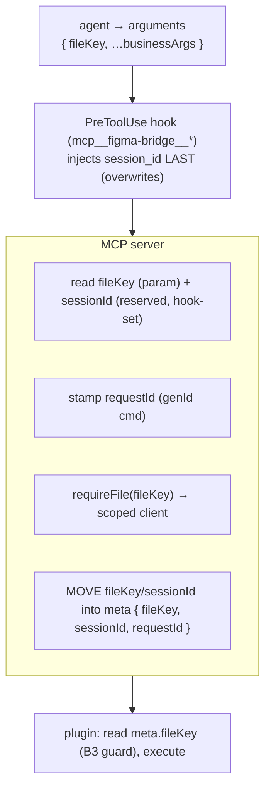

# Request Envelope & Metadata

> Governed by [[figma-bridge/docs/principles|the principles]]. This is **mechanism**, not policy:
> it defines the wire envelope and the request-metadata (`meta`) plane that carry **B1**'s uniform
> contract, **B3**'s per-file addressing, and (at connection level) **B2**'s version handshake.
> [[figma-bridge/docs/specs/overview|overview.md]] owns the *addressing policy* (per-call `fileKey`,
> never guess); this spec owns *how* that identity — and the ambient request headers — ride the wire.
> One fact, one place: fields defined here are referenced (not redefined) by the specs that use them.

## Overview

Every command the server sends to a file's plugin, and every reply/push back, is one JSON frame. Two
kinds of information ride it, and separating them is the whole point — the same split as an HTTP
request's **body vs. headers**:

- **The agent's intent** — which tool, on which file, with what arguments. The *body*
  (`command` + `params`); the file target is the one part of it that must be explicit.
- **Ambient request metadata** — *who* is asking (session), *which* request (correlation). The agent
  never authors this; it is stamped for it. The *headers* (`meta`).

The rule that makes this clean: **a value is a param if the agent chooses it, and a header if the
server or platform provides it.** Everything below follows from that one distinction.

## The taxonomy

### Per-request `meta` — rides every command

| Field | Kind | Generator · when · how | Consumers |
|---|---|---|---|
| `fileKey` | **param** (agent-selected) | an existing file identity the agent picks per call, sent in `arguments` | relay channel routing, plugin B3 guard, per-file index / change-feed buffers |
| `sessionId` | **header** (platform, hook-injected — **reserved, agent never sets**) | the Claude Code `session_id`, injected into each call's `arguments` by a `PreToolUse` hook (see Sourcing) | change-feed **count-file path** (v1); multi-session `source` attribution (forward-compat) |
| `requestId` | **header** (server) | `genId('cmd')`, per request (this is today's frame `id`) | request↔reply correlation (the pending map) |

### Connection-level — established once, **never** per-request

| Field | Where it lives |
|---|---|
| `appVersion` | The **B2 handshake** at register; compared major.minor; a skew fails the connection loudly. See [[figma-bridge/docs/specs/version-handshake]]. Not a per-request header. |
| `epoch` | A plugin **nonce** set on each `register`/reconnect, **compared for equality only** (a reconnect yields a different value → change-feed `reset`). See [[figma-bridge/docs/specs/change-feed]]. |
| `channel` | Derived from `fileKey` (`file-<fileKey>`, or a random session channel for unsaved files); the relay's transport routing layer, not agent-facing. |

## The wire envelope

Today's `CommandMessage` carries a flat `targetFileKey`. Generalize it into a `meta` block:

```
// command  (server → plugin)
{ command, params, meta: { fileKey, sessionId, requestId } }

// reply     (plugin → server)   — correlation only
{ meta: { requestId }, result | error }

// push      (plugin → server, unsolicited; e.g. change-feed document_changed)
{ command, params: { …payload }, meta: { fileKey, epoch } }
```

- `meta.fileKey` **replaces** `targetFileKey`; the plugin reads it for its **B3 identity guard**
  (refuse a command whose `meta.fileKey` ≠ its own `figma.fileKey`).
- The wrapper **moves** the identity fields (`fileKey`, `sessionId`) out of the forwarded `params` and
  into `meta` — each appears **once**, so an agent-set `params.fileKey` can never diverge from
  `meta.fileKey`.
- `requestId` correlates a reply to its command (the pending map is keyed by it). The reply changes
  today's flat frame `id` → `meta.requestId` — a **coordinated plugin-side change**, not a server-only
  refactor (both sides adopt it atomically; the B2 handshake guards skew).
- **Pushes carry no `sessionId`/`requestId`.** A push is unsolicited (no correlation) and the relay
  **broadcasts** it to every channel member, so a single frame-level `sessionId` would be meaningless.
  Self-write attribution therefore rides **per-record in `changes[].source`**, not in frame `meta`
  (see [[figma-bridge/docs/specs/change-feed|change-feed.md]]).

## `fileKey` — the one param

`fileKey` is a **choice the agent makes** (two files open — which one?), so it must enter through the
tool's `arguments` — in MCP the model only controls a tool's arguments, never transport `_meta`. Under
concurrent multi-file there is no coherent "current file" to default to, so per-call is the correct
model (the *why* is B3 policy — see [[figma-bridge/docs/specs/overview|overview.md]]). It is carried by
a shared `fileTargetParamsSchema` mixin (**defined by the tool-surface migration**; see
[[figma-bridge/docs/specs/tool-surface|tool-surface.md]]) spread into every **file-addressed** tool
schema — so "required" is one definition, not per-tool. The **session/transport tools are
exceptions**: `connect({fileKey?})` (discovery) and `status()` (no file) address the *connection*, not
a per-call file.

## `sessionId` — the hook-injected header, and how the server gets it

`sessionId` is the **Claude Code `session_id`** — the sender identity the change-feed uses so the
server and the change-feed hook agree on a per-session count file. It is ambient platform identity:
**the agent never authors it.** Sourcing fact (verified against the Claude Code docs, 2026-07-09):

- **Hooks receive `session_id`** natively (stdin JSON); stable across the session.
- **MCP servers do NOT** — a spawned stdio server gets only `CLAUDE_PROJECT_DIR`.

Mechanism (also verified): a **`PreToolUse` hook** can rewrite a call's arguments via
`hookSpecificOutput.updatedInput`, and the change **propagates to MCP tools**; plugin `hooks.json`
supports `PreToolUse` with a matcher. So:

- A `PreToolUse` hook scoped by matcher to **`mcp__figma-bridge__*`** injects its native `session_id`
  into each call's arguments. The **server reads `sessionId` directly from the call** — **no handoff
  file, no `SessionStart` dance, no "which session is this" correlation.** The id is tied to the one
  session making the call because it *is* that call.
- It is a **header, not a param**: the *hook* authors it. It travels in the arguments channel only
  because that is the one channel `PreToolUse` can inject into; the wrapper lifts it into the
  server→plugin `meta`. It is declared as a **reserved** field on the mixin (marked *server-managed —
  do not set*), present so the injected value validates, **not** advertised for the model to author.

**Trust rule (security — the injection is untrusted unless it comes from the hook):**

- The hook MUST **forcibly overwrite** any pre-existing value: emit `updatedInput: { …args, sessionId }`
  with `sessionId` written **last**. `{ sessionId, …args }` (agent value wins) is **forbidden** — the
  key order is a security rule, not incidental.
- The server MUST treat `arguments.sessionId` as **untrusted**. It is authoritative only because the
  hook overwrote it. When the hook's contribution cannot be relied on (the Fallback), the server
  **unconditionally** mints/degrades and **ignores** any agent-supplied value — never "mint only if
  absent."
- Defense-in-depth: the server is 1:1 with a CC session, so it MAY cache the first injected `sessionId`
  and ignore the arguments field thereafter for its own writes. The plugin still receives `sessionId`
  **per command** in `meta` (forward-compat multi-session attribution; the v1 plugin ignores it — its
  self-write filter drops *all* plugin-caused changes without consulting `sessionId`).

**Fallback (documented, not silent — T7):** two sub-cases, because a missing count file reads as `0`
and must never be mistaken for "quiet turn":

1. **Whole hook bundle absent** (no `PreToolUse` *and* no `UserPromptSubmit`): no `sessionId` and no
   count-gated nudge at all — the count file is moot; change-feed runs without the proactive nudge.
2. **`PreToolUse` absent but `UserPromptSubmit` present** (the path-desync case): the server has no
   trustworthy `sessionId`, so it MUST emit an explicit **unattributed signal** the change-feed hook
   can read as "nudge unconditionally" — never a silent zero. The exact mechanism (a session-agnostic
   sentinel vs. a `fileKey`-level aggregate) is owned by
   [[figma-bridge/docs/specs/change-feed|change-feed.md]]; this spec only fixes the requirement: **the
   degrade is never a silent never-on.**

## `requestId` — the server header

`genId('cmd')` minted per `sendCommand` (already present today as the frame `id`), globally unique
across channels (nanoid, never a per-channel counter — the pending map is keyed by it alone, so it
must stay global). Correlation only; the agent never sees it. The reply echoes it as `meta.requestId`.

## How the pieces meet



Handlers never touch addressing or identity — the wrapper reads them and scopes the client.

## Design constraints

- **MCP model controls only `arguments`.** The model cannot set transport `_meta`, so an
  agent-*chosen* value (the file target) must be a schema param; ambient values are headers.
- **MCP servers get no session id from Claude Code** (only `CLAUDE_PROJECT_DIR`); the CC `session_id`
  reaches the server via a **`PreToolUse` hook injecting it into the call** (`updatedInput`,
  propagates to MCP tools — verified). No file, no correlation.
- **Reuse the existing store root.** All server-side state lives under `~/.figma-agent-bridge/`
  (alongside `component-index/`, `feedbacks/`, change-feed `changes/`) — no new storage convention.

## Cascade reconciliations (Phase 2 of the revisions plan)

This spec is the new SSOT; the following must be aligned in the cascade (they currently drift):

- **`targetFileKey` → `meta.fileKey`** in `overview.md` (Targeting + guard) and `version-handshake.md`
  (the guard field); both defer here for the envelope shape. The `meta{}` wrapping is itself the
  breaking wire change → minor bump (B2).
- **Push frame shape** in `change-feed.md`: move `fileKey`/`epoch` from `params` into `meta`; keep
  `changes`/`at` in `params`.
- **`fileTargetParamsSchema` + reserved `sessionId`** added to `tool-surface.md`.
- **`epoch`** wording in `change-feed.md`: "nonce, compared for equality" (drop "monotonic").
- **Close change-feed Open-Q** on "the shared session identifier" — answered here.

## Open questions

1. **Reserved-field pass-through** — confirm at implementation that a `PreToolUse` `updatedInput`
   value for a field marked reserved (present but not model-advertised) survives MCP schema validation
   and reaches the server. (Declaring it on the schema is the hedge; verify it isn't stripped.)
2. **Unattributed-signal mechanism** — the concrete change-feed degrade for Fallback case 2 (sentinel
   file vs. `fileKey`-level aggregate); owned by change-feed.md.
