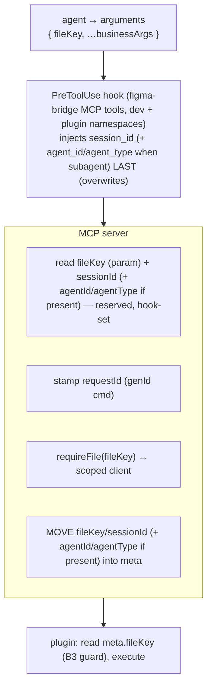

# Request Envelope & Metadata

> Governed by [[figma-bridge/docs/principles|the principles]]. This is **mechanism**, not policy:
> it defines the wire envelope and the request-metadata (`meta`) plane that carry **B1**'s uniform
> contract, **B3**'s per-file addressing, and (at connection level) **B2**'s version handshake.
> [[figma-bridge/docs/specs/overview|overview.md]] owns the *addressing policy* (per-call `fileKey`,
> never guess); this spec owns *how* that identity — and the ambient request headers — ride the wire.
> One fact, one place: fields defined here are referenced (not redefined) by the specs that use them.

## Overview

Every command the server sends to a file's plugin, and every reply/push back, is one JSON frame. Two
kinds of information ride it, and separating them is the whole point — the same split as an HTTP
request's **body vs. headers**:

- **The agent's intent** — which tool, on which file, with what arguments. The *body*
  (`command` + `params`); the file target is the one part of it that must be explicit.
- **Ambient request metadata** — *who* is asking (session, and which agent within it), *which* request
  (correlation). The agent never authors this; it is stamped for it. The *headers* (`meta`).

The rule that makes this clean: **a value is a param if the agent chooses it, and a header if the
server or platform provides it.** Everything below follows from that one distinction.

## The taxonomy

### Per-request `meta` — rides every command

| Field | Kind | Generator · when · how | Consumers |
|---|---|---|---|
| `fileKey` | **param** (agent-selected) | an existing file identity the agent picks per call, sent in `arguments` | relay channel routing, plugin B3 guard, per-file index / change-feed buffers |
| `sessionId` | **header** (platform, hook-injected — **reserved, agent never sets**) | the Claude Code `session_id`, injected into each call's `arguments` by a `PreToolUse` hook (see Sourcing) | the change-feed **count-file path** ([[figma-bridge/docs/specs/change-feed|change-feed.md]]); per-agent status identity **when no `agentId`** (top-level agent) |
| `agentId` | **header** (platform, hook-injected — **reserved, agent never sets**) | the Claude Code `agent_id`, injected by the **same** `PreToolUse` hook alongside `sessionId`; **present only for subagent-originated calls** — absent for the top-level agent | per-agent status identity (a subagent's row key) — consumer owns the keying policy |
| `agentType` | **header** (platform, hook-injected — **reserved, agent never sets**) | the Claude Code `agent_type` (e.g. `"Explore"`), injected by the same hook alongside `agentId`; same subagent-only presence | default display label for a per-agent status row |
| `requestId` | **header** (server) | `genId('cmd')`, per request — the correlation id | request↔reply correlation (the pending map) |

### Connection-level — established once, **never** per-request

| Field | Where it lives |
|---|---|
| `appVersion` | The **B2 handshake** at register; compared major.minor; a skew fails the connection loudly. See [[figma-bridge/docs/specs/version-handshake]]. Not a per-request header. |
| `epoch` | A plugin **connection nonce**, minted on each `register`/reconnect and **compared for equality only**; published on the `register` frame *and* on every push frame's `meta`. Defined below. |
| `channel` | Derived from `fileKey` (`file-<fileKey>`, or a random session channel for unsaved files); the relay's transport routing layer, not agent-facing. |

## The wire envelope

`CommandMessage` carries a `meta` block (generalizing the earlier flat `targetFileKey`):

```
// command  (server → plugin)
{ command, params, meta: { fileKey, sessionId, agentId?, agentType?, requestId } }

// reply     (plugin → server)   — correlation only
{ meta: { requestId }, result | error }

// push      (plugin → server, unsolicited; e.g. change-feed document_changed)
{ command, params, meta: { fileKey, epoch, seq } }
```

- **`packages/shared/src/ws-schemas.ts`'s `metaSchema` is the *enforcing* definition of this
  header.** The relay parses every frame and re-broadcasts the **parsed** object, so a `meta` field
  this spec describes but that schema does not enumerate is silently **stripped in transit** — it
  does not exist on the wire. The shapes above and that schema therefore change together. (`params`
  is a free record and is forwarded whole, so a body field needs no schema change.)
- `meta.fileKey` **replaces** `targetFileKey`; the plugin reads it for its **B3 identity guard**
  (refuse a command whose `meta.fileKey` ≠ its own `figma.fileKey`).
- The wrapper **moves** the identity fields (`fileKey`, `sessionId`, and — when present — `agentId`,
  `agentType`) out of the forwarded `params` and into `meta` — each appears **once**, so an agent-set
  `params.fileKey` can never diverge from `meta.fileKey`.
- `requestId` correlates a reply to its command (the pending map is keyed by it). The reply changes
  today's flat frame `id` → `meta.requestId` — a **coordinated plugin-side change**, not a server-only
  refactor (both sides adopt it atomically; the B2 handshake guards skew).
- **On a push, `meta.fileKey` carries the *addressable* file identity — the `synthKey`** (`fileKey`
  when the file is saved, the plugin's `channel` when it is not; defined in
  [[figma-bridge/docs/specs/overview|overview.md]]) — **not** raw `figma.fileKey`, which is `null`
  for an unsaved file. Because only the plugin's **UI realm** knows its channel, a push's `meta` is
  stamped there; the sandbox posts the body to the UI and never needs the identity.
- **`meta.seq` is a per-connection monotonic frame counter**, carried on pushes only. It starts at
  `0` on a connection's first frame and increments by one per frame, so a consumer that sees a `seq`
  beyond the next expected value knows the relay dropped a frame. It is scoped to one `epoch`: a
  `seq` restarting at `0` alongside a new `epoch` is a reconnect, not a loss. Commands and replies
  do not carry it.
- **Pushes carry no `sessionId`/`agentId`/`agentType`/`requestId`.** A push is unsolicited (no
  correlation) and the relay **broadcasts** it to every channel member, so a single frame-level sender
  identity would be meaningless. A consumer that needs to tell its own writes from a user's therefore
  cannot read it off the frame (see [[figma-bridge/docs/specs/change-feed|change-feed.md]]).

## `fileKey` — the one param

`fileKey` is a **choice the agent makes** (two files open — which one?), so it must enter through the
tool's `arguments` — in MCP the model only controls a tool's arguments, never transport `_meta`. Under
concurrent multi-file there is no coherent "current file" to default to, so per-call is the correct
model (the *why* is B3 policy — see [[figma-bridge/docs/specs/overview|overview.md]]). It is carried by
a shared `fileTargetParamsSchema` mixin (**defined by the tool-surface migration**; see
[[figma-bridge/docs/specs/tool-surface|tool-surface.md]]) spread into every **file-addressed** tool
schema — so "required" is one definition, not per-tool. The **session/transport tools are
exceptions**: `connect({fileKey?})` (discovery) and `status()` (no file) address the *connection*, not
a per-call file.

## `sessionId` — the hook-injected header, and how the server gets it

`sessionId` is the **Claude Code `session_id`** — the sender identity the change-feed uses so the
server and the presence hook agree on a per-session count file. It is ambient platform identity:
**the agent never authors it.** The sourcing constraint that shapes this design:

- **Hooks receive `session_id`** natively (stdin JSON); stable across the session.
- **MCP servers do NOT** — a spawned stdio server gets only `CLAUDE_PROJECT_DIR`.

Mechanism: a **`PreToolUse` hook** can rewrite a call's arguments via
`hookSpecificOutput.updatedInput`, and the change **propagates to MCP tools**; plugin `hooks.json`
supports `PreToolUse` with a matcher. So:

- A `PreToolUse` hook scoped by matcher to the **figma-bridge MCP tools** — both install namespaces
  (`mcp__figma-bridge__*` in dev, `mcp__plugin_figma-agent-bridge_figma-agent-bridge__*` under the
  plugin install) — injects its native `session_id`
  into each call's arguments. The **server reads `sessionId` directly from the call** — **no handoff
  file, no `SessionStart` dance, no "which session is this" correlation.** The id is tied to the one
  session making the call because it *is* that call.
- It is a **header, not a param**: the *hook* authors it. It travels in the arguments channel only
  because that is the one channel `PreToolUse` can inject into; the wrapper lifts it into the
  server→plugin `meta`. It is declared as a **reserved** field on the mixin (marked *server-managed —
  do not set*), present so the injected value validates, **not** advertised for the model to author.

**Trust rule (security — the injection is untrusted unless it comes from the hook):**

- The hook MUST **forcibly overwrite** any pre-existing value: emit `updatedInput: { …args, sessionId }`
  with `sessionId` written **last**. `{ sessionId, …args }` (agent value wins) is **forbidden** — the
  key order is a security rule, not incidental.
- The server cannot structurally tell a hook-injected `sessionId` from an agent-supplied one, so it
  keys on **presence, not provenance**: it uses whatever `sessionId` arrives and, when it has **never**
  received one, degrades (the Fallback). Because the hook forcibly overwrites when present, the
  arriving value *is* the hook's on the hardened path. The residual — hook absent **and** the agent
  supplies a stray value — is a benign **count-file misroute** (a missed/false nudge, never a data
  hazard: it selects only a count-file path and grants no access).
- Defense-in-depth, and a **requirement** rather than an option: the server is 1:1 with a CC session,
  so it **SHALL** remember the **first** injected `sessionId` — first non-empty value wins for the
  life of the process — and ignore the arguments field thereafter for its own writes. It is required
  because the change-feed's count mirror is written on a **push**, and a push carries no `sessionId`
  at all, so a per-call read would never evaluate on that write path
  ([[figma-bridge/docs/specs/change-feed|change-feed.md]]). The plugin still receives `sessionId`
  **per command** in `meta` and does not need it to attribute a change: its self-write filter drops
  *all* plugin-caused changes without consulting it.

**Fallback (documented, not silent — T7):** two sub-cases, because a missing count file reads as `0`
and must never be mistaken for "quiet turn":

1. **Whole hook bundle absent** (no `PreToolUse` *and* no `UserPromptSubmit`): no `sessionId` and no
   presence block at all — the count file is moot; the agent gets no proactive change signal.
2. **No `sessionId` ever received** (`PreToolUse` absent, `UserPromptSubmit` present): the server
   keys the degrade on **presence** — when it has **never** received a `sessionId`, it writes an
   explicit **unattributed signal** the presence hook reads as "nudge unconditionally" — never a
   silent zero. The trigger is *never received*, not *this call carries none*: a push carries no
   `sessionId`, so the per-call phrasing would fire on every write. The mechanism (a
   session-agnostic sentinel) is owned by
   [[figma-bridge/docs/specs/change-feed|change-feed.md]]; this spec fixes the requirement: **the
   degrade is never a silent never-on.** (A *stray* agent-supplied `sessionId` with the hook absent
   routes to a wrong count file instead of the sentinel — the benign misroute noted in the Trust rule.)

## `agentId` / `agentType` — the per-agent identity headers

`agentId` is the **Claude Code `agent_id`** and `agentType` its **`agent_type`** (e.g. `"Explore"`).
Together they name **which agent within a session** is asking — the granularity `sessionId` alone
cannot provide, because **a session's subagents all share its `session_id`** and are distinguished only
by `agent_id`. Like `sessionId`, they are ambient platform identity: **the agent never authors them.**

- **Same hook, same channel.** They are injected by the **same `PreToolUse` hook** that injects
  `sessionId`, read from that hook's native stdin (`agent_id`, `agent_type`) and written into the
  call's `arguments` via `updatedInput`; the wrapper lifts them into `meta`. They are **reserved**
  mixin fields (marked *server-managed — do not set*), present so an injected value validates.
- **Subagent-only presence.** `agent_id`/`agent_type` appear **only when the call originates inside a
  subagent** (or an `--agent` session); for the **top-level agent** both are **absent**. This is by
  design, not a gap: the top-level agent's per-agent identity simply *is* its `sessionId`.
- **Why the same `PreToolUse` hook — not `SessionStart` or `SubagentStart`.** The value must reach the
  MCP server *inside the call's arguments* (MCP servers receive neither `session_id` nor `agent_id`
  natively), and only `PreToolUse`'s `updatedInput` can rewrite per-call arguments. `SessionStart`
  fires once per session and cannot attribute an individual subagent's call; `SubagentStart` knows the
  `agent_id` but is not a tool event and cannot inject arguments. So one `PreToolUse` hook stamps all
  three identity fields — no `SessionStart` dance, no manual id threaded through subagent prompts.

**Identity resolution (mechanism here; keying/lifecycle policy is the consumer's).** A per-agent
consumer resolves an agent's stable key as **`agentId ?? sessionId`** (a subagent → its `agentId`; the
top-level agent → its `sessionId`) and uses `agentType` as the default display label. Because the
injected `agentId` **is** the platform's canonical subagent id, it matches the `agent_id` that the
`SubagentStart`/`SubagentStop` lifecycle hooks report — so a consumer can register and **clear** a
per-agent entry against the same key without any id-mapping table. *How* a consumer keys, labels,
expires, or renders per-agent state — and any fallback when the hook is absent — is owned by that
consumer's spec, not here; this spec owns only that the headers exist and how they ride the wire.

**Trust rule (extends `sessionId`'s).** `agentId`/`agentType` are injected **last** in the same
`updatedInput`, forcibly overwriting any agent-supplied value. Exactly **one** `PreToolUse` hook may
own this write: parallel `PreToolUse` hooks that each rewrite `updatedInput` race (last-writer-wins,
non-deterministic order), so the identity injection is a **single** hook, never split across two.

## `requestId` — the server header

`genId('cmd')` minted per `sendCommand` — the correlation id carried on the frame — globally unique
across channels (nanoid, never a per-channel counter — the pending map is keyed by it alone, so it
must stay global). Correlation only; the agent never sees it. The reply echoes it as `meta.requestId`.

## `epoch` — the connection nonce

`epoch` names **one plugin connection**. The plugin's **UI realm** mints it with `genId('epoch')`
([[figma-bridge/docs/specs/id-generation|id-generation.md]], random family) on each
`register`/reconnect and holds it for the life of that socket. That realm owns it because it is the
side that knows when its own connection is new — and the only side that can stamp it on a frame. It
is **not** the relay's `connectedAt`: that value is minted relay-side and never delivered to the
plugin, so a plugin cannot carry it.

It is published on **two** paths, both of them needed:

- **On the `register` frame** — the relay's channel registry stores it and `GET /channels` exposes it
  as a `ChannelInfo` field ([[figma-bridge/docs/specs/overview|overview.md]]). This is the path a
  member that joins a channel *after* the plugin registered can read: the relay does not replay, so a
  late joiner never receives that connection's earlier frames.
- **On every push frame's `meta`** — so a member already receiving frames observes a change in-band,
  without polling.

It is **compared for equality only** — never ordered, never parsed, never interpreted as a clock. A
value differing from the one a consumer holds means the connection is not the one that value came
from. **What a mismatch means** for a consumer's own state is owned by
[[figma-bridge/docs/specs/change-feed|change-feed.md]]; this spec owns that `epoch` exists, where it
is minted, and where it rides.

## How the pieces meet



Handlers never touch addressing or identity — the wrapper reads them and scopes the client.

## Design constraints

- **MCP model controls only `arguments`.** The model cannot set transport `_meta`, so an
  agent-*chosen* value (the file target) must be a schema param; ambient values are headers.
- **MCP servers get no session/agent id from Claude Code** (only `CLAUDE_PROJECT_DIR`); the CC
  `session_id` — and, for subagent calls, `agent_id`/`agent_type` — reach the server via a **single
  `PreToolUse` hook injecting them into the call** (`updatedInput`, which propagates to MCP tools). No
  file, no correlation. A `SessionStart`/`SubagentStart` hook cannot substitute: neither can rewrite a
  per-call argument, which is the only channel that reaches an MCP tool.
- **Reuse the existing store root.** `~/.figma-agent-bridge/` is the project's shared per-user root,
  not a server-private one. The server's own state (`component-index/`, `feedbacks/`, change-feed
  `changes/`) sits there beside the presence hook's state (`hook/`,
  [[figma-bridge/docs/specs/plugin-presence|plugin-presence.md]]) and the Figma plugin payload
  (`versions/`, `figma-plugin/`, [[figma-bridge/docs/specs/claude-plugin|claude-plugin.md]] §5.1).
  Whatever this spec persists joins them under that root — each owner keeping to its own
  subdirectory, and no new storage convention.
