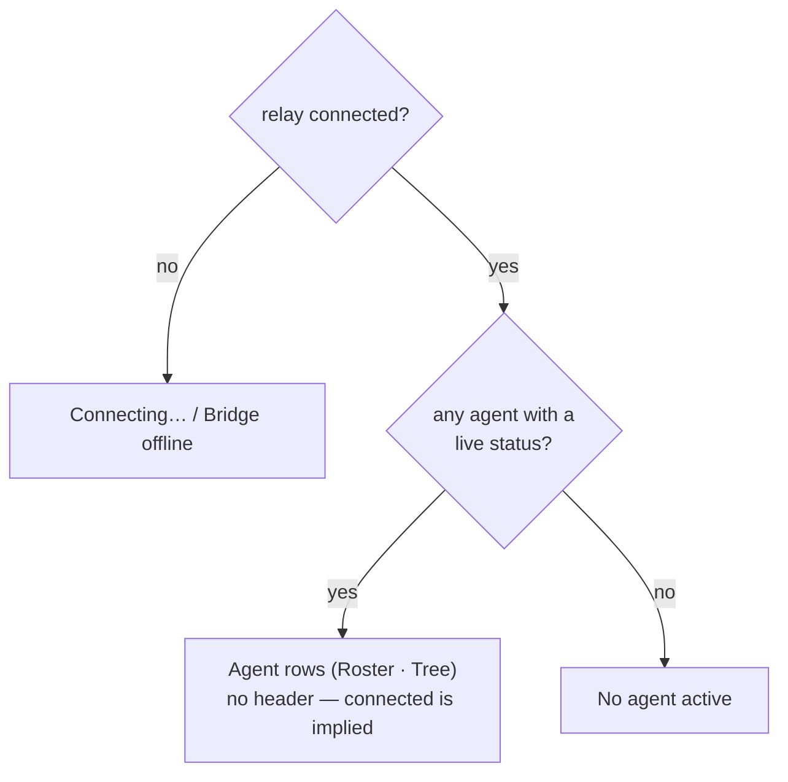
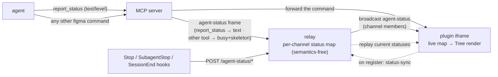
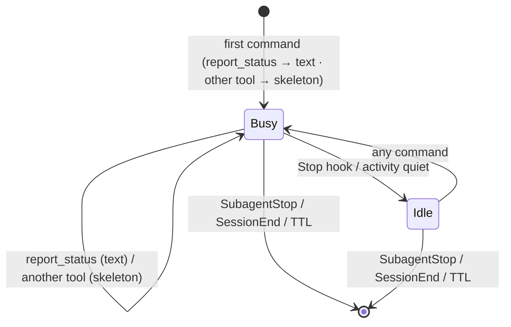

# Agent Status Monitor (Plugin UI)

> Governed by [[figma-bridge/docs/principles|the principles]]. This spec defines the **plugin iframe UI**
> and the **agent→UI status channel** that feeds it: what an agent shows a human while it works, and how
> the panel degrades when no agent is talking. Identity headers are defined by
> [[figma-bridge/docs/specs/request-envelope|request-envelope.md]] (the SSOT — this spec *consumes* them).
> The agent-facing presence block (turn-start awareness for the agent) is a separate, opposite-direction
> mechanism owned by [[figma-bridge/docs/specs/plugin-presence|plugin-presence.md]].

## Why

The plugin panel today is an operator console: a status pill, a connect/port form, a disconnect button, a
channel readout, and a feedback list with per-item **Send** buttons. That surface assumes a human drives
the bridge. The bridge is now agent-driven and always-on, so the panel should instead answer the one
question a human actually has while an agent builds in their file: **who is working, and what are they
doing right now?** The panel becomes a live **status monitor** — one row per active agent, driven by the
agent itself, with a connection fallback for when nothing is talking.

## What it shows — the display model

The panel renders in exactly one of two modes each frame — **strict either/or**: agent rows *or* a
connection state, never both.



- **No persistent connection header.** When agents are shown, the panel shows *only* the agent rows —
  their presence **is** the "connected" signal, so no separate connection line is drawn. A connection
  state is surfaced **only** in the fallback, when there is nothing else to show.
- **Connected is the gate.** Agent rows render only while the relay socket is up. If it drops, the panel
  switches to the fallback — agent rows are stale the moment fresh pushes can't arrive — which preserves
  the invariant **agent shown ⇒ connected**.
- **Resolution, top-down:**
  1. **Not connected** → connection fallback: **Connecting…** (transient discovery/socket-open) or
     **Bridge offline** (relay/MCP unreachable — "start the MCP / relay to connect").
  2. **Connected + ≥1 live agent** → the agent rows (roster below); this is the normal working state.
  3. **Connected + no live agent** → **No agent active** ("waiting for an agent").

### The roster — adaptive Tree

One row per agent, with session grouping that **adapts to how many agents a session has live**:

- **A lone agent is a single flat row** — no group header. This is the common case (one operator, or a
  session whose only live agent is its top-level agent).
- **A session with ≥2 live agents is a group:** a **session header row** — the session's top-level agent
  (the one with no `agentId`), carrying its own status dot + label + status text — with its **subagents
  nested** beneath as indented child rows (`agentId`-keyed).
- **Threshold:** a session becomes a group only when **≥2** of its agents have live rows, and collapses
  back to a flat row when it falls to one.
- **Two independent sessions on one file** are two separate rows/groups.

Each row carries a **progress dot**, a **label**, the **status text** (or a skeleton), and a **relative
timestamp**. The two *live* signals — the progress dot and the text/skeleton — are defined next; how they
transition over time is in Lifecycle.

### Row anatomy — two independent signals

A row shows **two signals that mean different things**, so neither is overloaded onto the other:

- **Progress dot — the loader.** A single dot whose state is the agent's *progress*, derived
  automatically, not hand-set:
  - **busy** — amber, gently pulsing — a Figma action is in flight;
  - **ok** — green, static — settled, nothing failed;
  - **error** — red, static — the agent's last report flagged a failure.

  "Busy" is inferred from activity, never set by the agent. A *warning* the agent wants to raise lives in
  the **text**, not the dot — the dot is purely progress (busy / ok / error).
- **Text, or a skeleton.** The one-line narrative from `report_status`. When a new action has begun but no
  narrative has yet arrived, the text area shows a **3-dot skeleton** (a loading placeholder) instead of a
  stale line from the previous action.

A **busy** row is emphasised so that a run of adjacent busy rows reads as **one continuous band**, not
separate pills. The exact treatment (a full-width, no-radius fill in Figma's layers-panel style) is owned
by the design system, not restated here.

### Styling

The panel **matches native Figma UI as closely as possible**. All concrete styling — the Figma color
tokens, Inter/11px type ramp, spacing, radius, motion, and the full-width row-emphasis rule — is owned by
[[figma-bridge/docs/specs/design-system|design-system.md]] and referenced, not duplicated here. The only
UI parameter this feature fixes is the window:

- **Window:** resizable via `figma.ui.resize`, default ~340×400, min ~340×160 — so one agent up to many
  render gracefully (replacing today's fixed 340×280).

## Identity & grouping

The panel keys and groups rows entirely from the request `meta` identity headers
([[figma-bridge/docs/specs/request-envelope|request-envelope.md]] — that spec owns the header *mechanism*;
the keying/labelling *policy* below is owned here):

| Concern | Resolution |
|---|---|
| **Row key** (dedupe / update / clear a specific agent) | `agentId ?? sessionId` — a subagent by its `agentId`; the top-level agent by its `sessionId` |
| **Group** (a session's agents together) | `sessionId` — the row with no `agentId` is the group's top-level agent; the rest are its subagents |
| **Display label** | `label` (agent-set, optional) `?? agentType` (e.g. `"Explore"`) `?? "Agent"` |
| **Kind** (top-level vs subagent, for indent) | derived: `agentId` present ⇒ subagent; absent ⇒ top-level |

No new identity field is introduced; `label` is the only agent-authored addition and it rides the status
push (below), not `meta`.

## The transport — `report_status`

A new agent-facing MCP tool lets an agent show its own status. It is a **file-addressed, non-facade
meta-tool** (a sibling of `record_feedback`; it carries the shared `fileTargetParamsSchema` so it receives
`fileKey` + the injected identity headers).

```
report_status({
  fileKey,                     // which file's panel (param; identity headers injected)
  text: string,                // the one-line narrative — replaces the skeleton
  level?: "normal" | "error",  // default "normal"; "error" → red dot. (Busy is automatic, never set here)
  label?: string,              // optional friendly name; else agentType / "Agent"
})
```

- **The dot is progress, not level.** `report_status` sets only `ok` (`normal`) vs `error`; **busy** is
  derived from activity, not passed here. A *warning* the agent wants to surface goes in `text`.
- **Latest-wins.** Each call *replaces* the calling agent's current status (keyed by `agentId ?? sessionId`
  on `fileKey`'s panel) and fills the skeleton with `text`. `text` is a single live line, not an appended log.
- **Display-only, no round-trip.** Unlike a Figma command, `report_status` never reaches the plugin main
  thread (`code.ts` / `figma.*`). It is a UI push, delivered like feedback broadcasts — the iframe renders
  it directly. The agent gets a quick ack, not a plugin result.
- **File-scoped delivery.** It targets **one** file's channel via `channelFor(fileKey)` — *not* the
  existing all-files `notify()` fan-out.

### Store & flow

The **relay owns an in-memory, per-channel status map** — it is the only actor that sees *every* session
on a file (a per-session MCP server sees only its own agents), so it alone can replay the full
multi-session picture. Crucially, the relay stays a **dumb transport (B1):** it stores and fans out
`agent-status` frames **without interpreting Figma commands**. The *MCP server* decides what each frame
says — it already knows which tool it is calling — so no command-parsing is pushed into the relay.



The **MCP server emits one `agent-status` frame per Figma tool call it handles** (on `channelFor(fileKey)`,
carrying the agent's `meta` identity); the relay upserts it into the channel map by `key` and broadcasts:

- **Text (`report_status`):** the server emits the record `{ key, sessionId, agentId?, agentType?, label?,
  level, text, activity, updatedAt }` with the new `text`/`level` and `activity: "busy"`.
- **Busy + skeleton (any *other* Figma tool call):** the server emits the same record with `text: null`
  (the skeleton) and `activity: "busy"` — a new action has started, so the old line is no longer current.
  This is the per-tool "clear to loading", decided **at the server** from the tool it is invoking (no
  dedicated `PreToolUse` ping). It relies on the agent's `meta.sessionId`/`agentId` — the envelope's
  identity headers.
- **Settle to idle:** a **`Stop`** hook (turn ended) — or a short activity-quiet window — flips
  `activity: "idle"`; the dot stops pulsing (green `ok` / red `error`) and the last `text` stays.
- **Replay:** on plugin `register`, the relay replays the channel's current records (so a reopened or
  reloaded plugin immediately shows the agents already working — mirrors today's `feedback-sync`).
- **Remove:** `SubagentStop`/`SessionEnd` hooks POST `{ sessionId, agentId? }`; the relay removes matching
  records from every channel map and broadcasts the removal. (The hooks carry no `fileKey`, so removal is
  keyed by `sessionId`/`agentId` across files — correct, since an agent's identity is file-independent.)

The store is **in-memory only** — never written to disk (unlike feedback). It self-heals: a relay restart
starts empty and repopulates from the next frames.

## Lifecycle — busy / idle / removed

Two timescales drive a row: a fast **activity** state (seconds — the dot and the skeleton) and a slow
**presence** state (minutes — muted, then gone).



- **Activity (the dot, seconds):**
  - **Busy** — amber, pulsing — a command (a `report_status` *or* any Figma tool call) is in flight/recent.
    The text shows the latest `report_status` narrative, or a **skeleton** when the current action has not
    been narrated yet — the *skeleton is just Busy with no text*, so the Busy transitions below cover it.
  - **Idle** — green (`ok`) / red (`error`), static — no recent activity, or the turn ended (**`Stop`**
    hook). The last `text` stays (a row that was only ever a skeleton settles to just its label + dot).
- **Presence (the row, minutes):**
  - **Muted** — after `IDLE_MS` (~45–60s) of no activity the whole row dims: present, so you can still see
    *who* is here, but clearly not working.
  - **Removed** — an authoritative end signal drops the row:
    - **`SubagentStop`** → that one `(sessionId, agentId)` subagent row;
    - **`SessionEnd`** → all rows for that `sessionId` (backstop for the top-level agent, which has no
      `SubagentStop`);
    - **Backstop TTL** (`TTL_MS`) → any row whose activity is older than the timeout, if no hook ever fires
      (hook absent, crash, lost signal). Prevents permanent ghosts.

`IDLE_MS` and `TTL_MS` are single tuning constants (`IDLE_MS` ≈ 45–60s, `TTL_MS` ≫ `IDLE_MS`, minutes); the
busy→idle activity-quiet window is a few seconds.

## Hooks

Three `hooks.json` entries are added alongside the existing `PreToolUse` identity injector and
`UserPromptSubmit` presence hook (all delivered by the plugin, per
[[figma-bridge/docs/specs/claude-plugin|claude-plugin.md]]):

- **`Stop`** — POSTs `{ sessionId }` (the turn ended) → the relay settles that session's rows **busy →
  idle**.
- **`SubagentStop`** — POSTs `{ sessionId, agentId }` → removes that subagent's row.
- **`SessionEnd`** — POSTs `{ sessionId }` → removes all of that session's rows.

They reach the relay by an HTTP call (like the presence hook), needing no MCP server and no `fileKey`.

**No hook is needed for busy + skeleton.** That signal is derived at the relay from the command stream it
already forwards (§ Store & flow) — realising the intended per-tool "clear to loading" without a
`PreToolUse` ping, and avoiding a second `PreToolUse` hook racing the identity injector on `updatedInput`.

## Wire additions

New relay-level frames (transport only; not Figma commands):

The per-agent **status record** is `{ key, sessionId, agentId?, agentType?, label?, level, text, activity,
updatedAt }` where `text` is `null` while the row is a skeleton (no narrative yet) and `activity` is
`"busy" | "idle"`. New relay-level frames/endpoints (transport only; not Figma commands):

| Frame / endpoint | Direction | Payload / effect |
|---|---|---|
| `agent-status` | relay → plugins (one channel) | the relay's updated record after a command (text set · text→skeleton · busy · settled) |
| `status-sync` | plugin → relay (on register) | request the channel's current records; relay replies with the set |
| `agent-status-remove` | relay → plugins | `{ sessionId, agentId? }` — remove matching rows |
| `POST /agent-status/settle` | `Stop` hook → relay (HTTP) | `{ sessionId }` — busy → idle |
| `POST /agent-status/remove` | `SubagentStop` / `SessionEnd` hooks → relay (HTTP) | `{ sessionId, agentId? }` — remove rows |

These are new message types, not changes to existing command/reply framing, so they carry no version-skew
risk beyond additive handling (an older plugin simply ignores an unknown broadcast type).

## What is removed from the panel

The status monitor **replaces** the old iframe surface. Removed:

- the **feedback panel** and its per-item **Send** buttons (feedback moves to an agent-driven flow — see
  Out of scope);
- the **connect / port form** and **Retry** (connection is automatic; discovery is internal);
- the **Disconnect** button (no manual disconnect);
- the **channel readout** (channel is internal transport, never agent- or human-facing).

The underlying relay connection, discovery, presence, and B3 identity plumbing are unchanged — only what
the iframe *renders* changes.

## The agent-facing skill

Knowing *when* and *what* to `report_status` is guidance, not mechanism, and is owned by a plugin **skill**
(agent-facing), not this spec. The skill's job: prompt an agent to report a concise, human-meaningful line
at the start of and during a unit of work, choose an appropriate `level`, and set a `label` when the
default (`agentType`) is unhelpful. This spec defines only the tool and the panel it feeds.

## Degrade / fallback

- **No `PreToolUse` identity hook** (headers absent) → `sessionId`/`agentId` are absent; an agent that
  still calls `report_status` is keyed by a self-supplied `label` if given, else shown as a single generic
  "Agent" row. The panel never errors on missing identity.
- **No cleanup hooks** → rows never receive an explicit clear; the **idle-fade** and **backstop TTL**
  guarantee they mute and then disappear anyway. Cleanup hooks are an optimisation over the TTL, not a
  correctness dependency.
- **Plugin reloaded / reopened** → `status-sync` replay repaints current agents immediately.
- **Relay restarted** → maps start empty; the next pushes repopulate; nothing is lost that isn't
  re-derivable from live agents.
- **No agent ever pushes** (relay connected) → the panel sits in the "No agent active" resting state
  indefinitely; this is correct, not an error.

## Out of scope

- **Feedback send-flow.** This spec removes the feedback *UI*; how feedback is sent now that the button is
  gone (an agent-driven send path) is a separate follow-up spec. `record_feedback` (writing feedback) is
  unchanged.
- **`meta` identity injection.** Building the `PreToolUse` hook and the `sessionId`/`agentId`/`agentType`
  plumbing is owned by [[figma-bridge/docs/specs/request-envelope|request-envelope.md]] and its
  implementation, not this spec. This panel *consumes* those headers.
`report_status` is a non-facade meta-tool (sibling of `record_feedback`), recorded in
[[figma-bridge/docs/specs/tool-surface|tool-surface.md]]'s count formula.
