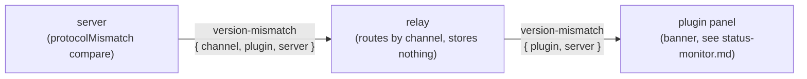

# Version / Protocol Handshake

> A **standalone** feature the Claude Code plugin milestone
> ([[figma-bridge/docs/specs/claude-plugin|claude-plugin.md]]) assumes is in place and only
> *specializes* (the mismatch UX). It defines a **real** version check: the app-level Ping/Pong
> carries `name`+`version` but is not wired to a handshake on its own; this wires one. The skew this
> handshake detects is surfaced **visually** in the Figma-plugin panel as a banner — the banner's
> rendering and precedence are owned by
> [[figma-bridge/docs/specs/status-monitor|status-monitor.md]]; this spec owns the compare and the
> wire frame that feeds it.

## Purpose

Detect a **plugin ↔ server version/protocol mismatch at connect time** and **fail fast** with an
actionable message naming which side to update — instead of letting drift fail silently.

**Why (real incidents).** On 2026-06-25 two silent failures cost a live session: (1) the MCP
server was running stale pre-merge code with **no signal** it was stale, and (2) a protocol-shape
mismatch — the plugin replies `{ id, result }` with no `command`, while a refactored server schema
required `command` — **silently dropped every command round-trip** (30s timeouts, zero
diagnostic). A handshake flags both immediately.

## Design

- **App semver, per [[figma-bridge/docs/principles|B2]]** — each side reports its **app version**
  (`APP_VERSION`, the root `package.json` semver, frozen into the build). A breaking change bumps
  the **minor**; a patch is non-breaking. There is **no** separate protocol-version constant.
- **Who moves the number — only CI.** Every "bumps the minor (B2)" statement in this spec names
  the release label the change demands: `release:minor` on the release pull request that ships
  it. It is not an instruction to edit a manifest. Only CI bumps the versions
  ([[figma-bridge/docs/specs/dev-ops|dev-ops.md]] §6.5): the pipeline computes the number from
  the label and stamps it at release. No agent commits a version change. Exception for tests: an
  agent may set a version field in the working tree to run a test (for example, to force a
  handshake mismatch). The change stays uncommitted. The agent reverts it when the test ends.
  `appVersion` is **connection-level** — reported once in the register handshake and compared
  **major.minor** — **not** a per-request header (contrast the per-request `meta` block owned by
  [[figma-bridge/docs/specs/request-envelope|request-envelope.md]]).
- **Plugin reports it on register** — add `version: string` to `registerMessageSchema`
  (`packages/shared/src/ws-schemas.ts`, today `{ type, channel, fileName }`). The plugin sends its
  `APP_VERSION` on join/register.
- **Server compares on connect** — the `connect` handler reads the reported version and compares
  it to its own `APP_VERSION` on **major + minor only** (patch ignored); the outcome is also
  surfaced in `status`. In the auto-join model the compare + emit **chokepoint** is `requireFile`
  (the B2 gate every file-addressed tool call flows through) plus the two `connect` branches
  (explicit-channel and resolved-target) — not a single manual connect handler; every path that can
  discover a skewed plugin runs the same compare and the same emit.
- **Mismatch → actionable error** — naming the MISMATCH, never a stale side: *"Figma plugin version
  'X' is incompatible with server version 'Y' (major.minor mismatch). Update whichever side was not
  rebuilt — version order is not build recency, so the lower number can be the newer build after a
  renumber."* Subsequent tool calls short-circuit with the same message until resolved.
  **The message must not infer which side is stale from the two numbers.** It used to, and a
  version renumber made the inference false: the lower number was the newer build, and a reader who
  trusted the verdict looked at the wrong half of the stack. Two version strings prove that the
  sides disagree; nothing in a number records when it was built. The person running both sides
  knows which one they last rebuilt, so the message hands them that question.
- **Model:** **major.minor** match of the app semver (B2). A **patch** difference does **not** trip
  it; a **minor or major** difference — i.e. a breaking change — does. The two versions differ only
  when the sides are built from different releases (each build freezes its version), so a same-build
  plugin+server always match.

## Wire contract & layer alignment (B1)

- `registerMessageSchema` gains `version: string` (the sender's `APP_VERSION` semver). The **relay
  stays semantics-free** — it only routes/stores the value and gains **no** version logic (B1). The
  **server owns** the comparison (**major.minor**, per B2).
- The comparison is **one-way** (the server is the reference), surfaced on `connect` + `status`.
- Tool names/commands are unaffected; this rides the existing register/connect path.
- **Per-file channels extend this same schema.** The
  [[figma-bridge/docs/specs/overview|per-file channel]] change adds **`fileKey`** to
  `registerMessageSchema` and a **`meta.fileKey`** to the command envelope (the B3 identity
  guard; the `meta` envelope is owned by
  [[figma-bridge/docs/specs/request-envelope|request-envelope.md]]) — a **breaking wire change**,
  so it **bumps the minor** (B2) and trips *this* handshake on a mixed-version plugin/server. The
  **`meta{}` wrapping itself** — generalizing the old flat `targetFileKey` into a `meta` block — is
  likewise a breaking wire change → **minor bump** (B2). The relay stays semantics-free — it stores
  `fileKey` in the availability registry but gains no logic (B1); the server owns targeting and the
  compare.
- **The change-feed push frame extends it again.** The
  [[figma-bridge/docs/specs/change-feed|change feed]] moves the push's file identity out of
  `params.fileId` into **`meta.fileKey`**, adds **`meta.epoch`** and **`meta.seq`** to the envelope
  and **`params.indexStale`** to the push body, and adds **`epoch`** to `registerMessageSchema` — the
  same class of **breaking wire change** as the `meta{}` wrapping and the per-file-channel additions
  above, so it too **bumps the minor** (B2) and trips *this* handshake on a mixed-version
  plugin/server. Both sides adopt the new push shape atomically; the relay still only routes it (B1).
- **The change-feed push frame extends once more, for attribution and runs.** The push body gains
  **`params.writers[]`** — the per-frame table of the sessions its records are attributed to — and
  each record gains the **`by`** / **`rf`** bitmasks that index into it, the final values
  **`set`**, the **`pg`** / **`fr`** locator, the **`merged`** flag, and the rule that
  **one record is one RUN, not one id** (so `params.changes[]` is ordered, and for a given id that
  order is the run order). All of it rides `params`, which the relay forwards whole — `metaSchema`
  gains **nothing**, so the allow-list is untouched.
  It is a **coordinated change, not an optional field bolted on**, and it **bumps the minor** (B2):
  a peer that ignores the masks does not merely lose an enrichment, it **keeps its own writes and
  reports them back to itself as foreign** — a count that never returns to zero, tolerable as a
  transient and wrong as a steady state. This handshake is what keeps that a transient: the file
  gate refuses the skew with `INCOMPATIBLE` before it can settle in.
- **On skew, the server pushes a `version-mismatch` frame** so the plugin can surface it visually
  (the banner, owned by [[figma-bridge/docs/specs/status-monitor|status-monitor.md]]):
  `{ channel, plugin, server }` server→relay, routed to `{ plugin, server }` relay→plugin (the
  `channel` is stripped on the way out — the **same** server→plugin precedent as `agent-status`).
  The **relay routes by `channel` and never interprets or stores** the frame (B1); the **server
  owns** both the compare (`protocolMismatch`) and the emit.

## Testing

- **Unit** — same `major.minor` → proceed; a **patch-only** difference → proceed (not a break); a
  **minor/major** difference → the actionable error, surfaced on `connect` and `status`.
- **Relay schema** — assert `version` is present/validated on the `register` message.
- **Mock fidelity** — the mock plugin (`packages/server/test/mocks/mock-plugin.ts`) reports the same
  `APP_VERSION` by default; assert it so server / plugin / mock drift is caught (mock-fidelity rule).
- **Emit + route** — a skewed connect makes the server emit a `version-mismatch` frame (and a
  matching connect emits none); the relay routes the frame to the channel's other members and
  stores nothing; the shared schema validates both the `{ channel, plugin, server }` and
  `{ plugin, server }` shapes and rejects a frame missing a required field.

## Relationship to the plugin milestone

This handshake ships **first** and is **self-contained**. The Claude Code plugin milestone
([[figma-bridge/docs/specs/claude-plugin|claude-plugin.md]]) is built **after** and stays
**decoupled** — it does not spec or depend on this mechanism. Its only version touch-point is a
later, small **diagnosis / response skill**: when this handshake reports a mismatch, that skill
guides the user through the fix — update the Claude Code plugin and **re-run `figma-setup`**, which
replaces the Figma payload's contents at its stable path so Figma picks up the new code with **no
re-import** (§5.1 there) — or diagnose a stale server. A re-import repairs a payload directory the
user *moved or deleted*; it is never the remedy for a version skew.

Separately, the **Figma-plugin panel itself** surfaces the skew **visually**, immediately, with no
skill needed: a **banner** — a red dot, bold "Version mismatch", and one sentence naming both
versions inline — that **pre-empts the roster** (peer to a "Bridge offline" fallback) and
**self-clears** once a (re)connect reports a matching `major.minor`. The banner's rendering and
precedence are owned by [[figma-bridge/docs/specs/status-monitor|status-monitor.md]]; it consumes
the `version-mismatch` frame this spec defines.

The version compare (major.minor), the wire change, and the actionable error all live **here**; the
plugin only *responds* — visually via the banner, and, for the Claude Code plugin milestone, via its
later diagnosis skill.

## Out of scope

- Auto-updating either side — the handshake only **detects** and **instructs**.
- The plugin-distribution UX (compiled-in version; how the Figma payload is materialised and
  refreshed in place) — the plugin milestone's specialization
  ([[figma-bridge/docs/specs/claude-plugin|claude-plugin.md]] §5.1).
